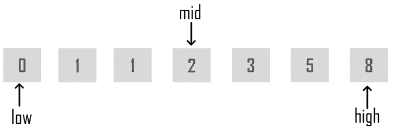

# 爪哇的二分搜索法是什么？如何实施？

> 原文：<https://www.edureka.co/blog/binary-search-in-java/>

搜索和排序算法是任何编程语言中的[流行算法](https://www.edureka.co/blog/data-structures-algorithms-in-java/)。它们是理解编程基础的基础。其中一个流行的搜索算法是 T2 Java T3 中的二分搜索法。在这篇文章中，我将告诉你所有关于它的实现。

本文涵盖以下主题:

*   什么是二分搜索法？
*   [实现二分搜索法算法](#ImplementingBinarySearchAlgorithm)
*   [递归二分搜索法](#RecursiveBinarySearch)

我们开始吧！

## 什么是二分搜索法？

[Java](https://www.edureka.co/blog/java-tutorial/) 中的 二分搜索法是一个  搜索算法，在一个排序的[数组](https://www.edureka.co/blog/java-array/)中找到目标值的位置。  **二分搜索法**将目标值与数组的中间元素进行比较。它 只对一组有序的元素起作用。要在集合上使用二分搜索法，必须首先对[集合](https://www.edureka.co/blog/java-collections/)进行排序。

 当使用[二分搜索法](https://www.edureka.co/blog/java-programs/#BinarySearchPrograminJava)对一个有序集合执行操作时，迭代次数总是可以在被搜索值的基础上减少。你可以在上面找到 *mid 元素*的快照中看到。二分搜索法的类比是利用数组排序的信息，将时间复杂度降低到 *O(log n)* 。

## **实现二分搜索法算法**

让我们来看看下面的伪代码，以便更好地理解它。

```
Procedure binary_search
A ← sorted array
n ← size of array
x ← value to be searched

Set low = 1
Set high = n

while x not found
if high < low
EXIT: x does not exist.

set mid = low + ( high - low ) / 2

if A[mid] < x set low = mid + 1 if A[mid]> x
set high = mid - 1

if A[mid] = x
EXIT: x found at location mid
end while

end procedure
```

**说明:**

**第一步:**首先比较 x 和中间元素。

**第二步:**如果 x 与 mid 元素匹配，那么你要返回 mid 索引。

**第三步:** Else，如果 x 大于 mid 元素，那么 x 只能位于 mid 元素之后的右侧半数组。因此你重现了右半边。

**第四步:**否则，如果(x 较小)则对于左半部分递归。

这就是在给定数组中搜索元素的方法。

现在让我们看看如何递归地实现二分搜索法算法。下面的程序演示了同样的情况。

## **递归二分搜索法**

```
public class BinarySearch {
// Java implementation of recursive Binary Search
// Returns index of x if it is present in arr[l..h], else return -1
int binarySearch(int a[], int l, int h, int x)
{
if (h >= l) {
int mid = l + (h - l) / 2;
// If the element is present at the middle itself
if (a[mid] == x)
return mid;
// If element is smaller than mid, then it can only be present in left subarray
if (a[mid] >x)
return binarySearch(arr, l, mid - 1, x);
// Else the element can only be present in right subarray
return binarySearch(arr, mid + 1, h, x);
}
// We reach here when element is not present in array
return -1;
}
public static void main(String args[])
{
BinarySearch ob = new BinarySearch();
int a[] = { 20, 30, 40, 10, 50 };
int n = a.length;
int x = 40;
int res = ob.binarySearch(a, 0, n - 1, x);
if (res == -1)
System.out.println("Element not present");
else
System.out.println("Element found at index " + res);
}
}
```

在执行上述程序时，它将定位出现在特定索引处的元素

```
Element found at index 2
```

所以这就把我们带到了二分搜索法在[爪哇](https://docs.oracle.com/javase/tutorial/)文章的结尾。我希望你觉得它很有启发性，并能帮助你理解 [Java 基础知识](https://www.edureka.co/blog/basic-java-tutorial-getting-started/)。

*查看 Edureka 提供的 **[Java 认证培训](https://www.edureka.co/java-j2ee-training-course)** ，edu reka 是一家值得信赖的在线学习公司，在全球拥有超过 250，000 名满意的学习者。我们在这里帮助你的每一步旅程，成为除此之外的 java 面试问题。我们为想成为 Java 开发人员的学生和专业人士设计了一个课程。该课程旨在为您提供 Java 编程的开端，并训练您掌握核心和高级 Java 概念以及各种 Java 框架，如 Hibernate & Spring。*

*如果您在 [Java](https://www.edureka.co/blog/what-is-java/) 中实现二分搜索法时遇到任何困难，请在* *下方的评论栏中提出，我们会在第一时间回复您。*