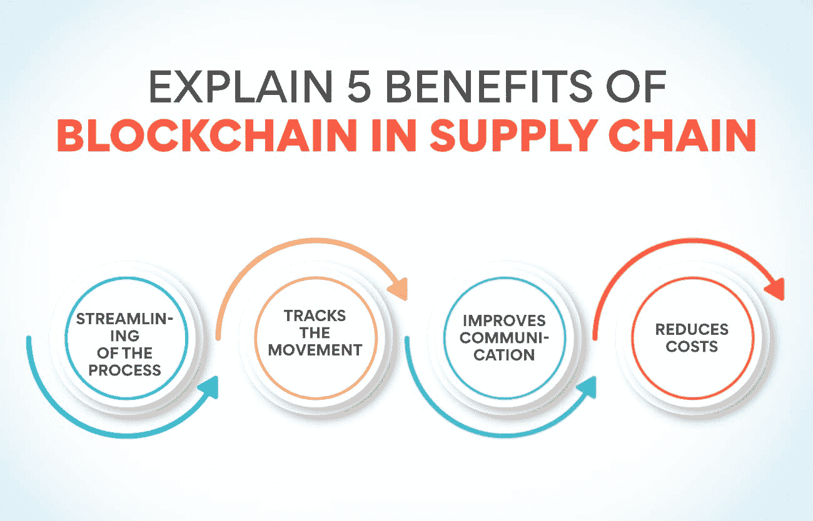
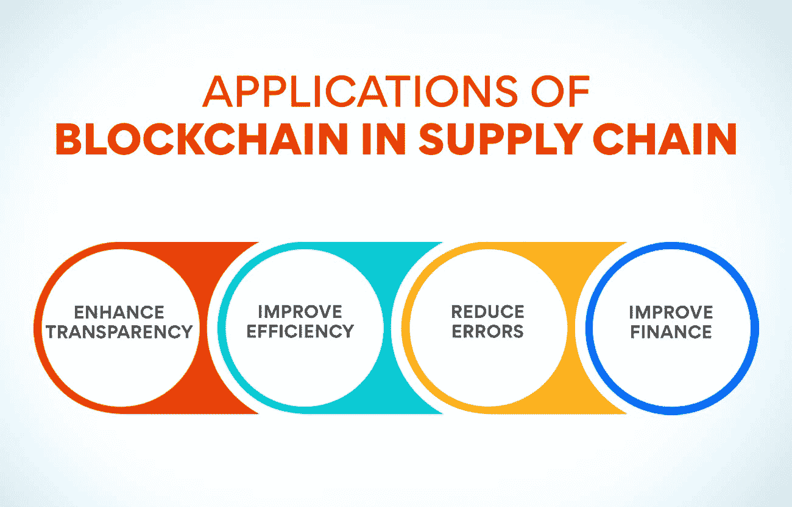

# 供应链中的区块链是什么？概述

> 原文：<https://www.edureka.co/blog/blockchain-in-supply-chain/>

毫无疑问，区块链是今天[供应链管理](https://www.edureka.co/blog/what-is-operations-and-supply-chain-management-oscm/)最热门的话题之一。但这是什么呢？这对供应链管理有什么影响？这篇博文将探讨区块链的概念，以及它如何应用于供应链管理。我们还将讨论与实现这样一个系统相关的潜在好处和挑战。所以，如果你一直想知道这些大惊小怪的事情是怎么回事，请继续阅读，了解更多。

## **区块链在供应链中是如何使用的**

随着越来越多的企业意识到区块链技术的好处，区块链在供应链中变得越来越普遍。区块链提供了一种更好、更安全和透明的方法来跟踪和管理从制造到销售点的整个供应链中的商品流动。它允许企业优化其运营并提高效率。

此外，区块链可以验证产品的真实性，确保它们不是假冒的。它在安全至上的食品和制药行业至关重要。

最后，区块链可用于创建整个供应链中所有交易的数字分类账。这可以用来帮助识别问题和需要改进的地方。它还可以用来创建一个出处记录，这将有助于追溯污染产品的问题。

## **解释区块链在供应链中的 5 大优势**

**简化流程**

区块链是一个分布式数据库，维护着一个不断增长的记录列表，称为块。每个块包含一个时间戳和到前一个块的链接。加密用于保护每个块中的数据。

区块链通过为所有供应链成员提供一个共享的、不可变的分类账来简化供应链。这使得供应链合作伙伴之间的合作更加透明和高效。结果是一个更精简、更高效的供应链，可以节省时间和金钱。

**也可理解为:[供应链管理中的主要决策领域](https://www.edureka.co/blog/major-decision-areas-in-supply-chain-management/)**

**跟踪运动**

在供应链中，区块链最适合跟踪商品从供应商到制造商再到零售商最后到消费者的流动。通过提供供应链中每笔交易的不可更改的记录，区块链可以帮助确保商品不是伪造的或被篡改的。此外，通过让供应链中的各方都能了解在途货物的状态，区块链可以帮助优化库存管理，降低与过量库存相关的成本。

**改善沟通**

沟通是供应链中的关键，它确保每个人都在努力实现相同的目标，并了解最新发生的事情。区块链通过为各方提供一个去中心化的平台来查看数据和进行交互，从而改善了沟通。这种信息的透明度和可访问性有助于简化供应链，避免任何延迟或中断。

**降低成本**

商品和服务的成本一直是企业最关心的问题。传统的供应链往往是分散的，涉及许多不同的供应商和中间商。这可能导致效率低下和成本增加。区块链技术有可能简化供应链并降低成本。

区块链可以通过创建所有交易的去中心化、共享的分类账，提高整个供应链的透明度和可见性。它将允许企业自始至终跟踪他们的产品，减少对第三方中介的需求。有了区块链，企业还可以进行实时跟踪和支付，进一步降低成本。

## **传统 Vs 区块链供应链**

有许多不同的供应链，每一个都有其优势和劣势。在这篇博文中，我们将比较两种最流行的供应链:传统供应链和区块链供应链。

传统供应链是更传统的供应链类型。他们通常依靠中央系统和中介来管理数据和交易。这可以使它们更高效、更易于控制，但也使它们更容易受到安全威胁。

另一方面，区块链供应链使用分散的系统来管理数据和交易。这使它们更安全，但也使它们效率更低，更难控制。

那么，哪种类型的供应链适合你呢？这取决于你的具体需求和要求。如果安全是你的首要任务，那么区块链供应链可能是更好的选择。然而，如果效率对你来说更重要，那么传统的供应链可能是一条出路。

## **区块链在供应链中的应用**

## **增强透明度**

供应链中的区块链技术可以帮助提高整个过程的透明度和可追溯性。通过提供一个安全和分散的数据共享平台，区块链可以帮助简化供应链管理，减少出错或欺诈的机会。

特别是，区块链可以跟踪从制造商到零售商的供应链中的货物运输。这将使所有利益攸关方在任何特定时间都能了解货运状况，并有助于改善协调和提高效率。此外，区块链可以验证产品的真实性，这将有助于减少假冒，并确保消费者得到他们所期望的。

总的来说，在供应链中使用区块链可以提高透明度和可追溯性，同时降低成本和提高效率。因此，这是一个创新的解决方案，值得在这一领域开展业务的企业考虑。

## **提高效率**

区块链被称为分布式账本技术，可用于跟踪和管理整个供应链中的货物和信息流动。通过创建所有交易的共享、不可变记录，区块链可以帮助简化供应链管理并提高效率。

区块链在供应链中的一些潜在应用包括:

*   跟踪货物在整个供应链中的移动
*   验证产品真实性
*   管理供应商信息和合同
*   提高库存水平的可见性

通过利用区块链，企业可以提高供应链的效率，并创建一个更透明、更高效的商品和信息跟踪系统。

## **减少错误**

信息的准确性在供应链行业中至关重要，因为它确保在规定的时间内将正确的货物运送到正确的地点。不准确的信息会导致延误、错误，甚至经济损失。

区块链是一个分布式数据库，允许安全、透明和防篡改的记录保存。这使得它成为供应链管理的理想解决方案，因为它可以帮助减少错误和提高透明度。

例如，区块链可以跟踪产品从制造到零售的全过程。这将允许所有利益相关者了解供应链，并确保产品按预期交付。区块链还可以用于追踪出处，确保产品是真实的，没有被篡改。

总的来说，区块链通过提供一个安全透明的信息管理平台，有可能大大减少供应链行业中的错误。

## **改善财务**

区块链的分布式总账技术有可能简化供应链并改善财务状况。区块链可以通过自动化常规任务和增加透明度来减少错误、提高效率和降低成本。

区块链在供应链管理中的应用包括:

*   自动跟踪货物和库存
*   提高供应链的可见性
*   缩短交易结算时间
*   支持新的融资模式，如保理和动态贴现

特别是，区块链可以通过减少交易结算时间来改善供应链中的财务状况。通过自动跟踪发票和付款，区块链可以帮助减少会计错误，加快付款处理。

此外，基于区块链的融资模式，如保理和动态贴现，可以向供应商提供早期付款，改善现金流和营运资本管理。

## **供应链中区块链的逐步方法**

如果你想在供应链中实施区块链，你需要记住几件事。下面是一个逐步实现的方法:

1.  定义你试图解决的问题。

这是最重要的一步。你需要清楚地了解你试图解决区块链的什么问题。一旦你知道这一点，你就可以确定区块链是不是你的正确解决方案。

2.  进行研究并开发概念证明。

在你定义了问题之后，是时候做你的研究了。这包括研究不同的区块链平台，并确定哪一个最适合您的需求。一旦你选定了一个平台，就该进行概念验证了。这将有助于您测试解决方案的可行性，并在实施之前对其进行微调。

3.  创建路线图并获得资金。

一旦有了概念证明，就该为实施制定路线图了。该路线图应该包括时间表、里程碑和预算考虑事项。一旦有了这些，是时候开始为你的项目争取资金了。如果没有足够的资金，你的项目很可能会停滞不前。

**也可阅读:[了解供应链管理的基本要素](https://www.edureka.co/blog/components-of-supply-chain-management/)**

## **区块链对于供应链来说，涉及到哪些漏洞？**

关于区块链，首先要知道的是没有数据的“主”副本。相反，网络中的每个参与者都有一份数据副本。这种分散的方法有几个优点，其中最主要的是增加了安全性。当没有中央控制点时，黑客破坏系统就变得很困难。

区块链的另一个优势是它允许近乎即时的交易。因为不需要等待中央机构来批准每一笔交易，所以可以更快地处理它们。这在供应链管理中尤其有益，因为时间往往是关键。

最后，区块链提供了高度的透明度。因为每笔交易都有记录，所有参与者都可以看到，所以隐藏或篡改信息变得很难。这将有助于提高整个供应链流程的可问责性和可信度。

然而，在供应链管理中使用区块链可能会有一些缺点。一个问题是，只有在所有相关方广泛采用的情况下，该系统才能发挥作用。没有供应链中每个人的认同，这个系统将无法正常运转。另一个潜在问题是可伸缩性。随着越来越多的数据添加到区块链中，个人用户处理和管理所有信息会变得越来越困难。

## **区块链在供应链中的未来进展**

区块链在供应链中的进步是不可避免的。随着区块链技术的日益普及，对高效、安全的供应链管理的需求也日益增长。区块链提供了一个分布式账本系统，可用于跟踪和管理整个供应链中的商品和信息流动。这允许更大的透明度和可追溯性，有助于提高供应链运作的效率。此外，区块链可以帮助降低欺诈和假冒的风险，并为智能合同提供一个平台。

随着区块链技术的不断发展，我们可以期待一些未来的、更具创新性的供应链管理应用。例如，基于区块链的解决方案已经被开发出来，可以追踪食品的来源，确保食品的安全性，并从信誉良好的供应商处采购。区块链还可以管理供应链的其他方面，如运输和物流。最终，区块链有潜力改变企业运营和管理供应链的方式——让它们更加高效、透明和安全。

## **结论**

供应链管理中的区块链是一个相对较新的概念，很有潜力。通过使用区块链技术，企业可以创建一个透明和安全的系统，用于跟踪供应链中货物的运输和管理。这有助于提高效率、降低成本，并为所有相关方提供供应链的更大可见性。如果您正在考虑在自己的企业中实施区块链，那么研究并与在该领域有经验的知名公司合作是至关重要的。

如果你想拓宽你对供应链的视野，快速浏览一下我们的[运营、供应链和项目管理高级证书](https://www.edureka.co/highered/advanced-program-in-operations-supply-chain-project-management-iitg)。这是一个理想的课程计划，将带你通过供应链的所有角落和缝隙。

## **更多信息:**

[供应链管理目标讲解](https://www.edureka.co/blog/objectives-of-supply-chain-management-explained/)

绿色供应链管理:它是什么，为什么重要？

[如何制定先进的供应链战略？](https://www.edureka.co/blog/how-to-formulate-advanced-supply-chain-strategy/)

[什么是绿色供应链？概述](https://www.edureka.co/blog/green-supply-chain)