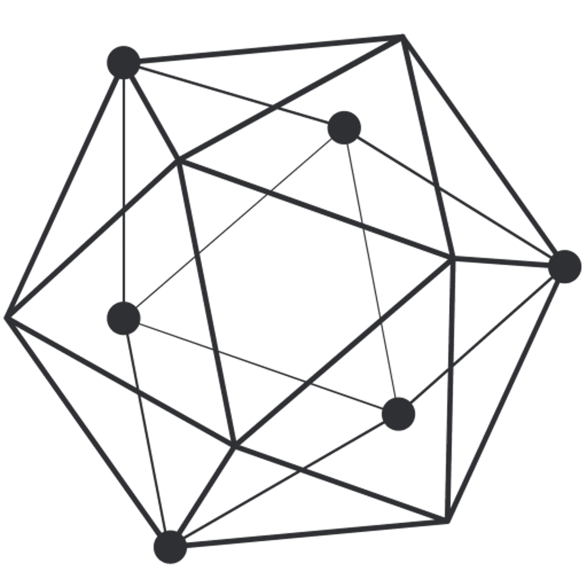
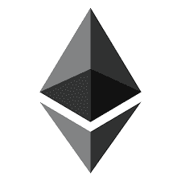

# 关于区块链编程你需要知道的

> 原文：<https://www.edureka.co/blog/blockchain-programming>

[区块链技术](https://www.edureka.co/blog/how-blockchain-works/)很有未来感。想象一个将围绕它建立的未来并不牵强。区块链一开始是一种公共的无许可技术，后来，另一种类型的区块链推出，每一种都有自己的特定用例。公共/未经许可的区块链是开放的、分散的和缓慢的，而私人/经许可的区块链是封闭的和集中的，部分或全部。区块链技术也更有效地实现了业务流程的现代化。

在这里，我将讨论，为了开始构建使用区块链技术的应用程序，你需要学习什么。刚开始学区块链的时候，脑子里蹦出很多问题。区块链编程有哪些不同类型，我应该知道哪些编程语言才能高效编程， 区块链 编码的平台有哪些 ？

在这篇文章中，我将讨论不同的编程语言，你可以学习这些语言来开发使用区块链技术的应用程序。

以下是你会在这个博客中找到的主题列表:

*   [区块链编程的类型](#types)
*   [热门区块链编程平台](#platform)
*   [排名前五的区块链编程语言](#top5)

## **区块链编程类型**

*   **区块链架构编程**

在区块链发布之前，必须解决构成其架构和协议的重要特性。这必须用代码编写。例如，在 2009 年比特币区块链发布之前，管理这种情况的规则和条例是用 c++编写的。这种编码通常是使用 c 和 java 等更接近机器的语言来完成的。

*   **建立智能合同或分散式应用程序(DApp)**

在普通的集中式应用中，后端代码运行在集中式服务器上，而 [Dapp](https://www.edureka.co/blog/developing-ethereum-dapps-with-truffle) 的后端代码运行在分散的对等网络上。像一个应用程序一样，DApp 可以用任何语言编写前端代码，用户界面可以调用后端。

**了解我们在顶级城市/国家的区块链培训**

| **印度** | **其他城市/国家** |
| [班加罗尔](https://www.edureka.co/blockchain-training-bangalore) | [纽约](https://www.edureka.co/blockchain-training-new-york-city) |
| [海德拉巴](https://www.edureka.co/blockchain-training-hyderabad) | [英国](https://www.edureka.co/blockchain-training-uk) |
| 喀拉拉邦 | [美国](https://www.edureka.co/blockchain-training-usa) |
| [钦奈](https://www.edureka.co/blockchain-training-chennai) | [加拿大](https://www.edureka.co/blockchain-training-canada) |
| [孟买](https://www.edureka.co/blockchain-training-mumbai) | [澳大利亚](https://www.edureka.co/blockchain-training-australia) |
| [浦那](https://www.edureka.co/blockchain-training-pune) | [新加坡](https://www.edureka.co/blockchain-training-singapore) |

## **热门区块链编程平台**

### **总账**

### ****

[Hyperledger](https://www.edureka.co/blog/what-is-hyperledger/) 是开源区块链的一个伞式项目，旨在帮助推进技术，并通过领导力，提供相关的工具、培训和活动来支持基于区块链的分布式总账的协作开发。它的目标是提供模块化的区块链技术，该技术包含丰富的、易于使用的应用程序编程接口(API)。Hyperledger 降低了安全风险，并确保只有希望进行交易的各方才是交易的一部分。因此 hyperledger 提供了区块链架构、数据隐私、信息共享和不变性的所有功能。

### **以太坊**

以太坊是一个开源的区块链平台，用于开发基于区块链技术的分散式应用程序。以太坊区块链平台有助于通过网络中的节点运行脚本或智能合同。它只是不跟踪交易，但也编程。以太坊提供了众多编程选择，C++、Go、Python、Java 等等。智能合约是使用 Solidity 构建的，Solidity 是一种面向合约的高级编程语言。

## **排名前 5 的区块链编程语言**

### **1。C++**

让我们从列表中最古老、最受推崇的语言开始吧，常青树 C++。几乎我们所有人都知道它是 C 语言的扩展。在 C++中，创建了一个数据、函数和对象的包，可以很容易地在其他程序中调用和重用，从而大大减少了编码时间。

但是现在有很多高级语言，为什么还要用 C++？

嗯，C++有一些特性使它非常吸引人。 考虑到区块链发展中的挑战，区块链应该像一个安全的堡垒，同时拥有有效的资源管理。区块链应该与许多不可信的节点进行交互，同时仍然为所有这些节点提供快速服务。这种及时的服务对于一种加密货币的成功至关重要。 为了满足所有这些需求并以最高水平运行，您需要完全控制 CPU 和内存的使用。C++把这个给了它的用户。

C++另一个有趣的方面是移动语义。移动语义提供了一种在对象之间移动内容而不是复制内容的方法。移动语义的优势在于，您可以仅在需要时获得某些数据的副本，从而通过减少代码冗余来大幅提升性能。因此，高效的内存管理和高性能都是区块链所需要的。

关于区块链编程，我能想到的另一个挑战是集成并行性好的任务和不并行的任务。大多数语言只擅长一种，然而，C++的线程能力可以处理并行和非并行任务。C++支持多线程功能和有效的线程间通信，还优化了单线程性能。

***c++的利弊:***

| **优势** | **缺点** |
| 独立多平台 | 复杂且通常难以调试 |
| 静态类型 | 不太好学 |
| 高速 | 不支持垃圾收集 |

C++主要用于加密货币和重要的区块链项目，如比特币、Ripple、比特币现金、莱特币、Stellar、Monero。

### **2。Javascript**

JavaScript 是软件开发中最流行的语言之一。JavaScript 及其库和框架，像 [jQuery](https://www.edureka.co/blog/jquery-tutorial/) 、 [React](https://www.edureka.co/blog/what-is-react/) 、 [Angular](https://www.edureka.co/blog/animating-angular-apps-with-nganimate/) 和 [Node](https://www.edureka.co/blog/nodejs-tutorial/) ，是驱动现代 web 开发的引擎。与 HTML 和 CSS 一起，它无疑增强了它的功能。Javascript 主要用于创建高度互动的网页。

javascript 非常适合区块链操作的一个主要特点是它非常擅长处理异步动作。随着区块链上用户数量的增加，所有用户同时执行操作，JavaScript 可以更容易地处理所有这些不同区块链节点之间的通信。但是，我们不能否认，在最大化计算机的处理能力方面，JavaScript 不如 C++高效。

***Javascript 的利弊:***

| **优势** | **缺点** |
| 面向对象 | 动态 |
| 基于原型的 | 解读取决于浏览器 |
| 支持功能编程 | 任何人都可以查看代码 |

区块链开发者在 web3.js 和 ethereum.js 中使用 javascript，它帮助你连接你的应用前端，以连接以太坊网络和智能合约。JavaScript 在区块链的另一个流行应用是 Hyperledger Fabric SDK for node.js，这是一个巨大的框架，在 It 行业和企业中经常使用。所以，如果你喜欢这种编码，这可能是一个很好的选择。

### **3。蟒蛇**

作为一种相对现代的编程语言， [Python](https://www.edureka.co/blog/python-tutorial/) 通常是新程序员的最爱，因为它具有类似于英语的简单语法。Python 代码可以在服务器上用来创建基于 web 的应用程序。它还用于连接数据库系统。它可以处理大数据，执行复杂的数学运算。Python 最吸引人的方面是它使用新行来完成命令，这与其他经常使用分号或括号的编程语言相反。

无论你做什么，你都不能把 Python 排除在这个列表之外，因为几乎每个区块链生态系统都有一个或多个用 Python 编写的公共工具。Python 正成为比以往任何时候都更受欢迎的语言。

***Python 的利弊:***

| **优势** | **缺点** |
| 在不同平台上工作(Windows、Mac、Linux、Raspberry、其他) | 大多用作服务器语言 |
| 与其他一些编程语言相比，这种语法允许开发者用更少的代码行编写程序。 | 不那么聪明的语境 |
| 运行在一个翻译系统上。也就是说，原型制作可以非常快。 | 库并不总是以足够的方式被记录 |

Python 在区块链的使用案例:

在区块链领域，Python 被用于为 Hyperledger 编写智能合约。像以太坊(pyethereum)这样的好项目还有很多，都有自己的实现。Python 也被用于为 NEO 创建合同。

### **4。开始**

GoLang 或俗称 GO 编程语言，是一种相对现代的领域通用语言，由谷歌于 2007 年开发，并于 2012 年公开使用。它是一种静态类型语言，语法有点类似于 c 语言。作为一种健壮的多用途语言，GO 试图将现代语言(如 Python & Javascript)的语法和用户友好性与 c 语言的性能和安全优势结合起来。GO 是一种编译语言，它提供了丰富的标准库。当您对区块链项目的多个部分使用 GO 时，这个特性提供了最大的灵活性。

在 Go 中，名为 Goroutines 的方法提供了异步或并行运行几个程序或程序的几个部分的能力，这是区块链项目所需要的一个重要特性。通常，在 Java 等语言中使用线程来实现这一点。

***围棋的利弊:***

| **优势** | **缺点** |
| 编译时间快 | 不太好学 |
| 程序简单、简洁、安全 | Go 没有很多像 python 或 javascript 这样的包 |
| 超级强类型，可伸缩 | 对于一些开发者来说，语法不清楚 |
| 垃圾收集 | 非常年轻的语言，社区不像其他流行语言那么大 |

***区块链围棋用例:***

与 Golang 相关的项目不胜枚举， ，这里我只提几个比较热门的 。 Go-Ethereum 是用 golang 编写的最重要的项目之一。另一个用 Go 语言编写的重要项目是 Hyperledger Fabric。这是大公司最受欢迎的区块链解决方案之一。一个针对分散式在线游戏的令人兴奋的项目是 Loom Network，它用 go 编写了 chaincode。

### **坚固度**

[Solidity](https://www.edureka.co/blog/solidity-tutorial/) 是以太坊团队(Gavin Wood，Christian Reitwiessner 等人)制作的一种类似 javascript 的特定领域、面向对象的高级语言。Solidity 受 C++、Python 和 JavaScript 的影响，是为在以太坊平台以太坊虚拟机(EVM)上创建分散式应用而设计的。EVM 是在以太坊平台上编写的智能合约的运行时环境。Solidity 是一种静态类型语言，支持继承、库和复杂的用户定义类型。到目前为止，它是以太坊社区和区块链行业中最适用的 DSL。

你可以通过这个 Solidity 视频讲座，我们拥有[区块链认证](https://www.edureka.co/blockchain-training)的专家正在讨论每一个&技术的每一个细节。

## 智能合约编程教程| Solidity 编程语言| Solidity 教程| Edureka

[https://www.youtube.com/embed/XdrScruyYtk?rel=0&showinfo=0](https://www.youtube.com/embed/XdrScruyYtk?rel=0&showinfo=0)This Edureka’s Solidity Tutorial video is intended to guide you through the basics of Ethereum’s smart contract language called solidity.

为了测试代码的可靠性，你可以使用 [混合 IDE](https://remix.ethereum.org/) 。Remix 是一个基于 web 浏览器的 IDE，集成了编译器和 Solidity 运行时环境，没有服务器端组件。它允许你编写可靠性代码，部署和运行智能合同 。

***坚固性的利弊:***

| **优势** | **缺点** |
| 提供 继承 房产合同 | 很年轻的语言，社群还不大，所以支持度更小。 |
| 静态类型化 | 由于 标准库不可用，使用非常复杂 |
| 简单易学 | 不通用的；仅在以太坊生态系统中可用 |

***区块链的坚固性用例:***

Solidity 语言用于开发以太坊智能合约。我没有看到任何其他项目使用 solidity，但以太坊开发生态系统是巨大的，是目前区块链开发最重要的部分之一。solidity 是智能合同开发中最流行的语言之一

## **结论**

区块链技术预计将对每个部门和行业产生巨大影响。在未来的日子里，随着世界变得越来越分散，区块链适应成为主流，你的未来肯定是无限的。