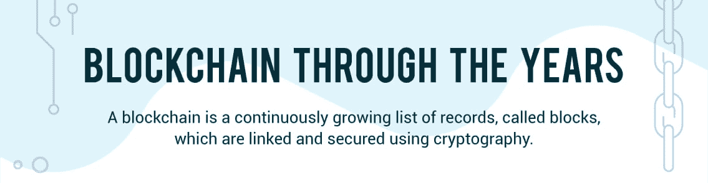
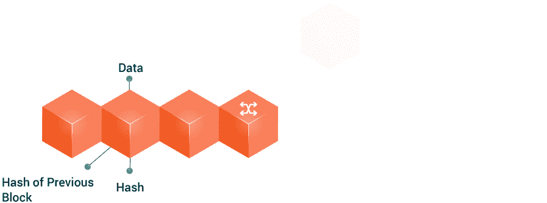
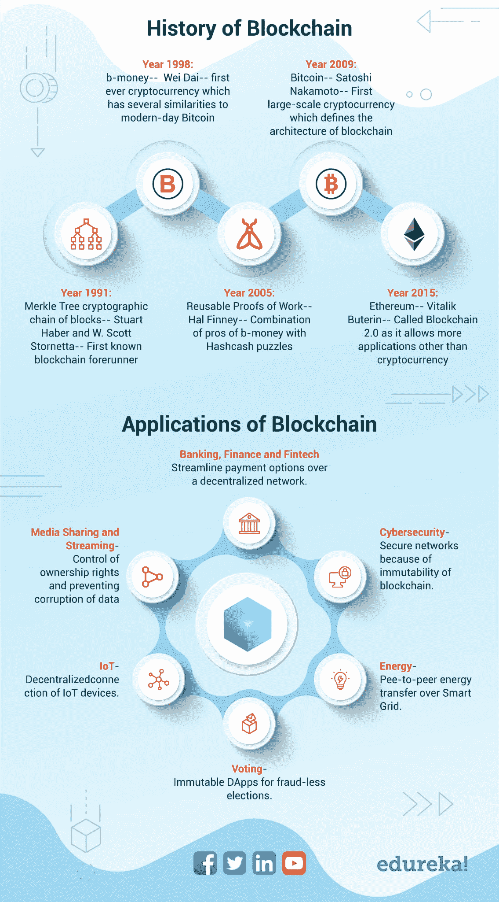

# 多年来的区块链:历史和近期应用

> 原文：<https://www.edureka.co/blog/blockchain-through-the-years/>

*“We have elected to put our money and faith in a mathematical framework that is free of politics and human error,” Tyler Winklevoss, co-creator of Facebook and top investor in Bitcoin, about blockchain.***Blockchain is a technology that is revolutionizing the IT industry. Even though this trending approach is almost a decade old, not many of us know about its and rise to power. Furthermore, most of us believe that the applications of this technology are limited to cryptocurrency.

让我们花几分钟时间来理解区块链是如何成为改变世界的技术的。下面的信息图将向您概述这种革命性方法的先驱。我们还将讨论它的一些主流应用。

 

## 区块链的兴起和崛起

如你所见，区块链不仅仅只有加密货币和比特币。事实上，这种趋势技术是少数几种可以应用于几乎任何领域的方法之一。您可能也知道，大多数领先的 IT 公司已经开始在这种分散的系统上开展项目。例如，脸书最近成立了一个专门的专家小组来探索这一领域。他们的官方声明大致是这样的，“区块链将成为新互联网的重要组成部分。”很明显，区块链正在改变大多数技术的工作方式。从现在起，这种情况至少会持续十年。

希望你能通过这张信息图对区块链有所了解。我们将在这个月发布更多关于这项革命性技术的有趣内容。如果你有兴趣发现更多关于这个潮流引领者的事实，请点击我们主页上的按钮进行订阅！

我们也很乐意在下面的评论区听到你的想法和疑问。因此，请随时让我们了解他们，我们将很高兴与您互动。

如果你希望更多地了解区块链，并在区块链技术公司建立职业生涯，那么请查看我们的[区块链课程](https://www.edureka.co/blockchain-training)，该课程包含讲师指导的现场培训和真实项目体验。本培训将帮助您深入了解 Hyperledger Fabric，并帮助您掌握该主题。**