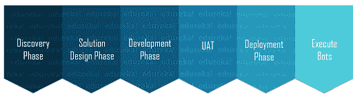

# 2023 年你必须知道的 50 大蓝棱镜面试问题

> 原文：<https://www.edureka.co/blog/interview-questions/blue-prism-interview-questions>

机器人过程自动化已经出现在市场上很长一段时间了，但只是在最近才受到欢迎。随着 RPA 在 [RPA 工具](https://www.edureka.co/blog/rpa-tools-list-and-comparison/)的帮助下帮助用户完成单调乏味的任务，它增加了 [RPA 开发人员](https://www.edureka.co/blog/rpa-developer-salary)的工作机会。IBM、埃森哲、Cognizant、德勤、Genpact、安永等跨国公司使用蓝棱镜。但是市场上缺乏 ***[RPA 认证](https://www.edureka.co/robotic-process-automation-training)*** 的专业人才。我相信你已经知道了这些事实，这些事实让你看到了这篇蓝棱镜面试问题的文章。

在这篇关于蓝棱镜面试问题的文章中，我将讨论在你的面试中被问到的与蓝棱镜相关的问题。所以，为了让你更好的理解，我把这篇文章分成了以下几个部分:

## **基本 RPA 面试问题**

### **Q1。在任何地方提及[蓝棱镜](https://www.edureka.co/blog/rpa-blue-prism/)、 [UiPath](https://www.edureka.co/blog/uipath-studio/) 和[自动化之间的区别。](https://www.edureka.co/blog/rpa-automation-anywhere/)**

| **蓝色棱镜** | **UiPath** | **自动化无处不在** |
| 最近推出了免费版。 | 有社区版/免费版 | 最近推出了社区版 |
| 比自动化任何地方都受欢迎 | 最受欢迎的工具 | 不如其他人受欢迎 |
| 它提供了允许用户编写代码的功能，但是用户没有它也能管理。 | 不需要编程知识 | 不需要编程知识 |
| 提供官方认证程序 | 拥有免费的在线培训和认证计划 | 最近推出了 50 美元的认证。 |
| 专为 Citrix automation for BPO 而设计。 | 提供桌面、web 和 Citrix 自动化 | 所有媒介都合理。 |

### **Q2。什么是机器人过程自动化？**

在软件/工具的帮助下自动化任务以部署机器人的过程，这将减少人类执行任何任务的参与，被称为 [机器人过程自动化](https://www.edureka.co/blog/what-is-robotic-process-automation/) 。

有三个术语你需要理解，即: *机器人，流程，* 和 *自动化。* 让我给你一一解释这些术语。

*   **机器人:**模仿人类动作的实体称为机器人。
*   **过程:**导致有意义活动的一系列步骤。比如制作咖啡或者你喜欢的菜的过程等等。
*   **自动化:**任何由机器人完成的没有人为干预的过程。

当我们将上述所有术语总结在一起时，在没有任何人类干预的情况下，模仿人类动作来执行一系列步骤，从而导致有意义的活动，这被称为 [机器人流程自动化](https://www.edureka.co/blog/rpa-tutorial/) 。

### **Q3。机器人自动化和屏幕抓取有什么区别？**

机器人自动化和屏幕抓取的主要区别如下:

*   机器人被认为是应用程序的指挥者，因为人类使用的任何机器也可以被现代机器人使用。它们可以是支持 web 服务的应用程序、遗留应用程序、大型机等。
*   机器人通过收集程序知识来建立一个共享图书馆。这种知识可以被任何其他机器人或设备重复使用。
*   此外，机器人在应用程序显示之前通过操作系统、通过本地应用程序环境中的屏幕或通过专用 API 读取应用程序。在本地应用的上下文中通过屏幕阅读应用的情况下，机器人以与用户相同的方式阅读。因此，当一个机器人被训练时，它被展示如何阅读应用程序的显示。类似于用户的行为。

### **Q4。您能详细说明 RPA 生命周期的各个阶段吗？**

RPA 生命周期主要有 5 个阶段和一个附加阶段。参考下图。

*   **发现阶段**——顾名思义，在这个阶段，分析客户的需求，以决定流程是否可以自动化。之后，分析过程的复杂性和好处。
*   **解决方案设计阶段**–自动化任务的解决方案或步骤就是在这个阶段设计的。除了基本要求之外，还决定了项目的一些其他要求，如预算、花费的时间、参与项目的人数。然后创建一个对象模型图或流程图来理解流程。
*   **开发阶段**–开发阶段是自动化开发人员在选择的 RPA 工具中创建自动化脚本的阶段。根据要自动化的任务或所需的自动化类型，可能需要也可能不需要编码。
*   **【UAT】**–在 RPA 生命周期的这个阶段，开发的 bot 由 [测试](https://www.edureka.co/blog/software-testing-tutorial/) 团队或开发团队本身进行测试。该机器人在生产前环境中进行测试，以测试用户如何使用该机器人来自动执行特定任务。
*   **部署&维护阶段**–在开发和测试一个 bot 之后，该 bot 被部署到生产环境中。
*   **执行机器人**–在这个阶段，机器人被执行，然后被检查以产生有意义的结果。

### **Q5。RPA 和自动化有什么区别？**

| **参数** | **南非** | **自动化** |
| **它减少什么？** | 减少人工劳动力 | 减少执行时间 |
| **对编程知识的需求** | 几乎不需要，因为它是向导驱动的 | 需要创建测试脚本 |
| **用途** | 通常用于生产环境 | 用于质量保证、生产、性能、UAT 环境 |
| 它自动化了什么？ | 重复的业务流程，即产品和业务 | 重复测试案例，即产品 |
| **工作环境有哪些？** | 适用于各种环境 | 有限的工作环境 |

### **Q6。RPA 有什么特点？**

RPA 的特征如下:

*   **准确:**不易出错，工作精度和均匀性高
*   **一致:**RPA 软件的构建方式是，所有重复性任务都以相同的方式执行。
*   **成本削减技术:**旨在减少体力劳动，从而降低用于执行任何任务的成本。
*   **生产率:**与手动方法相比，执行任何任务的执行时间都要快得多。
*   **可靠的软件:**这个软件是可靠的，因为机器人可以 24*7 不间断工作，效率一样。
*   **不需要/少需要编码:** RPA 工具不需要太多的编码知识。

### **Q7。提及瘦客户端和胖客户端之间的区别。**

| **瘦客户端** | **胖客户端** |
| 这是一个应用程序，我们无法获得质量属性，而间谍使用任何 RPA 工具 | 这是一个应用程序，我们无法获得质量属性，而间谍使用任何 RPA 工具 |
| **例如:**任何虚拟环境 | **举例:** 计算器，ie 浏览器 |

### **Q8。能提几个 RPA 对前台和后台处理的一般要求吗？**

这个问题没有明确的答案。但是，你可以回答面试官说，除了工具和客户需求，前台和后台处理的大部分需求是相同的。相同的配置可以很容易地部署，并且可以得到的结果总是在各个方面都是优越的。

### **Q9。[硒](https://www.edureka.co/blog/selenium-tutorial)和 RPA 有什么区别？**

| **参数** | **硒** | **南非** |
| **自动化** | 自动化浏览器应用 | 自动化业务流程 |
| **可用性** | 开源 | 

*   uipath: the community version is available
*   随处自动化:社区版可用
*   Blue prism: free trial for 30 days

 |
| 任务在哪里执行？ | 在当前浏览器页面执行任务 | 在流程的后端 |
| **使用的主要部件** | Selenium Web 驱动程序 | RPA 机器人 |
| **生命周期** | 相对困难 | 简单易行 |
| **平台依赖性** | 依赖于浏览器平台的 | 平台无关 |
| **编程知识** | 必需的 | 不需要 |
| **所需技能** | [【硒 IDE】](https://www.edureka.co/blog/selenium-ide)(创建测试套件) | SQL 数据库，分析能力，解决问题的能力，管理数据， [RPA 工具](https://www.edureka.co/blog/rpa-tools-list-and-comparison/) 的知识。 |

### **Q10。在自动化的规划阶段需要考虑哪些要点。**

在自动化的规划阶段，您需要考虑以下事项:

*   适合您项目的最佳 RPA 工具
*   收集范围内和范围外参数
*   测试环境
*   项目时间表
*   可交付成果的识别

## **基本蓝棱镜面试问题**

### **Q1。使用蓝棱镜工具需要编码技能吗？**

嗯，这是面试中最常见的问题之一。这个问题的答案是否定的。Blue Prism 不需要任何编程知识，因为它已经以一种可以由用户构建和管理的方式发展了其数字劳动力。除此之外，Blue Prism 还确保其数字员工坚持跨技术、运营和机器人运营模式，以确保它可以在企业的任何部门实施。此外，事实上，所有 RPA 工具都不需要或很少需要编程知识，因为它们的所有平台都是以这样一种方式构建的，即用户不需要坐着编写代码。

### **Q2。蓝棱镜在市场上有什么需求？**

由于没有 RPA 工具就无法实现机器人流程自动化，因此 Blue Prism 是最受欢迎的 RPA 工具之一 [RPA 工具](https://www.edureka.co/blog/rpa-tools-list-and-comparison/)用于为各个部门和任务设计自动化脚本。Blue Prism 支持密钥的内部和外部加密或解密。

除此之外，它还支持审计日志，便于用户调试。嗯，这只是几个要点，但是我相信一旦你开始使用这个工具，你就会明白蓝棱镜的好处。

### **Q3。你对《蓝棱镜》中的环境变量有什么理解？**

环境变量是那些对所有流程和业务对象都可用的变量。因此，这些变量被用作动态变量，以确保在蓝棱镜平台上需要时可以使用它们。

要使用环境变量，请遵循以下步骤:

*   向所选择的**流程**或**对象**添加新的数据项
*   打开**数据属性**表单
*   在**曝光**组合框中选择**环境**选项
*   屏幕上方的**‘姓名’编辑框**将变成**组合框**。从组合列表中选择您想要使用的环境变量
*   点击**确定**

### **Q4。需要蓝棱镜专业服务提供什么样的支持？**

蓝棱镜提供广泛的服务。所以，这完全取决于你已经具备的能力和你下一步想学什么。Blue Prism 可以提供学习该工具的完整培训，24*7 支持，确保您快速学习该工具并开始自动化任务。在这里，Blue Prism 负责在商定的服务级别内提供业务优势。

### **Q5。你能提到用于执行蓝棱镜平台的硬件要求吗？**

嗯，没有硬件要求。但由于 蓝棱镜的设计符合适用于 IT 安全性、操作完整性和操作支持性的 IT 标准，因此该软件以随时可部署的方式设计。

在前台处理中，它运行在标准/本地桌面上，而在后台处理中，它运行在大量系统上。

### **Q6。你所理解的可视化业务对象是什么？**

可视化业务对象用于为应用程序提供接口。这个应用程序接口不是在 Process Studio 中配置的，而是在一个称为 Object Studio 环境的独立环境中配置的。因此，业务对象不会向控制室公开，而是始终由流程使用。

### **Q7。提及蓝色棱镜**中的组件

Blue Prism 附带了各种工具、库和运行时环境，使用户能够自动执行任务。在所有这些当中，蓝色棱镜主要有两个组成部分。他们是:

*   **流程工作室**–流程工作室是创建流程图的区域。Blue Prism 的这个组件提供了诸如业务逻辑、对象调用、控制循环和变量等特性。创建的每个流程都有首先执行的主页。

*   **Object Studio**–几乎所有企业都需要与外部应用程序进行通信，以实现任务自动化。因为它不能在 Process Studio 中发生，所以使用 Object Studio。Object Studio 是创建可视化业务对象(VBO)的地方。这些对象只不过是与执行操作的外部应用程序交互的图形程序。一个业务对象只为一个外部应用程序提供一个接口。另外，让我告诉你，每个 Object Studio 都没有主页面，但是它有两个默认页面，组织成一个平面组。

### **Q8。你对《蓝色棱镜》中的过程有什么理解？**

流程与业务对象非常相似。它像人类用户一样工作，并实现软件机器人逻辑。每个流程都是通过使用一个或多个页面来定义的，其中每个页面都包含不同的阶段。一个过程总是从它的主页开始，然后进入其他页面。这里，每个页面都有自己单独的选项卡，以确保流程被划分到不同的逻辑分组中。

### **Q9。提及在蓝色棱镜**中创建流程的步骤

按照以下步骤在蓝色棱镜中创建流程:

*   打开**蓝色棱镜窗口**，选择**工作室图标**。
*   然后 r **右击 Studio 选项卡下的流程**标题，选择“**创建流程**”。
*   之后，**输入流程**的名称和描述
*   一旦流程被创建，它将**出现在流程标题**下。双击它就可以打开。
*   现在，一旦**流程开启**，下一步就是**增加一个阶段**。为此，请转到左侧的 **Stages 工具栏**并将其拖入工作区。
*   添加阶段后，您可以继续创建流程流。

### **Q10。如何开始使用 Blue Prism 交付流程？**

由于运营敏捷性框架是可扩展的，因此 Blue Prism 建议采用分阶段的方法开始。这种环境最初用于针对 1 到 10 个流程之间的配置，然后在框架建立后引入流程的滚动计划。

### **Q11。** **部署蓝棱镜应用有哪些步骤？**

为了部署 Blue prism 应用程序，我们需要工具控制室和系统管理器。

这些工具让执行如下任务:

*   启动和停止蓝色棱镜进程的实例。
*   查看每个 Blue Prism 进程生成的日志，无论是在进程运行时还是在进程结束后。除此之外，日志记录了流程中每个阶段的执行时间。
*   根据用户定义的时间表创建工艺时间表。
*   查看工作队列，检查流程在多大程度上获得了输入文件，以及发生了哪些异常。

### **Q12。提及在 Blue Prism 中创建一个动作并发布它的步骤。**

动作用于实现业务对象的逻辑。每个动作包含具有每个动作所使用的信息的数据项以及一组阶段。

要发布一个动作，它必须由进程或任何其他软件调用。一个动作也可以保持私有。当您将某个操作设为私有时，它仅对业务对象中的其他操作可用。

一个动作总是从开始阶段开始，在结束阶段结束。在这两个阶段之间，还存在负责执行任务的其他阶段。

发布动作的步骤非常简单:

*   右键单击动作的名称，并从上下文菜单中选择 **发布** 。
*   行动发布后，行动名称旁边会出现一个图标，表示该行动已发布。

### **Q13。** **你对蓝棱镜工艺模板有什么理解？**

Blue Prism 流程模板用作在 Blue Prism 中创建的所有流程的基础。这些模板确保流程易于配置和支持。它们还帮助用户理解工作队列在所有创建的流程中是如何使用的。

在流程模板的帮助下，您可以执行以下操作:

*   知道在哪里工作队列装载了新的工作，以及在哪里使用了**获取下一个项目**动作。
*   通过**解决项目页面**发送所有完整案例，并通过解决异常页面发送异常项目。
*   开发并支持在整个流程中拥有**多个标记异常和标记完成阶段**。
*   进行**快速流程开发**，因为为不同的工作队列加载场景提供了示例。
*   遵循类似模板，轻松熟悉现有流程。

### **Q14。** **你对 SDD 和 FRQ 有什么理解？**

*   –SDD 又名解决方案设计文档，用于描述流程定义文档中衍生的蓝棱镜自动化流程。
*   **FRQ—**FRQ 又名功能需求问卷，用于提供需要考虑的方面以及所需细节的清单。

### **Q15。您能介绍几种保护 Blue Prism 应用程序的方法吗？**

有三种方法可以保护您的应用程序:

*   **用户:**用于分配新用户信息
*   **凭证:**用于存储秘密信息
*   **选项:**用于设置设置密码的规则

除此之外，Blue Prism 还提供基于角色的安全访问控制。通过这个，蓝色的 棱镜管理员定义了一个用户可以扮演什么角色，系统将只允许那个用户执行这些角色所允许的动作。管理员还可以检查活动记录，例如用户登录 Blue Prism 的时间、用户启动或删除流程的时间、用户更改密码的时间等等。

### **Q16。全局鼠标点击和全局发送键有什么用？**

全局鼠标点击和全局发送键是需要活动应用程序的操作示例。在这种情况下，应用程序不是前端的，操作将点击或键入任何一个活动的窗口。这也可能是不同的应用程序或空桌面。

### **Q17。详细说明蓝棱镜生命周期的不同阶段。**

蓝棱镜生命周期有三个阶段:

**阶段 1:** 开发人员和测试人员相互合作，证明自动化解决方案验证了过程定义文档。

**阶段 2:** 您将在 Process Studio 中重复阶段 1，测试更多地在实时数据测试中执行。

**阶段 3:** 该阶段将包括以下内容:

*   为了测试最终解决方案，流程解决方案安装了测试环境。
*   解决方案应该能够管理环境的性能，以及任何剩余的问题。
*   最后，流程在蓝棱镜的控制室运行。
*   然后，验收标准必须在满足完整测试报告后发布标志。一旦完成，流程就在生产中执行。

### **Q18。蓝棱镜中的** **工作队列有哪些，提及蓝棱镜中设置工作队列优先级的** **步骤？**

工作队列主要用于将大量的工作分成小部分。为此，可以使用多个机器人来减少时间消耗。 同样，工作队列是部署机器人最有效的方式之一。如果您在队列中工作，您必须设置队列项的优先级。为此，

您必须借助 **添加到队列** 动作将第一个项目添加到队列中。

接下来，你要处理队列项，以启动进程开始的优先级。一旦项目的优先级被添加到队列中，它就不能被改变。

### **Q19。蓝棱镜的标签用在哪里？**

标签是分配给工作队列项目的术语的关键字。当您想要从工作队列中检索下一个项目时，会用到这些标签。您还可以过滤要检索的项目(是否存在特定的标记),并为 Get Next item 操作的标记过滤器输入参数提供适当的参数。通过使用分号可以使用多个标签。

**举例:**

"+工作类型 1；+学生类型 2；-工作类型 2"

在这里，下一个项目将具有工作类型 1 和学生类型 2 标签，并且将返回没有工作类型 2 标签。

### **Q20。蓝棱镜的平台安全可审计吗？**

是的，Blue Prism 的平台是安全且可审计的，因为安全性和可审计性都在几个级别上内置于 Blue Prism 平台中。

在 Blue Prism 中，运行时环境与编辑环境的过程是分开的。此外，每个授权用户都有特定的权限来设计、创建、编辑和运行流程。

除此之外，对任何流程的变更都保留完整的审计跟踪，并提供变更前后的效果比较。此外，在运行时为每个流程创建的日志为自动化流程中采取的每个决策和操作提供了详细的带时间戳的历史记录。

### **Q21。你对多部分流程的理解是什么？**

顾名思义，多部分流程用于需要在不同项目的多个部分中处理一个案例的场景。 它带有父子关系，其中单个工作队列项目必须链接到单个请求。

这也可用于工作由外部系统驱动而不是由蓝棱镜工作队列驱动的情况。

不仅如此，如果请求是在一天内添加的，并且必须在服务级别协议期内执行，则可以使用多部分流程。

### **Q22。什么是应用建模者？**

应用建模器用于与应用交互。通过这个，你可以只配置 一个应用。但是，您可以继续使用新配置覆盖或替换现有配置。

除此之外，您还可以遵循当地的命名惯例来回答面试，通常是{元素类型}-{元素名称}

**Q23。解释蓝色棱镜中的附加选项。**

附加选项用于识别正在使用的应用程序。您需要输入值来帮助它识别应用程序。例如:“窗口标题”或“进程名称”。

**Q24。你对“保存”复选框的理解是什么，什么时候使用？**

选中“保留”复选框时，将禁用“例外类型”和“例外详细信息”字段。因此，当我们检查 Preserve 复选框时，当前的异常将被重新释放或再次抛出，不需要更多的细节。

因此，必须在恢复阶段和恢复阶段之间的恢复模式中使用“保留”复选框。

此外，如果您在恢复模式之外使用复选框，将会生成一个异常。

**Q25。** **解释动态匹配类型的用法？**

动态匹配类型允许用户从图表中指定属性的值，而不是使用应用程序建模器中存在的值。

您可以将动态匹配类型理解为任何 stage using 元素所需的强制输入参数。

## **高级水平** **蓝棱镜面试试题**

### **Q1。你对 OID 和 PDI 有什么理解？**

OID 又名运营影响文档，用于通知运营团队在自动化解决方案设计完成后，由谁负责变更。

因此，它基本上是对成功实施解决方案后影响他们的变化的描述。

此外，为了检查自动化解决方案的执行及其对业务的影响，将通过流程定义文档召开研讨会。

来到 PDI 又名过程设计指导，是一个开发过程的蓝图，在将低级别的信息从软件定义文档中排除后，可以将它包含在 PDI 中，使过程变得清晰。

### **Q2。** **蓝棱镜中的主动辅助功能接口是什么？**

主动辅助功能界面比默认的 Win32 界面慢得多，但是 主动辅助功能兼容更多类型的界面元素。当自动化 Windows 本机应用程序时，只有当元素不兼容或使用 Win32 spy 模式无法可靠定位时，才应使用活动辅助功能。为了提高主动辅助功能接口的性能，可以使用 匹配索引和匹配反向。使用这个接口时，即使元素看起来是唯一的，也可以找到多个匹配项。这可能是因为有些元素即使不显示也可能存在。

### **Q3。在 Blue Prism 中创建 Web 服务的步骤是什么？**

你可以按照下面的步骤在 Blue Prism 中创建一个简单的计算器程序。

*   打开 Blue Prism Studio 并创建一个 web 服务组。
*   然后，创建一个简单的对象，比如 SampleCalc。此外，输入 web 服务的详细信息。
*   一旦创建了对象，双击对象并打开 object studio。这里，单击 Action1 按钮，并通过右键单击该按钮添加一个操作。
*   然后双击该操作，这将导航到您必须提供描述的页面信息，例如将两个数字相乘并返回结果。之后，点击确定。
*   既然我们正试图将两个数相乘。为此，您需要选择计算选项。为此，双击 SampleCalc1，您将导航到计算属性。在这里，您必须将名称提供为:两个数相乘。
*   然后，在表达式字段中，您只需点击数字选项即可创建两个数字。假设我们创建了两个输入数字 Data1、Data2 和一个输出数字 Data3。
*   接下来，您必须拖动输入数字，并在结果中拖动输出“Data3”。然后，单击“验证”按钮。
*   之后，点击评估表达式，在这里输入数据 1 和数据 2 的值。这些将在临时值中排序，然后您将在单击测试按钮后找到结果值。
*   接下来，你必须在给出输入数字的地方连接开始按钮。要将两个数相乘，请将它加到输出数为 Data3 的末尾。
*   然后，您可以通过单击 Go 按钮来测试这个图，并通过单击 save 按钮来保存业务对象。
*   最后， 如果给定了输入，您可以通过点击 go 按钮来检查流程。

### **Q4。详述一个过程 a 如何在控制室运行**

当过程在控制室运行时，您可以通过点击停止部分或选择过程会话来停止过程。这两种方法都会立即停止进程。在这种情况下，如果当前流程没有完成，那么蓝棱镜将在清理时将其标记为 异常。

主要有两个停止选项，您在运行过程会话上点击右键时会看到:

*   **请求停止—**请求流程在流程中配置的安全停止点停止
*   **立即停止-**该选项的行为类似于停止部分

### **Q5。** **你对等待阶段和选项的理解是什么:总是在超时时抛出异常，总是让屏幕改变？**

等待阶段用于在双击等待阶段时获取等待超时，默认超时应为 5 秒。因此，当我们在运行对象时给出等待阶段，它将一直等到用户给出的执行动作的时间。这旨在提高流程的弹性。

总是在超时时抛出异常——你不应该试图通过等待阶段来检索流程。相反，您应该尝试一个异常，并让进程来处理它，因为它可能会选择重新启动系统/在几次之后重试/在一个警告之后重试。

始终使用以改变屏幕–在导航到任何阶段后，您应该使用等待阶段，这是更新屏幕所需的原因。这通过不吸收任何延迟来确保快速运行。

### **Q6。对于短 SLA 的自动化解决方案有什么建议？**

下面列出了一些针对满足短期 SLA(服务水平协议)或实时请求的自动化解决方案的建议:

*   由于 Blue Prism 遵循从不立即完成工作的惯例，并且总是通过用户界面按照队列处理工作，因此您可以将工作请求确认与工作分开。例如，如果一个工作请求是通过 Web 服务调用来的，Blue Prism 必须将请求添加到一个工作队列中，并给出请求已被接收的输出。

*   您还可以分配足够的机器人，以确保这些机器人在高峰时间按照预期的 SLA 处理工作队列。除此之外，必须在解决方案中设计一种控制器方法，以通知用户是否错过了 SLA 或 SLA 是否有风险。还可以报告工作队列，以估计可用容量是否足以满足高峰时间的预期工作负载。

*   稳健的权变是可以满足的，因为它是蓝棱镜框架不可分割的一部分。这里，您必须确保预期的 SLA 包含在应急计划中。

### **Q7。业务对象的用途是什么，并解释检查对象是否与应用程序相关联的方法。**

业务对象的主要目的是为单个应用程序提供一个接口。业务对象不向控制室公开，而是由流程使用。

要检查一个 对象是否附加到应用程序上，你需要使用应用程序模型中的 top 或 root 元素。然后，您必须选择选项–读取操作。选择此选项后，业务对象将被连接。

### **Q8。你所理解的会话变量是什么，它们用在哪里？**

会话变量是那些适用于像正在运行的进程这样的会话的变量。与环境变量相似，会话变量在图外公开。

在运行的流程中，会话变量是非常具体的。如果流程的两个实例在同一时间运行，这两个实例将具有相同的会话变量和不同的值。

不需要在系统管理器中设置会话变量，但是在控制室中，你可以看到和修改会话变量。此外，所有数据项都是可写的，并作为会话变量公开。

### **Q9。您对新环境变量“停止时间”的理解是什么，该变量的值是“从现在起三或四分钟”，数据类型是“时间”？**

名为“停止时间”的新环境变量的值为“从现在起三或四分钟”，数据类型为“时间”。要使用这个变量，您必须创建名为“停止时间”的最新进程。然后你要创建一个名为“停止时间”的数据项。最后，您可以使用 exposure 字段将其与环境变量链接起来。

### **Q10。蓝棱镜中的标记异常和系统不可用异常是怎么理解的？**

标记异常有两个标记输入(保持锁定和重试)用于控制功能。因此，只要开发了一个新项目，它就会将其 ID 返回到这个新项目的输出参数中。此外，如果 Keep Locked 标志设置为 TRUE，那么一个新项目将在进程的控制之下。

进入系统不可用异常，这些异常通常在您无法启动应用程序时出现。这可能是因为没有响应的应用程序、应用程序的新屏幕、应用程序崩溃或应用程序内的更改，而这些在设计和开发阶段都没有考虑到。

### **Q11。** **你所理解的匹配指数是什么？**

如果你想从上到下搜索一个元素，那么你必须使用匹配索引。一旦找到元素，蓝色棱镜将停止搜索，而不是继续搜索潜在的重复项。

使用该属性，您可以提高搜索速度。但这通常在重复元素被忽略或不太可能出现时使用。

此外，如果您使用匹配反转选项，这将使蓝色棱镜以自下而上的顺序搜索，而不是自上而下的顺序。

### **Q12。运行流程的多个实例的步骤是什么？**

当访问流程的多个实例时，这些实例可能会相互冲突。例如，假设您有一个进程，它持有访问共享文件的任务。但是，您需要运行该流程的多个实例。

你认为，你将如何避免实例之间的冲突？

嗯，你可以通过从进程中删除文件访问序列，并将它放在一个单独的进程中，该进程将在一台机器上运行。

还有一种方法是使用 Blue prism 的环境锁定功能来控制对文件的访问。

这个锁是一个令牌或一把钥匙，一个进程必须获得这个令牌或钥匙作为“许可”来使用一个特定的路径作为输入。当一个进程有多个实例运行并且只有一个锁存在时，这些实例必须“竞争”锁。

### **Q13。** **在 Blue Prism 中，Blue Prism 流程从工作流系统获得工作的两种主要方法是什么？**

在 Blue Prism 中，Blue Prism 流程从工作流系统获得工作的两种主要方法如下:

**方法一:** 将工作流系统中的所有工作一次性加载到蓝棱镜工作队列中。通过这种方式，Bluer prism 机器人将从工作队列而不是工作流系统中获取项目。

**方法二:** 蓝棱镜里的机器人直接从工作流程系统里拿到案子去工作。对于每一种情况，都有一个项目被添加到 Blue Prism 工作队列中，并立即被锁定工作。

### **Q14。你对恢复阶段的理解是什么？**

恢复阶段捕获异常，让用户有机会创建各种恢复序列。一旦捕获到异常，业务对象或流程就被认为处于恢复模式，这意味着异常是实时的。

### **Q15。什么是 Blue Prism 中的连接器并说明其类型？**

蓝色棱镜中的连接器用于处理与应用程序用户界面的低级交互。由于用户可以使用各种应用程序接口，Blue Prism 提供了以下各种连接器选择:

*   **HTML 连接器**–该连接器允许用户使用 HTML、ActiveX 控件 JavaScript 和浏览器界面的其他组件。
*   **Java 连接器**–允许用户使用 Swing、Oracle、Java 小程序和其他基于 JVM 的技术。
*   **Windows Connector**–让用户能够访问 Windows[使用。NET 框架、PowerBuilder、Visual Basic、Microsoft 基础类(MFC)库和其他基于 windows 的用户界面。技术。
*   **Citrix Connector**——允许用户通过 技术访问提供用户界面的应用程序，如微软远程桌面服务和 Citrix XenApp
*   **大型机连接器**–该连接器用于允许通过来自 IBM、Attachmate 等不同供应商的终端仿真器访问大型机应用程序。

## **RPA 蓝棱镜面试问答 2022 | RPA 培训|爱德华卡**

[https://www.youtube.com/embed/ykbRdUNIbyQ?rel=0&showinfo=0](https://www.youtube.com/embed/ykbRdUNIbyQ?rel=0&showinfo=0)*This session on Blue Prism Interview Questions will cover the Top 50 Blue Prism related questions asked in your interviews.*

所以，乡亲们！说到这里，我们来结束这篇关于蓝棱镜面试问题的文章。如果您希望作为一名 [RPA 开发人员](https://www.edureka.co/blog/rpa-developer-roles-and-responsibilities/) 开始您的职业生涯，那么就开始学习 RPA 及其各种工具吧。

我们在 edureka，提供 [*机器人过程自动化培训使用 UiPath*](https://www.edureka.co/robotic-process-automation-training) 。Edureka 是一家值得信赖的在线学习公司，在全球拥有超过 250，000 名满意的学习者。本培训将帮助您获得 [*机器人过程自动化*](https://www.edureka.co/blog/robotic-process-automation/) 方面的深入知识和 UiPath 的实践经验。

*有问题吗？请在蓝棱镜面试问题的评论部分提到它，我们将会回复您。*