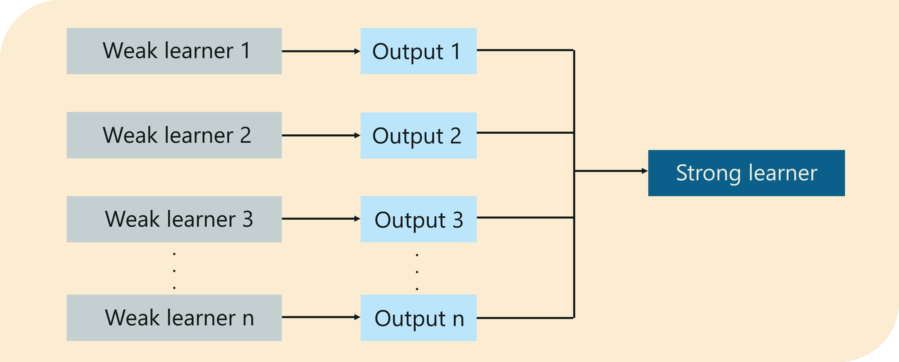
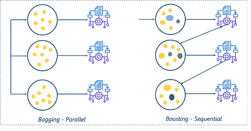
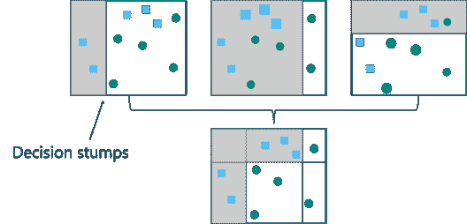
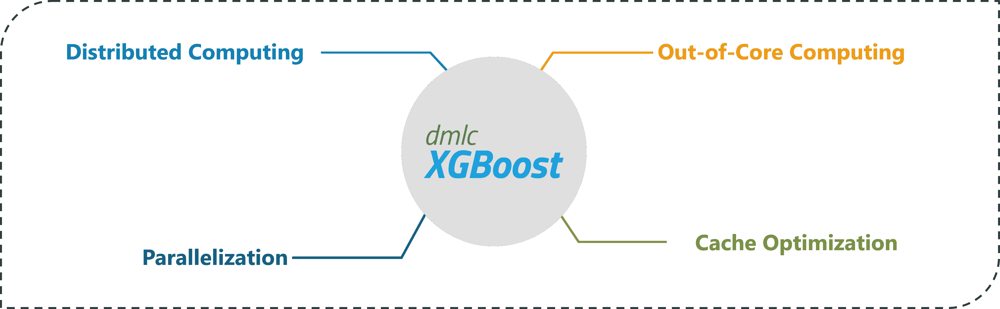

# 促进机器学习算法的综合指南

> 原文：<https://www.edureka.co/blog/boosting-machine-learning/>

随着医疗保健、市场营销、商业等领域的诸多进步，开发更先进、更复杂的[机器学习技术](https://www.edureka.co/blog/machine-learning-algorithms/)已经成为一种需求。促进机器学习就是这样一种技术，可以用来解决复杂的、数据驱动的、现实世界的问题。这篇博客完全专注于促进机器学习如何工作，以及如何实现它来提高机器学习模型的效率。

要获得人工智能和机器学习的深入知识，可以报名参加 Edureka 提供的全天候支持和终身访问的直播 [***机器学习工程师硕士项目***](https://www.edureka.co/masters-program/machine-learning-engineer-training) 。

以下是本博客将涉及的主题列表:

1.  [为什么使用增压？](#Why%20Boosting%20Is%20Used)
2.  [什么是助推？](#What%20Is%20Boosting)
3.  【Boosting 算法如何工作？
4.  [增压类型](#Types%20Of%20Boosting)
5.  [演示](#Demo)

## **为什么要用 Boosting？**

为了解决复杂的问题，我们需要更先进的技术。假设给定一组包含猫和狗图像的图像数据集，要求你建立一个模型，将这些图像分为两个独立的类别。像其他人一样，你将通过使用一些规则来识别图像，如下所示:

1.  图像有尖尖的耳朵:猫

2.  图像有猫形状的眼睛:猫

3.  图像有更大的四肢:狗

4.  图像有锋利的爪子:猫

5.  图像有一个更宽的嘴结构:狗

所有这些规则都有助于我们识别一幅图像是一只狗还是一只猫，然而，如果我们基于一个单独的(单一的)规则来对一幅图像进行分类，预测将是有缺陷的。这些规则中的每一个都被称为弱学习器，因为这些规则不足以将图像分类为猫或狗。

因此，为了确保我们的预测更加准确，我们可以通过使用多数规则或加权平均来组合来自这些弱学习者中的每一个的预测。这构成了一个强大的学习者模型。

在上面的例子中，我们已经定义了 5 个弱学习者，并且这些规则中的大多数(即，5 个学习者中的 3 个预测图像为猫)给出了图像是猫的预测。因此，我们最后的输出是一只猫。

这就给我们带来了一个问题，

## **什么是助推？**

*Boosting 是一种集成学习技术，它使用一组机器学习算法将弱学习器转换为强学习器，以提高模型的准确性。*



*什么是 Boosting-Boosting 机器学习-edu reka*

就像我提到的 Boosting 是一种集成学习方法，但集成学习到底是什么？

## **什么是机器学习中的系综？**

集成学习是一种通过组合多个学习器来提高机器学习模型性能的方法。与单一模型相比，这种类型的学习可以提高模型的效率和准确性。这就是为什么合奏方法被用来赢得市场领先的比赛，如网飞推荐比赛，卡格尔比赛等。



*什么是集成学习——助推机器学习——edu reka*

下面我也讨论了增压和装袋的区别。

### **增压 vs 装袋**

集成学习可以以两种方式执行:

1.  **顺序系综，**俗称 ***助推*** ，这里弱学习者是在训练阶段顺序产生的。通过给先前分类不正确的样本分配较高的权重，模型的性能得到改善。增强的一个例子是 AdaBoost 算法。

2.  **平行合奏**，俗称 ***装袋*** ，这里弱学习者是在训练阶段平行产生的。通过在自举数据集上并行训练多个弱学习器，可以提高模型的性能。装袋的一个例子是随机森林算法。

在这篇博客中，我将关注 boosting 方法，因此在下面的部分我们将了解 Boosting 算法是如何工作的。

查看 E & ICT Academy NIT Warangal 的这些 [AI 和 ML 课程](https://www.edureka.co/executive-programs/machine-learning-and-ai)，学习并建立人工智能职业生涯。

## 【Boosting 算法如何工作？

boosting 算法工作的基本原理是生成多个弱学习器，并将它们的预测组合起来形成一个强规则。这些弱规则是通过对数据集的不同分布应用基础机器学习算法而生成的。这些算法为每次迭代生成弱规则。在多次迭代之后，弱学习器被组合以形成强学习器，该强学习器将预测更准确的结果。



*Boosting 算法如何工作——Boosting 机器学习——edu reka*

算法是这样工作的:

**第一步:**基础算法读取数据，给每个样本观察值分配相等的权重。

**步骤 2:** 识别基础学习者做出的错误预测。在下一次迭代中，这些错误的预测被分配给下一个基础学习者，该基础学习者对这些不正确的预测具有较高的权重。

**第三步:**重复第二步，直到算法能够正确分类输出。

因此，Boosting 的主要目的是更加关注分类错误的预测。

现在我们知道了 boosting 算法是如何工作的，让我们来理解不同类型的 boosting 技术。

**了解我们在顶级城市的机器学习认证培训课程**

| 印度 | 美国 | 其他国家 |
| [班加罗尔的机器学习课程](https://www.edureka.co/masters-program/machine-learning-engineer-training-bangalore) | [达拉斯的机器学习培训](https://www.edureka.co/masters-program/machine-learning-engineer-training-dallas) | [多伦多的机器学习培训](https://www.edureka.co/machine-learning-certification-training-toronto) |
| [海德拉巴的机器学习课程](https://www.edureka.co/masters-program/machine-learning-engineer-training-hyderabad) | [华盛顿的机器学习培训](https://www.edureka.co/masters-program/machine-learning-engineer-training-washington) | [伦敦的机器学习培训](https://www.edureka.co/machine-learning-certification-training-london) |
| [孟买的机器学习认证](https://www.edureka.co/machine-learning-certification-training-mumbai) | [纽约的机器学习认证](https://www.edureka.co/machine-learning-certification-training-new-york-city) | [迪拜的机器学习课程](https://www.edureka.co/masters-program/machine-learning-engineer-training-dubai) |

## **增压类型**

有三种主要的方法可以实现增压:

1.  自适应升压或 AdaBoost

2.  梯度推进

3.  XGBoost

我将讨论每种类型背后的基础知识。

## **自适应增压**

*   AdaBoost 是通过将几个弱学习器组合成一个强学习器来实现的。

*   AdaBoost 中的弱学习器考虑单个输入特征，并绘制出称为决策树桩的单个分裂决策树。在画出第一个决策图时，每个观察值被同等地加权。

*   来自第一个决策树桩的结果被分析，并且如果任何观察被错误地分类，它们被分配更高的权重。

*   张贴这个，一个新的决策树桩被认为是更重要的观察与更高的权重。

*   同样，如果任何观察值被错误分类，它们被给予更高的权重，并且这个过程继续，直到所有观察值落入正确的类别。

*   Adaboost 可用于分类和基于回归的问题，但它更常用于分类目的。

## **梯度推进**

梯度提升也基于顺序集成学习。这里，基本学习器以这样的方式顺序地产生，即当前的基本学习器总是比前一个更有效，即，整个模型随着每次迭代顺序地改进。

这种类型的提升的不同之处在于，错误分类结果的权重不会增加，相反，梯度提升方法试图通过添加新模型来优化前一个学习器的损失函数，该新模型添加了弱学习器，以便减少损失函数。

这里的主要思想是克服前一个学习者预测中的错误。这种类型的升压有三个主要部分:

1.  需要改进的损失函数。

2.  **弱学习器**用于计算预测和形成强学习器。

3.  一个**加法模型**，它将正则化损失函数。

像 AdaBoost 一样，梯度提升也可以用于分类和回归问题。

## **XGBoost**

XGBoost 是梯度增强方法的高级版本，字面意思是极端梯度增强。XGBoost 由陈天琦开发，属于分布式机器学习社区(DMLC)的范畴。

该算法的主要目的是提高计算速度和效率。梯度下降提升算法以较慢的速率计算输出，因为它们按顺序分析数据集，因此 XGBoost 用于提升或极大地提升模型的性能。



*XGBoost–助推机器学习–edu reka*

XGBoost 旨在关注计算速度和模型效率。XGBoost 提供的主要特性有:

*   并行创建决策树。

*   实现评估大型复杂模型的分布式计算方法。

*   使用核外计算来分析庞大的数据集。

*   实现缓存优化以充分利用资源。

所以这些是不同类型的增强机器学习算法。为了让事情变得有趣，在下一节中，我们将运行一个演示来看看如何在 Python 中实现 boosting 算法。

## **在 Python 中推进机器学习**

一个简短的声明:我将使用 Python 来运行这个演示，所以如果你不知道 Python，你可以浏览下面的博客:

1.  [Python 教程——学习 Python 编程的完整指南](https://www.edureka.co/blog/python-tutorial/)

2.  [如何从零开始学习 Python 3——初学者指南](https://www.edureka.co/blog/learn-python-3/)

3.  [Python 编程语言——从 Python 基础开始](https://www.edureka.co/blog/python-programming-language)

4.  [Python 函数初学者指南](https://www.edureka.co/blog/python-functions)

现在是时候把手弄脏并开始编码了。

**问题陈述:**研究蘑菇数据集，建立一个机器学习模型，通过分析蘑菇的特征，可以将蘑菇分类为有毒或无毒。

**数据集描述:**该数据集根据 23 种香菇提供了假设样本的详细描述。每个种类都被分为可食用蘑菇和不可食用(有毒)蘑菇。

**逻辑:**通过使用其中一种 Boosting 算法来建立机器学习模型，以便预测蘑菇是否可以食用。

**第一步:导入需要的包**

```
from sklearn.ensemble import AdaBoostClassifier
from sklearn.preprocessing import LabelEncoder
from sklearn.tree import DecisionTreeClassifier
import pandas as pd
# Import train_test_split function
from sklearn.model_selection import train_test_split
#Import scikit-learn metrics module for accuracy calculation
from sklearn import metrics

```

**第二步:导入数据集**

```
# Load in the data
dataset = pd.read_csv('C://Users//NeelTemp//Desktop//mushroomsdataset.csv')

```

**第三步:数据处理**

```
#Define the column names
dataset.columns = ['target','cap-shape','cap-surface','cap-color','bruises','odor','gill-attachment','gill-spacing',
'gill-size','gill-color','stalk-shape','stalk-root','stalk-surface-above-ring','stalk-surface-below-ring','stalk-color-above-ring',
'stalk-color-below-ring','veil-type','veil-color','ring-number','ring-type','spore-print-color','population',
'habitat']
for label in dataset.columns:
dataset[label] = LabelEncoder().fit(dataset[label]).transform(dataset[label])

#Display information about the data set
print(dataset.info())

Int64Index: 8124 entries, 6074 to 686
Data columns (total 23 columns):
target 8124 non-null int32
cap-shape 8124 non-null int32
cap-surface 8124 non-null int32
cap-color 8124 non-null int32
bruises 8124 non-null int32
odor 8124 non-null int32
gill-attachment 8124 non-null int32
gill-spacing 8124 non-null int32
gill-size 8124 non-null int32
gill-color 8124 non-null int32
stalk-shape 8124 non-null int32
stalk-root 8124 non-null int32
stalk-surface-above-ring 8124 non-null int32
stalk-surface-below-ring 8124 non-null int32
stalk-color-above-ring 8124 non-null int32
stalk-color-below-ring 8124 non-null int32
veil-type 8124 non-null int32
veil-color 8124 non-null int32
ring-number 8124 non-null int32
ring-type 8124 non-null int32
spore-print-color 8124 non-null int32
population 8124 non-null int32
habitat 8124 non-null int32
dtypes: int32(23)
memory usage: 793.4 KB

```

**第四步:数据拼接**

```
X = dataset.drop(['target'], axis=1)
Y = dataset['target']
X_train, X_test, Y_train, Y_test = train_test_split(X, Y, test_size=0.3)

```

**第五步:建立模型**

```
model = DecisionTreeClassifier(criterion='entropy', max_depth=1)
AdaBoost = AdaBoostClassifier(base_estimator=model, n_estimators=400, learning_rate=1)

```

在上面的代码片段中，我们实现了 AdaBoost 算法。“AdaBoostClassifier”函数有三个重要参数:

*   base_estimator:默认情况下，基本估计器(弱学习器)是决策树
*   n_estimator:该字段指定要使用的基础学习者的数量。
*   learning_rate:这个字段指定了学习率，我们已经将其设置为默认值，即 1。

```
#Fit the model with training data
boostmodel = AdaBoost.fit(X_train, Y_train)

```

**第六步:模型评估**

```
#Evaluate the accuracy of the model
y_pred = boostmodel.predict(X_test)
predictions = metrics.accuracy_score(Y_test, y_pred)
#Calculating the accuracy in percentage
print('The accuracy is: ', predictions * 100, '%')
The accuracy is: 100.0 %

```

我们收到了 100%的准确率，这是完美的！

就这样，我们结束了这个推进机器学习的博客。如果你想了解更多关于机器学习的知识，你可以看看这些博客:

1.  [什么是机器学习？面向初学者的机器学习](https://www.edureka.co/blog/what-is-machine-learning/)

2.  [初学者机器学习教程](https://www.edureka.co/blog/machine-learning-tutorial/)

3.  [机器学习算法](https://www.edureka.co/blog/machine-learning-algorithms/)

4.  [机器学习的十大应用:机器学习在日常生活中的应用](https://www.edureka.co/blog/machine-learning-applications/)

一旦你知道了什么是机器学习的基础知识，你是否想知道如何进步？看看 Edureka 的 [机器学习认证](https://www.edureka.co/machine-learning-certification-training) ，帮助你在这个令人着迷的领域走上成功的正确道路。学习机器学习的基础，机器学习的步骤和方法，包括无监督和有监督的学习，数学和启发式方面，以及创建算法的动手建模。你会为机器学习工程师的职位做好准备。

如果你正试图在深度学习方面发展你的职业生涯，请查看我们的 [深度学习课程](https://www.edureka.co/ai-deep-learning-with-tensorflow) 。本课程为学生提供了推进职业发展所需的工具、技术和工具的相关信息。