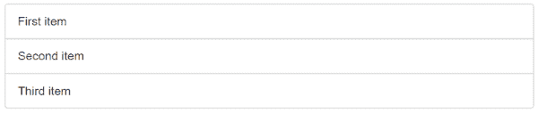
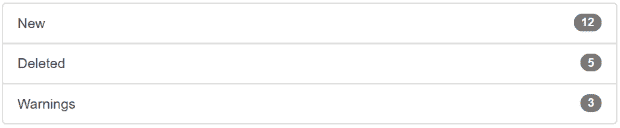
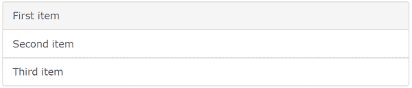
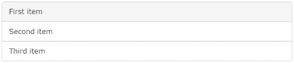
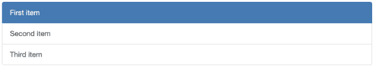

# 什么是引导列表，如何使用引导列表组？

> 原文：<https://www.edureka.co/blog/boostrap-list-group/>

列表被用来将相似的事物集合在一起。有两种类型的列表，即:有序列表和无序列表。**【ol】**有序列表是一个按特定顺序排列的有序列表。在 **无序列表(ul)** 中，条目排列不分先后。这是使用的两个基本列表。为了让它看起来更好，我们使用[引导](https://www.edureka.co/blog/bootstrap-header/)。

让我们看看你将从这个博客中学到什么:

*   [基本列表组](#basiclistgroups)
*   [带徽章列表组](#badges)
*   [列表组与](#linkeditems)
*   [活动状态](#activestate)
*   [禁用项](#disableditem)

让我们开始吧。

## **基本列表组**

无序列表是可以使用 bootstrap 创建的最基本的列表。在你创建一个基本列表之前，这里有一些你应该知道的事情:

*   < ul >:定义无序列表，并将其与“.列表-组"类
*   <李>:定义列表项，与。列表-组-项目"类

例如:执行下面的代码来创建一个基本的引导列表。

```
<body>
<div class = "container">
   		<ul class = "list-group">
    			<li class = "list-group-item"> First item </li>
    			<li class = "list-group-item"> Second item </li>
    			<li class = "list-group-item"> Third item </li>
 		</ul>
</div>
</body>

```

**输出**:当上面的代码被执行时，列表看起来像这样:

现在你已经知道了如何创建一个基本的表格，让我们来学习如何创建带有徽章的列表！

## **助推器列表:带有徽章的列表组**

列表中的徽章用于表示计数。徽章通常放在右边。使用“.徽章"类用< span >元素创建一个徽章。 例如:执行下面的代码。

```
<body>
<div class = "container">
  		<ul class = "list-group">
    			<li class = "list-group-item"> New <span class = "badge"> 12 </span> </li>
    			<li class = "list-group-item"> Deleted <span class = "badge"> 5 </span> </li>
    			<li class = "list-group-item"> Warnings <span class = "badge"> 3 </span> </li>
  		</ul>
</div>
</body>

```

**输出**:当上面的代码被执行时，列表看起来像这样:



接下来，我们来学习如何创建一个包含链接项目的列表。

## **具有链接项目的引导列表组**

列表上的每一项都可以与互联网上的任何其他项目建立超链接。当你悬停在一个特定的项目上时，它的颜色会变成灰色。当你创建一个带有链接项目的列表时，分别使用< div >和< a >而不是< ul >和< li >。

**例如:**执行下面的代码

```
<body>
<div class = "container">
  	<div class = "list-group">
    		<a href = "#" class = "list-group-item"> First item </a>
    		<a href = "#" class = "list-group-item"> Second item </a>
    		<a href = "#" class = "list-group-item"> Third item </a>
  	</div>
</div>
</body>

```

**输出:**当执行上面的代码时，列表看起来是这样的:



现在我们已经学习了如何创建一个链接项目列表，让我们来为列表创建一个活动状态。

## **启动列表:活动状态**

要突出显示列表中的当前项目，您必须使用“.活跃”类。

**例如:**执行下面的代码

```
<body>
<div class = "container">
  	<div class = "list-group">
    		<a href = "#" class = "list-group-item active"> First item </a>
    		<a href = "#" class = "list-group-item"> Second item </a>
    		<a href = "#" class = "list-group-item"> Third item </a>
  	</div>
</div>
</body>

```

**输出:**当执行上面的代码时，列表看起来是这样的:



激活很简单！让我们学习如何从列表中禁用一个项目。

## **禁用项目**

要禁用列表中的特定项目，您必须使用“.禁用”类。

**例如:**执行下面的代码。

```
<body>
<div class = "container">
  	<div class = "list-group">
    		<a href = "#" class = "list-group-item disabled"> First item </a>
    		<a href = "#" class = "list-group-item"> Second item </a>
    		<a href = "#" class = "list-group-item"> Third item </a>
  	</div>
</div>
</body>

```

**输出:**当执行上面的代码时，列表看起来是这样的:



当您尝试点击“第一项”时，会出现一个停止符号，不允许您点击“第一项”。

让我们转到组标题和组项目文本。

## **自定义内容**

要添加一个标题作为列表项，你可以使用“.list-group-item-heading "类，并使用。列表-组-项目-文本”类。

**例如:**执行下面的代码。

```
<body>
<div class = "container">
 	<div class = "list-group">
    		<a href = "#" class = "list-group-item active">
      			<h4 class = "list-group-item-heading"> First List Group Item Heading </h4>
      			<p class = "list-group-item-text"> List Group Item Text </p>
    		</a>
    		<a href = "#" class = "list-group-item">
      			<h4 class = "list-group-item-heading"> Second List Group Item Heading </h4>
      			<p class = "list-group-item-text"> List Group Item Text </p>
    		</a>
    		<a href = "#" class = "list-group-item">
      			<h4 class = "list-group-item-heading"> Third List Group Item Heading </h4>
      			<p class = "list-group-item-text"> List Group Item Text </p>
    		</a>
  	</div>
</div>
</body>

```

**输出:**当执行上面的代码时，列表看起来是这样的:

就这样，我们来到了这篇文章的结尾。我希望你明白什么是引导列表以及如何使用它。

*查看 Edureka 的 **[Web 开发认证培训](https://www.edureka.co/complete-web-developer)****Web 开发认证培训将帮助您学习如何使用 HTML5、CSS3、Twitter Bootstrap 3、jQuery 和 Google APIs 创建令人印象深刻的网站，并将其部署到亚马逊简单存储服务(S3)。*

*有问题吗？请在这个“引导列表”博客的评论部分提到它，我们会回复你。*