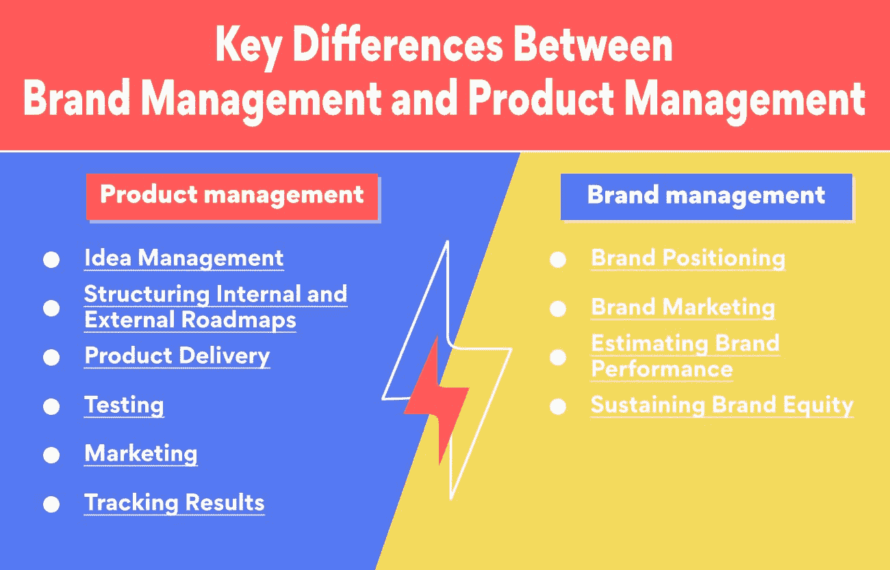
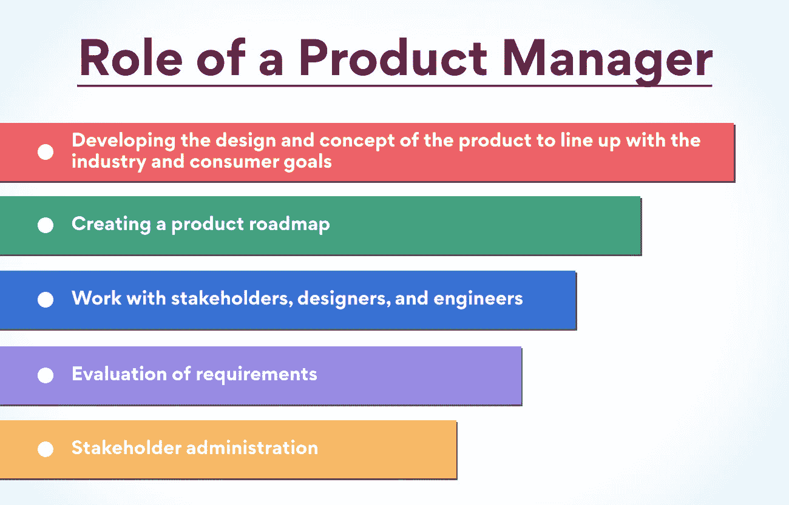
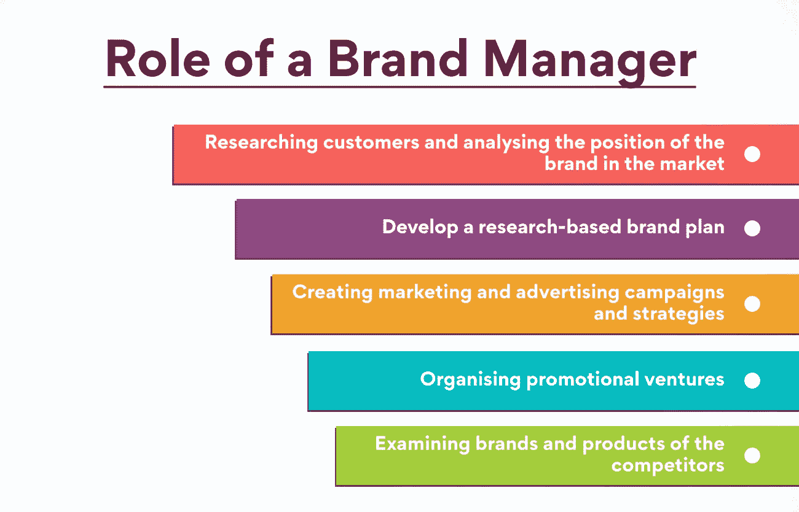

# 品牌管理与产品管理:了解关键差异

> 原文：<https://www.edureka.co/blog/brand-and-product-management/>

品牌和产品管理是营销职能，有助于提升品牌或产品在目标市场的市场价值。人们常常误以为这些角色是同义词。但是，事实并非如此，因为品牌管理和[产品管理](https://www.edureka.co/blog/product-management/)之间有着重要的区别，我们已经在这篇博客中详细介绍过了。但首先，让我们了解一下品牌和产品管理，以及为什么它们对一个企业是必要的。

**品牌管理**

作为市场营销的一项功能，品牌管理使用各种策略来提高品牌或产品线的感知价值。有效的品牌管理通过积极的品牌关系和理念或强大的品牌意识提高产品价格并创造忠诚的消费者。设计维护品牌资产或实现品牌价值的战略计划需要对品牌、其目标受众和公司的整体愿景有透彻的了解。

品牌对消费者参与、市场竞争和企业管理都有很大的影响。强大的品牌在市场上的存在将一个组织的产品与其竞争对手区分开来。它为企业的产品或服务创造了品牌联想。

一个已建立的品牌必须通过品牌管理不断保持其品牌形象。有效的品牌管理提升品牌意识，引导支持持续品牌声明的计划，衡量和处理品牌资产，识别和适应新的品牌产品，并有效地将品牌或产品投放市场。

一个品牌有时需要几年时间才能建立起来。但当这种建立最终发生时，它仍然必须通过创造和创新来维持。

**产品管理**

产品管理部门负责提供满足消费者需求的产品和服务，并引导企业发展。这对公司更一般的[产品开发过程](https://www.edureka.co/blog/product-development/)至关重要——将原始愿景转化为满足消费者需求的解决方案，然后计算其市场成功的整个周期。

企业获得可持续成功的基础是他们为客户提供的能力。因此，产品管理越来越受欢迎，影响力也越来越大。产品经理对计划、生产、交付和重复解决方案的承诺解决了消费者的担忧。

具有企业家精神的人会发现产品管理的吸引力非常强大。[产品经理](https://www.edureka.co/blog/product-manager)通常能够独立工作，跨多个跨学科团队工作，并发展终身专业技能。对业务发展产生重大影响和指导产品开发过程的可能性也说明了产品管理是一个要求很高的职业。

**也可阅读:[产品生命周期的阶段和例子有哪些？](https://www.edureka.co/blog/product-lifecycle/)**

**品牌管理 v/s 产品管理**

由于品牌代表着产品形象，人们通常认为品牌管理与产品管理是一样的。当然，这两者之间有一种内在的联系。专业的产品经理总是把公司的品牌记在心里——产品定位、市场调研等。因为，没有产品，就没有品牌。

但是品牌经理专注于通过营销活动影响大众市场和培养品牌忠诚度。在产品管理中，指定路线图和商业计划——界定产品如何让消费者受益，同时符合品牌目标，也是至关重要的。

因此，这些是你必须首先问的问题:-

*   品牌管理是产品管理的一个分支吗？
*   没有对方，任何一方都能工作吗？

通过研究品牌管理和产品管理的主要区别，上述问题的答案将变得清晰。

**品牌管理和产品管理的主要区别**

这两个领域在操作和功能上有相当多的关键差异，但它们在某些方面是一致的。

**产品管理策略**

产品管理包括将概念/想法转化为具体的商业实体。从产品的开始到完成，应该有一个结构化的技术。然而，并不是每个创造性的愿景都是可以实现的。

*   想法管理——该领域的专家将这一要素描述为一种定性方法。公司理念应该是决定产品将如何影响行业、消费者和公司的出发点。这是通过制作产品概述来实现的，该概述强调了产品相对于竞争对手的优势以及解决消费者棘手问题的规格。请注意，在这个阶段理解消费者是至关重要的。这是通过构建客户角色和理解他们的行为来实现的。
*   **构建内部和外部路线图—**将短期和长期产品目标与内部员工(销售、开发和管理部门)以及外部投资者、利益相关者和现有消费者联系起来至关重要。录制它是为了向每个相关人员清楚地传达产品的方向。
*   **产品交付——**处理产品交付是必不可少的，也就是将明确的指令交付给工程师进行产品扩展的点。产品经理必须确保工程/开发团队的工作进度符合指定的目标。
*   **测试**——这种方法也被视为执行阶段，产品经理运行一系列测试来检查产品的效率。这里的目的是决定产品是否满足消费者的需求，并在此基础上对产品进行改进。
*   **营销**——根据公司的规模，产品经理同样可以负责这一要素，他们通常都是这样。与竞争对手相比，他们会合理确定产品的成本，找到合适的分销渠道来销售产品，与销售团队合作，等等。，以产生决定性的收入。
*   **追踪结果——**产品经理的义务并不止于营销。他们会积极观察各种指标，如保留率、用户参与度等等。

想在产品管理领域工作，但缺乏技能？别担心，Edureka 为你带来了一个[产品管理高级执行官证书](https://www.edureka.co/highered/advanced-executive-program-in-product-management-iitg)课程，帮助你学习产品管理行业的所有技巧和诀窍。

**品牌管理策略**

品牌管理对于不断提升消费者对产品和公司的认知非常重要。产品经理通过创造客户需要的东西来使产品成功，而品牌经理则专注于随着时间的推移保持这种成功，并提高产品在市场上的影响力。看一看品牌管理的一些最基本的策略或流程。

*   **品牌定位**——它强调组织的理念，以及产品如何惠及消费者并在行业中脱颖而出。它与产品管理的理念管理功能相同，但这里的重点是基于完成的产品而不是理念来建立品牌。相反，它深入考察了目标市场对品牌的看法，以及竞争对手迄今无法提供的属性/品质。
*   **品牌营销**——这种方法对于通过不同的组成部分，包括标签标语、标志、符号等，来发展品牌形象是必不可少的。有了强有力的品牌识别，顾客尤其能够与品牌产生关联。
*   **评估品牌表现**——不断审视品牌的运作方式对品牌的成功至关重要。无论什么营销活动，无论是电子邮件营销，社会媒体营销等。，它们应该推动可衡量的结果，以便有效地增强消费者的感知。
*   **维持品牌资产—**品牌资产是对感知、认知、识别对手威胁、市场相关性、消费者忠诚度和品牌价值等要素的完善。在产品中加入质量控制，通过建立一个积极的社会来提供可及性，以及产生积极的体验，这些都有助于保存这些互补的元素。正是通过品牌资产，一家公司能够在不同的领域扩大其影响力。

## **产品经理 vs 品牌经理**

产品经理致力于打造产品，而品牌经理则致力于围绕该产品打造强大的品牌。品牌经理负责公众对产品的看法，设计策略来收集情感反应，从而提高品牌忠诚度。虽然产品经理的职能与产品的设计和属性以及它如何适应市场联系在一起，但品牌经理专注于各种价值主张。下面是产品经理和品牌经理的主要职责和区别:

### **产品经理**

[产品](https://www.edureka.co/blog/product)是呈现给消费者的商品或服务，由产品经理创造。他们关注产品的特点和设计。他们希望创造、更新并继续保持产品平稳运行，关注客户如何与它联系，以及它如何融入市场。他们的工作是后勤，他们与开发人员、高管、市场营销、销售和品牌经理密切合作。

产品经理拥有产品，并对产品的成败负责。他们还负责[的战略和产品](https://www.edureka.co/blog/product-strategy/)的愿景。他们必须紧跟发展，确保产品覆盖所有领域。他们的几项义务包括

*   开发产品的设计和概念，以符合行业和消费者的目标
*   创建产品路线图
*   与利益相关者、设计师和工程师合作
*   需求评估
*   利益相关方管理

**也读:[什么是产品策划，是怎么做的？](https://www.edureka.co/blog/product-planning/)**

**品牌经理**

品牌是一个抽象的概念，指导大众如何看待一家公司，包括自以为是的和事实上的细节。例如，当考虑苹果时，你知道他们卖手机，但你也可能认为他们是有创造力的。品牌不仅是公司和产品，也是个人。明星和运动员经常建立自己的品牌，并以特定的方式设计品牌，不仅让他们的粉丝和追随者，而且让社会上的每个人都能很好地理解。

品牌经理负责确保品牌与所有广告和营销计划保持一致。这可以包括监督广告、建筑或事件。他们利用消费者和模式研究来创造策略，影响消费者对品牌的认知。

随着新一代开始消费这些产品，他们越来越多地根据公司的品牌和价值来做出购买决定。市场营销行业对合格品牌经理的需求非常高。

品牌经理的角色是战略性地为公司或产品创造品牌。他们必须影响人们对公司/产品的看法。他们的几项主要义务包括:

*   研究顾客并分析品牌在市场中的地位
*   制定基于研究的品牌计划
*   创建营销和广告活动及策略
*   组织推广活动
*   调查竞争对手的品牌和产品

品牌经理身上有许多可转移的技能，这些技能与产品经理所需的技能直接相关。无论你是否具备满足消费者愿望的专业技能、趋势意识、创造力以及创造创造性和独特想法的能力，或者团队沟通技能，这些对于产品经理的成长都至关重要。

**结论**

品牌管理和产品管理有不同的功能，在市场活动中有一些重叠。就品牌作为产品的一部分而言，你现在可以更好地决定，这些是需要自己特定专业知识的独立领域，因为一个领域需要另一个领域的支持才能维持公司的生存。

总之，品牌管理更多的是关于感知价值和感知。相比之下，产品管理更多的是关于可衡量的价值和有形的主张。这体现在消费者满意度调查中，消费者产品的品牌用户根据对幸福的理解程度对品牌进行排名。而软件中的产品用户根据产品带来的可测量的和具体的好处对产品进行排名。

产品管理高级执行官证书可以帮助你进入这个成功的产品管理和营销领域。有了[我们的](https://www.edureka.co/blog/product-management-courses)课程，你可以通过现场课程和与业内最佳导师的互动来提高你的技能。有了方便的课程表，即使是在职的专业人士也可以报名参加这门课程。

## **更多信息:**

[什么是产品管理？](https://www.edureka.co/blog/what-is-product-management/)

[品牌管理 v/s 产品管理:了解关键差异](https://www.edureka.co/blog/brand-and-product-management/)

[产品变化的原因是什么？原因&原因](https://www.edureka.co/blog/what-are-the-reasons-of-variations-in-product-causes-reasons/)

[每个 PM 都必须知道的产品管理框架](https://www.edureka.co/blog/product-management-frameworks)