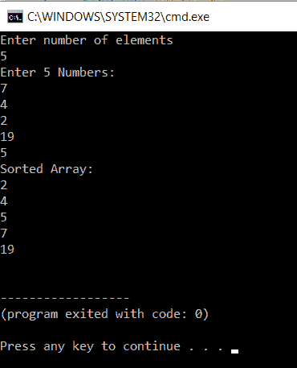

# 如何在 C 中实现冒泡排序？

> 原文：<https://www.edureka.co/blog/bubble-sort-in-c/>

整理数据可能是最重要的。尤其是在需要按特定顺序排列数据的情况下。在这篇文章“在 [C](https://www.edureka.co/blog/c-data-structures) 中的冒泡排序”中，我们将了解市场上流行的排序技术之一。

本文将关注以下几点:

*   [C 中的冒泡排序](#BubbleSortinC)
*   [优化实现冒泡排序](#OptimizedImplementationofBubbleSort)
*   [时间复杂度](#TimeComplexity)

那么让我们开始吧，

## **C 中的冒泡排序**

冒泡排序是编程中最简单的排序技术之一，实现起来非常简单。它只是简单地将当前元素与下一个元素进行比较，并根据条件交换它，如果它大于或小于当前元素。它给出了相当准确的结果。每次将一个元素与所有其他元素进行比较，直到找到它的最终位置，这称为一次通过。

冒泡排序得名于它像水面上的气泡一样过滤掉数组顶部的元素。

这是最慢的算法，其运行的时间复杂度为 O(n^2).冒泡排序可以通过使用一旦交换完成就退出循环的标志变量来优化。冒泡排序的最佳复杂度可以是 O(n)。O(n)只有在数组排序时才是可能的。

这里有一个例子:

(6 4 2 1 3)

实现冒泡排序后，上述数组将变为(1 2 3 4 6)

下面是示例程序:

```
int main()
{
int array[100], n, i, j, swap; 
printf("Enter number of elementsn");
scanf("%d", &n); 
printf("Enter %d Numbers:n", n); 
for(i = 0; i < n; i++)
scanf("%d", &array[i]); 
for(i = 0 ; i < n - 1; i++)
{
for(j = 0 ; j < n-i-1; j++)
{
if(array[j] > array[j+1]) 
{
swap=array[j];
array[j]=array[j+1];
array[j+1]=swap;
}
}
} 
printf("Sorted Array:n"); 
for(i = 0; i < n; i++)
printf("%dn", array[i]);
return 0;
}

```

**输出:**

这个程序给你演示了冒泡排序算法。在代码的第一部分，我们接受数组中的项数，并将其存储在 n 中。在下一部分，用户输入数组的元素。



然后是两个 for 循环’。第一个“for 循环”从 I 值等于零一直运行到它小于 n-1。外部数组负责将值中的元素与所有其他元素进行比较。

在 for 循环内部，还有另一个 for 循环，从 j=0 开始一直到 j <n-i-1\. this="" loop="" takes="" care="" of="" all="" elements.="" inside="" there="" is="" an="" if="" statement="" that="" compares="" a="">a[j+1]。如果满足这一条件，则进行交换。一个名为 swap 的变量用于此。首先，a[j]被分配给 swap，接着 a[j+1]被分配给 a[j]，最后 swap 被分配给 a[j+1]。这一直持续到所有元素都被排序。之后，打印排序后的数组。</n-i-1\.>

这就是冒泡排序的方法。

## **优化实现冒泡排序**

这样做是为了改善冒泡排序的结果。为了获得优化的输出，我们在 for 循环中插入一个标志变量。如果有交换，这个变量将保存一个。如果不是，那么它将跳出 for 循环并节省时间。

```

#include <stdio.h>
int main()
{
int array[100], n, i, j, swap,flag=0;
printf("Enter number of elementsn");
scanf("%d", &n);
printf("Enter %d Numbers:n", n);
for(i = 0; i < n; i++)
scanf("%d", &array[i]);
for(i = 0 ; i < n - 1; i++)
{
for(j = 0 ; j < n-i-1; j++)
{
if(array[j] > array[j+1])
{
swap = array[j];
array[j] = array[j+1];
array[j+1] = swap;
flag=1;
}
if(!flag)
{
break;
}
}
}
printf("Sorted Array:n");
for(i = 0; i < n; i++)
printf("%dn", array[i]);
return 0;
}

```

**举例:**

```
The execution of this program is similar to that of the normal bubble sort but, the only change is flag variable. The flag variable is set to one if there is a swap. This means that the array still requires more checking. If the flag is not 1 then we exit from the loop thinking that the array is already sorted.
```

**输出相同**

这就把我们带到了 C 语言中冒泡排序的最后一部分

## **时间复杂度**

该算法的最佳复杂度为 O(n)。这是对数组进行排序的时候。

该算法的最坏复杂度为 O(n*n)。这里数组没有排序。

至此，我们结束了这篇关于“C 语言中的冒泡排序”的博客。我希望你发现这是有益的，请继续关注更多类似主题的教程。您也可以查看我们的培训计划 t 以深入了解 jQuery 及其各种应用程序，您可以 [**在此**](https://www.edureka.co/masters-program/full-stack-developer-training) 注册在线实时培训，24/7 全天候支持，终身访问。

有问题要问我们吗？在这个博客的评论部分提到他们，我们会回复你。