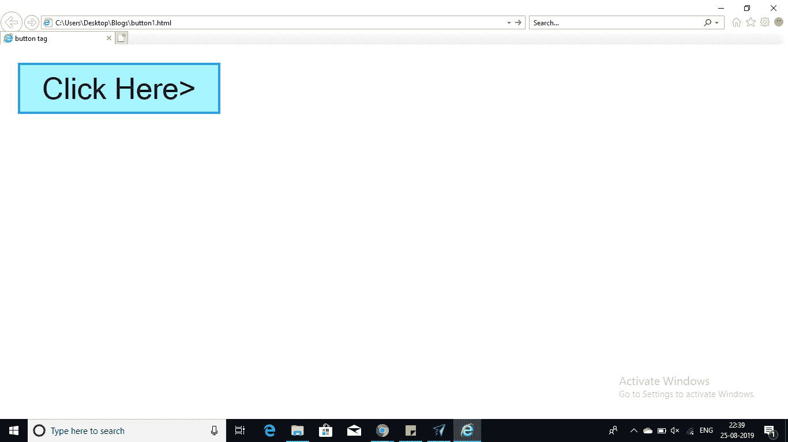
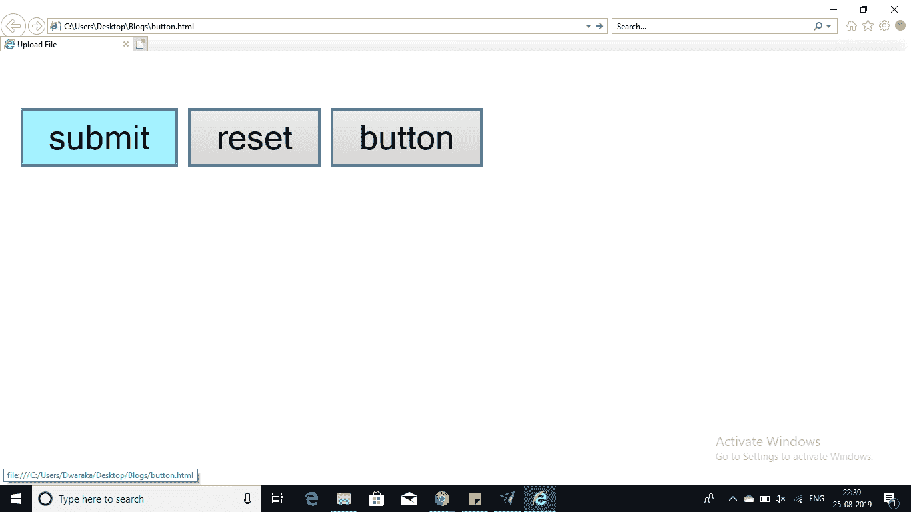

# 如何在 HTML 中最好地利用按钮？

> 原文：<https://www.edureka.co/blog/button-in-html/>

[HTML](https://www.edureka.co/blog/what-is-html/) 让创建按钮变得更容易。在这篇文章中将详细探讨 HTML 中的按钮。本文将涉及以下内容

*   HTML 中的 [按钮](#ButtonInHTML)
*   [有三种按钮的表单](#FormWithThreeTypesOfButtons)
*   [程序为按钮标记](#ProgramForButtonTag)

让我们从这篇文章开始吧，

## HTML 中的**按钮**

在 HTML 中有各种方法来创建可点击的按钮。在这里，您甚至可以通过将<输入>标签的类型属性设置为 button 来创建按钮。列出可以取值的类型属性:

| 类型 | 描述 |
| 提交 | 它创建了自动提交表单或文档的按钮。 |
| 复位 | 它创建了一个按钮，自动将表单控件重置为初始值。 |
| 按钮 | 它创建一个按钮，当用户点击该按钮时，该按钮用于触发客户端脚本。 |
| 图像 | 它创建了一个可点击的按钮，我们可以用这个图像作为按钮的背景。 |

HTML 中的按钮<标签>主要用于在 HTML 表单内创建按钮。你仍然可以使用<输入>标签来创建相同的按钮。

## **按钮标签的程序**

显示<按钮>标签的使用

```
<!DOCTYPE html>
<html>
<head>
<title>button tag</title>
</head>
<body>

<form>
<button name="button" name="OK" type="button">Click Here>
</form>

</body>
</html>

```

**输出**



## **有三种按钮的表单**

这里显示了带有三种按钮的表单代码:

```
<!DOCTYPE html>
<html>
<head>
<title>Upload File</title>
</head>
<body>

<form>
<input type="submit" name="submit" value="submit"/>
<input type="reset" name="reset" value="reset"/>
<input type="button" name="button" value="button"/>
<input type="image" name="imagebutton" scr="/C:UsersKATTANISHARADesktopBlogs"/>
</body>
</html>

```

**输出**



这就把我们带到了这篇关于 HTML 中的按钮的文章的结尾。

*查看我们的 [全栈开发课程](https://www.edureka.co/masters-program/full-stack-developer-training) ，该课程附带讲师指导的现场培训和真实项目体验。本培训使您精通使用后端和前端 web 技术的技能。它包括关于 Web 开发、jQuery、Angular、NodeJS、ExpressJS 和 MongoDB 的培训。*

有问题要问我们吗？请在文章的评论部分提到它，我们会给你回复。