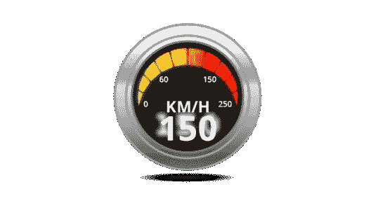
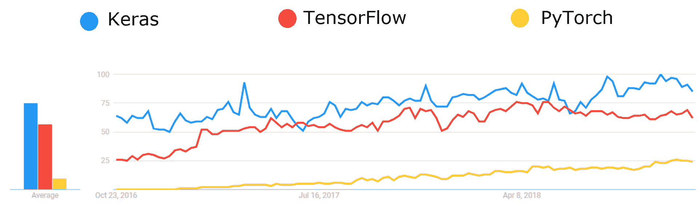

# Keras vs TensorFlow vs PyTorch:深度学习框架的比较

> 原文： [https://www.edureka.co/blog/keras-vs-tensorflow-vs-pytorch/](https://www.edureka.co/blog/keras-vs-tensorflow-vs-pytorch/)

Keras、TensorFlow 和 PyTorch 是数据科学家以及深度学习领域初学者首选的三大框架。这个关于**Keras vs tensor flow vs py torch**的比较将为你提供关于顶级[深度学习](https://www.edureka.co/blog/videos/deep-learning-tutorial/)框架的清晰知识，并帮助你找到哪一个适合你。在这篇博客中，你将按以下顺序对上述三个框架有一个完整的了解:

*   [Keras 介绍，tensor flow&py torch](#introduction)
*   [比较因素](#comparison)
*   [最终判决](#final)

## 介绍

### Keras

Keras 是用 [Python](https://www.edureka.co/blog/learn-python-for-data-science/) 编写的开源[神经网络](https://www.edureka.co/blog/neural-network-tutorial/)库。它能够在 TensorFlow 上运行。它旨在实现对**深度神经网络**的快速实验。

### TensorFlow

[TensorFlow](https://www.edureka.co/blog/tensorflow-tutorial/) 是一个开源软件库，用于跨一系列任务的数据流编程。这是一个符号数学库，用于像神经网络这样的机器学习应用。

### PyTorch

[PyTorch](https://www.edureka.co/blog/pytorch-tutorial/) 是 Python 的开源**机器学习**库，基于 Torch。它用于自然语言处理等应用，由脸书人工智能研究小组开发。

## Keras vs Tensorflow vs PyTorch |深度学习框架对比| Edureka

[https://www.youtube.com/embed/DmI58jz2i6w?rel=0&showinfo=0](https://www.youtube.com/embed/DmI58jz2i6w?rel=0&showinfo=0)This Edureka video on “Keras vs TensorFlow vs PyTorch” will provide you with a crisp comparison among the top three deep learning frameworks.

## 比较因素

所有这三个框架都是相互关联的，并且也有一些基本的区别。

那么让我们来看看区分它们的**参数**:

*   [API 等级](#level)
*   [速度](#speed)
*   [建筑](#architecture)
*   [调试](#debugging)
*   [数据集](#dataset)
*   [人气](#popularity)

## 空气污染指数水平

Keras 是一个**高级 API** ，能够运行在 TensorFlow、CNTK 和 Theano 之上。它因易于使用和语法简单而受到青睐，有助于快速开发。

TensorFlow 是一个框架，它提供了高级和低级的 T2 API。另一方面，Pytorch 是一个**低级 API** ，专注于直接处理数组表达式。它在去年获得了巨大的兴趣，成为学术研究和需要优化自定义表达式的深度学习应用的首选解决方案。

## 速度

在 **Keras** 中性能相对**慢**，而 Tensorflow 和 PyTorch 提供了类似的速度，速度快，适合**高性能**。

## 体系结构

**喀拉斯**有着**简单的**架构。可读性更强，更简洁。另一方面，Tensorflow 并不是很容易使用，尽管它提供了 Keras 作为一个框架来简化工作。PyTorch 有一个复杂的架构，与 Keras 相比可读性较差。

## 排除故障

在 keras 中，通常有非常**不太频繁的**需要调试简单的网络。但是在 Tensorflow 的情况下，进行调试是相当**困难的**。另一方面，Pytorch 与其他两个相比，具有更好的调试能力。

## 资料组

Keras 通常用于**小型数据集**，因为它相对较慢。另一方面，TensorFlow 和 PyTorch 用于需要快速执行的**高性能**模型和**大型** **数据集**。

## 流行

随着**数据科学领域需求的不断增加，**行业内的**深度学习技术**出现了巨大的增长。因此，这三个框架都非常受欢迎。 **Keras** 高居榜首，其次是 TensorFlow 和 PyTorch。与其他两个相比，它因其简单而广受欢迎。

Get in-depth Knowledge of Deep Learning [<button>Enroll Now</button>](https://www.edureka.co/ai-deep-learning-with-tensorflow)

这些是区分所有三个框架的参数，但是哪一个更好并没有绝对的答案。选择最终归结为

*   技术背景
*   要求和
*   易用性

## 定论

现在到了 Keras vs TensorFlow vs PyTorch 的最终结果，让我们来看看这三个深度学习框架中的每一个最**优选**的情况

Keras 最适合:

*   快速成型
*   小数据集
*   多后端支持

TensorFlow 最适合:

*   大型数据集
*   高性能
*   功能
*   [物体检测](https://www.edureka.co/blog/tensorflow-object-detection-tutorial/)

PyTorch 最适合:

*   灵活性
*   训练持续时间短
*   调试能力

现在，我们结束了对**Keras vs tensor flow vs py torch**的比较。我希望你们喜欢这篇文章，并了解哪个深度学习框架最适合你。

*现在你已经了解了 Keras、TensorFlow 和 PyTorch 之间的比较，* *看看 Edureka 的 [**AI 和深度学习与 Tensorflow**](https://www.edureka.co/ai-deep-learning-with-tensorflow) ，edu reka 是一家值得信赖的在线学习公司，拥有遍布全球的 250，000 多名满意的学习者。该认证培训由行业专业人士按照行业要求&的要求进行策划。您将掌握 SoftMax 函数、自动编码器神经网络、受限玻尔兹曼机(RBM)等概念，并使用 Keras & TFLearn 等库。*

另外，通过我们的[人工智能课程](https://www.edureka.co/executive-programs/machine-learning-and-ai)，发现你成为人工智能和人工智能专家的全部能力。了解各种人工智能相关技术，如机器学习、深度学习、计算机视觉、自然语言处理、语音识别和强化学习。

看看这个由 Edureka 使用 Python 训练的 [**NLP，将你的人工智能技能提升到下一个水平**](https://www.edureka.co/python-natural-language-processing-course)

*有问题吗？请在“Keras vs TensorFlow vs PyTorch”的评论区提及，我们会给你回复。*