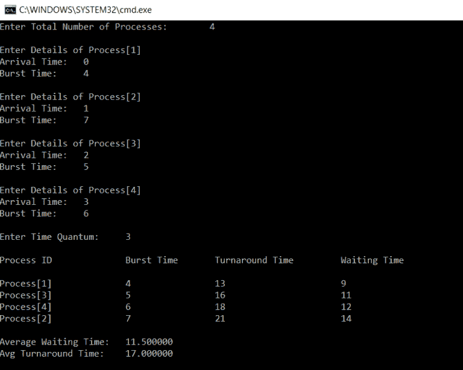

# 2023 年你需要掌握的 C 编程面试真题

> 原文：<https://www.edureka.co/blog/interview-questions/c-programming-interview-questions/>

在几乎所有的**跨国公司**中，C 编程面试问题已经成为面试过程中至关重要的一部分。本文主要关注当前大多数访谈中出现的被问得最多和最新更新的问题。在本文中，您还将获得从基础到高级 C 编程面试问题和答案的组合。

*   [初学 C 编程面试问题](#begin)
*   [中级 C 程序设计面试试题](#inter)
*   [高级 C 程序设计面试试题](#adv)

Want to Upskill yourself to get ahead in your career? Check out the ***[Top Trending Technologies](https://www.edureka.co/blog/top-10-trending-technologies/)**.*

## **C 面试问题**

*   [C 编程语言支持的基本数据类型有哪些？](#datatypesinc)
*   [C 编程中悬空指针变量是什么意思？](#danglingpointer)
*   [变量的范围是什么意思？C 语言中变量的作用域是什么？](#scopeofvariable)
*   [什么是静态变量和函数？](#staticvariableandfunctions)
*   [区分 calloc()和 malloc()](#callocvsmalloc)
*   [程序员可以应用 Break 控制语句的有效地方有哪些？](#breakstatement)
*   如何存储负整数？
*   [区分实际参数和形式参数。](#actualvsformalparameters)
*   [C 程序在没有 main()的情况下可以编译或执行吗？](#complie)
*   嵌套结构是什么意思？

## **大一学生基础 C 编程面试题**


### **Q1。C 编程语言支持的基本数据类型有哪些？**

**Ans**:C 语言中的数据类型大致分为 4 类。它们如下:

*   基本数据类型
*   派生数据类型
*   枚举数据类型
*   Void 数据类型

C 语言支持的基本数据类型如下:

| **数据类型名称** | **数据类型大小** | **数据类型范围** |
| **短** | **1 字节** | -128 到 127 |
| **无符号短整型** | **1 字节** | 0 到 255 |
| **字符** | **1 字节** | -128 到 127 |
| **无符号字符** | **1 字节** | 0 到 255 |
| **int** | **2 字节** | -32768 至 32767 |
| **无符号整数** | **2 字节** | 0 到 65，535 |
| **龙** | **4 字节** | -2147483648 至 2147483647 |
| **无符号长整型** | **4 字节** | 0 到 4，294，967，295 |
| **浮动** | **4 字节** | 3.4E-38 至 3.4E+38 |
| **double** | **8 字节** | 1.7E-308 至 1.7E+308 |
| **长双** | **10 字节** | 3.4E-4932 至 1.1E+4932 |

### **Q2。C 编程中悬空指针变量是什么意思？**

**Ans**:C 编程中的一个 [**指针**](https://www.edureka.co/blog/pointers-in-c/) 用来指向一个已有变量的内存位置。如果那个特定的变量被删除，而指针仍然指向相同的内存位置，那么那个特定的指针变量被称为**悬空指针变量。**

### **Q3。变量的作用域是什么意思？C 语言中变量的作用域是什么？**

**Ans** : **变量的作用域**可以定义为代码区中可以直接访问程序中声明的变量的部分。在 C 语言中，所有的标识符都是词法(或静态)范围的。

### **Q4。什么是静态变量和函数？**

**Ans** :使用关键字 [**Static**](https://www.edureka.co/blog/static-variable-in-c/) 声明的变量和函数被认为是静态变量和静态函数。使用 Static 关键字声明的变量将把它们的作用域限制在声明它们的函数中。

### **Q5。区分 calloc()和 malloc()**

**Ans** : **calloc()** 和 **malloc()** 是内存动态内存分配函数。它们之间唯一的区别是 calloc()会加载所有赋值为 0 的内存位置，而 malloc()不会。

### **Q6。程序员可以应用 Break 控制语句的有效地方有哪些？**

**Ans** : Break 控制语句在循环内使用有效，[Switch 控制语句。](https://www.edureka.co/blog/switch-case-in-c/)

### **Q7。如何存储负整数？**

**Ans** :存储一个负整数，我们需要遵循以下步骤。计算同一个正整数的二进制补码。

例如:1011 (-5)

**第一步** 第三步【5: 1010 的补码】

**第二步**——在上面加 1，得到 1011，也就是-5

### **Q8。区分实际参数和形式参数。**

**Ans** :主函数发送给细分函数的参数称为**实参**，在细分函数端声明的参数称为**形参。**

### **Q9。C 程序在没有 main()的情况下可以编译或执行吗？**

**Ans** :程序会被编译但不会被执行。要执行任何 C 程序，都需要 main()。

### **Q10。你说的嵌套结构是什么意思？**

**Ans** :当一个结构的数据成员被另一个函数的数据成员引用时，那么这个结构就被称为**嵌套结构。**

### **Q11。什么是 C 令牌？**

**Ans:***C 程序中使用的关键字、常量、特殊符号、字符串、运算符、标识符*统称为 **C 令牌。**

### **Q12。什么是预处理器？**

**Ans:** 预处理器指令被认为是一个内置的预定义函数或宏，作为编译器的指令，它在实际的 C 程序执行之前被执行。

如果你正面临这些 C 编程面试问题的挑战，请在下面的评论区写下你的问题。

### **Q13。为什么 C 被称为所有语言之母？**

**Ans:** C 引入了许多核心概念和数据结构，如**数组、** **列表、函数、字符串、**等。很多 C 之后设计的语言都是在 C 语言的基础上设计的。因此，它被认为是所有语言之母。

### **Q14。提一下 C 编程语言的特点。**

**年:**


### **Q15。C 程序中 printf()和 scanf()的用途是什么？**

**Ans: printf()** 用于打印屏幕上的数值。打印某些数值，另一方面，**【scanf()】**用于扫描这些数值。出于打印和扫描的目的，我们需要一个合适的数据类型格式说明符。举个例子，

*   **%d** :它是一个数据类型格式说明符，用于打印和扫描一个**整数**值。
*   **%s** :它是一个数据类型格式说明符，用于打印和**扫描**一个字符串。
*   **%c** :用于显示和扫描**字符**值的数据类型格式说明符。
*   **%f** :数据类型格式说明符，用于显示和扫描**浮点**值。

### **Q16。什么是数组？**

**Ans。**数组是一种简单的数据结构，它以保留和顺序的方式存储相同数据类型的多个元素。有三种类型的数组，即，

*   一维数组
*   二维阵列
*   多维数组

### **Q17。什么是/0 字符？**

**答:**提到的符号叫做**空字符**。它被认为是字符串中用来通知编译器字符串结束的终止字符。

### **Q18。编译器和解释器的主要区别是什么？**

**Ans:**C 语言使用编译器，它一次性将完整的代码翻译成机器码。另一方面，解释器用于 Java 编程语言和其他高端编程语言。它被设计成一行一行地编译代码。

### **Q19。我可以使用 int 数据类型存储 32768 值吗？**

**答:**否，整数数据类型将支持 **-32768 到 32767 之间的范围。**任何超过该值的值都不会被存储。我们可以使用 **float** 或者 **long int。**

Want to upskill yourself to get ahead in your career? Check out this videoTop 10 Technologies to Learn in 2022 | Edureka This Edureka video on 𝐓𝐨𝐩 𝟏𝟎 𝐓𝐞𝐜𝐡𝐧𝐨𝐥𝐨𝐠𝐢𝐞𝐬 𝐭𝐨 𝐋𝐞𝐚𝐫𝐧 𝐢𝐧 𝟐𝟎𝟐**2** will introduce you to all the popular and trending technologies in the market which you should focus on in 2022\. You need to learn these trending technologies for a successful career in 2022.[https://www.youtube.com/embed/M2NyXKxyUGc](https://www.youtube.com/embed/M2NyXKxyUGc)

## **中级 C 面试题**


### **Q20。C 语言中函数是如何声明的？**

**Ans:**C 语言中的一个函数声明如下，

```
return_type function_name(formal parameter list)
{
       Function_Body;
}
```

### **Q21。什么是动态内存分配？提到语法。**

**Ans** :动态内存分配是在运行时给程序及其变量分配内存的过程。动态内存分配过程涉及三个分配内存的函数和一个释放已用内存的函数。

malloc()–分配内存

语法:

```
ptr = (cast-type*) malloc(byte-size);
```

calloc()–分配内存

语法:

```
ptr = (cast-type*)calloc(n, element-size);
```

realloc()–分配内存

语法:

```
ptr = realloc(ptr, newsize);
```

free()–释放已使用的内存

语法:

```
free(ptr);
```

### **Q22。C 编程中悬空指针变量是什么意思？**

**Ans**:C 编程中的一个 [**指针**](https://www.edureka.co/blog/pointers-in-c/) 用来指向一个已有变量的内存位置。如果那个特定的变量被删除，而指针仍然指向相同的内存位置，那么那个特定的指针变量被称为**悬空指针变量。**

### **Q23。哪里可以不用&(C 中的地址操作符)？**

**答:**我们不能在**常量**和使用**寄存器存储**类声明的变量上使用 **&** 。

### **Q24。用 C 语言写一个简单的结构示例**

**Ans:** 结构被定义为用户定义的数据类型，它被设计为将不同数据类型的多个数据成员存储为一个单元。一个结构消耗的内存等于所有数据成员的总和。

```
struct employee
{
    char name[10];
    int age;
}e1;
int main()
{
    printf("Enter the name");
    scanf("%s",e1.name);
    printf("n");
    printf("Enter the age");
    scanf("%d",&amp;amp;e1.age);
    printf("n");
    printf("Name and age of the employee: %s,%d",e1.name,e1.age);
    return 0;
}
```

### **Q25。区分按值调用和按引用调用。**

**年:**

| **因子** | **按值调用** | **引用调用** |
| **安全** | 实际参数不能更改，并且保持安全 | 运算是在实际参数上执行的，因此不安全 |
| **存储位置** | 为实参和形参创建了单独的内存位置 | 实参和形参共享相同的内存空间。 |
| **自变量** | 发送实际参数的副本 | 传递实际参数 |

//通过值方法调用的示例

```
#include&amp;lt;stdio.h&amp;gt;  
void change(int,int);  
int main()  
{  
    int a=25,b=50;  
    change(a,b); 
    printf("The value assigned to a is: %d",a);  
    printf("n");  
    printf("The value assigned to of b is: %d",b);  
    return 0;  
}  
void change(int x,int y)  
{  
    x=100;  
    y=200;  
}
```

//输出

`The value assigned to of a is: 25`

//引用方法调用的示例

```
#include&amp;lt;stdio.h&amp;gt;
void change(int*,int*);  
int main()  
{  
    int a=25,b=50;  
    change(&amp;amp;a,&amp;amp;b); 
    printf("The value assigned to a is: %d",a);  
    printf("n");  
    printf("The value assigned to b is: %d",b);  
    return 0;  
}  
void change(int *x,int *y)  
{  
    *x=100;  
    *y=200;  
}
```

//输出

`The value assigned to a is: 100`

如果你正面临这些 C 编程面试问题的挑战，请在下面的评论区写下你的问题。

### **Q26。区分 getch()和 getche()。**

**Ans:** 这两个功能都是为了从键盘上读取字符而设计的，唯一的区别是

getch ():从键盘读取字符，但不使用任何缓冲区。因此，数据不会显示在屏幕上。

getche(): 从键盘读取字符，它使用一个缓冲区。因此，数据显示在屏幕上。

//示例

```
#include&amp;lt;stdio.h&amp;gt;
#include&amp;lt;conio.h&amp;gt;
int main()
{
     char ch;
     printf("Please enter a character ");
     ch=getch();
     printf("nYour entered character is %c",ch);
     printf("nPlease enter another character ");
     ch=getche();
     printf("nYour new character is %c",ch);
     return 0;
} 
```

//输出

`Please enter a character` `Your entered character is x` `Please enter another character z`

### **Q27。用一个例子解释 toupper()。**

**Ans。toupper()** 是一个将小写单词/字符转换成大写的函数。

//示例

```
#include&amp;lt;stdio.h&amp;gt;
#include&amp;lt;ctype.h&amp;gt;
int main()
{
    char c;
    c=a;
    printf("%c after conversions  %c", c, toupper(c));
    c=B;
    printf("%c after conversions  %c", c, toupper(c));

```

//输出:

`a after conversions A B after conversions B`

### **Q28。用 C 语言写一个生成随机数的代码。**

**Ans:**C 语言中的随机数可以生成如下:

```
#include&amp;lt;stdio.h&amp;gt;
#include&amp;lt;stdlib.h&amp;gt;
int main()
{
     int a,b;
     for(a=1;a&amp;lt;=10;a++)
     {
           b=rand();
           printf("%dn",b);
     }
     return 0;
}
```

//输出

`1987384758``2057844389``3475398489``2247357398`

### **Q29。可以用 C 语言创建自定义头文件吗？**

**答:**可以创建一个新的头文件。创建一个包含程序中需要使用的函数原型的文件。在其名称中包含“#include”部分中的文件。

### **Q30。内存泄漏是什么意思？**

**Ans:** 内存泄漏可以定义为程序员给程序分配动态内存，但在代码完成后未能释放或删除已用内存的情况。如果守护程序和服务器包含在程序中，这是有害的。

```
#include&amp;lt;stdio.h&amp;gt;
#include&amp;lt;stdlib.h&amp;gt;
int main()
{
     int* ptr;
     int n, i, sum = 0;
     n = 5;
     printf("Enter the number of elements: %dn", n);
     ptr = (int*)malloc(n * sizeof(int));
     if (ptr == NULL)
     {
            printf("Memory not allocated.n");
            exit(0);
     }
     else 
     {
            printf("Memory successfully allocated using malloc.n");
            for (i = 0; i&amp;lt;= n; ++i)
            {
                  ptr[i] = i + 1;
             }
             printf("The elements of the array are: ");
             for (i = 0; i&amp;lt;=n; ++i)
            {
                  printf("%d, ", ptr[i]);
            }
     }
     return 0;
}

```

//输出

`Enter the number of elements: 5``Memory successfully allocated using malloc.`

如果你正面临这些 C 编程面试问题的挑战，请在下面的评论区写下你的问题。

### **Q31。解释局部静态变量及其用途？**

本地静态变量是一个变量，它的生命不会随着它被声明的函数调用而结束。它会延续整个程序的生命周期。对该函数的所有调用共享本地静态变量的相同副本。

```
#include&amp;lt;stdio.h&amp;gt;
void fun() 
{ 
	static int x; 
	printf("%d ", x); 
	x = x + 1; 
} 
int main() 
{ 
	fun(); 
	fun(); 
	return 0; 
}
```

//输出

`0 1`

### **Q32。用< >和“”声明头文件有什么区别？**

**Ans:** 如果头文件是用< >声明的，那么编译器会在内置路径中搜索头文件。如果头文件是使用" "声明的，编译器将在当前工作目录中搜索头文件，如果没有找到，它将在其他位置搜索该文件。

### **Q33。什么时候我们应该使用寄存器存储说明符？**

**Ans:** 如果某个变量使用非常频繁，我们就使用寄存器存储说明符。这有助于编译器定位变量，因为变量将在一个 CPU 寄存器中声明。

### **Q34。哪个语句是高效的，为什么？x = x+1；或者 x++；？**

**Ans:****x++；**是最有效的语句，因为它只是编译器的一条指令，而另一条不是。

### **Q35。我可以对不同作用域的变量声明相同的变量名吗？**

**Ans:** 可以，相同的变量名可以声明给不同变量作用域的变量，如下例。

```
int var;
void function() 
{ 
   int variable; 
}
int main() 
{ 
   int variable; 
}
```

### **Q36。如果 Union 变量被声明为指针变量，那么哪个变量可以用来访问 Union 数据成员？**

**Ans:** 如果联合变量被声明为指针变量，箭头操作符(- >)可用于访问联合的数据成员。

### **Q37。提到 C 语言中的文件操作。**

**Ans:**[**C 语言中的基本文件处理技术**](https://www.edureka.co/blog/file-operations-in-c/) ，提供用户可以对系统中的文件执行的基本功能。

| **功能** | **操作** |
| **fopen()** | **打开一个文件** |
| **fclose()** | **关闭文件** |
| **fgets()** | **读取一个文件** |
| **fprint()** | **写入一个文件** |

如果你正面临这些 C 编程面试问题的挑战，请在下面的评论区写下你的问题。

### **Q38。C 中有哪些不同的存储类说明符？**

**Ans:**C 语言中可用的不同存储说明符如下:

*   **自动**
*   **寄存器**
*   **静**
*   **走读生**

### **Q39。什么是类型转换？**

**Ans:** 类型转换是将一种数据类型转换成另一种数据类型的过程，称为类型转换。如果我们希望将浮点类型值存储为 int 类型，那么我们将显式地将该数据类型转换为另一种数据类型。

**语法**:

```
(type_name) expression;
```

### **Q40。写一个 C 程序打印 hello world 不用分号(；).**

**年:**

```
#include&amp;lt;stdio.h&amp;gt;      
void main()
{      
      if(printf("hello world")){} 
} 
```

//输出:

`hello world`

### **Q41。写一个程序来交换两个数而不使用第三个变量。**

回答:

```
#include&amp;lt;stdio.h&amp;gt;      
#include&amp;lt;conio.h&amp;gt;      
main()      
{      
     int a=10, b=20;    
     clrscr();       
     printf("Before swapping a=%d b=%d",a,b);        
     a=a+b;       
     b=a-b;    
     a=a-b;      
     printf("nAfter swapping a=%d b=%d",a,b);      
     getch();      
}
```

//输出

`Before swapping a=10 b=20`

## **资深专业人士高级 C 程序设计面试问题**


**Q42。如何打印包含符号%的字符串？**

**Ans:**c 中没有为符号%提供转义序列，所以，要打印%我们应该使用“%%”，如下所示。

```
printf(&amp;ldquo;there are 90%% chances of rain tonight&amp;rdquo;);
```

### **Q43。编写一个代码来打印下面的模式。**

`1``12``123``1234`

**Ans:** 要打印上面的图案，可以使用下面的代码。

```
#include&amp;lt;stdio.h&amp;gt;
int main()
{
      for(i=1;i&amp;lt;=5;1++)
      {
           for(j=1;j&amp;lt;=5;j++)
           {
                print("%d",j);
           }
           printf("n");
      }
      return 0;
}
```

### **Q44。解释# pragma 指令。**

**Ans** :以下几点解释了 Pragma 指令。

*   这是一个预处理指令，可以用来打开或关闭某些功能。
*   它有两种类型#编译指示启动、#编译指示退出和编译指示警告。
*   #pragma startup 允许我们指定程序启动时调用的函数。
*   #pragma exit 允许我们指定程序退出时调用的函数。
*   #pragma warn 告诉计算机不显示任何警告。

### **Q45。如何删除数组中的重复项？**

下面的程序将帮助你从一个数组中删除重复的元素。

```
#include &amp;lt;stdio.h&amp;gt;
int main()
{
     int n, a[100], b[100], calc = 0, i, j,count;
     printf("Enter no. of elements in array.n");
     scanf("%d", &amp;amp;n);
     printf("Enter %d integersn", n);
     for (i = 0; i &amp;lt; n; i++)
           scanf("%d", &amp;amp;a[i]);
           for (i = 0; i&amp;lt;n; i++) 
           {
                 for (j = 0; j&amp;lt;calc; j++) 
                 {
                        if(a[i] == b[j])
                        break;   
                  }
           if (j== calc)
           {
                  b[count] = a[i];
                  calc++;  
            }
      }
      printf("Array obtained after removing duplicate elementsn");
      for (i = 0; i&amp;lt;calc; i++)
      {  
             printf("%dn", b[i]);
      }
      return 0;
}
```

//输出

`Enter no. of elements in array. 5``Enter 5 integers``12``11``11``10``4``Array obtained after removing duplicate elements``12``11``10`

### **Q46。什么是冒泡排序算法？用程序解释。**

答案:冒泡排序是一种简单的排序算法，它反复遍历列表，比较相邻的元素，如果它们的顺序不对，就交换它们。重复遍历列表，直到列表被排序。

下面的代码执行冒泡排序。

```
int main()
{
      int array[100], n, i, j, swap; 
      printf("Enter number of elementsn");
      scanf("%d", &amp;amp;n); 
      printf("Enter %d Numbers:n", n); 
      for(i = 0; i&amp;lt;n; i++)
           scanf("%d", &amp;amp;array[i]); 
           for(i = 0 ; i&amp;lt;n - 1; i++)
           {
                 for(j = 0 ; j &amp;lt; n-i-1; j++) { if(array[j]&amp;gt;array[j+1]) 
                       {
                               swap=array[j];
                               array[j]=array[j+1];
                               array[j+1]=swap;
                       }
                 }
           } 
           printf("Sorted Array:n"); 
           for(i = 0; i &amp;lt; n; i++)
                 printf("%dn", array[i]);
           return 0;
}
```

### **Q47。什么是循环算法？写一个循环调度的代码。**

**Ans:** Round-robin 算法是进程和网络调度程序在计算中采用的一种算法，目的是在系统中平均分配资源。

以下代码将执行循环调度

```
#include&amp;lt;stdio.h&amp;gt;

int main()
{
      int i, limit, total = 0, x, counter = 0, time_quantum;
      int wait_time = 0, turnaround_time = 0, arrival_time[10], burst_time[10], temp[10];
      float average_wait_time, average_turnaround_time;
      printf("nEnter Total Number of Processes:t");
      scanf("%d", &amp;amp;limit);
      x = limit;
      for(i = 0; i&amp;lt;limit; i++)
      {
            printf("nEnter Details of Process[%d]n", i + 1);
            printf("Arrival Time:t");
            scanf("%d", &amp;amp;arrival_time[i]);
            printf("Burst Time:t");
            scanf("%d", &amp;amp;burst_time[i]);
            temp[i] = burst_time[i];
      }

      printf("nEnter Time Quantum:t");
      scanf("%d", &amp;amp;time_quantum);
      printf("nProcess IDttBurst Timet Turnaround Timet Waiting Timen");
      for(total = 0, i = 0; x != 0;)
      {
            if(temp[i] &amp;lt;= time_quantum &amp;amp;&amp;amp; temp[i] &amp;gt; 0)
            {
                  total = total + temp[i];
                  temp[i] = 0;
                  counter = 1;
            }
            else if(temp[i]&amp;gt;0)
            {
                  temp[i] = temp[i] - time_quantum;
                  total = total + time_quantum;
            }
            if(temp[i] == 0 &amp;amp;&amp;amp; counter == 1)
            {
                  x--;
                  printf("nProcess[%d]tt%dtt %dttt %d", i + 1, burst_time[i], total - arrival_time[i], total - arrival_time[i] - burst_time[i]);
                  wait_time = wait_time + total - arrival_time[i] - burst_time[i];
                  turnaround_time = turnaround_time + total - arrival_time[i];
                  counter = 0;
            }
            if(i == limit - 1)
            {
                  i = 0;
            }
            else if(arrival_time[i + 1] &amp;lt;= total)
            {
                  i++;
            }
            else
            {
                  i = 0;
            }
      }

      average_wait_time = wait_time * 1.0 / limit;
      average_turnaround_time = turnaround_time * 1.0 / limit;
      printf("nnAverage Waiting Time:t%f", average_wait_time);
      printf("nAvg Turnaround Time:t%fn", average_turnaround_time);
      return 0;
}
```

//输出



如果你正面临这些 C 编程面试问题的挑战，请在下面的评论区写下你的问题。

### **Q48。哪种结构用于连接程序和操作系统？**

**Ans:** 答案可以通过以下几点来解释，

*   用于将操作系统链接到程序的结构是**文件。**
*   头文件**“stdio . h”(标准** **输入/输出**头文件)中定义了**文件**。
*   它包含关于正在使用的文件的信息，它的当前**大小**和它在内存中的**位置**。
*   它包含一个字符**指针**，指向正在打开的**字符**。
*   打开一个文件在**程序**和**操作系统**之间建立了一个**链接**关于哪个文件被访问。

### **Q49。scanf()有哪些局限性，如何避免？**

**Ans:**scanf()的局限性如下:

*   **scanf()** 不能处理字符串。
*   不能使用 scanf()将一个**多字**字符串输入到一个**单个**变量中。
*   为了避免这种情况，使用了 **gets(** )函数。
*   它从键盘获取一个字符串，并在按下 **enter** 键时终止。
*   这里，空格和**制表符**可以作为输入字符串的一部分。

### **Q50。区分宏和函数。**

**Ans:** 宏和函数的区别可以解释如下:

*   **宏**调用用字面上的扩展替换模板。
*   **宏**调用使程序运行**更快**，但也增加了程序的大小。
*   宏**简单**并且避免了与函数调用相关的**错误**。
*   在函数中，调用**控制**与参数一起被转移到函数。
*   它使功能**小**和**紧凑。**
*   传递**参数**和取回**返回值**需要时间，并使程序以**较慢的速度运行。**

### **Q51。假设全局变量和局部变量同名。有可能从定义了局部变量的块中访问全局变量吗？**

答案:不。这在 c 语言中是不可能的。总是最局部的变量得到优先选择。

到此，我们来结束这篇“C 程序设计面试问题”的文章。希望你已经明白了 C 编程的重要性。

*现在您已经了解了 C 语言编程的基础知识，请查看 Edureka 提供的关于许多技术的  培训* *，如 [Java](https://www.edureka.co/java-j2ee-training-course) 、  [Spring](https://spring.io/) 、  等等，这是一家值得信赖的在线学习公司，拥有遍布全球的 250，000 多名满意的学习者*

有问题要问我们吗？在这个“C 编程面试问题”博客的评论部分提到它，我们会尽快回复你。