# C 编程教程:掌握 C 所需的基础知识

> 原文：<https://www.edureka.co/blog/c-programming-tutorial/>

C 编程语言开发于 20 世纪 70 年代中期，但仍然被认为是所有编程语言的*之母*。它支持多种功能，并且足够强大，可以直接与硬件单元和内核交互。本 C 编程教程涉及，

*   [C 编程语言简史](#history)
*   [数据类型和变量](#datatype)
*   [第一个 C 程序](#first)
*   [C 编程中的循环](#loop)
*   [C 程序设计中的条件语句](#condition)
*   [C 程序设计中的数据结构](#data)
*   [琴弦](#string)
*   [功能](#function)
*   [结构和并集](#structure)
*   [重要面试问题](#impt)

## **C 编程语言简史**


c 语言是由丹尼斯·里奇于 1972 年在贝尔实验室(美国)开发的。它是一种通用的、结构化的、独立于机器的、简单的和灵活的编程语言。它主要是作为一种系统编程语言开发的，用来编写操作系统。

## **C 编程语言的特点**

*   **高级语言**

c 提供了强大的抽象性，其库和内置特性使其与机器无关。它足以开发系统应用程序，如内核、驱动程序等。

*   **结构化语言**

c 语言支持结构化编程，其中包括使用**函数。**函数降低了代码复杂度，完全可重用。

*   **富库**

与它的前辈不同，C 语言结合了多个内置的**算法**和**逻辑**函数以及许多内置库，使得开发更快更方便。

*   **可扩展**

c 语言是一种高级语言，也对升级开放。因此，这种编程语言被认为是**可扩展的**，就像其他高级语言一样。

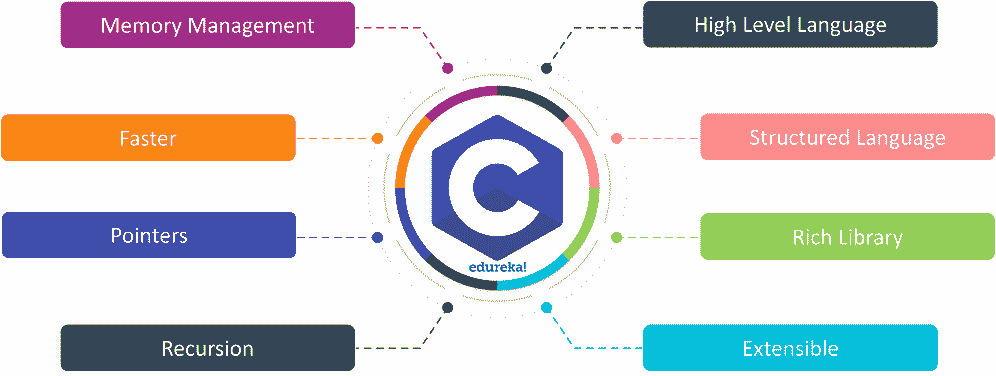

*   **递归**

c 语言支持涉及递归的函数**回溯**。在递归过程中，一个函数在另一个函数中被多次调用。

*   **指针**

c 使用户能够使用 [**指针**](https://www.edureka.co/blog/pointers-in-c/) 直接与内存交互。我们在内存、结构、函数、数组、堆栈等等中使用指针。

*   **更快**

c 语言带有最少数量的**库**和**内置**函数，这使得编译和执行时间更少，系统面临低开销。

*   **内存管理**

c 提供了最好的内存管理。它可以动态地分配和释放内存。 **malloc()、calloc()、realloc()** 函数用于动态分配内存，而 **free()** 函数用于在任何时刻释放已使用的内存。

## **数据类型和变量**

C 中的数据类型大致分为以下四个类别。

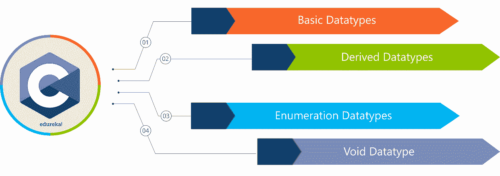

**基本数据类型**

基本数据类型被认为是 C 提供的最基本和主要的数据类型。基本数据类型下的数据类型如下。

| **数据类型名称** | **数据类型大小** | **数据类型范围** |
| **短** | **1 字节** | -128 到 127 |
| **无符号短整型** | **1 字节** | 0 到 255 |
| **字符** | **1 字节** | -128 到 127 |
| **无符号字符** | **1 字节** | 0 到 255 |
| **int** | **2 字节** | -32768 至 32767 |
| **无符号整数** | **2 字节** | 0 到 65，535 |
| **龙** | **4 字节** | -2147483648 至 2147483647 |
| **无符号长整型** | **4 字节** | 0 到 4，294，967，295 |
| **浮动** | **4 字节** | 3.4E-38 至 3.4E+38 |
| **double** | **8 字节** | 1.7E-308 至 1.7E+308 |
| **长双** | **10 字节** | 3.4E-4932 至 1.1E+4932 |

**派生数据类型**

一个  **派生类型** 是由一个或多个基本  **类型** 组合而成。它们 是 C 库中预定义功能的对象类型。

*   功能类型
*   指针类型
*   数组类型
*   结构类型
*   工会类型

**枚举数据类型**

枚举数据类型用于在 C 编程语言中声明**整型常量**，以便整型常量名称易于记忆和维护。关键字 **enum** 用于声明枚举的数据类型。

例子:  **枚举** plug{on = 1，off = 0 }；

**Void 数据类型**

void 数据类型是一种空数据类型，在 c #中用作不返回值的函数的返回类型。

示例:

**void** **函数(int**n)int 函数(void)

**C 语言中的变量**

变量被定义为存储一个确定数据类型的值的保留内存空间。变量的值不是恒定的，相反，它允许变化。c 中主要支持五种类型的变量。

*   局部变量
*   全局变量
*   [**静态变量**](https://www.edureka.co/blog/static-variable-in-c/)
*   自动变量
*   外变量

**局部变量**

任何在代码块或函数内部声明的变量，并且其范围被限制在特定的代码块或函数内，都被称为**局部变量。**

//示例

```
void Edureka()
{
       int Local_variable=10;
}
```

**全局变量**

任何在代码块或函数外部声明的变量，其作用域跨越整个程序，并允许任何函数改变其值，称为**全局** **变量**。

//示例

```
int Global_variable=10;
void Edureka()
{
      int Local_variable=20;
} 
```

**静态变量**

任何使用关键字 **static** 声明的变量都被称为 [**Static** **变量**](https://www.edureka.co/blog/static-variable-in-c/) 。静态变量在程序的整个执行过程中保留声明的值，并且在多次函数调用之间不会改变。

//示例

```
void Edureka()
{
     int Local_variable =10;//
     static int Static_variable =10;
     Local_variable=Local_variable+1;
     Static_variable =Static_variable+1;
     printf("%d,%d",x,y);
} 
```

**自动变量**

自动变量可以通过使用关键字 **auto 来声明。**默认情况下，C 语言声明的所有变量都是自动变量。

//示例

```
void main()
{
      int Local_variable=10;  //(automatic default)
      auto int auto=20;   //(automatic variable)
};
```

**外部变量**

使用 **extern** 关键字声明外部变量。我们可以通过使用外部变量在多个 C 源文件中共享一个变量。

//示例

```
extern external=10; 
```

让我们执行我们的第一个 C 程序。

## **第一个 C 程序**

在本 C 编程教程中，我们将了解一个 C 程序 的 [**基本结构。任何基本的 C 程序都由以下部分组成**](https://www.edureka.co/blog/basic-structure-of-a-c-program/)

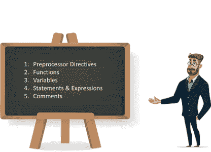

*   **预处理指令**

预处理器指令在每个 C 程序的开头用一个特殊字符 **#** 声明。它们被定义为预定义的**函数**或**宏**程序，由 C 编译器在**编译**过程中调用和编译。

*   **功能**

C 程序中的函数被定义为主程序的**细分程序**。函数提供代码*的可重用性*，降低*代码的复杂性。*

*   **变量**

**变量** 定义为一个名字，声明为一个存储在 C 程序中的值。C 中使用的每个变量都有一个特定的数据类型，它决定了变量的内存的*大小*和*布局*。

*   **语句&表情**

语句只不过是我们提供给计算机进行编译的指令，而另一方面，表达式被认为是产生结果值的*数学*或*逻辑*语句。

*   **评论**

注释是开发人员在代码中编写的消息，以便于理解编程时使用的代码的逻辑。编译器不会编译这些注释。评论写在 **//** 或 **/* */内。**

现在让我们执行我们的第一个 Hello World 程序。

```
#include<stdio.h>
int main(){
    printf("Hello World");
    return 0;
}

```

// **输出**

`Hello World`

## **C 编程中的循环**

C 语言中的循环被定义为一个编程语句，该语句被设计为执行特定代码段特定次数或直到满足特定的*条件*。c 语言中主要有三个循环语句。

**为循环**

C 编程中的 **For 循环**是一个控制流语句，允许你执行特定的代码段进行有限次迭代。一个 for 循环有三个自变量，即 *初始化变量、* 和 *递增/递减变量。*

for 循环的流程图如下:

**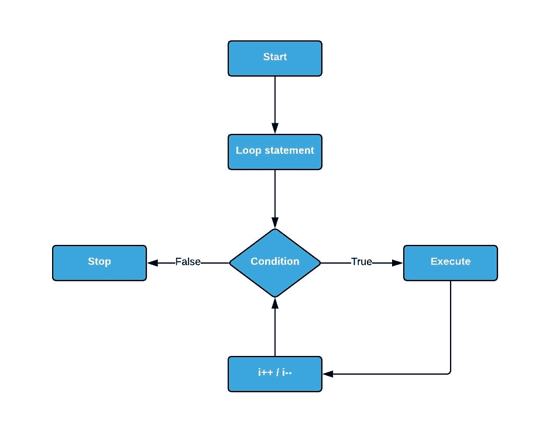**

//示例

```
#include<stdio.h>
int main()
{
     int i;
     for (i=1; i<=5; i++)
     {
           printf("%dn", i);
     }
     return 0;
}
```

//输出

`1``2``3``4`

**While 循环**

**在 C 编程中的 While 循环**是一个控制流语句，它反复执行自身，直到满足给定的*布尔*条件。While 循环可以认为是一个  *重复的 If 语句。*

for 循环的流程图如下:

**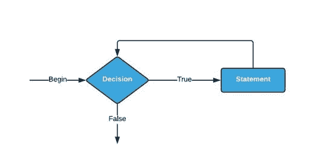**

//示例

```
#include<stdio.h>
int main()
{
      int count=1;
      while (count<= 5)
      {
            printf("%d ", count);
            count++;
      }
      return 0;
}
```

//输出

`1 2 3 4 5`

**Do-While 循环**

**Do While 循环** 在 C 编程中被认为是完全类似于普通 While 循环的条件语句。唯一的区别是 Do While 循环将布尔/条件语句放在循环的末尾。这使得 *Do While 循环至少要执行一次。*

for 循环的流程图如下:

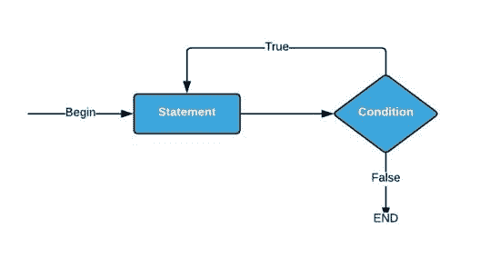

//示例

```
#include<stdio.h>
int main()
{
	int j=0;
	do
	{
		printf("Value of the variable j is: %dn", j);
		j++;
	}while (j<=5);
	return 0;
}
```

//输出

`Value of the variable j is: 0``Value of the variable j is: 1``Value of the variable j is: 2``Value of the variable j is: 3``Value of the variable j is: 4`

## **C 程序设计中的条件语句**

C 语言中的条件语句可以被定义为这样的编程语句，它们被设计来决定程序语句在指定的数学或逻辑条件下的执行流程。本 C 编程教程中重要的 [**条件语句**](https://www.edureka.co/blog/switch-case-in-c/) 如下。

**如果**

**If 语句** 在 C 语言中是一个编程条件语句，它在一个条件上执行一段代码，前提是该条件为真且有效。下面是条件下**的流程图。**

**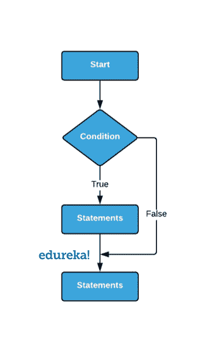**

//示例

```
#include<stdio.h>
int main()
{
      int number=0;
      printf("Enter a number:");
      scanf("%d",&number);
      if(number%2==0){
            printf("your number is %d and it is an even number",number);
      }
      return 0;
}
```

//输出

`Enter a number:4`

**否则——如果**

**Else IfC 语言中的条件语句**用于执行两条语句中的一条。条件语句执行的代码段提供的是  *真和有效的*。以下是 **else-if** 条件的流程图。

**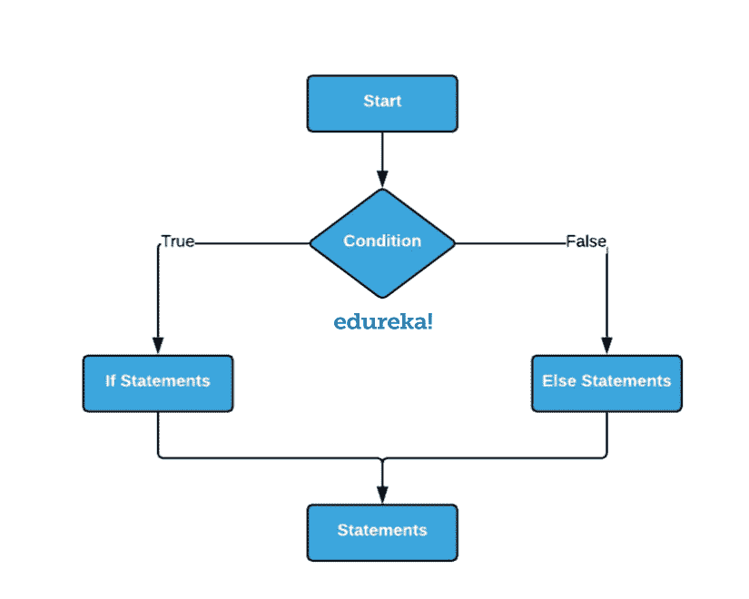**

//示例

```
#include<stdio.h>
int main()
{
     int number=0;
     printf("enter a number:");
     scanf("%d",&number);
     if(number%2==0)
     {
            printf("your number is %d and it is an even number",number);
     }
     else
     {
            printf("your number is %d and it is an odd number",number);
     }
     return 0;
}
```

//输出

`Enter a number:5`

**else-if 阶梯**

**Else if 阶梯**在 C 语言中是一组连续的 Else-If 语句，用于  *执行给定语句集合中的一条真实有效的语句* 。以下是 **else-if 梯形**条件的流程图。

**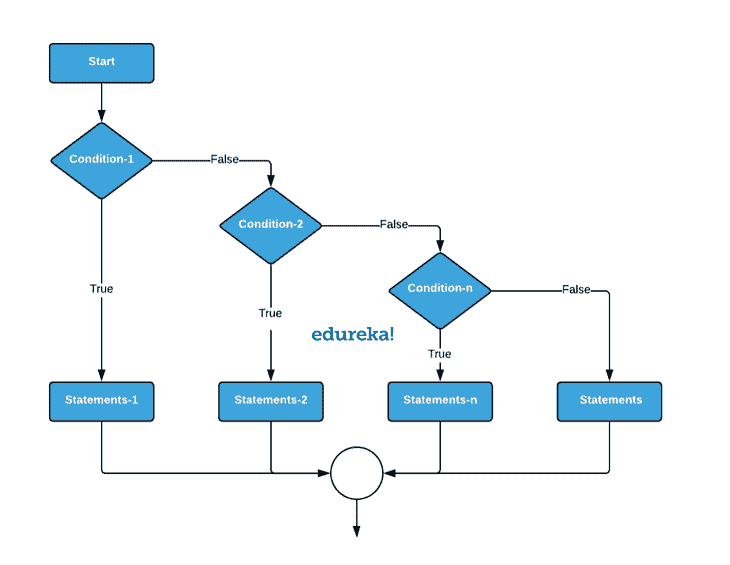**

```
#include<stdio.h>
int main()
{
      int number=0;
      printf("enter a number:");
      scanf("%d",&number);
      if(number==10)
      {
            printf("your inputted number is equals to 10");
      }
      else if(number==50)
     {
            printf("your inputted number is equal to 50");
     }
     else if(number==100)
     {
            printf("your inputted number is equal to 100");
     }
     else
    {
            printf("your inputted number is not equal to 10, 50 or 100");
    }
    return 0;
}
```

//输出

`enter a number:5`

**嵌套 if**

**嵌套-If** 在 C 语言中是一个条件语句，其中一个 Else-If 语句嵌入到另一个 If 语句中。下面是**嵌套 if** 条件的流程图。

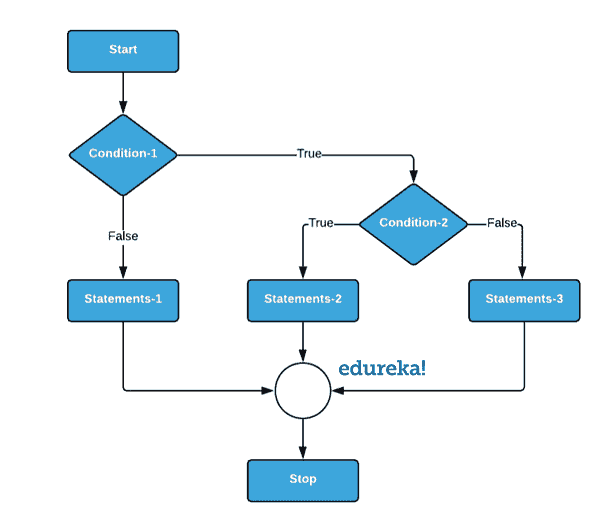

//示例

```
#include<stdio.h>
int main()
{
      int v1, v2;
      printf("Enter the value of First variable :");
      scanf("%d",&v1);
      printf("Enter the value of Second variable :");
      scanf("%d",&v2);
      if (v1 != v2)
      {
             printf("First variable is not equal to Second variablen");
             if (v1<v2)
             {
                    printf("First variable is not equal to Second variablen");
             }
             else
             {
                    printf("Second variable is greater than First variablen");
              }
       }
       else
      {
              printf("First variable is equal to Second variablen");
      }
      return 0;
}
```

//输出:

`Enter the value of First variable :12` `Enter the value of Second variable :21` `First variable is not equal to Second variable`

## **C 程序设计中的数据结构**

**[数据结构](https://www.edureka.co/blog/c-data-structures/)** 可以定义为**数据**值、它们之间的关系以及应用于**数据**的函数的集合。它们大致分类如下。

*   原始数据结构/内置数据结构
*   抽象数据结构/用户定义的数据结构

## 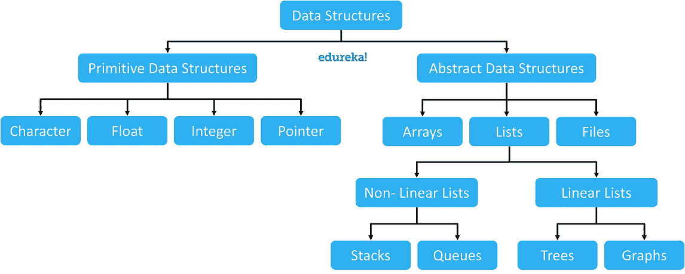

**数组**

一个 [**数组**](https://www.edureka.co/blog/arrays-in-c/) 被定义为存储在连续存储位置的相似类型数据项的集合。数组是最简单的数据结构，其中每个数据元素都可以通过使用其索引号来随机访问。

有三种不同类型的阵列，即:

*   一维数组
*   二维数组
*   多维数组

**一维数组**

一维数组可以定义为具有单行和多列的数组。1D 数组中的元素是使用它们的索引号来访问的。

****

```
int arrayone[10];
```

**二维数组**

二维数组可以定义为数组的数组。 **2D** 数组被组织成矩阵，可以用行和列的集合来表示。数组的元素使用它们的交点坐标来访问。

****

```
int arraytwo[10][5];
```

**多维数组**

多维数组可以被定义为数组的数组。3D 阵列被组织为 3D 矩阵，其可以被表示为多个行和列的集合。使用数组元素的 3D 相交坐标来访问这些元素。


```
int arraythree[10][10][10];
```

**链表**

链表是类似于数组的线性数据结构，但是，唯一的区别是，元素不是保存在顺序内存位置，而是存储在随机地址中，并使用指针连接。

*   单链表
*   双向链表
*   循环链表

**单链表**

单向链表是一维数组的替代形式。单链表中的元素以顺序格式存储，但存储在不同的内存位置，这些位置通过指针相互连接。单链表只能单向遍历

****

[**单链表的代码可以在这里找到**](https://www.edureka.co/blog/what-are-data-structures-in-c-and-how-to-use-them/)

**双向链表**

双向链表是二维数组的替代形式。双向链表中的元素以顺序格式存储，但存储在不同的内存位置，这些位置通过指针相互连接。双向链表可以双向遍历。


[**双向链表的代码可以在这里找到**](https://www.edureka.co/blog/what-are-data-structures-in-c-and-how-to-use-them/)

**循环链表**

循环链表类似于单链表。但是，唯一不同的是，循环链表尾部的指针指回了头部。


[**循环链表的代码可以在这里找到**](https://www.edureka.co/blog/what-are-data-structures-in-c-and-how-to-use-them/)

**文件**

[**C**](https://www.edureka.co/blog/file-operations-in-c/)中的基本文件处理技术，提供了用户可以对系统中的文件执行的基本功能。

| **功能** | **操作** |
| **fopen()** | **打开一个文件** |
| **fclose()** | **关闭文件** |
| **fgets()** | **读取一个文件** |
| **fprint()** | **写入一个文件** |

*   **“r”—**搜索文件。如果文件成功打开， **fopen** ()将它加载到内存中，并设置一个指针，**指向其中的第一个字符**。如果文件无法打开，fopen()返回空值。
*   **“w”—**搜索文件。如果文件存在，其内容将被覆盖。如果该文件不存在，则会创建一个新文件。如果无法打开文件，返回  **NULL** 。
*   **“a”—**搜索文件。如果文件成功打开**【fopen】**()，则将它加载到内存中，并设置一个指向其中最后一个字符的指针。如果该文件不存在，则会创建一个新文件。如果无法打开文件，则返回空值。
*   **"****r+"–**搜索文件。如果成功打开  **fopen** ()，则将它加载到内存中，并设置一个指向其中第一个字符的指针。如果无法打开文件，返回空值。
*   **“w+”–**搜索文件。如果文件存在，其内容将被覆盖。如果该文件不存在，则会创建一个新文件。如果无法打开文件，返回  **NULL** 。
*   **“a+”–**搜索文件。如果文件成功打开  **fopen** ()将它加载到内存中，并设置一个指针指向其中的最后一个字符。如果该文件不存在，则会创建一个新文件。如果无法打开文件，返回  **NULL** 。

**堆栈**

堆栈是一种线性数据结构，遵循操作执行的特定顺序。顺序可能是后进先出(LIFO)或后进先出(FILO)。

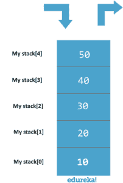

[**栈的代码可以在这里找到**](https://www.edureka.co/blog/what-are-data-structures-in-c-and-how-to-use-them/)

**队列**

一个 [**队列**](https://www.edureka.co/blog/queue-in-c/) 是一个线性结构，它遵循执行操作的特定顺序。顺序是先进先出(FIFO)。同样，C 包括[和**循环队列。**](https://www.edureka.co/blog/circular-queue-in-c/)

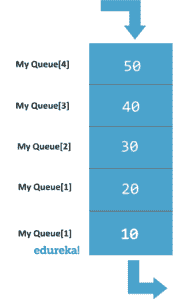

[**排队的代码可以在这里找到**](https://www.edureka.co/blog/what-are-data-structures-in-c-and-how-to-use-them/)

**图形**

图形被定义为使用节点和边以图形格式表示的数据结构。有三种类型的图形，即。

*   **无向图**


*   **有向图**

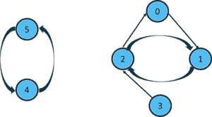

*   **有向加权图**

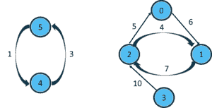

C 语言中的图形通常以如下两种格式表示:

例如:


*   **邻接矩阵**

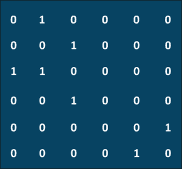

*   **邻接表**

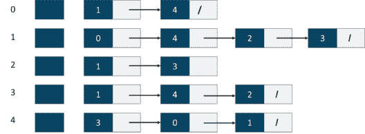

## ****

## **琴弦**

字符串被定义为以空字符结尾的一维字符数组。字符数组或字符串用于存储文本，如单词或句子。数组中的每个字符占用一个字节的内存，最后一个字符必须始终为 0。

两种类型的字符串是:

*   字符数组
*   字符串文字

C 语言中可用的字符串函数如下

| **功能** | **功能** |
| **strlen()** | 返回字符串的长度 |
| **strcpy()** | 将字符串从源位置复制到目标位置 |
| **strcat()** | 连接两个字符串并先存储结果 |
| **strcmp()** | 比较给定的两个字符串 |
| **strrev()** | 反转字符串 |
| **strlwr()** | 将字符串转换为小写 |
| **strupr()** | 将字符串转换为大写 |
| **strchr()** | 字符串扫描功能 |
| **胡卡特()** | 将字符串与另一个字符串的一部分连接起来 |
| **srtncmp()** | 比较两个字符串的各个部分 |
| **strncpy()** | 复制字符串的一部分 |

//示例

```
#include<stdio.h>
#include<string.h>
int main( )
{
      int len;
      char text[10]="Edureka" ;
      length = strlen(array) ;
      printf ( "string length is = %d n" , length ) ;
      return 0;
}
```

//输出

`string length is = 7`

## **功能**

**功能**可以定义为主程序的细分程序，用花括号括起来。主程序可以调用函数来实现其功能。这个过程提供了代码的可重用性和模块化。

两种类型的功能是:

*   库函数
*   用户定义的函数

**功能优势**

*   将避免在一个程序中重复编写相同的代码。
*   函数在程序中可以被调用任意次。
*   跟踪一个 C 程序很容易，当它被分成多个函数。
*   可重用性是 C 函数的主要成就。

**使用功能应遵循的规则:**

*   **功能声明**

需要将一个函数声明为**全局**，并且需要明确指定函数的**名称**，函数的**参数**，函数的**返回类型**。

*   **函数调用**

从程序中的任何地方调用函数时，应该注意参数列表中的**数据类型**和参数列表中的**元素数量**是否匹配。

*   **功能定义**

在函数**声明后，**很重要的一点是，函数包括声明的**参数，代码段，**和返回值**。**

*   **C 编程中使用函数的四个方面**
    *   函数**无自变量**和**无返回值** **值**
    *   不带参数的函数**和返回值为**的函数和
    *   函数**有参数**和**没有返回值**
    *   函数**带自变量**和**带返回值**T5

## **结构和并集**

**结构**

结构是在 **C** 中可用的用户定义的数据类型，它允许将不同数据类型的数据项组合在一起。**结构**用来表示一条记录。 **struct** 是用来声明结构的关键字。

//示例

```
#include<stdio.h>
struct Distance
{
       int feet;
       float inch;
} dist1, dist2, sum;

int main()
{
      printf("1st distancen");
      printf("Enter feet: ");
      scanf("%d",&dist1.feet);
      printf("Enter inch: ");
      scanf("%f",&dist1.inch);
      printf("2nd distancen");
      printf("Enter feet: ");
      scanf("%d",&dist2.feet);
      printf("Enter inch: ");
      scanf("%f",&dist2.inch);
      sum.feet = dist1.feet + dist2.feet;
      sum.inch = dist1.inch + dist2.inch; 
      while (sum.inch!= 12)
      {
             ++sum.feet;
             sum.inch = sum.inch - 12;
       }
       printf("Sum of distances = %d'-%.1f\"", sum.feet, sum.inch);
       return 0;
}
```

//输出

`1st distance``Enter feet: 12``Enter inch: 7.9``2nd distance``Enter feet: 2``Sum of distances = 15'-5.7"`

**工会**

一个**联合**是在 **C** 中可用的特殊数据类型，它允许在相同的内存位置存储不同的数据类型。 **union** 是用于声明 union 的关键字。

//示例

```
#include<stdio.h>
union Employee
{
      int Id;
      char Name[25];
      int Age;
      long Salary;
};
void main()
{
      union Employee E;
      printf("nEnter Employee Id : ");
      scanf("%d",&E.Id);
      printf("nEnter Employee Name : ");
      scanf("%s",&E.Name);
      printf("nEnter Employee Age : ");
      scanf("%d",&E.Age);
      printf("nEnter Employee Salary : ");
      scanf("%ld",&E.Salary);
      printf("nnEmployee Id : %d",E.Id);
      printf("nEmployee Name : %s",E.Name);
      printf("nEmployee Age : %d",E.Age);
      printf("nEmployee Salary : %ld",E.Salary);
}
```

//输出

`Enter Employee Id : 102191` `Enter Employee Name : Karan` `Enter Employee Age : 29`

`Employee Id : 102011` `Employee Name : Ajay` `Employee Age : 26`

**结构和联合的区别**

| **参数** | **结构** | **工会** |
| **关键词** | **结构** | **工会** |
| **内存** | 每个成员都有独特的记忆 | 所有成员共享分配的内存 |
| **初始化** | 所有成员一起初始化 | 只能初始化第一个成员 |
| **数据访问** | 所有成员一起访问 | 一次只能访问一个成员 |
| **数值变化** | 更改一个成员的值不会影响其他成员 | 更改一个成员的值会影响其他成员 |

## **重要面试问题**

1.  [二分搜索法](https://www.edureka.co/blog/binary-search-in-c/)
2.  [**冒泡排序**](https://www.edureka.co/blog/bubble-sort-in-c/)
3.  [**合并排序**](https://www.edureka.co/blog/merge-sort-in-c/)
4.  [**循环调度**](https://www.edureka.co/blog/round-robin-scheduling-in-c/)
5.  [**斐波那契数列**](https://www.edureka.co/blog/fibonacci-series-in-c/)
6.  [**二次方程的根**](https://www.edureka.co/blog/c-program-quadratic-equation/)
7.  [**两个数的 LCM**](https://www.edureka.co/blog/c-program-to-find-lcm-of-two-numbers/)

至此，我们结束了这篇“C 编程教程”文章。我希望您已经理解了数据结构、语法、功能和使用它们执行的操作的重要性。

*既然您已经了解了 C 语言编程的基础知识，请查看 Edureka 提供的关于 Java、[Spring](https://spring.io/)等许多技术的 [**Java**](https://www.edureka.co/java-j2ee-training-course) 培训* *，这是一家值得信赖的在线学习公司，拥有遍布全球的 250，000 多名满意的学习者*

有问题要问我们吗？在这个“C 编程教程”博客的评论部分提到它，我们会尽快回复你。