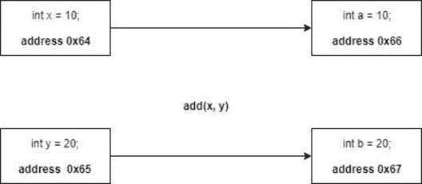
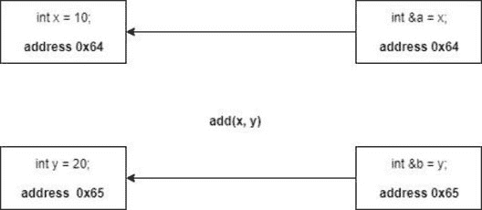

# 如何在 C++中实现引用调用

> 原文：<https://www.edureka.co/blog/call-by-reference-in-cpp>

如果你已经有了 C 语言的背景，那么使用 C++并不是一件困难的事情，因为两者彼此分享了大量的概念。但是，C++有一些概念不是 C 范式的一部分。在这篇 C++中通过引用调用的文章中，我们将按以下顺序讨论引用变量的概念及其应用:

*   [参考变量](#variable)
*   [c++中的按值调用和按引用调用](#value-reference)
*   [返回 C++](#return)
*   [通过引用调用 Vs 指针](#pointer)

## **参考变量**

C++给了我们一种新的变量类型，即引用变量。我们可以把引用变量想象成原始变量的昵称。这就是一行中引用变量的确切功能。

例如，如果你的名字是哈里森，但在家里，你的家人叫你哈利。现在让我们来看看参考变量的一些细节。这种类型变量的声明和使用不同于我们通常使用的变量，但非常类似于指针变量。

**语法:**

```
int Hello = 1;
int *ptr;
int &World = Hello;
```

当我们创建一个包含值“1”的变量“Hello”时，使用一段内存来存放值“1 ”,这段内存的名称将是“Hello ”,这段内存的地址将是某个十六进制值，例如 0x64。当我们写 `int &World = Hello;` 时，创建了指向相同存储位置的‘世界’变量。

包括行 World++将改变地址 0x64，这意味着变量“Hello”的值也将改变。有些人可能会指出引用变量与指针变量有什么不同，我们将在本文的后半部分讨论指针变量。

## **c++中的值调用和引用调用**

**按值调用:**按值调用是一种广泛使用的方法。大多数情况下，您将使用按值调用方法，因为您不希望变量的原始值被更改。因此，我们使用 call by value 方法来调用函数，只传递变量的值。这是通过在内存中创建虚拟变量来实现的。

```
#include <iostream>

using namespace std;

void add(int a, int b){
    a = a + 10;
    b = b + 10;
    cout<<"Value of a = "<<a<<endl;
    cout<<"Value of b = "<<b<<endl;

    }

int main()
{
   int x = 10;
   int y = 20;

   add(x,y);

   cout<<"Value of x = "<<x<<endl;
    cout<<"Value of y = "<<y<<endl;

    return 0;
}
```

**输出:**

`Value of a = 20`

`Value of b = 30`

`Value of x = 10`

`Value of y = 20`



从上图中，我们可以看到，只要我们调用 add()函数，x 和 y 变量的值就被复制到变量 A 和 b 中。A 和 b 是哑变量。

**引用调用:**现在，我们来谈谈引用方法的调用。在这个方法中，没有创建单独的伪变量，而是将一个已经存在的变量的引用传递给这个方法。该引用指向相同的内存位置，因此不会在内存中创建单独的副本。这里需要注意的重要一点是，参考变量中所做的更改会反映在虚拟变量中。

```
#include <iostream>

using namespace std;

void add(int &a, int &b){
    a = a + 10;
    b = b + 10;
    cout<<"Value of a = "<<a<<endl;
    cout<<"Value of b = "<<b<<endl;

    }

int main()
{
   int x = 10;
   int y = 20;

   add(x,y);

   cout<<"Value of x = "<<x<<endl;
    cout<<"Value of y = "<<y<<endl;

    return 0;
}
```

**输出:**

`Value of a = 20`

`Value of b = 30`

`Value of x = 20`

`Value of y = 30`

从输出中，我们可以看到 x 和 y 的原始值受到影响，因为没有形成单独的虚拟变量。



## **在 C++中引用返回**

我们可以传递对函数的引用，也可以从函数返回引用。

```
int & min(int &a, int &b)
{
    if (a<b)
      return a;

    if (b<a)
      return b;

}

```

正如我们所看到的，上面的函数看起来与普通函数不同，因为返回类型是“int &”。这个函数根据条件返回对 a 或 b 的引用。这里需要注意的重要一点是，值没有被返回。

如果我们调用函数 min(x，y) = 10。如果 x 是最小值，10 将被赋给 x；如果 y 是最小值，10 将被赋给 y。

## **通过引用调用 Vs 指针**

在我们所有的例子中，我们看到我们总是给我们创建的引用变量赋值，因为引用变量不能为空，而指针变量可以为空，这会导致意外的错误。

引用变量不能被重新分配，而指针变量可以指向程序后面的其他变量。

指针变量保存特定变量的地址值，而引用变量的地址与它所引用的变量的地址相同。

到此，我们在 C++文章中通过引用来结束这个调用。我希望您理解了通过值和引用调用的各种实现，以及它们之间的区别。

如果你想了解更多，请查看由 Edureka(一家值得信赖的在线学习公司)提供的  [Java 培训](https://www.edureka.co/java-j2ee-soa-training)。Edureka 的 Java J2EE 和 SOA 培训和认证课程旨在培训您掌握核心和高级 Java 概念以及各种 Java 框架，如 Hibernate & Spring。

有问题要问我们吗？请在这个博客的评论部分提到它，我们会尽快回复你。