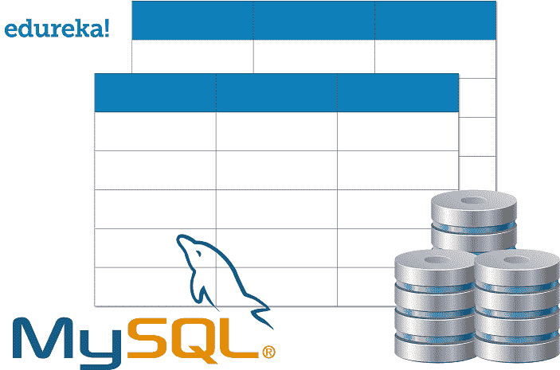

# MySQL 中如何使用 CASE 语句？

> 原文：<https://www.edureka.co/blog/case-statement-in-mysql/>

随着每天产生大量的数据，根据一些条件检索数据是很重要的。在这篇关于 MySQL 中的 CASE 语句的文章中，我将讨论如何使用这个语句来检索单个条件或多个条件下的数据。

本文将涉及以下主题:

*   [SQL 简介](#whatisSQL)
*   [SQL 的用途是什么？](#purposeofSQL)
*   [MySQL 中的案例](#CASEinMySQL)
*   [MySQL 中 CASE 的语法](#syntaxCASEinMySQL)
*   [MySQL 中的案例示例](#ExampleCASEinMySQL)

## **什么是 SQL？**

SQL 是一种在编程中广泛使用的领域特定语言。它被设计用于管理包含在[关系数据库管理系统(RDBMS)](https://www.edureka.co/blog/what-is-mysql/) 中的数据，或者用于关系数据流管理系统中的流处理。 一般来说， [SQL](https://www.edureka.co/blog/sql-basics/) 是一种帮助存储、操作和检索数据库中数据的标准语言。

## ****SQL 的用途是什么？****

[SQL](https://www.edureka.co/blog/sql-tutorial/) 基本上是用来和数据库通信的。根据 ANSI(美国国家标准协会)，它被认为是关系数据库管理系统(RDBMS)的标准语言。我们使用 [SQL 语句](https://www.edureka.co/blog/sql-commands)来执行任务，例如更新、插入、删除或从数据库中检索数据。

## ****MySQL 中的 CASE 语句是什么？****

[MySQL](https://www.edureka.co/blog/mysql-tutorial/) 中的 CASE 语句是处理 if/else 逻辑的一种方式。这是一种控制语句，它构成了编程语言的细胞，因为它们控制其他语句集的执行。

CASE 语句经历各种条件，并在满足第一个条件时返回值(就像低级语言中的 [IF-THEN-ELSE 语句](https://www.edureka.co/blog/sql-if-statement/))。一旦条件为真，它将停止遍历并返回结果。如果没有一个条件为真，它将返回 ELSE 子句中的值。

如果没有 ELSE 子句，并且没有一个条件为真，它就返回 NULL。

## **MySQL 中 CASE 语句的语法**

### 基本语法:

```
CASE
    WHEN condition1 THEN result1
    WHEN condition2 THEN result2
    WHEN conditionx THEN resultx
    ELSE result
END;

```

***有两种方法可以实现语句的大小写切换:***

*   取一个名为 case_value 的变量，将其与某个 statement_list 进行匹配。

```
CASE case_value
    WHEN when_value THEN statement_list
    [WHEN when_value THEN statement_list] ...
    [ELSE statement_list]
END;

```

*   考虑搜索条件而不是变量等式，并相应地执行语句列表。

```
CASE
    WHEN search_condition THEN statement_list
    [WHEN search_condition THEN statement_list] ...
    [ELSE statement_list]
END;

```

## ****MySQL 中 CASE 语句的例子****

让我们考虑一张桌子:学生

### **学生表**

| **学号** | **名称** | **部门** | **性别** |
| 001 | 阿卡什 | CS | M |
| 002 | 比克拉姆 | 机械 | M |
| 003 | 单丹 | CS | M |
| 004 | 迪帕克 | CS | M |
| 005 | 螺旋桨 | 欧共体 | F |
| 006 | 费尔南德斯 | 机械 | F |

**示例:**考虑一个场景，您必须将部门名称修改为完整的形式。如果 dept 名字是 CS，应该转换成计算机科学；L ikewise，Mech 应该转换成 Mechanical.a nd EC 转换成 Electronic 和 Communication。

### **样本查询**

```
CASE department_name
WHEN 'CS'
  THEN UPDATE Student SET
  department='Computer Science';
 WHEN 'EC'
  THEN UPDATE Student SET
  department='Electronics and Communication';
 ELSE UPDATE Student SET
 department=’Mechanical';
END;

```

### **输出:**

相应的部门名称重命名如下:

| **学号** | **名称** | **部门** | **性别** |
| 001 | 阿卡什 | 计算机科学 | M |
| 002 | 比克拉姆 | 机械 | M |
| 003 | 单丹 | 计算机科学 | M |
| 004 | 迪帕克 | 计算机科学 | M |
| 005 | 螺旋桨 | 电子和通信 | F |
| 006 | 费尔南德斯 | 机械 | F |

**示例:**考虑一个场景，您必须选择与学生表对应的所有字段。由于写在性别字段中的值是单字符值(M/F ),让我们编写一个查询，将 M 改为男性，将 F 改为女性。

### ****样本查询****

```
SELECT Student ID, Name, Department,
CASE Gender
 WHEN'M' THEN 'Male'
 WHEN'F' THEN 'Female'
END
FROM Student;

```

### ****输出:****

| **学号** | **名称** | **部门** | **性别** |
| 001 | 阿卡什 | 计算机科学 | 男 |
| 002 | 比克拉姆 | 机械 | 男 |
| 003 | 单丹 | 计算机科学 | 男 |
| 004 | 迪帕克 | 计算机科学 | 男 |
| 005 | 螺旋桨 | 电子和通信 | 女 |
| 006 | 费尔南德斯 | 机械 | 女 |

### **SQL 自定义排序中的大小写切换**

#### ****样本查询****

```
CREATE PROCEDURE GetStudent(@ColToSort varchar(150)) AS
SELECT StudentID, Name, Gender, Department
FROM Student
ORDER BY
  CASE WHEN @ColToSort='Department' THEN Department
       WHEN @ColToSort='Name' THEN Name
       WHEN @ColToSort='Gender' THEN Gender
       ElSE StudentID
  END;

```

#### **输出:**

根据提供的字段对输出进行排序。

上述过程(函数)以 varchar 数据类型的变量作为其参数，并在此基础上对 Student 表中的元组进行排序。 此外，我们还可以用 CASE 语句来比较条件。

**示例:**考虑一个名为 CONTACTS 的表，其中包含 contactID 和 websiteID。根据这些细节，用户可以通过这些链接进行导航:【techon thenet . com】或【CheckYourMath.com】。

### ****样本查询****

```
SELECT
CASE
&nbsp;&nbsp;WHEN contact_id < 1000 THEN 'TechOnTheNet.com'
&nbsp;&nbsp;WHEN website_id = 2 THEN 'CheckYourMath.com'
END
FROM contacts;

```

现在很明显，在 MySQL 中编写 Case 语句时，一个最重要的因素是“以正确的方式排序”。 只要记住条件是按照你列出的顺序来评估的。一旦任何条件变为真，CASE 语句将返回结果，并且不再进一步评估这些条件。所以在选择列出你的条件的顺序时要小心。

如果您希望了解更多关于 [MySQL](https://www.edureka.co/blog/what-is-mysql/) 的信息，并了解这个开源关系数据库，请查看我们的 [MySQL DBA 认证培训](https://www.edureka.co/mysql-dba)，该培训包含讲师指导的现场培训和真实项目体验。本培训将帮助您深入了解 MySQL，并帮助您掌握这门学科。

有问题要问我们吗？请在这个“MySQL 中的 CASE 语句”的评论部分提到它，我们会给你回复。