# 2023 年你必须准备的顶级阿帕奇卡珊德拉面试问题

> 原文：<https://www.edureka.co/blog/interview-questions/cassandra-interview-questions/>

无模式数据库是 IT 界的最新流行语。极客程序员似乎喜欢灵活性和低成本，这些属性激发了许多初创企业。NoSQL 数据库是模式不可知的:不需要做任何前期的模式设计就可以存储信息。因此，在这个行业对 NoSQL 的需求如此之大的情况下，让我们来看看如果你打算申请 NoSQL 数据库开发人员或 NoSQL 数据库管理员，你必须知道的顶级 Cassandra 面试问题。

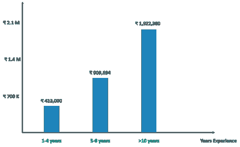

如你所见，有 Cassandra 经历的人的工资趋势相当高。让我们从卡珊德拉面试问题开始

我把这个关于卡珊德拉面试问题的博客分成了 3 个部分:

*   [**NoSQL 将军面试题**](#Nosql)
*   [**初学卡珊德拉面试题**](#Beginners)
*   [**提前卡珊德拉面试提问**](#Advance)

## **NoSQL 将军面试问题**

### **1。任何 NoSQL 数据库的关键特征是什么？**

 <caption>#### **NoSQL 数据库的特点**</caption> 
| **特色** | **描述** |
| ***图式不可知*** | 无需进行任何前期模式设计即可存储信息 |
| ***&弹力*** | NoSQL 允许工作负载自动分布到任意数量的服务器上 |
|  | 一个服务器集群可以用来容纳一个大型数据库。 |
| ***轻松扩展*** | 允许轻松扩展以适应云应用的数据量和复杂性 |
| ***集成缓存*** | 系统内存中的缓存数据对应用程序开发人员&运营团队是透明的。 |

### **2。什么是 NoSQL 数据库？**

*   NoSQL 也被称为不仅是 SQL，以强调他们可能支持关系数据库中使用的类似 SQL 的查询语言。
*   NoSQL 数据库提供了一种存储和检索数据的机制，这些数据是模型化的，而不是关系数据库中使用的表格关系。

### **3。有哪些不同类型的 NoSQL 数据库？**

NoSQL 数据库主要有 4 种类型，

*   键值存储
*   文档库
*   列存储
*   图形数据库

### **4。什么是键值存储数据库？举例说明。**

数据库中的所有数据由一个 ***索引键**和一个**值*** 组成。一个键可以对应一个或多个值(哈希表)。提供卓越的性能，并且可以根据业务需求轻松扩展。

### **5。什么是文档存储数据库？举例说明。**

数据记录是键值对的 JSON/XML 表示。每个记录可以有不同的字段集。 文档 db 类似于键-值对，但区别在于键与文档相关联

### **6。什么是列存储数据库？举例说明。**

数据存储在数据列而不是数据行组成的单元格中。柱在逻辑上被分组为柱族。 一行可以有一条或多条数据记录，由分区键索引。

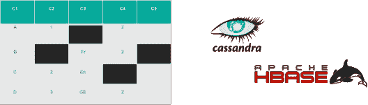

### **7。什么是 Graph DB？举例说明。**

NoSQL 数据库的类型，其中使用了灵活的图形表示。主要目的是存储节点之间的关系。

在这里，节点是 Id 1、2 和 3。节点 1 的属性是名称和年龄 边是:Id 100、101、102、103、104 和 105

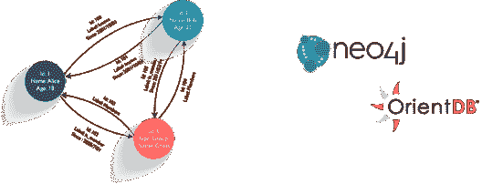

## **初学者** **卡珊德拉面试问题**

### **8。什么是阿帕奇卡珊德拉？**

Apache Cassandra 是一个免费的开源分布式 NoSQL 数据库管理系统，旨在处理许多商用服务器上的大量数据，提供无单点故障的高可用性。

### **9。阿帕奇卡珊德拉有什么特点？**

Apache Cassandra 有很多特性，其中一些让它与众不同的特性是:

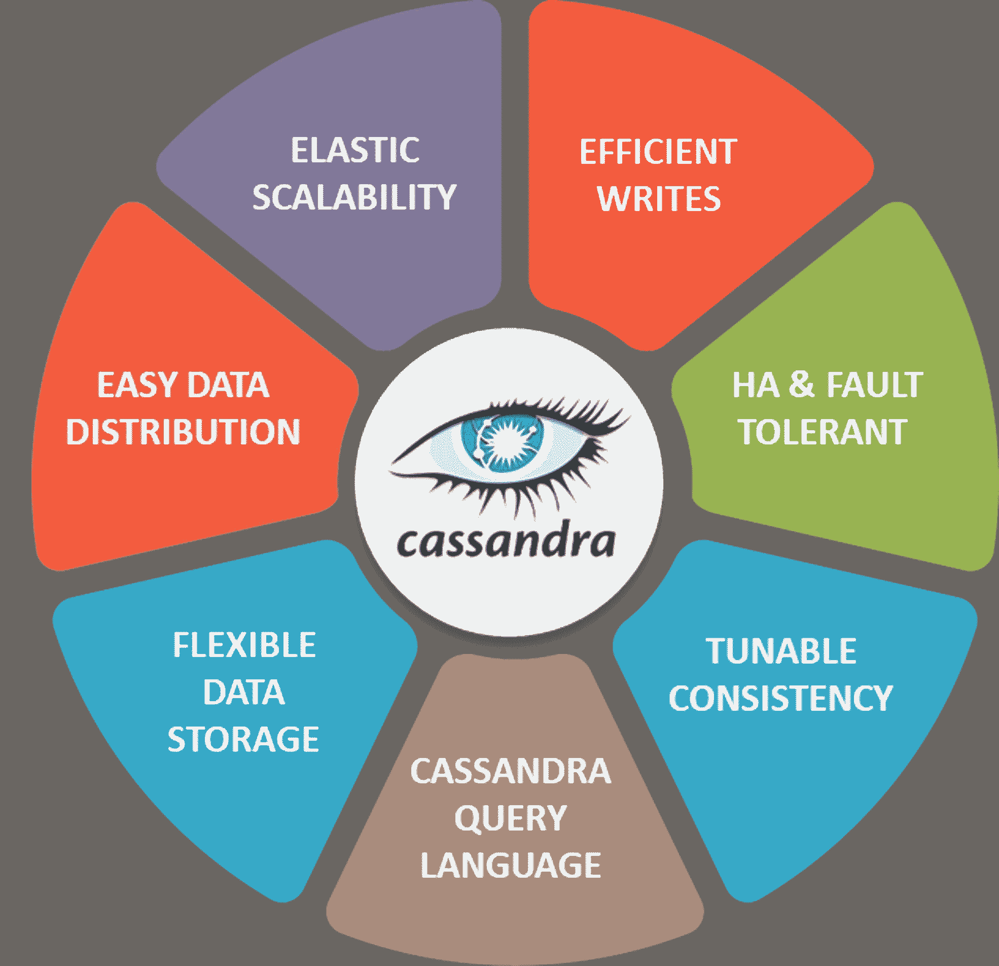

### **10。有哪些不同类型的数据模型？**

数据模型主要有 3 种类型/阶段

*   **概念数据模型**
*   **逻辑数据模型**
*   **物理数据模型**

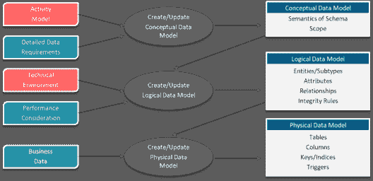

Cassandra Interview Questions

### **11。Cassandra 和传统 RDBMS 的主要区别是什么？**

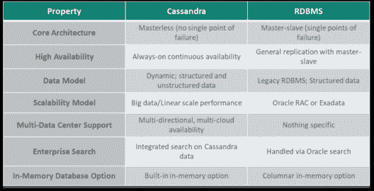

### **12。Cassandra 有哪些不同的数据库元素？**

有 4 个主要的 Cassandra 数据库元素:

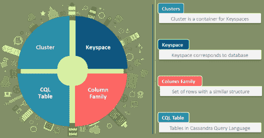

### **13。CQLSH 是什么？为什么要使用它？**

Cassandra-Cqlsh 是一种查询语言，使用户能够与其数据库进行通信。通过使用 Cassandra cqlsh，您可以做以下事情:

*   **定义一个模式**
*   **插入一条数据，**
*   **执行查询**

### **14。卡珊德拉的 YAML 档案是什么？**

cassandra.yaml 文件是 cassandra 的主要配置文件。更改 cassandra.yaml 文件中的属性后，必须重新启动节点才能使更改生效。

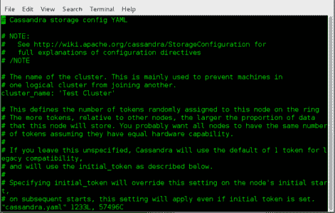

### **15。卡珊德拉中的集群是什么？**

《卡桑德拉》中最外层的结构是群集。集群是密钥空间 的容器，有时称为环，因为 Cassandra 通过将数据排列在环 中来将数据分配给集群中的节点，一个节点保存不同数据范围的副本。

### **16。卡珊德拉中的一个键空间是什么？**

在 Cassandra 中，keyspace 是最外层的数据容器。像关系数据库一样，一个键空间有一个名称和一组定义键空间范围行为的属性。键空间用于将柱族组合在一起。

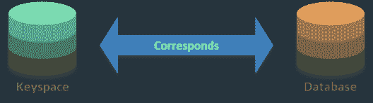

### **17。如何在 Cassandra 中创建密钥空间？&使用的参数是什么？**

CREATE key space ABCWITH replication = { ' class ':' simple strategy '，' replication _ factor ':' 3 ' }，durable _ writes = ' TRUE

创建密钥空间时使用的参数有:

*   键区名称
*   复制策略
*   复制因子&
*   持久写入

### **18。什么是持久写入？**

持久写入提供了一种方法来指示 Cassandra 是否使用 commitlog 来更新当前的键空间。 这个选项不是强制的。持久写入的默认值为 TRUE。

### **19。你说的复制因子是什么意思？**

Cassandra 根据行键存储每一行的拷贝(称为副本)。复制因子是指将充当每行数据的拷贝(副本)的节点数量。

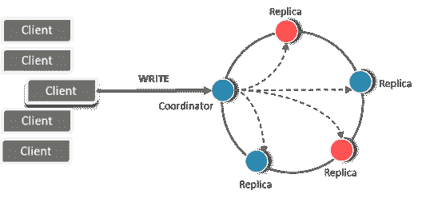

### **20。你说的复制策略是什么意思？**

副本放置策略是指副本将如何放置在环中Cassandra 提供了不同的策略来确定哪些节点将获得哪些密钥的副本 主要有两种策略:

*   **简单策略**
*   **网络拓扑策略**

### **21。什么是简单策略？**

它使用简单的单一数据中心集群。它将第一个副本放在由分割器确定的节点上。其他副本以顺时针(环形)方式放置在下一个节点上，而不考虑机架或数据中心的位置。

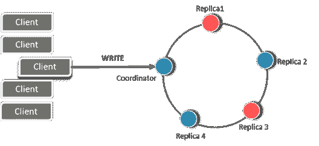

### **22。什么是网络拓扑策略？**

当我们跨多个数据中心部署集群时，会用到这一点。这是插入副本的首要考虑因素。可以在本地满足读取要求，而不会导致跨数据中心延迟，还可以处理故障情况。

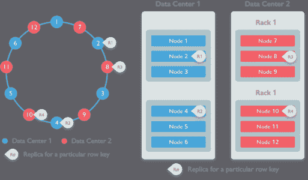

### **23。什么是柱族？**

列族是行的有序集合的容器，每个行本身是列的有序集合。根据您的需求，我们可以随时向任何色谱柱系列添加任何色谱柱。比较器值指示当列在查询中返回给您时将如何排序。

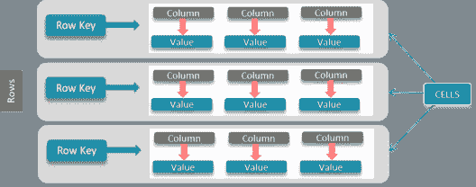

### **24。卡珊德拉的一排是什么？它的不同元素是什么？**

一行是排序后的列的集合。它是 Cassandra 中存储相关数据的最小单元。行的任何组件都可以存储数据或元数据

一行的不同元素/部分是

*   行键
*   列键
*   列值

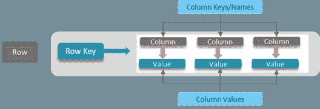

### **25。什么是主键？它有哪些不同的类型？**

主键是用来唯一标识一行的列

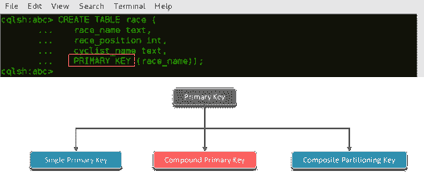

主键有 3 种:

这些是一些你必须知道的初级卡珊德拉面试问题。

那么，让我们继续讨论一些预先卡珊德拉面试问题

## **提前** **卡珊德拉** **面试问题**

### **26。区分 Cassandra 中不同类型的主键。**

*   在**单主键**中，只有一列作为主键。

列也称为分区键。数据基于该列进行分区。数据根据分区键分布在不同的节点上。

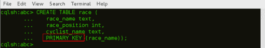

*   在**复合主键**中，数据被分区，然后被聚类

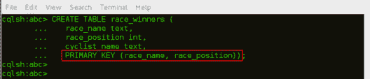

race_name 是分区键，race_position 是聚类键。数据将基于 race_name 进行分区，数据将基于 race_position 进行聚类。聚类是对分区中的数据进行排序的过程。当分区键的行根据聚类列按顺序存储时，行的检索非常有效。

*   **复合分区键**用于为数据创建多个分区

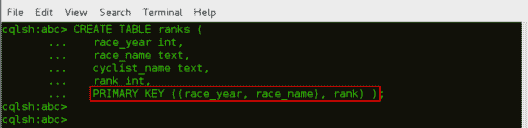

race_year 和 race_name 是组合分区键，数据将基于这两列进行分区。数据将根据等级进行聚类。当单个分区上存在太多数据时，会使用它。

### **27。区分静态和动态****表。**

1.  静态表使用一组相对静态的列名，类似于关系数据库表。
2.  动态表允许您预先计算结果集，并将它们存储在一行中，以便高效地进行数据检索。

### **28。在 CQLSH**T3 中区分 Drop 和 Truncate

1.  Drop table 命令从键空间中删除指定的表，包括所有数据。
2.  Truncate table 命令用于截断一个表格，并永久删除表格中的所有行。

### **29。什么是八卦协议？**

Cassandra 中的 Gossip 协议是一种对等通信协议，其中节点可以在它们之间选择它们想要与谁交换它们的状态信息。这些节点交换关于它们自己和关于它们已经谈论过的其他节点的信息，因此所有节点快速了解集群中的所有其他节点。

### **30。八卦协议是如何运作的？**

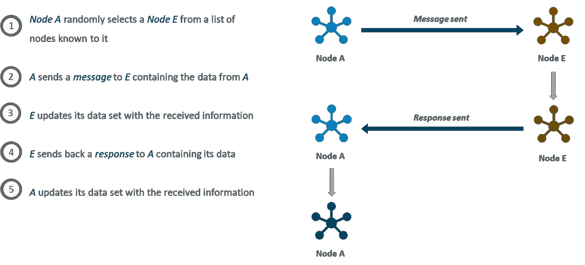

### **31。gossip 协议如何帮助故障检测？**

确认消息的过程有助于故障检测。当一个节点停机/发生故障时，它无法发送或接收消息，因此无法收到确认。

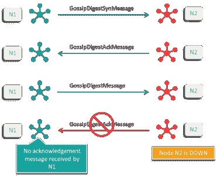

### **32。Cassandra 中的分区和令牌是什么？**

*   **分区**:它是一个位于每个节点上的散列函数，从被添加的行中的指定值散列令牌。它将可变长度输入转换为固定长度值。
*   **令牌:**由散列算法生成的整数值，标识分区在簇内的位置

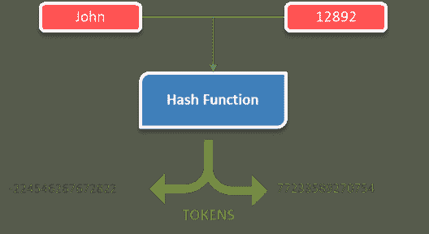

### **33。卡珊德拉中有哪些不同类型的划分者？解释一下。**

*   **murmur 3 分区器**是默认的分区器。它比 RandomPartitioner 既改进又快。基于 MurmurHash 函数均匀分布数据。

64 位哈希值分区键，范围:263 到 263-1

*   在 Cassandra 1.2 之前，RandomPartitioner 是默认的分区器。它与 vnodes 一起使用。它有均匀的分布。

使用 MD5 哈希值，范围:0 到 2127-1

*   **ByteOrderedPartioner** 用于有序分区。它按关键字字节对行进行词汇排序。使用有序划分器允许通过主键进行有序扫描。这意味着我们可以像在传统索引中移动光标一样扫描行。

### **34。你说的告密者是什么意思？举出几个**

告密者确定节点属于哪个数据中心和机架。他们通知 Cassandra 网络拓扑结构，并允许 Cassandra 分发副本。具体来说，复制策略根据新告密者提供的信息放置副本。

告密者有很多种，举几个例子:

*   动态告密
*   SimpleSnitch
*   rackeinferingsnicker
*   Ec2Snitch
*   PropertyFileSnitch
*   GossipingPropertyFile
*   ec2m 文化区
*   谷歌云飞贼
*   CloudstackSnitch

### **35。Cassandra 是如何执行写操作的？**

当写请求到达节点时:

*   首先，它记录在提交日志中。数据将被捕获并存储在 Mem-Table 中。
*   当 mem-table 已满时，数据被刷新到 SSTable 数据文件。

所有写入都会自动分区并在整个群集内复制，Cassandra 会定期整合表，丢弃不必要的数据。

### **36。解释术语 Memtable、CommitLog 和 SSTables。**

*   **提交日志:**提交日志是一种崩溃恢复机制，支持卡珊德拉的持久性目标
*   **MemTable:** MemTable 是一个内存中的数据结构，对应一个 CQL 表
*   **SSTable:**mem table 的内容被刷新到磁盘上一个名为 SSTable 的文件中。

### **37。** **中的协调器节点读作 有什么用？**

读取操作非常简单，因为客户端可以连接到群集中的任何节点来执行读取操作。如果一个客户端连接到一个没有它试图读取的数据的节点，它连接到的节点将充当协调器节点。

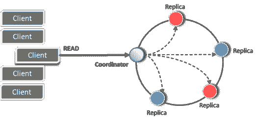

### **38。Cassandra 是如何进行读操作的？解释**

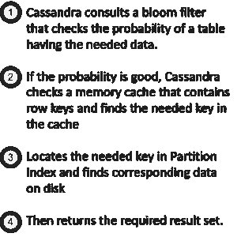

### 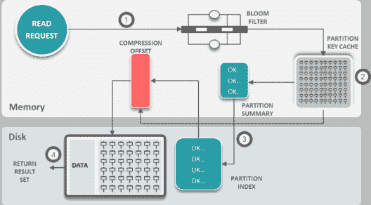

### **39。你说的压实是什么意思？**

这是通过合并大量累积的数据文件来释放空间的过程。它通过减少所需的寻道次数来提高性能。

### **40。什么是反熵，它与默克尔树有什么联系？**

反熵是副本同步机制，保证不同节点上的数据更新到最新版本 Cassandra 使用 Merkle 树进行反熵修复。默克尔树是一种散列树，其中树叶是各个键的值的散列。

### **41。解释不同类型的维修。**

*   **反熵:**反熵修复是使用 Merkle 树比较所有副本的数据，并用最新版本的数据更新它们的过程。反熵修复手动触发。该流程分为两个阶段:
    *   为每个副本构建一棵 Merkle 树
    *   比较 Merkle 树以发现差异

反熵修复非常有用，通常建议定期运行，以保持数据同步。

*   **读取修复:**读取修复是在读取请求时修复副本节点之间的不一致的过程。在读取操作中，如果一些节点响应的数据与新节点的响应不一致，则在旧节点上执行读取修复。它确保了整个节点环的一致性。通过从节点中提取所有数据并执行合并，然后将其写回不同步的节点来完成。
*   **Nodetool 修复:** Nodetool 修复命令针对一个节点，发起对某个范围内令牌的修复。被修复的范围取决于指定的选项。默认选项，只调用“nodetool repair ”,启动节点拥有的每个令牌范围的修复
*   **完全修复:**完全修复对令牌范围内的所有数据进行操作
*   **增量修复:**增量修复只修复自上次增量修复后写入的数据。增量修复是默认的修复类型，如果定期运行，可以显著减少执行修复的时间和 I/O 成本。它将数据分为已修复和未修复的表，并且只修复未修复的数据。一旦增量修复将数据标记为已修复，它就不会再次尝试修复它。不建议进行渐进式修复，而应进行全面修复。

### **42。什么是暗示切换？**

在 Cassandra 中，提示切换是一种确保可用性、容错性和优雅降级的机制。收到提示的节点将知道不可用的节点何时重新联机，因为流言蜚语。

### **43。登录卡珊德拉是什么意思？**

日志被写入到 Cassandra 日志目录 下的 system.log 和 debug.log 文件中，我们可以通过编程或者手动的方式来配置日志。了解数据库中发生的事情的最简单的方法是改变日志记录级别，使输出更加详细，默认情况下设置为 INFO。

### **44。解释 Cassandra 中不同的日志记录级别。**

*   **全部:**所有等级包括自定义等级
*   **跟踪:**指定比调试更细粒度的信息事件
*   **调试:**指定对调试应用程序最有用的细粒度信息事件
*   **信息:**表示在粗粒度级别上强调进度的信息性消息
*   **警告:**表示潜在的有害情况
*   **错误:**表示可能仍然允许应用程序继续运行的错误事件
*   **OFF:** 可能的最高等级，意在关闭日志记录

### **45:什么是 JMX？它在《卡珊德拉》中有什么用？**

JMX (Java 管理扩展)是一种 Java 技术，它提供了管理和监控 Java 应用和服务的工具。卡珊德拉利用 JMX 来实现服务器的远程管理。

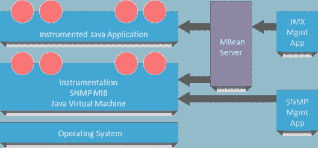

### **46。什么是快照，如何在 Cassandra 中创建快照？**

快照表示数据文件在特定时间点的状态。快照命令在进行备份时使用，它为快照文件夹中的表创建硬链接，这些表稍后可用于恢复节点

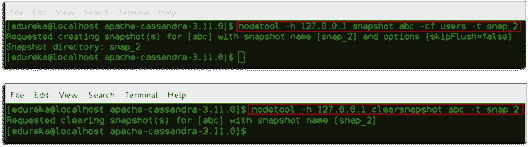

### **47。为什么用 JConsole？它的不同元素是什么？**

JConsole 用于监控和分析服务器活动。一旦你连接到服务器，默认视图包括四个主要类别关于你的服务器的状态，它们会不断更新:

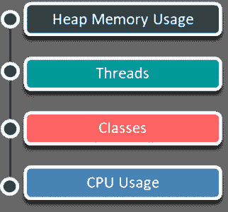

### **48。解释 Nodetool 实用程序。**

Nodetool 实用程序是 Cassandra 自带的命令行实用程序，是一个非常棒的管理和监控工具。它与 JMX 进行通信，以执行 MBeans 公开的操作和监视任务。

### **49。CQLSH 中的角色有哪些？**

角色支持比每个用户所能提供的安全性更大规模的授权管理。一个角色被创建并可能被授予其他角色。在它的帮助下，可以创建分级权限集。

### **50。Cassandra 中的 Python 压力测试是什么？**

Cassandra 附带了一个流行的实用程序 py_stress，可以用来在 Cassandra 集群上运行压力测试。Cassandra-stress 工具是一个基于 Java 的压力测试工具，用于测试 Cassandra 集群的基本基准和负载。这是填充集群和压力测试 CQL 表和查询的有效工具。

所以，我希望这些 Cassandra 面试问题帮助你复习了关于 Apache Cassandra 的知识。

*有问题吗？请在评论区提到它，我们会尽快回复您。*

*如果你希望在 Cassandra 领域建立自己的事业，并获得 NoSQL 数据库方面的专业知识，请在这里注册参加在线直播的 **Edureka [Apache Cassandra 认证](https://www.edureka.co/cassandra)** 培训，它将提供 24*7 全天候支持，在整个学习期间为你提供指导。*