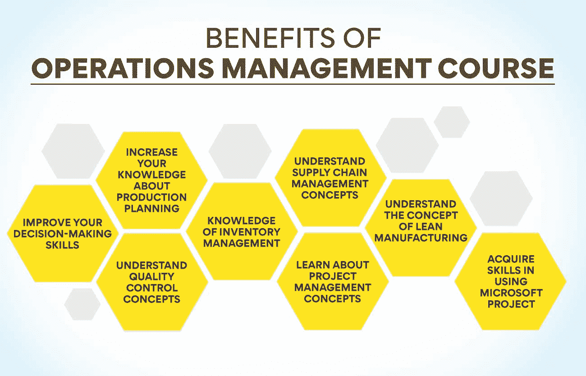
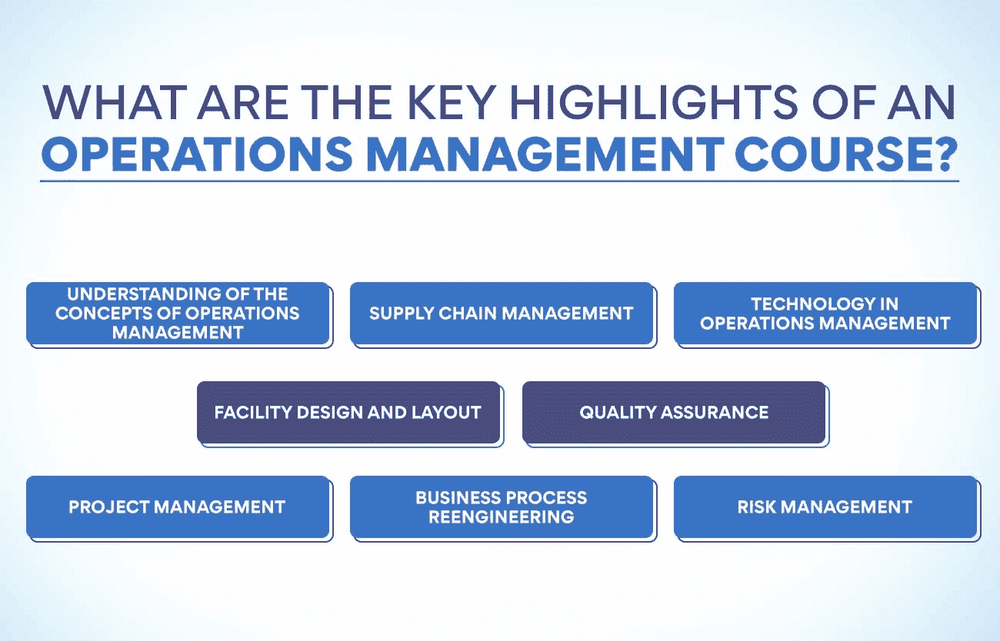
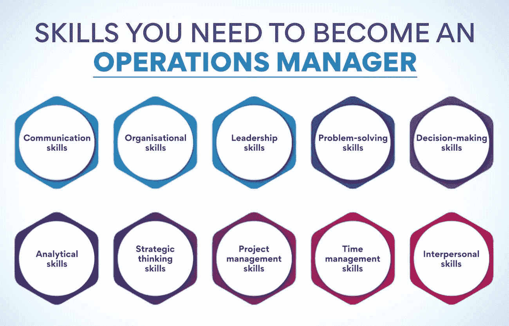

# 运营管理认证:详细分析

> 原文：<https://www.edureka.co/blog/certifications-in-operations-management/>

谈到[运营管理](https://www.edureka.co/blog/beginners-guide-to-operations-management/)，各种证书可以帮助验证你的技能，提升你的职业前景。有了大量的选择，决定哪一个适合你需要时间。这篇博文将对运营管理领域最受欢迎的一些认证进行详细分析，从而做出最符合您需求的明智决策。

我们将讨论各种主题，例如每个证书的要求、获得证书的好处以及与每个证书相关的预期工资增长。

## **运营管理课程的好处**

运营管理是一个与商品和服务的生产有关的领域。它负责计划、协调和控制生产商品和服务所需的资源。运营管理旨在确保生产过程高效且有效。

运营管理课程将为你提供有效管理生产过程所需的知识和技能。你将学习运营管理的各个方面，如生产计划、质量控制、[库存管理](https://www.edureka.co/blog/inventory-management/)和供应链管理。此外，您还将了解如何使用不同的工具和技术来提高生产过程的效率。

通过参加运营管理课程，您将能够:

**1)提高你的决策能力:** 课程将教你如何对生产过程的各个方面做出更好的决策。你将学会如何快速识别和解决问题。此外，您还将学习如何使用不同的工具和技术来支持您的决策过程。

**2)增加你关于生产计划的知识:** 课程会让你对生产计划有一个透彻的了解。您将了解不同类型的生产计划，如主生产计划(MPS)、物料需求计划(MRP)、[产能计划](https://www.edureka.co/blog/what-is-capacity-planning-in-operations-management/)和总计划。此外，您还将了解这些计划如何相互配合使用，以优化生产过程。

**3)了解质量控制概念:** 质量控制是运营管理中最关键的一个方面。本课程将教你不同的质量控制概念，如六适马、统计过程控制(SPC)和全面质量管理(TQM)。此外，您还将了解不同的工具和技术，这些工具和技术将提高您生产的产品和服务的质量。

**4)库存管理知识:库存管理是另一个** 运营管理的重要方面。本课程将教你不同的库存管理方法，如准时制(JIT)库存、经济订货量(EOQ)和定期审查库存(PRI)。此外，您还将了解可用于优化组织库存水平的不同技术。

**5)了解供应链管理概念:** 课程会让你详细了解供应链管理。您将了解不同类型的供应链，如按库存生产(MTS)、按订单生产(MTO)和按订单设计(ETO)。此外，您还将了解如何管理和协调这些供应链。

**6)了解项目管理概念:** 运营管理也负责项目的管理。本课程将教你不同的项目管理概念，如项目启动、计划、执行、监控和结束。此外，您还将了解如何使用不同的工具和技术来有效地管理项目。

**7)了解精益制造的概念:** 本课程将让你更好的了解精益制造。您将学习精益工具和技术，如价值流图、5S 和看板。此外，您还将了解如何使用这些工具和技术来提高生产过程的效率。

**8)获取使用微软项目的技巧:** 微软项目是运营管理中常用的软件应用。本课程将向您介绍 Microsoft Projects 的不同功能，如任务日程安排、资源分配和成本估算。此外，您还将了解如何使用 Microsoft Projects 创建和管理生产计划。

**也读:[运营管理的范围是什么？](https://www.edureka.co/blog/what-is-the-scope-of-operations-management/)**

## 如何选择运营管理的最佳认证？

在为你的运营管理职业前景选择合适的认证时，你需要采取几个关键步骤。这里有一个方法可以帮助你为你的未来做出最大的决定。

**1)研究潜在认证:** 花时间研究现有的运营管理认证项目。你应该弄清楚每个项目需要什么资格和经验，并考虑任何相关的费用或成本。

**2)分析你的职业需求:** 思考你希望为你的运营管理职位获得的具体技能和知识。确保你选择的认证项目符合这些要求。

**3)选择最适合的:** 现在是时候确定哪种认证最适合你了。一旦你缩小了你的选择范围，权衡每一个选择的利弊，决定哪一个会给你带来理想的投资回报。

**4)考虑认证:** 最后，确保你选择的认证在你选择的领域得到认可和认可。这将确保雇主认真对待你的新证书。

考虑他们的教学大纲: 在参加认证项目之前，仔细检查他们的教学大纲。它将帮助你评估这门课程是否适合你想要的职业目标。

寻找额外的资源: 一旦你决定了一个认证项目，寻找他们可能提供的额外资源。

它可以包括在线培训材料、学习小组或导师。

寻求建议: 不要忘记向导师、同事和你关系网中可能有认证经验的其他专业人士寻求帮助。这样做将有助于你根据职业需求做出明智的决定。

冒险: 你已经做了调查，考虑了所有选项，选择了你认为最好的认证项目。是时候采取行动让它发生了！

通过遵循这些步骤，你应该能够选择一个有助于提升你运营管理职业生涯的认证。

## 运营管理认证:运营管理课程的重点是什么？

运营管理课程将涵盖与业务流程的组织、规划和控制相关的各种主题。一般来说，它会涵盖以下主题:

**对运营管理概念的理解:** 这将包括运营管理角色的概述，如供需、精益生产和全面质量管理等概念。

**供应链管理:** 你将了解[供应链管理战略](https://www.edureka.co/blog/how-to-formulate-advanced-supply-chain-strategy/)，以及如何识别优化材料、信息和服务流程的机会。

**运营管理中的技术:** 你将学习运营管理中技术的使用，如机器人和自动化、人工智能和数据分析。

**设施设计和布局:** 您将深入了解如何设计高效的设施布局，包括空间最大化、人体工程学和布局原则。

质量保证: 你将学习质量管理系统，控制质量的方法，以及如何识别缺陷及其原因。

项目管理: 你将学习如何有效地计划、管理和监控项目，使其按照计划和预算运行。

业务流程再造: 它会给你一个思路，让你识别现有流程中潜在的改进领域，开发新的流程，管理变革。

**风险管理:** 你将了解影响运营的风险因素，制定缓解策略和应急计划，并管理风险。

完成本课程后，您可以将所学知识应用到运营管理中。您可以识别和解决问题、分析数据、做出决策并优化运营。你也会更好地理解运营管理对组织整体绩效的影响。

## 参加运营管理认证有什么好处？

考虑获得运营管理认证有很多原因。首先，它可以极大地改善你的职业前景和收入潜力。此外，认证可以帮助您发展运营管理方面的新技能和知识。

参加运营管理认证的一些具体好处包括:

**改善的工作前景和收入潜力:** 运营管理方面的证书可以帮助你的简历在求职时脱颖而出。这向雇主展示了你拥有在这个职位上取得成功所必需的技能和专业知识。此外，认证运营经理比非认证运营经理收入更高。

发展新的技能和知识: 运营管理认证将为你提供该领域坚实的知识基础。你将学习供应链管理、[项目管理](https://www.edureka.co/blog/project-management-fundamentals)、质量控制等等。这些知识可以提高你目前的工作表现，或者为你在运营管理中的新角色做好准备。

**灵活性和可移植性:** 证书是可移植的，这意味着各行各业的雇主都有可能接受它。如果你决定转行或在其他行业寻找机会，这将是一笔宝贵的财富。

此外，许多认证可以在网上或通过晚间/周末课程完成，这对忙碌的专业人士来说非常方便。

**也读:[运营管理的目标是什么？](https://www.edureka.co/blog/what-are-the-objectives-of-operations-management/)**

## 运营管理职业的资格标准是什么？

运营管理职业的资格标准因具体业务及其需求而异。一般需要有[企业管理、](https://www.edureka.co/blog/digital-business-management-for-better-profitability/)运营管理、会计或财务的学士学位。此外，一些雇主可能更喜欢同一领域的硕士学位。

在某些情况下，运营管理领域的相关专业经验可能会被雇主接受，作为学位的替代选择。

除了学历之外，雇主可能还会寻找特定的技能和品质，比如很强的组织和解决问题的能力、决策能力和优秀的沟通技巧。了解该领域的最新技术和趋势也可能是有益的。

最后，拥有成功项目管理经验的良好记录通常是获得运营经理职位的关键。在申请工作时，证明你如何在预算和期限内管理项目将是无价的。

## **成为运营经理所需的技能**

要成为运营经理，你必须具备特定的技能。以下是你需要的 10 项基本技能:

1.  **沟通技巧:** 运营经理必须与团队成员进行清晰有效的沟通。他们需要能够给出指示并提供反馈。
2.  组织技能: 运营经理需要有条理且高效。他们需要能够迅速计划和执行任务。
3.  领导技能: 运营经理必须领导和激励他们的团队成员。他们需要能够设定目标，并激励团队实现目标。
4.  **解决问题的技巧:** 运营经理必须快速高效地发现并解决问题。他们必须快速思考，想出有创意的解决方案。
5.  **决策技巧:** 运营经理必须快速自信地做出决策。他们需要权衡所有的选择，为他们工作的公司或组织做出最好的决定。
6.  **分析技能:** 运营经理需要快速准确地分析数据和信息。他们必须发现趋势和模式，并利用这些信息来提高运营效率。
7.  **战略思维技巧:** 运营管理者必须进行战略和长远的思考。他们需要能够规划未来，做出从长远来看有利于公司或组织的决策。
8.  **项目管理技巧:** 运营经理必须有效地管理项目。他们需要能够创建项目计划、分配任务和跟踪进度。
9.  **时间管理技巧:** 运营经理必须明智地管理自己的时间。他们需要能够区分任务的优先级，并在分配的时间框架内完成任务。
10.  **人际交往技巧:** 运营经理必须与团队成员建立良好的关系。他们必须激励和鼓舞他们的队友一起为共同的目标而努力。

## **运营管理认证:获得运营管理认证后你可以选择的职业道路**

运营管理认证可以帮助你走上不同的职业道路。以下是一些最受欢迎的选项:

1.  项目经理: 项目经理将监督项目的计划、执行和完成。他们必须有很强的组织能力，并能与项目团队的所有成员有效沟通。
2.  运营分析师: 运营分析师负责分析一个组织的业务流程，并找出需要改进的地方。他们必须有很强的分析和解决问题的能力。
3.  业务流程顾问: 业务流程顾问帮助组织优化他们的业务流程。他们必须对运营管理的最佳实践有深刻的理解，并且能够与客户进行有效的沟通。
4.  质量保证经理: 质量保证经理确保产品和服务符合所有质量标准。他们必须非常关注细节，并有效地管理质量保证专业人员团队。

## **结论**

对于一个新的令人兴奋的运营管理职业来说，获得认证是最好的开始方式。有这么多不同的认证可用，研究和选择最适合您的需求是至关重要的。我们希望这篇文章能帮助你理解现有的认证类型，以及它们如何有利于你的职业生涯。

如果你想了解运营管理的本质，可以参加我们的课程[运营、供应链和项目管理高级证书](https://www.edureka.co/highered/advanced-program-in-operations-supply-chain-project-management-iitg)，它将训练你处理各种管理问题。

现在就报名吧！

## **更多信息:**

什么是运营和供应链管理(OSCM)？

[运营管理:教学大纲、课程和认证](https://www.edureka.co/blog/syllabus-for-operations-management/)

[运营管理中的转型过程是什么？](https://www.edureka.co/blog/transformation-process-in-operations-management/)

[什么是运营管理&生产流程中的调度？](https://www.edureka.co/blog/scheduling-in-operations-management/)