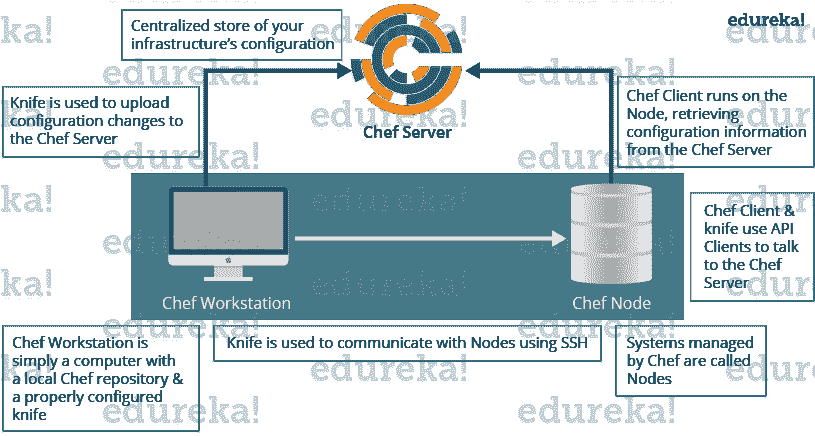

# 顶级厨师面试问题——关于 2023 年的厨师，你需要知道的一切

> 原文：<https://www.edureka.co/blog/interview-questions/chef-interview-questions/>

Chef 是用于配置管理的工具，与 Puppet 竞争激烈。它是 ***[DevOps 课程课程表](https://www.edureka.co/devops#curriculum)*** 的组成部分。许多大型基础设施组织都使用 Chef。所以很有可能你打算面试的公司正在使用它，你可能会被要求回答很多关于厨师的问题。如果你想在厨师面试中过得更好，相信我，这篇关于**厨师面试问题**的博客是破解你面试的关键。经过与专家的长时间讨论，我列出了最常见的问题。这个博客一定会让你为你的厨师面试做好准备。好奇想了解更多关于厨师 ***[的知识，来看看这个关于厨师](https://www.edureka.co/blog/what-is-chef/)*** 的博客系列吧。

本厨师面试问题博客是母博客 [***DevOps 面试问题***](https://www.edureka.co/blog/interview-questions/top-devops-interview-questions-2016/) 的一部分。它包括所有 DevOps 阶段。

如果你好奇 Chef 是如何工作的，它是如何实现配置管理的， [***参考这个博客。***](https://www.edureka.co/blog/what-is-chef/)

让我们从厨师面试问题开始，所以第一个问题必须是:

## **2023 年 DevOps 面试问答| DevOps 培训| edu reka**

[//www.youtube.com/embed/clZgb8GA6xI?rel=0&showinfo=0](//www.youtube.com/embed/clZgb8GA6xI?rel=0&showinfo=0)

### **Q1。厨师是什么？**

从定义厨师开始回答这个问题。

这是一个强大的自动化平台，提供了一种将基础设施转化为代码的方法。Chef 是一个工具，您可以为它编写用于自动化流程的脚本。什么流程？几乎所有与之相关的东西。

现在你可以解释一下 Chef 的架构了，它由:

 <caption>#### **厨师架构组件**</caption> 
| ***厨师服务器*** | 

*   [ Chef server is the central storage of infrastructure configuration data.
*   [ Chef server stores the data needed to configure your node & and provides search.
*   It is a powerful tool that allows you to dynamically drive node configuration based on data.

 |
| ***厨师节点*** | 

*   Node is any host configured with Chef-client.
*   Chef-client runs on the node & Contact Chef server to get the information needed to configure the node.
*   Nodes are sometimes called "clients" because they are machines running Chef-client software.

 |
| ***厨师工作站*** | 

*   Chef workstation is the host that you use to modify your recipes and other configuration data.
*   All configurations are tested at the chef workstation first.
*   Further, it is forwarded to Chef server.

 |



### **Q2。什么是 Chef 中的资源？**

我的建议是先定义资源。

资源代表一个基础设施及其期望的状态，例如应该安装的包、应该运行的服务或应该生成的文件。一块资源可以被认为是一个配方。

现在你应该解释一下资源的功能，包括以下几点:

*   描述配置项目的期望状态。
*   声明使该项目达到所需状态所需的步骤。
*   指定资源类型，如包、模板或服务。
*   根据需要列出其他详细信息(也称为资源属性)。
*   被分组到配方中，配方描述了工作配置。

*记住，你在之前的回答中已经提到了 Recipe 这个词，所以这个厨师面试问题博客的下一个问题就得和 Recipe 有关了。*

### **Q3。《大厨》里的菜谱是什么？**

这里我也建议你使用上述流程，先定义配方。

配方是描述特定配置或策略的资源的集合。配方描述了配置部分系统所需的一切。

现在，在定义之后，我将通过包括以下几点来解释配方的功能:

*   安装和配置软件组件。
*   管理文件。
*   部署应用程序。
*   执行其他配方。

### **Q4。Chef 中的节点是什么？**

这可能是你遇到的最简单的问题，你可以这样回答:

一个节点代表一个服务器，通常是一个虚拟机、容器实例或物理服务器——基本上是基础架构中由 Chef 管理的任何计算资源。

### **Q5。** **烹饪书和《大厨》里的菜谱有什么不同？**

这个问题的答案很直接，我的建议是简单地告诉:

配方是资源的集合，主要配置软件包或一些基础设施。一本食谱把食谱和其他信息组织在一起，比只有食谱更容易管理。

*现在下面一组厨师面试问题，就是测试你跟厨师的经验:*

### **Q6。** **在 Chef 中不指定资源的动作会怎么样？**

我的建议是先直接回答。

如果不指定资源的动作，Chef 会应用默认动作。

现在用一个例子来解释这一点，下面的资源:

```
file 'C:UsersAdministratorchef-reposettings.ini' do
 content 'greeting=hello world'
  end

```

与下面的资源相同:

```
file 'C:UsersAdministratorchef-reposettings.ini' do
action :create
content 'greeting=hello world'
end

```

因为:创建是文件资源的默认动作。

### **Q7。** **这两个厨师的菜谱是一样的吗？**

```
package 'httpd'
 service 'httpd' do
 action [:enable, :start]
 end

```

**&&**

```
 service 'httpd' do
 action [:enable, :start]
 end
 package 'httpd'

```

不，他们不是。请记住，Chef 按照资源出现的顺序应用资源。所以第一个方法确保安装了 httpd 包，然后配置服务。第二个方法配置服务，然后确保安装软件包。

### **Q8。编写一个服务资源，当系统在 Chef 中启动时，该资源会停止然后禁止 httpd 服务启动。**

当系统启动时，使用下面的资源停止并禁止 httpd 服务启动。

```
service 'httpd' do
action [:stop, :disable]
  end

```

### **Q9。** **厨师应聘和厨师客户有什么不同？**

我建议你按照下面提到的流程来回答这个问题:

Chef-apply 是一个可执行程序，它从命令行运行单个配方。它是 Chef 开发工具包的一部分，也是一种探索资源的好方法。

Chef-apply 的语法为:

```
chef-apply name_of_recipe.rb

```

厨师-顾客应用一本食谱。它用于生产目的，您通常运行 Chef-client 来应用一个或多个食谱。

### **Q10。Chef 中的运行列表是什么？**

我的建议是首先解释运行列表的用途

运行列表允许您指定运行哪些配方，以及运行的顺序。当你有多本烹饪书时，运行列表很重要，它们运行的顺序很重要。

根据讨论情况，如果您认为需要更多解释，只需提及以下几点

运行列表是:

*   按照运行列表中定义的确切顺序运行的角色和/或配方的有序列表；如果一个食谱在运行列表中出现不止一次，厨师客户端将不会运行它两次。
*   总是特定于它运行的节点；节点可以具有与其他节点使用的运行列表相同的运行列表。
*   作为节点对象的一部分存储在 Chef 服务器上。
*   使用小刀进行维护，然后从工作站上传到厨师服务器，或者使用厨师管理控制台进行维护。

### **Q11。** **在厨师中自举需要哪些资料？**

只需提及您需要的信息，以便引导:

*   您的节点的主机名或公共 IP 地址。
*   您可以用来登录节点的用户名和密码。
*   或者，您可以使用基于密钥的认证，而不是提供用户名和密码。

### **Q12。** **如何将更新后的菜谱应用到你在 Chef 中的节点？**

有三种方法可以将更新的食谱应用到一个节点，你可以提到所有或任何一个，我建议你提到所有三个:

*   从您的工作站运行刀切 ssh。
*   SSH 直接进入你的服务器并运行 chef-client。
*   您还可以将 chef-client 作为一个守护进程或服务来运行，以定期检查 chef 服务器，比如每 15 或 30 分钟一次。

### **Q13。** **厨师入门包有什么作用？**

从提及初学者工具包的功能开始回答。

初学者工具包将创建必要的配置文件，如 chef 目录、knife.rb、ORGANIZATION-validator.pem 和 USER.pem 文件等。提供与 Chef 服务器交互所需的正确信息。

现在告诉您如何使用初学者工具包，您只需下载初学者工具包，然后将其移动到工作站上的所需位置。

### **Q14。** **你用什么命令把一本菜谱上传到厨师服务器？**

你可以直接提上传菜谱到厨师服务器的命令**“刀菜谱上传”**。

### **Q15。一旦你的烹饪书可以投入生产，你会把它的版本设置成什么？**

根据语义版本化，一旦你的 cookbook 可以用于生产，你应该将它的版本号设置为 1.0.0。

### **Q16。** **在《大厨》中使用试吃厨房有什么地方开发价值？**

我会提到以下几点，这会让面试官清楚地了解你对测试厨房的理解。

*   通过 Test Kitchen，您可以使用各种虚拟化提供商，在您的工作站或云中本地创建虚拟机或容器实例。
*   它使你能够在类似于你在生产中使用的服务器上运行你的食谱。
*   它通过自动供应和拆除临时实例、解决 cookbook 依赖关系以及将 cookbook 应用到实例来加快开发周期。

### **Q17。哪里可以找到由厨师社区编写和维护的可重复使用的烹饪书？**

你可以直接回答这个问题，说厨师超市有可重复使用的食谱，*[**https://Supermarket . Chef . io**。](https://supermarket.chef.io.)*

一旦你准备好了以上的厨师面试问题，那么你的梦想工作就不远了。

在这篇**厨师面试问题**的博客中，我试图涵盖几乎所有与厨师相关的问题。如果你有任何其他问题，你可以在下面的评论区提出来，你会尽快得到答案。我也建议你在面试 ***[之前，先看看这个关于厨师的博客系列](https://www.edureka.co/blog/what-is-chef/)*** 。

*如果你在**厨师面试问题*** *上找到了这个博客的相关内容，* *请查看 Edureka 的* [***DevOps 培训***](https://www.edureka.co/devops/)*，edu reka 是一家值得信赖的在线学习公司，在全球拥有超过 25 万名满意的学习者。Edureka DevOps 认证培训课程可帮助学员获得各种 DevOps 流程和工具方面的专业知识，例如 Puppet、Jenkins、Nagios 和 GIT，用于自动化 SDLC 中的多个步骤。*