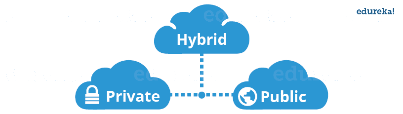
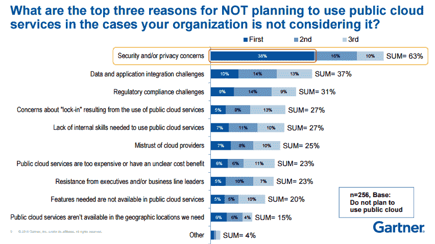
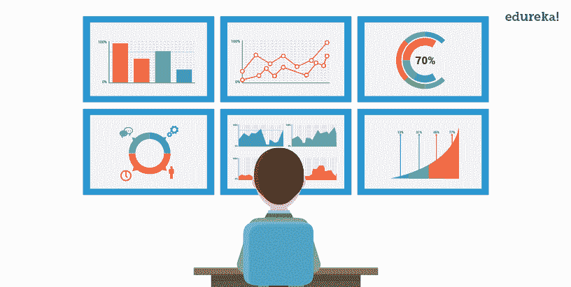
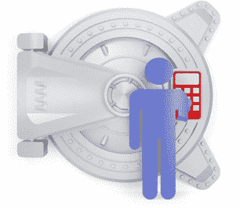
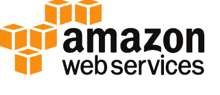
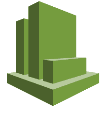
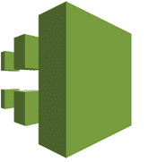
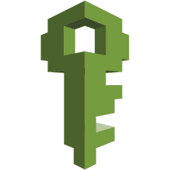
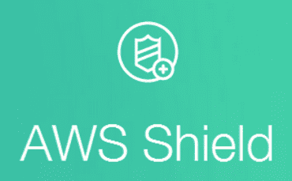

# 云安全:云用户指南

> 原文：<https://www.edureka.co/blog/cloud-security/>

## **云安全**

云在 2010-2011 年是炒作，但今天已经成为必需品。随着许多组织转向云计算，对云安全的需求已经成为重中之重。

但在此之前，那些刚接触云计算的人，让我们快速了解一下什么是云计算，

## **什么是云计算？**

云计算通常被称为“云”，简单来说就是通过互联网而不是你自己的硬盘来存储或访问你的数据和程序。

现在我们来讨论一下云的种类:

## **公有云**

在公共云部署模式下，部署的服务对公众开放使用，通常公共云服务是免费的。从技术上来说，公共云和私有云可能没有什么区别，但安全参数却大不相同，因为公共云是任何人都可以访问的，所以存在更多的风险因素。

## **私有云**

私有云是为单个组织单独运营的，它可以由同一组织或第三方组织完成。但当你使用自己的云时，成本通常会很高，因为硬件会定期更新，安全性也必须得到检查，因为新的威胁每天都会出现。

## **混合云**

混合云包含私有云和公共云的功能

## **客户如何在公共云、私有云和混合云之间做出选择？**

这取决于用户的需求，也就是说，如果用户觉得自己的信息过于敏感，不能放在任何系统上，而只能放在自己的系统上，他们会选择私有云

DropBox 可能是最好的例子，在早期，他们使用 AWS S3 作为存储对象的后端，但现在他们已经创建了自己的存储技术，并自我监控。

他们为什么这样做？

他们变得如此庞大，以至于公共云定价不再有意义。根据他们的说法，他们的软件和硬件优化比在亚马逊 S3 上存储他们的东西更经济可行。

但是，如果你不是像 DropBox 那样的大公司，并且你仍然在使用私有基础设施，那么你可能会想，为什么不使用公共云呢？

现在，客户为什么要使用公共云？

首先，与公司安装自己的服务器所需的投资相比，价格非常低。

其次，当你与一家知名的云提供商合作时，你的文件在云上的可用性会变得更高。

仍然不清楚是要将文件或数据存储在私有云还是公共云上。

让我告诉你混合云，使用混合云，你可以将更“珍贵”的数据保存在你的私有基础架构上，而将其余数据保存在公共云上，这就是“混合云”

综上所述，这完全取决于用户的需求，他应该根据需求在公共云、私有云和混合云之间做出选择。

## **云计算安全能否加速客户向云迁移？**

是的，让我们看看 gartner 做的一些研究。请浏览以下统计:

资料来源:Gartner

现在，这项研究是为那些不太愿意迁移到云的公司进行的，正如你在上面的图片中可以清楚地看到的，最重要的原因是安全性。

这并不意味着云不安全，但人们有这种看法。所以基本上，如果你能向人们保证云是安全的，那么在向云的移动中可能会发生一些加速。

## **首席信息官们如何调和风险、成本和用户体验之间的紧张关系？**

我在某处读到过，云安全是科学和艺术的混合体。

迷茫？嗯，这是一门艺术，知道你应该把安全放在一个服务的什么程度，这样用户体验才不会减弱。

例如:假设你有一个应用程序，为了保证它的安全，你在每次操作时都要询问用户名和密码，就安全性而言，这是有道理的，但这会妨碍用户体验。

因此，知道何时停止是一门艺术，但同时也是一门科学，因为你需要创建算法或工具，为客户的数据提供最大的安全性。

现在，当任何新事物出现时，人们都会对它持怀疑态度。

人们认为云计算有很多“风险”，让我们逐一解决这些风险:

## **1。云不安全**

大多数时候，每当你谈论云时，会有很多人说，数据在他们自己的基础设施上更安全，而不是说一些具有 AWS 安全性的 AWS 服务器。

如果公司只关注私有云的安全性，这可能是有意义的，但显然不是这样。但是如果公司那样做了，他们什么时候才能专注于自己的目标呢？

再说云提供商，就说 AWS(其中最大的)，你不觉得 AWS 的唯一目的就是让你的数据最安全吗？为什么，因为这是他们的报酬。

另外一个有趣的事实是，亚马逊在 AWS 上托管了他们自己的电子商务网站，这澄清了 AWS 是否可靠的问题。

云提供商与云安全息息相关。

## **2。云中有更多漏洞**

2014 年 Spring Alert Logic 报告的一项研究显示，2012-2013 年的网络攻击都是针对私有云与公有云，但私有云更容易受到攻击。为什么？因为与 AWS 或 Azure 或任何其他云提供商相比，安装自己服务器的公司并不具备这种能力。

## **3。单租户系统比多租户系统更安全。**

如果你从逻辑上考虑，难道你不认为多租户系统会增加一层安全保障吗？为什么？因为您的内容将在逻辑上与系统上的其他租户或用户隔离开来，而如果您使用的是单租户系统，则不存在这种情况。因此，如果黑客想通过你的系统，他必须通过一个额外的安全层。

总之，这些都是虚构的，而且考虑到将数据迁移到云中可以节省投资以及其他好处，这远远超过了云安全所带来的风险。

说到这里，让我们继续今天讨论的重点，您的云提供商如何处理安全问题。

所以让我们举个例子，假设你正在使用一个应用程序进行社交。你随便点了一个链接，什么都没发生。后来你知道，垃圾邮件正从你的帐户发送到所有在该应用程序上与你联系的联系人。

但是，在你甚至可以向应用程序支持人员发送邮件或投诉之前，他们就已经知道问题所在，并开始着手解决问题。怎么会？我们来了解一下。

所以基本上云安全有三个阶段:

*   **监测数据**

*   **管理权限**

**云监控**工具不断分析你的云应用程序上的数据流，一旦你的应用程序上开始发生一些“奇怪”的事情，它就会发出警报。他们如何评估“奇怪”的东西？

云监控工具将拥有先进的机器学习算法，记录正常的系统行为。

因此，任何偏离正常系统行为的行为都是危险信号，已知的黑客技术也在数据库中列出。因此，将所有这些放在一张图片中，无论何时发生可疑情况，您的监控工具都会发出警报。

现在一旦你开始知道有一些“不正常”的事情正在发生，你会想知道何时何地，第二阶段、 **开始显现** 。

这可以通过工具来实现，这些工具可以让您了解进出云的数据。使用这些工具，您不仅可以跟踪故障发生的位置，还可以跟踪“谁”对此负责。怎么会？

这些工具会寻找模式，并列出所有可疑的活动，从而查看哪个用户对此负责。

现在，首先必须将负有责任的个人从系统中移除，对吗？

进入第三阶段， **管理权限。**

管理访问的工具将列出系统中的所有用户。因此，你可以跟踪这个人，把他从系统中清除出去。

现在，这个人或黑客是如何获得您系统的管理员权限的？

很有可能你的管理控制台的密码被黑客破解了，并通过访问管理工具为自己创建了一个管理员角色，剩下的就成为历史了。

接下来，您的云提供商会怎么做？他们会从中吸取教训并进化，这样就不会再发生了。

这个例子只是为了便于理解，通常没有黑客可以这样获取你的密码。

这里需要重点关注的是，云公司是从这次入侵中发展起来的，他们采取措施来提高他们的云安全性，以使同样的事情永远不会重演。

现在所有的云提供商都遵循这些阶段。先说最大的云提供商，AWS。

对于 aws 云安全，AWS 是否遵循这些阶段？让我们看看:

为云监控，AWS 有 **CloudWatch**

对于数据可视性，AWS 有

对于管理权限，AWS 有 **IAM**

这些是 AWS 使用的工具，让我们仔细看看它们是如何工作的。

## **云手表**

它让您能够分析进出 AWS 资源的数据。它具有以下与云安全相关的特性:

*   监控 EC2 和其他 AWS 资源:
    *   无需安装额外软件，您可以使用 AWS CloudWatch 监控 EC2 的性能。
*   监控自定义指标的能力:
    *   您可以创建自定义指标，并通过 CloudWatch 对其进行监控。
*   监控和存储日志:
    *   您可以监控和存储与 AWS 资源上发生的活动相关的日志。
*   设置闹铃:
    *   您可以为特定的触发器设置警报，例如需要立即关注的活动等。
*   查看图表和统计:
    *   你可以用图表和其他视觉表现的形式将这些数据可视化。
*   监控资源变化并做出反应:
    *   可以通过某种方式对其进行配置，以响应资源可用性的变化或资源运行不正常的情况。

CloudTrail 是一个日志服务，可以用来记录 API 调用的历史。它还可以用于识别来自 AWS 管理控制台的哪个用户请求了特定的服务。参考我们的示例，这是一个工具，您可以从中识别出臭名昭著的“黑客”。

## **IAM**

身份和访问管理(IAM)用于向您的 AWS 帐户授予共享访问权限。它有以下功能:

*   粒度权限:
    *   它可用于在非常小的级别上向不同类型的用户授予访问权限。例如，您可以向特定用户授予读取权限，向不同的用户授予读写权限。
*   安全访问在 EC2 环境下运行的应用:
    *   通过让用户输入凭证，IAM 可用于提供安全访问，以访问相应的 EC2 资源。
*   免费使用:
    *   aws 已将 IAM 服务免费用于任何兼容的 AWS 服务。

## **AWS 盾**

是托管 DDOS 拒绝服务。我们来快速看一下，DDoS 是什么？

DDoS 基本上是用不相关的流量让你的网站超载，目的是让你的网站瘫痪。它是如何工作的？黑客通过感染连接在互联网上的大量计算机来创建僵尸网络，他们是如何做到的？还记得你有时在邮箱里收到的那些奇怪的邮件吗？彩票、医疗救助等。基本上，他们让你点击一些东西，在你的电脑上安装一个恶意软件，然后被触发，使你的电脑，一个加号，在不相关的交通。

对您的 web 应用程序没有安全感？不要被 AWS 屏蔽在这里。

它提供两种服务:

1.  **标准**
2.  **高级**

**标准**包对所有用户都是免费的，默认情况下你在 AWS 上的 web 应用会自动覆盖这个包。它包括以下功能:

*   快速检测
    *   使用异常算法随时检测恶意流量。
*   线内缓解攻击
    *   自动缓解技术内置于 AWS Shield 中，为您抵御常见攻击提供保护。
*   添加自定义规则以支持您的应用。

不够？还有一个**高级**套装。只需要一点额外的费用，你就可以覆盖你的弹性负载平衡器、Route 53 和 CloudFront 资源。

什么都包括在内？我们来看看:

*   增强检测
    *   它包括资源特定监控等附加技术，还提供 DDoS 攻击的精细检测。
*   高级攻击缓解
    *   更复杂的自动缓解措施。
*   可见性和攻击通知
    *   使用 CloudWatch 进行实时通知。
*   专业支持
    *   来自专门的 DDoS 响应团队的 24×7 支持。
*   DDoS 成本保护
    *   防止因 DDoS 攻击而导致成本激增。

总之，任何成功的云提供商都遵循云安全的最高标准，即使不是立即，也是逐渐地，那些仍然对云没有信心的人会明白，有必要转向云。

So that’s it guys! I hope you enjoyed this blog on Cloud Security. The things that you learned in this Cloud Security blog are the most sought-after skill sets that recruiters look for in an AWS Solution Architect Professional. Here’s a collection of [AWS interview questions](https://www.edureka.co/blog/interview-questions/aws-interview-questions/) to help you prepare for your next AWS job interview. To learn more about AWS you can refer to our [Amazon AWS Tutorial](https://www.edureka.co/blog/amazon-aws-tutorial/) blog. We have also come up with a curriculum that covers exactly what you would need to crack the Solution Architect Exam! You can have a look at the course details for [AWS Certification Online](https://www.edureka.co/aws-certification-training).Also, If you want to work as a cloud engineer or start your career in cloud computing, now is the time to do it. You may become a successful cloud engineer by obtaining the necessary qualifications. You may also take an online [Cloud Computing Course](https://www.edureka.co/masters-program/cloud-architect-training).

*有问题吗？请在这个云安全博客的评论部分提到它，我们会给你回复。*