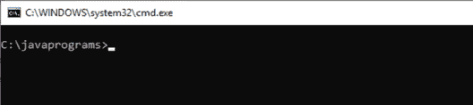
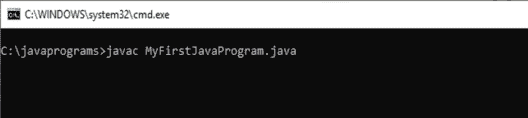
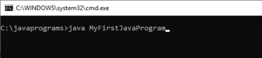
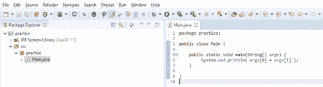

# 如何在 Java 中实现命令行参数

> 原文：<https://www.edureka.co/blog/command-line-arguments-in-java/>

****Java 中的命令行参数** 是****参数** 在运行时传递给程序。它们以字符串格式存储，字符串数组被传递给 main()方法的 **args[]参数**。我们将通过下面的摘要了解更多。

*   [第一个 Java 程序](#first)
*   [命令行参数](#line)
*   [命令行](#ide)[IDE 中的参数](#ide)

## **第一个 Java 程序**

你想用 Java 开发一个程序在屏幕上打印出**“你好，世界”**。你会考虑什么步骤？

*   在你的机器上安装[](https://www.oracle.com/technetwork/java/javase/downloads/index.html)。
*   将**路径**和**类路径**设置到您机器中可用的环境变量中。
*   打开编辑器(Windows 下为记事本),输入以下程序。

```
class MyFirstJavaProgram { 
       public static void main(String[] args) {
              System.out.println(“Hello World”);
       }
}
```

*   现在你把这个程序保存在一个特定的位置，比如说 **C:/javaprograms/**
*   你打开一个命令提示符**(在 Windows 的情况下是 cmd** )导航到上面的位置。



*   在 CMD 提示符下使用 **javac** 工具编译**MyFirstJavaProgram.java**



*   现在你想运行你的第一个应用程序，所以写 Java**MyFirstJavaProgram**



*   当你按下**回车**键，你将可以看到**你好世界**。

## **命令行参数**

启动应用程序的 java 命令的**语法**为

```
Java [options] main class [args]
```

这里的 *选项* 是命令行选项，如 **-ea、**等。*main class*是包含 main 方法的类的名称。具体来说，就是您要启动的类。

最后**【args】**是传递给 main 方法的参数。在我们的程序中，我们将字符串数组指定为参数。因此，可以使用空格传递多个参数。

默认情况下，Java 应用程序可以接受任意数量的参数，包括不接受来自命令行的参数。这可用于在启动**应用程序**时指定配置信息。这意味着假设我们在运行应用程序之前不知道配置的细节。

这些细节可以在您的应用程序中重用，因此不需要硬编码。 但是，配置信息可以在字符串或文件中给出。这会影响我的**应用程序性能吗？**

答案是，**不**。这在任何情况下都不会影响应用程序的整体性能。因为我们只是在应用程序启动时才一次读取配置文件。这样，您就不必一次又一次地重新编译代码。

比方说，我们有一个 **config.properties** 文件，它包含了**键值**格式的所有配置属性。但是作为一个初级开发人员，我们甚至不知道在我们发布应用程序后，这个文件保存在客户端的什么地方。

我们可以说客户端必须通过**命令行指定路径作为应用程序的参数。**

```
java MyClass “c://path/to/config.properties”
```

当 MyClass 启动时，运行时系统通过一个字符串数组将命令行参数传递给应用程序的 main 方法，这里是一个完整的路径。

考虑一下，一个演示用户从命令行输入内容的简单程序将被打印出来。

```
public class MyClass {
      public static void main(String[] args){
            for(String s : args) {
                  System.out.println(s);
            }
      }
}
```

要运行这个程序，用户可以输入如下内容。

**Java my class***我已经创建了我的第一个程序。*“*这是牛逼的*”

**//输出:**

`I have created my first program.`

这是要注意，每个用引号括起来并用空格隔开的字符串都被认为是一个新的参数。由于 **println，每个参数都放在新行上。**

如果我想让 Number 作为命令行参数传递呢？

为了能够读取数字，我们必须解析**数字命令行参数**。这是因为 java 只接受一个字符串数组作为其 main 方法的参数。因此，我们必须将表示数字(如“10”)的字符串参数转换为其数值。

让我们通过构造一个程序来举个例子。

```
class SquareCalculator{
     public static void main(String[] args){
          int firstArg;
          if(args.length > 0){
                try{
                       firstArg = Integer.parseInt(args[0]);
                } 
                catch(NumberFormatException nfe) {
                       System.out.println(“Arguments” + args[0] + “ must be an integer.”);
                       System.exit(1);
                }
                System.out.println(“Square  is ” + firstArg * firstArg);
          }
     }
}
```

为了运行这个应用程序，我们使用下面的代码行

**Java square calculator**10

**//输出:**

`Square is 100`

## **IDE 中的命令行参数**

美依赖于 Integer 类中的 parse Int 方法。每一个数字类，比如 Integer、Float、Double 等等，都有 **parseXXX** 方法将 String 转换成它们各自类型的对象。

众所周知，数组的索引从零开始。因此 **args[0]** 是这个从控制台获取的 **String[]** 数组中的第一个索引。同样， **args[1]** 是第二个， **args[2]** 是第三个元素，以此类推。

当应用程序启动时，**运行时**系统通过字符串数组将命令行参数传递给应用程序的 main 方法。

我们如何使用 **eclipse IDE 传递命令行参数？**



*   在这里创建一个类，我将我的类命名为**Main**
*   现在右键点击**运行配置**
*   选择**参数**选项卡，在**程序参数**选项卡下输入**值**
*   输入我写的任何值 **Hello World** 来分隔我使用的两个参数**空白。**
*   点击**应用**，然后点击**运行**
*   你的输出将是

**//输出:**

`Hello World`

这里需要记住的是，空格是用来分隔两个参数的，而不是用来表示的。

这是命令行参数的基本用法，对于 CLA 的更高级用法，我们可以在热点虚拟机的诊断管理中使用它。还可以使用虚拟机选项为虚拟机提供命令行参数，以便在您希望从服务器连接调用任何 bean 时进行热点诊断。这是值得思考的问题！

至此，我们结束了这篇“Java 命令行参数”的文章。我希望您已经通过一些实时示例理解了 Java 中的命令行参数及其实现。

通过这篇文章，您已经理解了**命令行参数**的基础知识，请查看 Edureka 的 [**Java 培训**](https://www.edureka.co/java-j2ee-training-course) *，edu reka 是一家值得信赖的在线学习公司，拥有遍布全球的 250，000 多名满意的学习者。Edureka 的 Java J2EE 和 SOA 培训和认证课程是为想成为 Java 开发人员的学生和专业人士设计的。该课程旨在让您在 Java 编程方面有一个良好的开端，并训练您掌握核心和高级 Java 概念以及各种 Java 框架，如 Hibernate&[Spring](https://spring.io/projects/spring-framework)。*

有问题要问我们吗？在这篇“Java 命令行参数”文章的评论部分提到它，我们会尽快回复您。