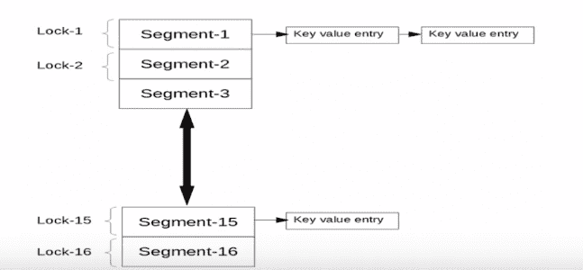

# 如何在 Java 中最好地实现并发哈希映射？

> 原文：<https://www.edureka.co/blog/concurrent-hash-map-in-java/>

本文将向您介绍一个在 [Java](https://www.edureka.co/blog/java-tutorial/) 中称为并发散列映射的概念，并通过一个实际的演示来跟进。本文将涉及以下几点:

*   【ConcurrentHashMap 内部是如何工作的？
*   [为什么是其他地图？](#WhyotherMap?)
*   如何与众不同？
*   【ConcurrentHashMap 和 HashMap 的区别
*   [陷阱](#Pitfalls)

继续这篇关于 Java 并发散列映射的文章

【ConcurrentHashMap 内部是如何工作的？

从 Java 5 开始，ConcurrentHashMap 被引入作为哈希表的替代。我们也可以使用名为 Synchronized map()的实用程序类方法来获得同步映射，但是这种方法有一个缺点，即性能非常差，因为一次只有一个线程可以访问它。所以 ConcurrentHashMap 解决了这些问题。

继续这篇关于 Java 并发散列映射的文章

## **为什么是其他地图？**

尽管我们已经有了 HashMap，HashTable，但还需要 ConcurrentHashMap，因为它提供了更好的性能，同时又是线程安全的。

继续这篇关于 Java 并发散列映射的文章

## 如何与众不同？

它也是基于散列的，但是它的性能通过它的锁定策略得到了提高。与 HashTable 或 Synchronized HashMap 不同，它不会在每个方法上应用相同的锁，而是为每个方法使用单独的锁，为此它使用可重入锁。与 HashMap 类似，ConcurrentHashMap 有 16 个桶，即段，为了创建超过 16 个桶的 ConcurrentHashMap，它有不同的构造函数。

在详细讨论之前，让我们回顾以下几个概念:

ConcurrentHashMap:这个映射允许并发线程访问。在添加或更新映射时，只有称为段的映射部分(即底层数据结构)被锁定。它允许并发线程访问来读取数据而不锁定。它的引入是为了提高性能。

*   并发级别:这是一个估计并发更新线程数量的数字。
*   Load-Factor:它是一个用于控制调整大小因子的值。
*   初始容量:这是一个属性，它创建一个具有给定大小的地图。

让我们看看下图，并尝试理解 ConcurrentHashMap 是如何工作的。



所以在上面的图中，我们有 16 个锁，它们只锁定所需的映射的一部分，以便其他方法可以被不同的线程访问，从而提高性能。

与 HashMap 类似，ConcurrentHashMap 以类似的方式工作，默认情况下它包含 16 个段，并通过散列来存储元素，因此如果元素具有相同的散列，它们将存储在相同的段上，如上图所示，借助于链表。

继续这篇关于 Java 并发散列映射的文章

## 【ConcurrentHashMap 和 HashMap 的区别

HashMap 属于集合，而 ConcurrentHashMap 属于并发集合，然而它们之间还有许多其他的区别。

*   ConcurrentHashMap 是线程安全的，即是同步的，但是 HashMap 是非同步的。
*   ConcurrentHashMap 的性能较低，因为它是同步的，因为有时线程必须等待，但 HashMap 的性能较高，因为它是非同步的，任何线程都可以同时访问它。
*   如果两个线程同时试图修改或添加对象的内容，我们将得到 ConcurrentModificationException。然而，在 ConcurrentHashMap 的情况下，我们在执行相同的操作时不会得到任何异常。

*   HashMap 中的键和值允许为空值，但是，ConcurrentHashMap 不允许键和值为空值，它试图添加空值，我们将得到异常，即 NullPointerException。

*   HashMap 是在 JDK 1.2 中引入的，而 ConcurrentHashMap 是在 JDK 1.5 中引入的。

正如我们前面看到的，为了获得更好的性能，它由一个节点数组作为表桶组成，在 *Java 8* 之前是表段。

当执行第一次插入时，桶被延迟初始化。通过锁定存储桶的第一个节点，可以独立锁定每个存储桶，读取操作也不会阻塞。

与 *HashMap 相比，ConcurrentHashMap* 提供了额外的 *concurrencyLevel* 参数来控制预计使用的线程数量。

**构造函数:**

1.  **concurrent hashmap m = new concurrent hashmap()；**

    创建一个新的空映射，默认初始容量为 16，负载系数为 0.75，并发级别为 16。

2.  **concurrent hashmap m = new concurrent hashmap(int initial capacity)；** 创建一个新的空 map，指定初始容量，负载因子 0.75，并发级别 16。

3.  **concurrent hashmap m = new concurrent hashmap(int initial capacity，float load factor)；**

    创建一个新的空映射，具有指定的初始容量和负载因子，并发级别为 16。

4.  **concurrent hashmap m = new concurrent hashmap(int initial capacity，float loadFactor，int concurrency level)；** 使用指定的初始容量、负载系数和并发级别创建新的空映射。

5.  **concurrent hashmap m = new concurrent hashmap(Map m)；** 从提供的地图创建新的并发哈希表。

另外两个参数:initialCapacity 和 loadFactor 的工作方式与 HashMap 非常相似。ConcurrentMap 是多线程环境中键/值操作的内存一致性。

继续这篇关于 Java 并发散列映射的文章

## **陷阱**

而检索对象 ConcurrentHashMap 不会被阻塞，可能会与更新操作重叠，因此为了获得更好的性能，它们只检索最近完成的更新操作。

包括 size、isEmpty 和 containsValue 在内的聚合状态方法的结果通常只有在 map 没有在其他线程中进行并发更新时才有用。

如果并发更新得到适当控制，这些状态方法是可靠的。

虽然这些方法不能保证实时性。

默认的表容量是 16，但是我们可以使用并发级别来更改它。

```
public ConcurrentHashMap(int initialCapacity, float loadFactor, int concurrencyLevel) {
//...
if (initialCapacity < concurrencyLevel) {
initialCapacity = concurrencyLevel;
}
//...
}

```

如果 keys 键需要排序，我们可以使用 ConcurrentSkipListMap。

现在，在执行了上面的程序之后，您应该已经理解了 Java 中的并发哈希表。因此，这篇文章到此结束，如果你想了解更多，请查看 Edureka 提供的 [Java 培训，这是一家值得信赖的在线学习公司。Edureka 的 Java J2EE 和 SOA 培训和认证课程旨在培训您掌握核心和高级 Java 概念以及各种 Java 框架，如 Hibernate & Spring。](https://www.edureka.co/java-j2ee-training-course)

有问题吗？请在这篇文章的评论部分提到它，我们会尽快回复你。