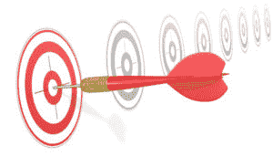
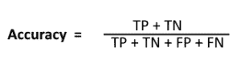
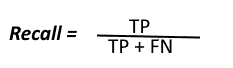
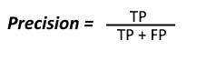
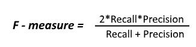
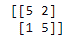
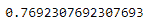
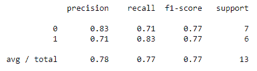

# 机器学习中的混淆矩阵:你的一站式解决方案

> 原文：<https://www.edureka.co/blog/confusion-matrix-machine-learning/>

在[监督机器学习](https://www.edureka.co/blog/introduction-to-supervised-learning/)中，我们通常有 2 种不同类型的用例，[回归](https://www.edureka.co/blog/linear-regression-in-python/)，和[分类](https://www.edureka.co/blog/classification-algorithms/)问题。混淆矩阵有助于计算分类模型的准确性，从而间接帮助我们描述分类模型的性能。这是评估模型时最重要的一步。在本文中，我将涉及以下主题:

[1。什么是混淆矩阵？](#confusion-matrix)

[2。混淆矩阵的准确性和组成](#components)

[3。精度、召回和 F-Measure](#f-measure)

[4。使用 Python 和 Sklearn 创建混淆矩阵](#demo)

## **什么是混淆矩阵？**

A Confusion matrix is the comparison summary of the predicted results and the actual results in any classification problem use case. The comparison summary is extremely necessary to determine the performance of the model after it is trained with some training data.For a binary classification use case, a Confusion Matrix is a 2×2 matrix which is as shown below

|  | **预测类 1 值** **例 1** | **预测类 2 值** **EG:0** |
| **Actual Class 1 Value ****例:1** | **TP(真阳性)** | **FN(假阴性)** |
| **Actual Class 2 Value ****EG: 0** | **FP(假阳性)** | **TN(真阴性)** |

从上图:我们有，

*   实际类别 1 值= 1，类似于二进制结果中的正值。
*   实际类别 2 值= 0，类似于二进制结果中的负值。

混淆矩阵的左侧指数基本上表示实际值，顶部一栏表示预测值。

当我们创建一个混淆矩阵时，有各种各样的组件存在。组件如下所述

**阳性(P):** 预测结果为阳性(例如:图像为猫)

**阴性(N):** 预测结果为阴性(例如:图像不是猫)

**真正(TP):** 这里 TP 基本上表示预测值和实际值为 1(真)

**真负值(TN):** 此处 TN 表示预测值，实际值为 0(假)

**假阴性(FN):** 此处 FN 表示预测值为 0(负)，实际值为 1。这里两个值不匹配。因此它是假阴性的。

**假阳性(FP):** 这里 FP 表示预测值为 1(阳性)，实际值为 0。这里两个值再次不匹配。因此它是假阳性的。

## **混淆矩阵的准确度和分量**

After the confusion matrix is created and we determine all the components values, it becomes quite easy for us to calculate the accuracy. So, let us have a look at the components to understand this better.

*   **分类精度**



从上面的公式可以看出，TP(真阳性)和 TN(真阴性)之和是正确的预测结果。因此，为了计算百分比精度，我们除以所有其他成分。然而，在准确性方面存在一些问题，我们不能完全依赖它。

让我们考虑我们的数据集是完全不平衡的。在这种情况下，98%的准确率可以根据问题陈述的好坏而定。因此，我们有更多的关键术语，这将帮助我们确定我们计算的准确性。条款如下所示:

*   **TPR(真阳性率)或灵敏度:**

真阳性率也称为敏感度，衡量真阳性相对于总实际阳性的百分比，用(TP+ FN)表示

|  | **预测类 1 值** **例 1** | **预测类 2 值** **EG:0** | **总计** |
| Actual Class 1 Value例:1 | ***【TP】*** | ***【FN】*** | ***实际阳性总数*** |
| Actual Class 2 Value例:0 | 假阳性 | TN(真阴性) | 实际负数合计 |

**TPR= True Positive/ (True Positive + False Negative**

*   **TNR(真阴性率)或特异性:**

真阴性率或特异性测量实际阴性相对于总阴性的比例

|  | **预测类 1 值** **例 1** | **预测类 2 值** **EG:0** | **总计** |
| Actual Class 1 Value例:1 | TP(真阳性) | 假阴性 | 实际阳性总数 |
| Actual Class 2 Value例:0 | ***【FP】*** | ***【真阴性】*** | ***实际底片总数*** |

**TNR=真阴性/(真阴性+假阳性)**

*   **假阳性率(FPR):**

假阳性率是预测假阳性(FP)占预测阳性结果总数(TP + FP)的百分比。

|  | **预测类 1 值** **例 1** | **预测类 2 值** **EG:0** |
| 第一类实际值例如:1 | ***TP*** | FN(假阴性) |
| 实际二级值例如:0 | ***【FP】*** | TN(真阴性) |
|  | 合计预测正 | 总预测负值之和 |

**FPR= False Positive/ (True Positive + False Positive)**

*   **假阴性率(FNR):**

假阴性率是预测假阴性(FP)占预测阴性结果总数(TN + FN)的百分比。

|  | **预测类 1 值** **例 1** | **预测类 2 值** **EG:0** |
| 第一类实际值例如:1 | TP(真阳性) | ***【假阴性】*** |
| 实际二级值例如:0 | FP(假阳性) | ***【TN】*** |
|  | 预测阳性总数之和 | ***总预测负之和*** |

**FNR= False Negative/ (False Negative + True Negative)**

## 精确度、召回率和 F 值

*   **回忆:**

召回率类似于真阳性率，它是正确预测的阳性值总数(TP)与所有阳性值的比率。



*   **精度:**

精度基本上指示了模型预测为正的所有点以及它们中实际上为正的百分比。



精确度和召回率是度量结果，其集中在正面的类上，如上面的公式所示。

*   **F-Measure**

因此，F-Measure 是一种结合了精度和召回技术的技术，它使用调和平均值来代替通常的算术平均值，因此极值会受到惩罚。F-measure 也称为 F1- score，由以下公式给出。



让我们考虑一个例子，看看我们如何计算准确度、精确度、召回率和 F1 分数。

| **N = 165** | **预测是** | **预测不到** |
| **实际是** | **TP = 150** | **联合国= 10** |
| **实际编号** | **FP = 20** | **TN = 100** |

*   **F-measure =(2 *召回率*精确度)/(召回率+精确度)**=(2 * 0.93 * 0.88)/(0.93+0.88)=**0.90**

## **使用 Python 和 Sklearn 创建混淆矩阵**

现在我们将看到一个例子，展示如何使用 python 和 sklearn 库创建混淆矩阵。

**1。**最初，我们将创建一些实际数据和预测数据的列表，以检查如下所示的准确性

```

# Python script for confusion matrix creation.

actual_data = [1, 1, 0, 1, 0, 0, 1, 0, 0, 0,1,0,1]
predicted_data = [0, 1, 1, 1, 0, 0, 1, 0, 1, 0,1,0,1]

```

**2。**我们需要从 sklearn 库中导入混淆矩阵，如下所示:

```

from sklearn.metrics import confusion_matrix

```

**3。**接下来，我们将创建混淆矩阵，如下所示:

```

final_results = confusion_matrix(actual_data, predicted_data)

```

**4。**现在我们可以通过导入库来计算精度，如下所示:

```

from sklearn.metrics import accuracy_score
accuracy=accuracy_score(actual_data,predicted_data)

```

**5。**最后，我们计算 F1 值或 F 值，如下所示:

```

from sklearn.metrics import classification_report
report=classification_report(actual_data,predicted_data)

```

下面是完整的代码:

```

actual_data = [1, 1, 0, 1, 0, 0, 1, 0, 0, 0,1,0,1]
predicted_data = [0, 1, 1, 1, 0, 0, 1, 0, 1, 0,1,0,1]

from sklearn.metrics import confusion_matrix

final_results = confusion_matrix(actual_data, predicted_data)

print(final_results)

from sklearn.metrics import accuracy_score
accuracy=accuracy_score(actual_data,predicted_data)

from sklearn.metrics import classification_report
report=classification_report(actual_data,predicted_data)

print(accuracy)

print(report)

```







所以，就这样，我们来结束这篇文章。我希望你所有关于混淆矩阵的困惑现在都解决了。

*Edureka’s [**Machine Learning with Python**](https://www.edureka.co/machine-learning-certification-training) certification training helps you gain expertise in various machine learning algorithms such as regression, clustering, decision trees, random forest, Naïve Bayes and Q-Learning. This Machine Learning using Python Training exposes you to concepts of Statistics, Time Series and different classes of machine learning algorithms like supervised, unsupervised and reinforcement algorithms. Throughout the Data Science Certification Course, you’ll be solving real-life case studies on Media, Healthcare, Social Media, Aviation, HR.*