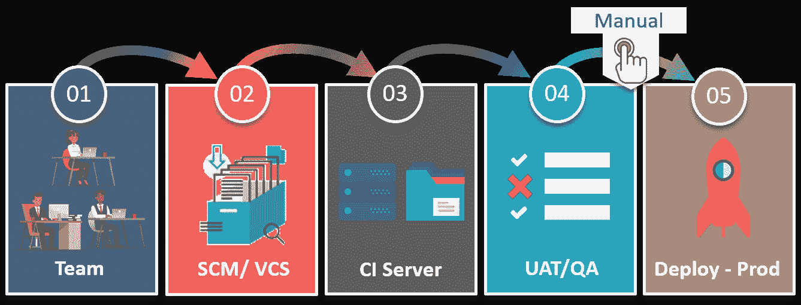
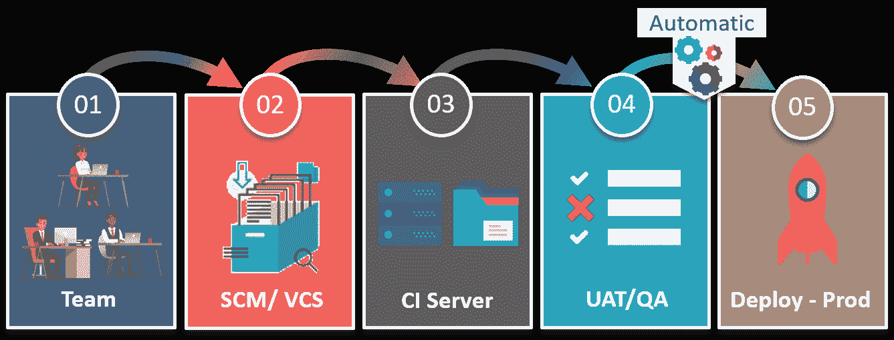
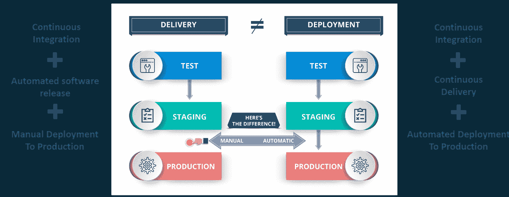

# 持续交付与持续部署

> 原文：<https://www.edureka.co/blog/continuous-delivery-vs-continuous-deployment/>

持续性是 DevOps 生命周期的核心，人们经常混淆术语持续交付和持续部署。在这篇关于持续交付与持续部署的博客中，我将比较这两个在业界高度冲突的术语。

因此，在我深入区分这些术语之前，让我先简要介绍一下 DevOps。

## **什么是 DevOps？**

***[devo PS](https://www.edureka.co/blog/what-is-devops/)***基本上是一种软件开发策略，它在公司的开发方和运营方之间架起了一座桥梁。简而言之，你可以说 DevOps 是，开发者如何获得一个新的特性，一个增强的请求，或者一个生产的改变，这样，当客户给出反馈时，开发者可以基于那个反馈进行改进。

**但是，开发者可以努力的因素有哪些呢？**

嗯，开发人员可以主要关注 3 个重要因素:

*   交付的软件。
*   软件交付环境的效率和性能。
*   以更低的成本使软件交付过程更高效、更强大、更快捷。

因此，当你交付软件时，它不仅仅是交付给产品，而是包含了整个软件交付生命周期。

**图 1:** DevOps 方法——持续交付与持续部署

如图所示，开发人员构建软件并将其存储在软件配置管理或版本控制系统中。之后，QA 环境保证质量，并执行系统集成测试、用户验收测试。最后，当软件通过所有这些阶段时，它就进入了产品阶段，在那里软件实际运行，客户与之交互。

现在，开发人员工作的环境可能与客户工作的环境相同，但配置可能不同。因此，为了匹配这些配置，需要自动化部署。

自动化部署是在任何给定时间将软件部署到任何环境中的能力，而连续交付是在任何给定时间将软件部署到任何特定环境中的能力。

现在，你可能听说过大型网络公司每天都在部署变更，一直到他们的 prod 服务器。

他们是如何如此频繁地部署这么多次的？

基本上，开发人员所做的任何更改都会被部署到生产环境中，这就是所谓的持续部署。

Want to explore more about DevOps? [<button>Learn Now</button>](https://www.edureka.co/devops)

## **持续交付 vs 持续部署**

现在，您已经对这两个术语有了基本的了解，让我来为您定义一下持续交付和持续部署。

### **连续交货**

连续交付是一种软件开发实践，在这种实践中，你以一种软件可以在任何时候发布到产品中的方式来构建软件。

通过持续集成开发团队构建的产品，对这些构建的产品运行自动化测试以检测问题，然后将这些文件推送到类似生产的环境中以确保软件在生产中工作，从而实现持续交付。

**图 2:** 连续交付——连续交付 vs 连续部署

持续交付的好处在于代码随时可以部署。因此，正如您在这里看到的，质量保证团队测试每项功能是否有效，然后根据业务需求手动将其部署到生产中，以提高产品的质量和速度。因此，每一项更改都不会部署到生产中。

现在，让我告诉你持续部署和持续交付有什么不同。

### **连续部署**

持续部署意味着你所做的每一个改变都要经过管道，如果通过了所有的测试，它就会自动部署到生产中。因此，使用这种方法，软件发布的质量完全取决于测试套件的质量，因为一切都是自动化的。

**图 3:** 连续部署——连续交付 vs 连续部署

例如，如果你有一个功能来检查测试套件中的各种条件，那么在连续交付中，可以执行一个手动测试来检查功能的质量。因此，如果有人发现该特定功能中可能包含更多案例，那么它就不会被部署到生产中。

但是，在连续部署的情况下，不需要批准，因此该功能将自动部署到生产服务器上。

因此，如果我们必须用一行来总结，那么，在使用持续部署的开发运维世界中，不需要发布批准。因此，代码自动地从开发人员站点转移到生产站点，这与连续交付的情况不同。

我们总是建议不要使用持续部署，因为我们需要在发布软件之前考虑许多因素，就像在产品上市之前营销产品一样，但是我们必须进行持续交付，以便我们有能力在任何给定的时间向任何给定的环境交付软件。

## **持续交付 vs 持续部署|爱德华卡**

[//www.youtube.com/embed/93raARQl8PE?rel=0&showinfo=0](//www.youtube.com/embed/93raARQl8PE?rel=0&showinfo=0)

*本视频将解释持续交付与持续部署的区别。*

你有没有想过，有没有连续发货的连续部署的情况？

## **连续交付与连续部署**

嗯，在很多情况下你会同时使用这两个词。让我给你看一个例子:

考虑这样一种情况，客户发现了软件中的一个错误，并向开发团队发送了一个反馈。

开发团队必须尽快重现那个错误，然后修复它。因此，在这种紧急情况下，如果团队使用连续交付，那么他们就有能力提供与客户配置相同的环境，将正确版本的软件部署到该环境中，并使用自动化测试来帮助进行每一次更改。由于最后的步骤是完全自动化的，连续部署可以快速解决问题。

**图 4:** 连续交付的区别&连续部署——连续交付与连续部署

因此，通过不跳过任何步骤，而是确保快速测试和实现修复，并交付尽可能高的质量，使持续交付和持续部署齐头并进。

所以，希望这能让你明白，持续交付是你必须具备的一项能力，而持续部署是你可以根据所交付产品的种类来选择的一个选项。

Become a DevOps Expert Now [<button>View Batches Now</button>](https://www.edureka.co/devops)

*有问题吗？请在评论区提到它，我们会给你回复。*