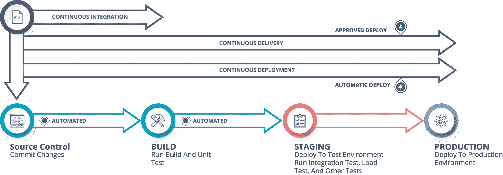
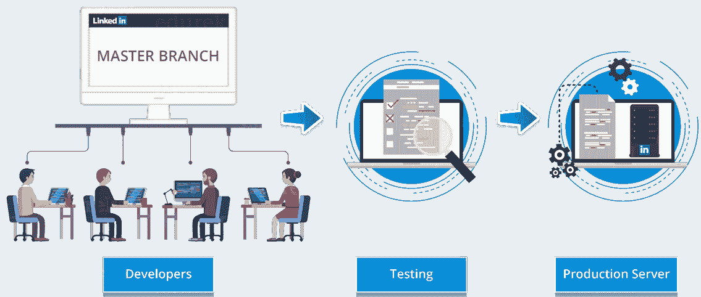
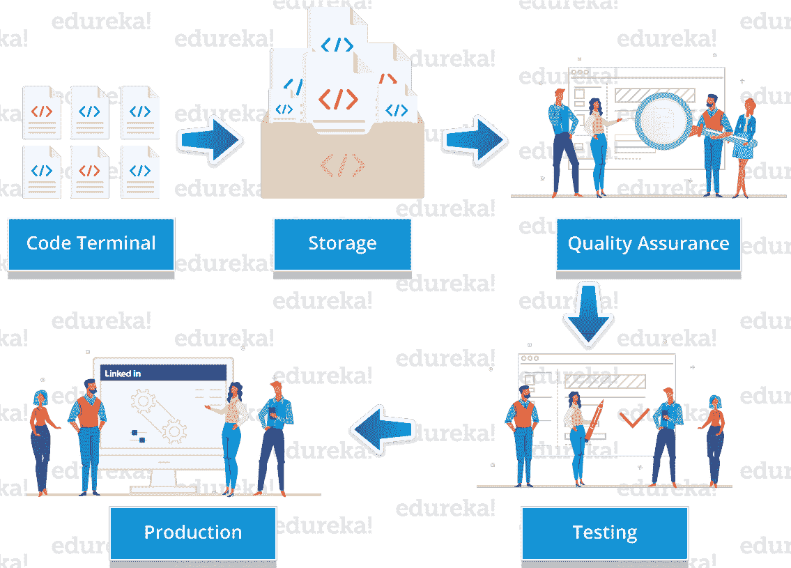

# 持续部署–包含示例的全面指南

> 原文：<https://www.edureka.co/blog/continuous-deployment/>

发布软件不是一门艺术，但它是一门工程学科。 持续部署可以被认为是对持续集成的扩展，这使得我们可以更早地捕捉到缺陷。

在这篇关于持续部署的博客中，您将了解以下主题:

*   [什么是持续部署？](#What%20is%20Continuous%20Deployment?)
*   [连续交付 v/s 连续部署](#Continuous%20Delivery%20v/s%20Continuous%20Deployment)
*   [持续部署案例](#Case%20Study%20of%20Continuous%20Deployment)
*   [持续部署的好处](#Benefits%20of%20Continuous%20Deployment)
*   [动手](#Hands%20-%20On)

因此，在我们深入研究持续部署之前，让我先向您简要介绍一下 DevOps！

## **什么是持续部署？**

这是一种在生产服务器上以自动化方式持续发布软件的方法。因此，一旦一个代码通过了 编译源代码、验证源代码、审查代码、执行单元测试&集成测试、持续打包应用、 的所有阶段，它就会被部署到测试服务器 上，以执行用户验收测试。一旦完成，软件将被部署到生产服务器上进行发布，这就是所谓的**持续部署。**

## **什么是持续部署|爱德华卡**

[//www.youtube.com/embed/Pv5hohD25ls?rel=0&showinfo=0](//www.youtube.com/embed/Pv5hohD25ls?rel=0&showinfo=0)

*这个关于“什么是持续部署”的 Edureka 视频将借助案例研究、使用案例和实践，向您解释您需要了解的所有持续部署概念。*

现在，经常有人混淆连续交付&和连续部署这两个术语。所以让我为你澄清困惑！

## **持续交付 vs 持续部署**

连续交付不涉及每次变更时的生产部署。您只需要确保代码始终处于可部署状态，这样您就可以随时轻松地部署它。

另一方面，**连续部署**要求每个变更都自动部署，无需人工干预。

因此，正如您在图表中看到的，一旦持续集成阶段完成，新构建的应用程序将自动部署到生产环境中，然后就是持续部署。另一方面，如果我们设法自动化所有的事情，但是决定需要一个人的批准来进行新版本的部署，那么我们就要考虑连续交付。这种差异非常微妙，但它有着巨大的影响，使每种技术适用于各种情况。

## **持续交付 vs 持续部署|爱德华卡**

[//www.youtube.com/embed/93raARQl8PE?rel=0&showinfo=0](//www.youtube.com/embed/93raARQl8PE?rel=0&showinfo=0)

这个关于持续交付和持续部署的 Edureka 视频将向您解释这两个术语在 DevOps 世界中的主要区别。

Want to explore more about DevOps Stages? [<button>Learn Now</button>](https://www.edureka.co/devops)

现在，您已经了解了持续部署，让我们来看一个关于持续部署的案例研究。

## **Linkedln 案例分析**

领英是一项以就业为导向的服务，主要用于职业社交。在实施连续部署之前，领英以前的系统更传统。

这个系统包括从一个主干上以平行方式发展出来的各种分支。因此，开发人员会针对各种功能编写大量代码，然后等待这个功能分支合并到主干中，即主分支。

一旦该特性被合并到主分支中，它必须再次被测试，以确保它不会在相同的实例中破坏其他不同特性的代码。

由于这个系统包含了由不同团队独立编写的几批代码，并且一旦被编写就被合并到一个单独的分支中，这个系统被称为特性分支系统。这种系统限制了功能的范围和数量，从而减缓了公司的开发生命周期。

鉴于上述情况，Linkedln 决定从传统的基于特性的开发生命周期转向新的持续部署。

这需要移植旧代码，并构建自动化工具来使新系统工作，因此 Linkedln 的开发暂停了几个月。

使用持续部署后，LinkedIn 的框架包括开发人员以整洁、不同的块编写代码，并将每个块签入所有 LinkedIn 开发人员共享的主干。然后，新添加的代码将接受一系列自动化测试，以消除错误。

一旦代码通过测试，它就会被合并到主干中，并在一个系统中列出，向经理们展示哪些功能可以在网站上或 LinkedIn 应用的新版本中上线。

这就是 Linkedln 的成功故事！

现在，让我通过告诉您持续部署的基本好处来继续我们的讨论。

## **持续部署的好处**

持续部署提供的优势如下:

*   **速度**–开发不会因为发布而暂停，所以开发速度非常快。
*   **安全**–发布的风险较低，因为在发布之前会执行测试，并且所有的错误都已解决。
*   **持续改进**–持续部署支持对客户可见的持续改进。

#### 订阅我们的 youtube 频道获取新的更新..！