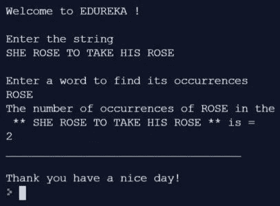

# 如何最好地利用 Python 中的 Count 函数？

> 原文：<https://www.edureka.co/blog/count-function-in-python/>

这篇文章将告诉你如何最好地利用 Python 中的 Count 函数，并通过一个详细的编程演示来跟进。下面的指针将在这篇文章中讨论。

*   [Python 中的计数函数](#CountFunctionInPython)
*   [计数功能的示例程序](#SampleProgramForCountFunction)
*   [使用可选参数的计数功能](#CountFunctionUsingOptionalParameters)

让我们开始吧，

## **Python 中的计数函数**

你有没有想过如何找到一个特定单词在一个段落或一个句子中出现的次数？如果你的答案是肯定的。那你就不用再找了。下面是如何使用 python 编程语言中流行的“Count”函数的综合说明。Count 是一个内置函数，它帮助用户确定主字符串中某个子字符串的迭代次数。它可能有两种类型。第一种类型没有开始和结束参数，第二种类型有参数。

继续这篇关于 Python 中计数函数的文章，

**计数功能的示例程序**

让我们看一个例子来获得更好的视角。下面的代码接受用户的两个输入。一个是主字符串，另一个是要计数的子字符串。输出是“上升”发生的次数。

```
print(“nWelcome to EDUREKA !n”)
string1=input(“Enter the stringn”)
find=input(“nEnter a word to find its occurrencesn”)
print (“The number of occurrences of”, find, “in the sentence  **”, string1, “** is =”)
print(string1.counts(find))
print(“____________________________”)
print(“Thank you have a nice day!”
```

**输出**

 继续这篇关于 Python 中 Count 函数的文章，

**计数功能使用可选参数**

可选参数包括提供主字符串的长度，在该长度内搜索事件。例如，当我们提供指数或从 0 到 10 的范围时。对主字符串的搜索只发生在前 11 个字符上。因此,“玫瑰”这个词在这段时间里只出现过一次。万一，主弦的长度增加到能盖住第二朵“玫瑰”。相应的输出是 2。

```
print(“nWelcome to EDUREKA !n”)
string1=input (“Enter the stringn”)
find= input(“nEnter a word to find its occurrencesn ”)
print(“The number of occurrences of”, find, “in the sentence  **”, string1, “** is =”)
print(string1.count(find,0,10))
print (“_______________________”)
print (“n Thank You have a nice day!”)
```

**输出**

这就把我们带到了这篇关于 Python 中 Count 函数的文章的结尾。

*要深入了解 Python 及其各种应用，您可以 [**在此**](https://www.edureka.co/python/) 注册参加在线直播培训，全天候支持，终身访问。*

*有问题吗？在文章的评论部分提到它们，我们会给你回复。*