# 利用机器学习预测新冠肺炎疫情病毒的爆发

> 原文：<https://www.edureka.co/blog/covid-19-outbreak-prediction-using-machine-learning/>

第一天，没有一个你认识的人生病。感觉就是平常的一天。但是有一天，你认识的几个人生病了，突然，你看到每个人都生病了，感觉就像是突然发生的一样。一切看起来都很好，直到它不是。这就是流行病的悖论。在本文中，我们将使用[机器学习](https://www.edureka.co/blog/machine-learning-algorithms/) 来分析 ***新冠肺炎的爆发。***

以下是您今天将要学习的所有内容的大纲:

*   什么是新冠肺炎？
*   疫情是如何工作的？
*   [案例研究:利用机器学习分析新冠肺炎疫情](#covid19machinelearning)
    *   [问题陈述](#problemstatement)
    *   [第一部分:分析印度的现状](#analysingindia)
    *   [第二部分:这种趋势是否类似于义大利、武汉&南韩？](#globaltrends)
    *   第 3 部分:探索全球数据？
    *   [第 4 部分:预测全球病例总数](#forecast)
*   [结论](#conclusion)

## 什么是新冠肺炎？

***问题***

冠状病毒病(新冠肺炎)是一种由新发现的病毒引起的传染病，于 2019 年 12 月在中国武汉出现。

大多数感染新冠肺炎病毒的人会经历轻度至中度的呼吸道疾病，无需特殊治疗即可康复。老年人和患有心血管疾病、糖尿病、慢性呼吸系统疾病和癌症等潜在疾病的人更有可能患上严重疾病。

新冠肺炎病毒主要通过感染者咳嗽或打喷嚏时的唾液或鼻涕传播，所以你可能听说过要注意呼吸礼仪(例如，咳嗽时弯曲肘部)。

## 疫情是如何工作的？

为了更好地理解这一点，让我们来看一个小谜语。

显微镜下有一个载玻片，它包含一种特殊的细菌。这种细菌具有每天翻倍的特性。所以第一天有一个，第二天有两个，第三天有四个，第四天有八个，以此类推。

第 60 天，滑梯已满。那么哪一天滑梯是半满的呢？

第 59 天。但是当然，你知道的。

但是哪一天，滑梯是 1%满的？

出人意料的是， ***直到第五十四天** **！***

这意味着载玻片在不到一周的时间内从 1%充满到 100%，并因此显示出称为 ***指数增长*** 的属性。这也是疫情的工作原理。爆发在开始时是相当不明显的，然后，一旦它达到一个显著值，增长到最大值是极其迅速的。

但是这不可能永远持续下去。这种病毒最终会停止寻找被感染的人，并且最终会减慢感染人数。这被称为 ***逻辑增长*** ，而这条曲线被称为***s 形。***

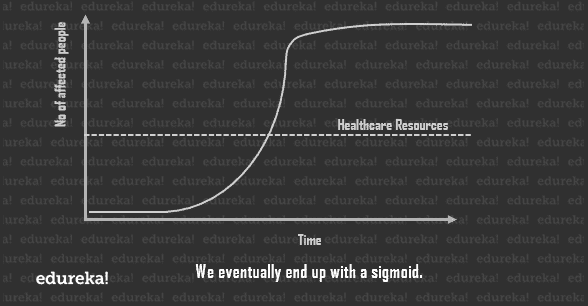现在，曲线上的每一点都将为您提供当天的运行案例总数。但是如果你稍微钻研一下 [* **统计** *](https://www.edureka.co/blog/mathematics-for-machine-learning/) ，你会发现通过绘制每天的斜率，你会得到每天的新案例。在开始和结束时，新病例较少，在中间阶段急剧上升。如您所见，曲线的峰值可能会让我们的医疗保健系统不堪重负，这是指在任何给定的时间点，我们可用于护理受影响个体的资源量。

由于我们无法真正帮助受疫情影响的总人数，最好的解决方案是 ***使曲线*** 变平，以便在任何给定的时间点降低病例总数，尽可能接近医疗保健线。

这将整个过程的持续时间延长了一点，但由于医疗系统可以在任何给定的时间点处理大量的病例，伤亡人数会大大减少。

***解***

社交距离。这里的逻辑是，如果病毒找不到可以感染的身体，它就不能感染身体！

所有受影响国家的世界领导人宣布隔离和封锁，以确保他们的家人安全，远离可能感染他们的任何东西或任何人，所有大型社会活动都被推迟，所有主要的体育联盟也被取消。

3 月 24 日，印度总理宣布，该国将实行封锁，以防止病毒传播，直到另行通知。在意大利、法国、德国、西班牙、英国和美国，感染率正在迅速上升。它对全球经济和股票市场产生了巨大影响

新冠肺炎的爆发正在发展成为一场重大的国际危机，并开始影响日常生活的重要方面。

例如:

*   **旅行:**完全封锁在民航部做出决定之前，印度不允许任何国内或国际航班。
*   杂货店:在受灾严重的地区，人们开始囤积必需品，导致必需品短缺。

你也可以看看下面关于“使用机器学习的 COVID 19 爆发预测”的教程，以更全面的方式了解这个主题。

*查看这些[人工智能在线课程](https://www.edureka.co/executive-programs/machine-learning-and-ai)由 E & ICT 学院 NIT Warangal 学习并建立人工智能职业生涯。*

## **COVID–19 利用机器学习进行疫情预测| Edureka**


[//www.youtube.com/embed/_Hi6_JQesSQ?rel=0&showinfo=0](//www.youtube.com/embed/_Hi6_JQesSQ?rel=0&showinfo=0)

*本次 Edureka 会议探讨和分析了以其快速增长席卷全球的新型冠状病毒疫情的传播和影响。*

## **案例研究:使用机器学习分析 COVID 19 的爆发**

## **问题陈述**

我们需要一个强大的模型来预测病毒如何在不同的国家和地区传播。此任务的目标是建立一个模型，预测未来 7 天内病毒的传播。

**🔴** ***注:** **该模型建立在一个[测试数据集](https://bit.ly/2yhHrCm)上，更新到 2010 年 4 月。但你可以在“约翰·霍普斯金大学冠状病毒资源中心”访问这些数据集的来源，该中心每天都会更新，所以你可以在你喜欢的日期运行这个模型。***

### 要执行的任务:

1.  印度现状分析
2.  这种趋势和意大利/韩国/武汉类似吗
3.  探索世界范围的数据
4.  利用 Prophet 预测全球新冠肺炎病例

在我们开始建模之前，让我们先导入我们需要的 ***[库](https://www.edureka.co/blog/python-libraries-for-data-science-and-machine-learning/)*** 。如果可以的话，把这看作是第 0 步。

```
# importing the required libraries
import pandas as pd
# Visualisation libraries
import matplotlib.pyplot as plt
%matplotlib inline
import seaborn as sns
import plotly.express as px
import plotly.graph_objects as go
import folium
from folium import plugins
# Manipulating the default plot size
plt.rcParams['figure.figsize'] = 10, 12
# Disable warnings
import warnings
warnings.filterwarnings('ignore')
```

In here we import a few important libraries that we shall use throughout the model. [***Pandas***](https://www.edureka.co/blog/python-pandas-tutorial/) is an extremely fast and flexible data analysis and manipulation tool and allows you to allow you to store and manipulate tabular data. We also import visualisation libraries such as [***matplotlib***](https://www.edureka.co/blog/python-matplotlib-tutorial/), [***seaborn***](https://www.edureka.co/blog/python-seaborn-tutorial/) and ***plotly***.And finally, we determine the default plot size and disable warnings in our module.

### **第一部分:分析印度的现状**

那么，它是如何在印度开始的呢？

第一例新冠肺炎病例于 2020 年 1 月 30 日报告，当时一名学生从中国武汉抵达印度喀拉拉邦。就在接下来的两天里，Kerela 又报告了两起病例。在将近一个月的时间里，印度没有报告新的病例，然而，在 2020 年 3 月 2 日，喀拉拉邦再次报告了五例新的冠状病毒病例，从那时起，这些病例一直在上升。

### **1.1 读取数据集**

首先，我们将通过使用 Pandas 创建一个数据框来读取数据集。

```
# Reading the datasets
df= pd.read_excel('/content/Covid cases in India.xlsx')
df_india = df.copy()
df
```

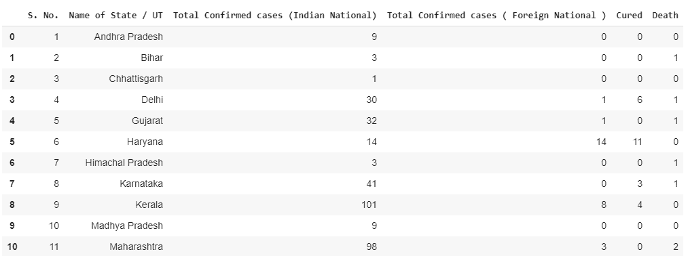

```
# Coordinates of India States and Union Territories
India_coord = pd.read_excel('/content/Indian Coordinates.xlsx')
#Day by day data of India, Korea, Italy and Wuhan
dbd_India = pd.read_excel('/content/per_day_cases.xlsx',parse_dates=True, sheet_name='India')
dbd_Italy = pd.read_excel('/content/per_day_cases.xlsx',parse_dates=True, sheet_name="Italy")
dbd_Korea = pd.read_excel('/content/per_day_cases.xlsx',parse_dates=True, sheet_name="Korea")
dbd_Wuhan = pd.read_excel('/content/per_day_cases.xlsx',parse_dates=True, sheet_name="Wuhan")
```

### **1.2 分析印度的 COVID19 病例**

So, here we’re going to play around with the data frame and create a new attribute called ‘Total Case’.This attribute is the total number of confirmed cases (Indian National + Foreign National)

```
df.drop(['S. No.'],axis=1,inplace=True)
df['Total cases'] = df['Total Confirmed cases (Indian National)'] + df['Total Confirmed cases ( Foreign National )']
total_cases = df['Total cases'].sum()
print('Total number of confirmed COVID 2019 cases across India till date (22nd March, 2020):', total_cases)
```

We are also going to highlight our data according to its geographical location in India.

```
df.style.background_gradient(cmap='Reds')
```

### **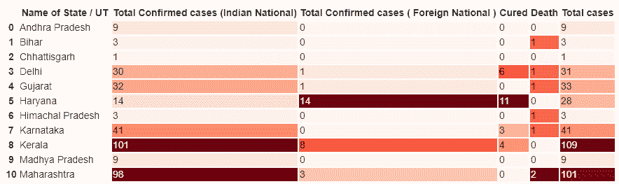**

您可能已经猜到，单元格越红，值越大。因此，颜色较深的单元格表示受影响的病例数量较多，颜色较浅的单元格则相反。

### **1.3 受影响邦/中央直辖区的活跃新冠肺炎病例数**

```
#Total Active  is the Total cases - (Number of death + Cured)
df['Total Active'] = df['Total cases'] - (df['Death'] + df['Cured'])
total_active = df['Total Active'].sum()
print('Total number of active COVID 2019 cases across India:', total_active)
Tot_Cases = df.groupby('Name of State / UT')['Total Active'].sum().sort_values(ascending=False).to_frame()
Tot_Cases.style.background_gradient(cmap='Reds')
```

### **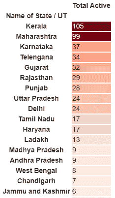**

### **1.4 可视化地理分布**

Next, we shall use Folium to create a zoomable map corresponding to the number of cases in different geographies.

```
df_full&nbsp;=&nbsp;pd.merge(India_coord,df,on='Name&nbsp;of&nbsp;State&nbsp;/&nbsp;UT')
map&nbsp;=&nbsp;folium.Map(location=[20,&nbsp;70],&nbsp;zoom_start=4,tiles='Stamenterrain')
for&nbsp;lat,&nbsp;lon,&nbsp;value,&nbsp;name&nbsp;inzip(df_full['Latitude'],&nbsp;df_full['Longitude'],&nbsp;df_full['Total&nbsp;cases'],&nbsp;df_full['Name&nbsp;of&nbsp;State&nbsp;/&nbsp;UT']):
&nbsp;&nbsp;&nbsp;&nbsp;folium.CircleMarker([lat,&nbsp;lon],&nbsp;radius=value*0.8,&nbsp;popup&nbsp;=&nbsp;('<strong>State</strong>:&nbsp;'&nbsp;+&nbsp;str(name).capitalize()&nbsp;+&nbsp;'
''<strong>Total&nbsp;Cases</strong>:&nbsp;'&nbsp;+&nbsp;str(value)&nbsp;+&nbsp;'
'),color='red',fill_color='red',fill_opacity=0.3&nbsp;).add_to(map)
map
```

### **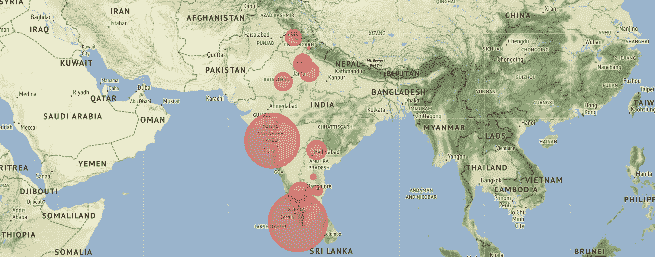**

### **1.5 确认与恢复的数字**

Next, we are going to use Seaborn for visualization.

```
f, ax = plt.subplots(figsize=(12, 8))
data = df_full[['Name of State / UT','Total cases','Cured','Death']]
data.sort_values('Total cases',ascending=False,inplace=True)
sns.set_color_codes("pastel")
sns.barplot(x="Total cases", y="Name of State / UT", data=data,label="Total", color="r")
sns.set_color_codes("muted")
sns.barplot(x="Cured", y="Name of State / UT", data=data, label="Cured", color="g")
```

```
# Add a legend and informative axis label
ax.legend(ncol=2, loc="lower right", frameon=True)
ax.set(xlim=(0, 35), ylabel="",xlabel="Cases")
sns.despine(left=True, bottom=True)
```

### **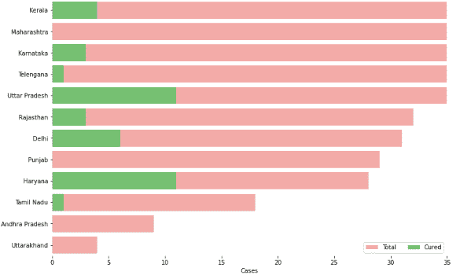 1.6 冠状病毒病例的增加**

接下来，您将使用 Plotly 获得描绘印度冠状病毒病例上升趋势的图表。

```
#This cell's code is required when you are working with plotly on colab
import plotly
plotly.io.renderers.default = 'colab'
```

```
# Rise of COVID-19 cases in India
fig = go.Figure()
fig.add_trace(go.Scatter(x=dbd_India['Date'], y = dbd_India['Total Cases'], mode='lines+markers',name='Total Cases'))
fig.update_layout(title_text='Trend of Coronavirus Cases in India (Cumulative cases)',plot_bgcolor='rgb(230, 230, 230)')
fig.show()
```

```
import plotly.express as px
fig = px.bar(dbd_India, x="Date", y="New Cases", barmode='group', height=400)
fig.update_layout(title_text='Coronavirus Cases in India on daily basis',plot_bgcolor='rgb(230, 230, 230)')
fig.show()
```

### ****

### **第二部分:这种趋势是否类似于义大利、武汉&南韩？**

此时，印度已经跨越了 500 例。在未来几天，控制局势仍然非常重要。在许多国家达到 100 大关后，冠状病毒患者人数开始翻倍，几乎开始呈指数增长。

### **2.1 印度、意大利、韩国和武汉的累计病例**

```
# import plotly.express as px
fig = px.bar(dbd_India, x="Date", y="Total Cases", color='Total Cases', orientation='v', height=600,
             title='Confirmed Cases in India', color_discrete_sequence = px.colors.cyclical.IceFire)
'''Colour Scale for plotly
https://plot.ly/python/builtin-colorscales/
'''
fig.update_layout(plot_bgcolor='rgb(230, 230, 230)')
fig.show()
fig = px.bar(dbd_Italy, x="Date", y="Total Cases", color='Total Cases', orientation='v', height=600,
             title='Confirmed Cases in Italy', color_discrete_sequence = px.colors.cyclical.IceFire)
fig.update_layout(plot_bgcolor='rgb(230, 230, 230)')
fig.show()
fig = px.bar(dbd_Korea, x="Date", y="Total Cases", color='Total Cases', orientation='v', height=600,
             title='Confirmed Cases in South Korea', color_discrete_sequence = px.colors.cyclical.IceFire)
fig.update_layout(plot_bgcolor='rgb(230, 230, 230)')
fig.show()
fig = px.bar(dbd_Wuhan, x="Date", y="Total Cases", color='Total Cases', orientation='v', height=600,
             title='Confirmed Cases in Wuhan', color_discrete_sequence = px.colors.cyclical.IceFire)
fig.update_layout(plot_bgcolor='rgb(230, 230, 230)')
fig.show()
```

**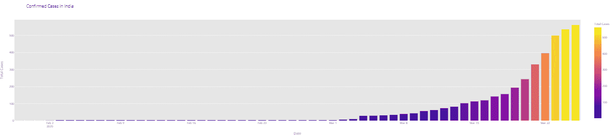**

### **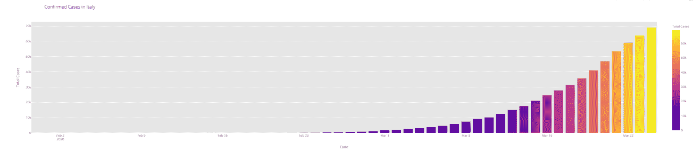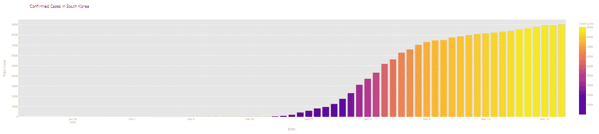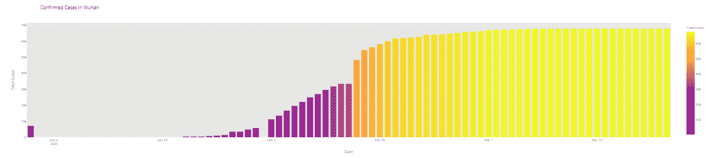**

从上面的可视化中，可以推断出以下内容:

*   印度确诊病例呈指数增长，没有固定模式(印度的检测非常少)
*   意大利的确诊病例正以某种固定模式呈指数上升
*   韩国的确诊病例正在逐渐上升
*   武汉一周的确诊病例几乎可以忽略不计。

### **2.2 武汉、韩国、意大利和印度病例上升对比**

```
# import plotly.graph_objects as go
from plotly.subplots import make_subplots
fig = make_subplots(
    rows=2, cols=2,
    specs=[[{}, {}],
           [{"colspan": 2}, None]],
    subplot_titles=("S.Korea","Italy", "India","Wuhan"))
fig.add_trace(go.Bar(x=dbd_Korea['Date'], y=dbd_Korea['Total Cases'],
                    marker=dict(color=dbd_Korea['Total Cases'], coloraxis="coloraxis")),1, 1)
fig.add_trace(go.Bar(x=dbd_Italy['Date'], y=dbd_Italy['Total Cases'],
                    marker=dict(color=dbd_Italy['Total Cases'], coloraxis="coloraxis")),1, 2)
fig.add_trace(go.Bar(x=dbd_India['Date'], y=dbd_India['Total Cases'],
                    marker=dict(color=dbd_India['Total Cases'], coloraxis="coloraxis")),2, 1)
# fig.add_trace(go.Bar(x=dbd_Wuhan['Date'], y=dbd_Wuhan['Total Cases'],
#                     marker=dict(color=dbd_Wuhan['Total Cases'], coloraxis="coloraxis")),2, 2)
fig.update_layout(coloraxis=dict(colorscale='Bluered_r'), showlegend=False,title_text="Total Confirmed cases(Cumulative)")
fig.update_layout(plot_bgcolor='rgb(230, 230, 230)')
fig.show()
```

### **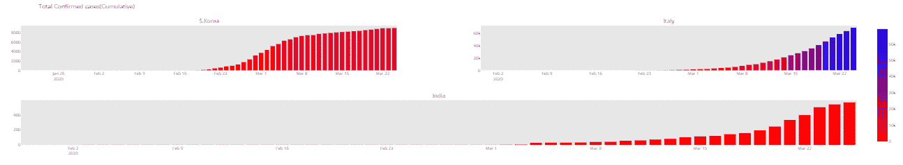 2.3 趋势穿越 100 例后**

```
# import plotly.graph_objects as go
title = 'Main Source for News'
labels = ['S.Korea', 'Italy', 'India']
colors = ['rgb(122,128,0)', 'rgb(255,0,0)', 'rgb(49,130,189)']
mode_size = [10, 10, 12]
line_size = [1, 1, 8]
fig = go.Figure()
fig.add_trace(go.Scatter(x=dbd_Korea['Days after surpassing 100 cases'], 
                 y=dbd_Korea['Total Cases'],mode='lines',
                 name=labels[0],
                 line=dict(color=colors[0], width=line_size[0]),            
                 connectgaps=True))
fig.add_trace(go.Scatter(x=dbd_Italy['Days after surpassing 100 cases'], 
                 y=dbd_Italy['Total Cases'],mode='lines',
                 name=labels[1],
                 line=dict(color=colors[1], width=line_size[1]),            
                 connectgaps=True))
fig.add_trace(go.Scatter(x=dbd_India['Days after surpassing 100 cases'], 
                 y=dbd_India['Total Cases'],mode='lines',
                 name=labels[2],
                 line=dict(color=colors[2], width=line_size[2]),            
                 connectgaps=True))
annotations = []
annotations.append(dict(xref='paper', yref='paper', x=0.5, y=-0.1,
                              xanchor='center', yanchor='top',
                              text='Days after crossing 100 cases ',
                              font=dict(family='Arial',
                                        size=12,
                                        color='rgb(150,150,150)'),
                              showarrow=False))
fig.update_layout(annotations=annotations,plot_bgcolor='white',yaxis_title='Cumulative cases')
fig.show()
```

### **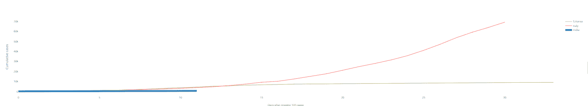**

### **第三部分:探索全球数据**

The following code will give you tabular data about the location and status of confirmed cases by date.

```
df = pd.read_csv('/content/covid_19_clean_complete.csv',parse_dates=['Date'])
df.rename(columns={'ObservationDate':'Date', 'Country/Region':'Country'}, inplace=True)
df_confirmed = pd.read_csv("/content/time_series_covid19_confirmed_global.csv")
df_recovered = pd.read_csv("/content/time_series_covid19_recovered_global.csv")
df_deaths = pd.read_csv("/content/time_series_covid19_deaths_global.csv")
df_confirmed.rename(columns={'Country/Region':'Country'}, inplace=True)
df_recovered.rename(columns={'Country/Region':'Country'}, inplace=True)
df_deaths.rename(columns={'Country/Region':'Country'}, inplace=True)
df_deaths.head()
```

```
df2 = df.groupby(["Date", "Country", "Province/State"])[['Date', 'Province/State', 'Country', 'Confirmed', 'Deaths', 'Recovered']].sum().reset_index()
df2.head()
```

```
#Overall worldwide Confirmed/ Deaths/ Recovered cases 
df.groupby('Date').sum().head()
```

### **可视化:全球新冠肺炎病例**

```
confirmed = df.groupby('Date').sum()['Confirmed'].reset_index()
deaths = df.groupby('Date').sum()['Deaths'].reset_index()
recovered = df.groupby('Date').sum()['Recovered'].reset_index()
```

```
fig = go.Figure()
#Plotting datewise confirmed cases
fig.add_trace(go.Scatter(x=confirmed['Date'], y=confirmed['Confirmed'], mode='lines+markers', name='Confirmed',line=dict(color='blue', width=2)))
fig.add_trace(go.Scatter(x=deaths['Date'], y=deaths['Deaths'], mode='lines+markers', name='Deaths', line=dict(color='Red', width=2)))
fig.add_trace(go.Scatter(x=recovered['Date'], y=recovered['Recovered'], mode='lines+markers', name='Recovered', line=dict(color='Green', width=2)))
fig.update_layout(title='Worldwide NCOVID-19 Cases', xaxis_tickfont_size=14,yaxis=dict(title='Number of Cases'))
fig.show()
```

### **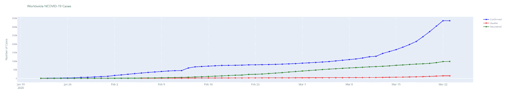**

### **第 4 部分:预测全球病例总数**

在这一部分中，我们将使用 ***【预言家】*** 生成新冠肺炎确诊病例的一周预测，通过创建一个基础模型(调整和不调整季节性相关参数和额外回归变量)来确定具体的预测间隔。

#### 什么是先知？

Prophet 是由脸书核心数据科学团队发布的开源软件。它可以在 CRAN 和 PyPI 上下载。

我们使用 Prophet，这是一种基于加法模型预测时间序列数据的程序，其中非线性趋势符合每年、每周和每天的季节性，加上假日影响。它最适用于具有强烈季节效应的时间序列和几个季节的历史数据。Prophet 对缺失数据和趋势变化非常稳健，通常能够很好地处理异常值。

#### 为什么是先知？

*   **准确而快速:** Prophet 在脸书被广泛应用于为规划和目标设定提供可靠的预测。脸书发现，在大多数情况下，它比任何其他方法都要好。它适合在[站](https://mc-stan.org/)的模型，所以你可以在几秒钟内得到预测。

*   **全自动:**无需人工干预，即可对杂乱的数据做出合理的预测。Prophet 对异常值、缺失数据和时间序列中的剧烈变化非常稳健。

*   **可调预测:**Prophet 程序包括用户调整预测的多种可能性。您可以通过添加您的领域知识，使用人类可理解的参数来改进您的预测

*   **可用 R 或 Python:** 脸书用 R 和 Python 实现了 Prophet 过程。它们共享相同的基础 Stan 代码进行装配。你可以使用任何你觉得舒服的语言来获得预测。

```
from fbprophet import Prophet
confirmed = df.groupby('Date').sum()['Confirmed'].reset_index()
deaths = df.groupby('Date').sum()['Deaths'].reset_index()
recovered = df.groupby('Date').sum()['Recovered'].reset_index()
```

The input to Prophet is always a data frame with two columns: **ds** and **y**. The **ds (datestamp)** column should be of a format expected by Pandas, ideally YYYY-MM-DD for a date or YYYY-MM-DD HH:MM:SS for a timestamp. The y column must be numeric and represents the measurement we wish to forecast.

```
confirmed.columns = ['ds','y']
#confirmed['ds'] = confirmed['ds'].dt.date
confirmed['ds'] = pd.to_datetime(confirmed['ds'])
confirmed.tail()
```

### **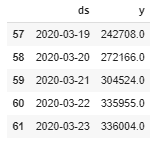 4.1 用预言家预测全球确诊新冠肺炎病例(基础模型)**

使用 Prophet 生成新冠肺炎确诊病例的一周预测，通过创建一个没有调整季节性相关参数和额外回归变量的基础模型，预测间隔为 95%。

```
m = Prophet(interval_width=0.95) 
m.fit(confirmed) 
future = m.make_future_dataframe(periods=7) 
future.tail()
```

The **predict** method will assign each row in future a predicted value which it names **yhat**. If you pass on historical dates, it will provide an in-sample fit. The **forecast object** here is a new data-frame that includes a column yhat with the forecast, as well as columns for components and uncertainty intervals.

```
#predicting the future with date, and upper and lower limit of y value
forecast = m.predict(future)
forecast[['ds', 'yhat', 'yhat_lower', 'yhat_upper']].tail()
```

您可以通过调用 Prophet.plot 方法并传入预测数据框来绘制预测。

```
confirmed_forecast_plot = m.plot(forecast)
```

```
confirmed_forecast_plot =m.plot_components(forecast)
```

### **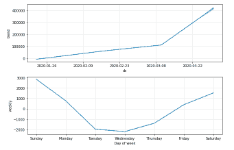 4.2 使用 Prophet(基础模型)预测全球死亡人数**

使用机器学习库 Prophet 生成新冠肺炎确诊病例的一周预测，通过创建一个没有调整季节性相关参数和额外回归变量的基础模型，具有 95%的预测区间。

```
deaths.columns = ['ds','y']
deaths['ds'] = pd.to_datetime(deaths['ds'])
m = Prophet(interval_width=0.95)
m.fit(deaths)
future = m.make_future_dataframe(periods=7)
future.tail()
```

```
forecast = m.predict(future)
forecast[['ds', 'yhat', 'yhat_lower', 'yhat_upper']].tail()
```

```
deaths_forecast_plot = m.plot(forecast)
```

``

```
deaths_forecast_plot = m.plot_components(forecast)
```

### **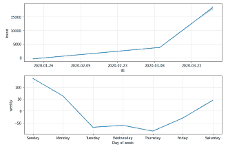 4.3 用 Prophet(基本模型)预测全球康复病例**

使用 Prophet 生成新冠肺炎确诊病例的一周预测，通过创建一个基本模型，预测间隔为 **95%** ，不调整季节性相关参数和其他回归变量。

```
recovered.columns = ['ds','y']
recovered['ds'] = pd.to_datetime(recovered['ds'])
m = Prophet(interval_width=0.95)
m.fit(recovered)
future = m.make_future_dataframe(periods=7)
future.tail()

forecast = m.predict(future)
forecast[['ds', 'yhat', 'yhat_lower', 'yhat_upper']].tail()

recovered_forecast_plot = m.plot(forecast)
```

``

```
recovered_forecast_plot = m.plot_components(forecast)
```

## ****

## **结论**

This is a humble request to all our learners.Don’t take your cough and cold lightly as you would. If you look at the data, the number of cases in India is rising just like in Italy, Wuhan, S.Korea, Spain, or the USA. We have crossed 100,000 cases already. Don’t let lower awareness and fewer test numbers ruin the health of our world.Currently, India is a deadly and risky zone as there are very few COVID-19 test centers available. Imagine how many infected people are still around you and are infecting others unknowingly. Let’s give a hand in fighting this pandemic at least by quarantining ourselves by staying indoors and protecting ourselves and others around us.Take precautions, stay indoors, and utilize this time to develop your Machine Learning skillset with [***Edureka’s AI-ML PGP***](https://www.edureka.co/post-graduate/machine-learning-and-ai) and maybe you’ll be the one to help the world with your Machine Learning models.*Got a question for us? Please mention them in the comments section and we will get back to you.*