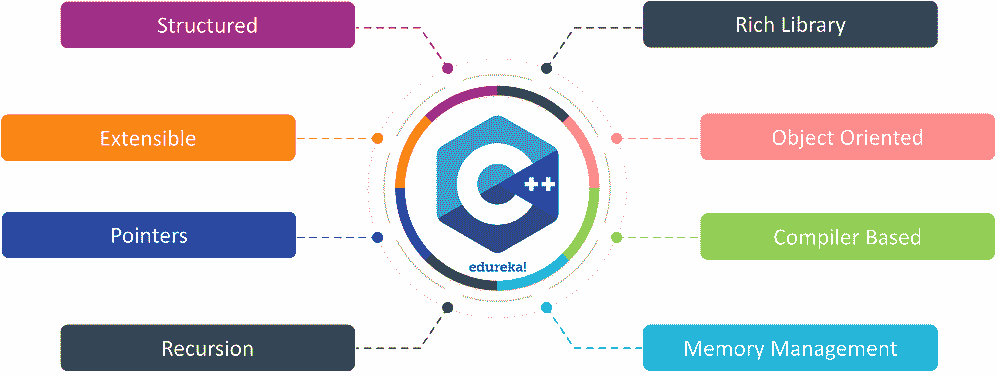
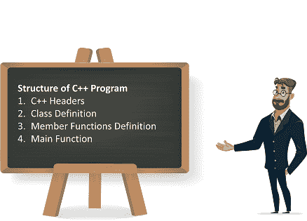
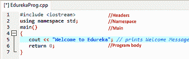
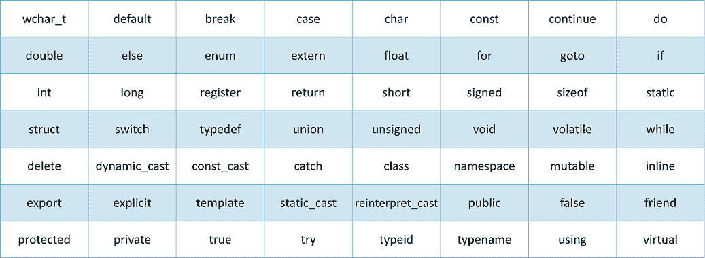
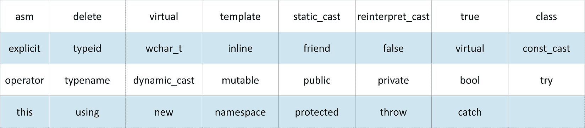
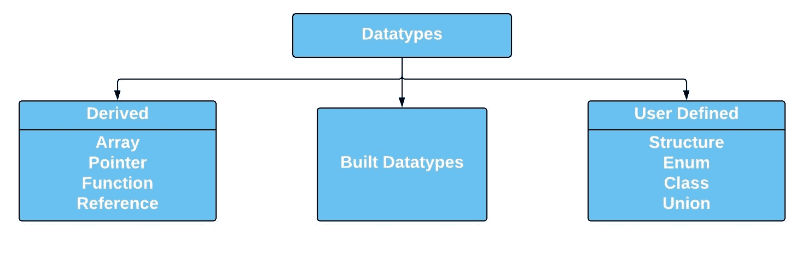
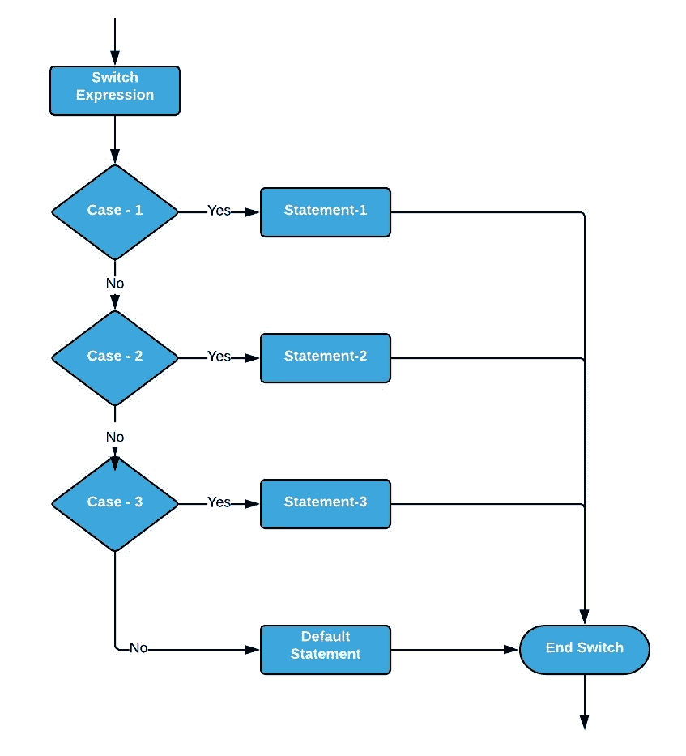
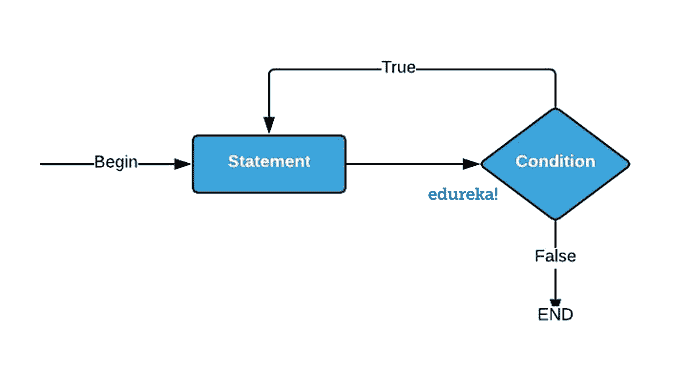

# C++编程教程:掌握 C++的关键

> 原文：<https://www.edureka.co/blog/cpp-tutorial/>

**C++** 是比雅尼·斯特劳斯特鲁普创造的通用编程语言，是 C 编程语言的扩展。理解面向对象的编程风格被认为是最重要和最基本的要求。在本 C++教程中，我们将理解如下所述的重要概念。

*   [C+基础知识](#c++basics)
*   [面向对象编程](#oops)
*   [高级 C++概念](#advanced)
*   [面试问题](#interview)

## **C+基础知识**

*   [c++的历史](#history)
*   [c++的特性](#features)
*   [安装 C++](#install)
*   [第一个 C++程序](#first)
*   [c++程序的结构](#structure)
*   [标识符](#identifier)
*   [关键词](#keyword)
*   [空白区域](#white)
*   [数据类型](#datatype)
*   [变量](#variable)
*   [修饰词](#modifier)
*   [类型限定符](#type)
*   [操作员](#operator)
*   [条件语句](#condition)
*   [c++中的循环](#loop)

**c++的历史**

**C++程序设计语言** 是于 **1980 年**由比雅尼·斯特劳斯特鲁普先生在位于美国的美国电话&电报(AT & T)公司历史悠久的贝尔实验室开发的。


比雅尼·斯特劳斯特鲁普**是 C++编程语言的创始人。**

他开发了 **C++** 编程语言，以便将**面向对象**风格的编程集成到 C 语言中，而不必对 C 基础做任何重大的改变。

**c++的特性**

**C++** 编程语言加载了许多面向性能的特性，如下所述:

*   **富库**

**C++** 语言结合了多个内置的**算术** 和 **逻辑** 函数以及许多内置库，使得开发更加快捷方便。

*   **面向对象**

**C++** 编程语言被设计成一种面向对象的编程语言。糟糕的是 特性使得开发和维护更加容易，然而在面向过程的编程语言中，如果代码随着项目规模的增长而增长，那么管理起来就不容易了。

*   **基于编译器的**

**C++** 编程语言是一种基于编译器的编程语言，它的意思是没有编译就没有 C++程序可以执行。首先，我们需要用编译器编译我们的程序，然后我们可以执行我们的程序。

*   **内存管理**

**C++** 提供了同类最好的内存管理。它可以在任何时刻动态地**分配**和**释放**内存。



*   **递归**

**C++** 语言支持函数 **回溯** 其中涉及到递归。在递归过程中，一个函数在另一个函数中被多次调用。

*   **指针**

**C++** 使用户能够使用指针直接与内存交互。我们在内存、结构、函数、数组、堆栈等等中使用指针。

*   **可扩展**

**C++** 编程语言因其易于适应的特性而具有高度的可扩展性。

*   **结构化**

**C++** 语言支持结构化编程，其中包括使用函数。函数降低了代码复杂度，并且完全可重用。

**C++安装**

让我们按照下面的步骤在我们的本地系统中安装 **C++** 。

*   **步骤** **1:** 选择你喜欢的**文本编辑器。**

C++可以使用各种文本编辑器，如 **TurboC、CodeBlocks、 [Dev。C++](https://sourceforge.net/projects/orwelldevcpp/files/latest/download) ，Visual Studio，Eclipse** 等等。

*   第二步:在你的本地系统上安装 **MinGW** 。

在选择了你的文本编辑器之后，你需要一个编译器来解释你的代码给计算机系统。我们同样需要[](https://sourceforge.net/projects/mingw-w64/files/latest/download)。一旦你下载了 MinGW，

您需要设置相同的环境变量。

****

执行你的第一个 C++程序

在安装了 **C++** 编译器和您选择的**文本编辑器**之后，您可以直接执行您的第一个基本 C++程序，即 **Hello World** 程序。

```
#include &lt;iostream.h&gt;
#include&lt;conio.h&gt;
void main()
{
      clrscr();
      cout &lt;&lt; "Hello World..! Welcome to C++ Programming.";
      getch();
}

```

**//输出:**

`Hello World..! Welcome to C++ Programming.`

**c++程序的结构**

C++程序的基本结构如下:



*   **C++头文件:**

以**散列** **符号(#)** 开头的行被认为是**头文件。**一个程序中使用的所有头文件都有自己独特的含义。比如头文件**# include<iostream . h>**I指令**预处理器**到 执行标准的**输入**和**输出**操作，比如把我们第一个程序的输出( <samp>Hello World</samp> )写到屏幕上。

*   **命名空间:**

[**名称空间**](https://www.edureka.co/blog/namespace-in-cpp/) 允许将各种成员分组，如**类、对象、函数**和各种 **C++标记**在一个名称下。不同的用户可以创建不同的名称空间，因此可以使用相似的成员名称。这避免了由于同名冲突而可能存在的**编译时**错误。



*   **类别定义:**

class 是一个用户定义的数据结构，用关键字 **class 声明。**它包括数据和函数作为其成员，其访问由三个访问说明符控制，即**私有、受保护的**和**公共。默认情况下，对 C++类成员的访问是私有的。**

*   **成员函数定义:**

**成员函数** 是被声明为特定类的 **成员** 的运算符和 **函数** 。 成员函数也被称为主类的朋友。

*   **主要功能:**

**main** () **函数** 被称为每一个 **C++** 程序的入口点。当执行一个 **C++** 程序时，执行控制直接进入 **主** () **函数** 。

**标识符**

C++语言中的标识符就是 C++程序中变量和函数的名字。C++程序中的有效标识符使用从 **A 到 Z、A 到 z** 和 **0 到 9** 的字母来声明。标识符不能包含特殊符号和空格，但可以包含**下划线(_)**

**有效标识符**的一些基本示例如下:

`int A;``float x;`

**关键词**

类似于标识符，我们在 C++程序中确实有一些特殊的和**保留的**字，它们有**的特殊含义。**这样的词叫做**关键词。**c++编程语言中用到的一些关键词如下。



**从 C++语言引入的新关键字**



****

**空白区域**

空白可以定义为 C++中用来定义*空格、制表符、换行符*和*注释的术语。* **空格**将一个语句与另一个语句分开，并使**编译器**能够识别语句中的一个元素(如 **int)在哪里结束**以及下一个元素的开始。

**举例:**

`char Edureka_Happy_Learning;`

**评论**

C++程序注释是用户编写的语句，包含在 C++代码中用于解释目的。这些注释对任何阅读源代码的人都有帮助。所有编程语言都允许某种形式的注释。C++支持单行和多行注释。

**单行注释:**

```
#include &lt;iostream&gt;
using namespace std;
main() {
   cout &lt;&lt; "Welcome to Edureka"; // prints Welcome Message
   return 0;
}

```

**多行评论:**

```
/* Comment out printing of Happy Learning
cout &lt;&lt; "Happy Learning"; // prints Happy Learning Message
*/

```

接下来，我们将讨论数据类型

**数据类型**

C++语言中可用的数据类型如下:



**派生数据类型**

下表显示了**派生的数据类型**

**阵**

**数组**是一组具有相同数据类型的元素，由具有索引的相同名称引用。数组中的元素存储在连续的内存位置，每个元素通过其索引进行访问。索引值指示特定元素在数组中的位置。

**举例:**

```
#include &lt;iostream&gt;
using namespace std;
int main() {
     int arr[5];
     arr[0] = 1;
     arr[1] = 2;
     arr[2] = 3;
     arr[3] = 4;
     arr[4] = 5;
     cout &lt;&lt; arr[3] " ";
     return 0;
}

```

**//输出:**

`1 2 3 4 5`

此外，您可以在下面的 [**文章**](https://www.edureka.co/blog/arrays-in-cpp/) 中找到关于阵列的详细文档。

**功能**

函数是主程序的细分程序，执行特定的预定义任务。在 C++中，每个程序都包含一个或多个可以从程序的其他部分调用的函数。

**举例:**

```
#include &lt;iostream&gt;
using namespace std;
sum(int a, int b){
      int add = a+b; return add;
}
int main(){
      cout&lt;&lt;sum(25,50);
      return 0;
}

```

**//输出:**

`75`

**参考**

[**引用**](https://www.edureka.co/blog/call-by-reference-in-cpp) 是程序中变量的别名。一个变量和它的引用在一个程序中可以互换使用，因为两者都指向同一个内存位置。因此，对其中任何一个进行的更改都会反映在另一个中。

**举例:**

```
#include&lt;iostream&gt;
using namespace std;
int main()
{
      int x = 10;
      int&amp; ref = x;
      ref = 20;
      cout &lt;&lt; "x = " &lt;&lt; x &lt;&lt; endl ;
      x = 30;
      cout &lt;&lt; "ref = " &lt;&lt; ref &lt;&lt; endl ;
      return 0;
}

```

**//输出:**

`x = 20`

此外，您可以在下面的 [**文章**](https://www.edureka.co/blog/call-by-reference-in-cpp) 中找到详细的参考文档。

**指针**

[**指针**](https://www.edureka.co/blog/pointers-in-cpp/) 是一个变量，可以存储另一个变量的内存地址。指针允许动态使用内存。也就是说，在指针的帮助下，内存可以在运行时分配或取消分配给变量，从而使程序更加高效。

**举例:**

```
#include &lt;bits/stdc++.h&gt; 
using namespace std; 
void Edureka() 
{ 
	int var = 20; 
	int *ptr; 
	ptr = &amp;var;	 
	cout &lt;&lt; "Value at ptr = " &lt;&lt; ptr &lt;&lt; "n"; 
	cout &lt;&lt; "Value at var = " &lt;&lt; var &lt;&lt; "n"; 
	cout &lt;&lt; "Value at *ptr = " &lt;&lt; *ptr &lt;&lt; "n";	 
} 
int main() 
{ 
	Edureka(); 
} 

```

**//输出:**

`Value at ptr = 0x6ffdd4``Value at var = 20`

此外，您可以在下面的 [**文章**](https://www.edureka.co/blog/pointers-in-cpp/) 中找到关于指针的详细文档。

**琴弦**

术语 [**字符串**](https://www.edureka.co/blog/strings-in-c/) 表示有序的字符序列。在 C++中，可以使用类的对象来表示字符序列。

**举例:**

```
#include &lt;iostream&gt;

using namespace std;
int main () {

   char ch[12] = {'H', 'e', 'l', 'l', 'o', ' ', 'w','o','r','l','d'};
   string st = "Welcome to Edureka";
   std::string std_st = "Happy Learning";
   cout &lt;&lt; ch &lt;&lt; endl;
   cout &lt;&lt; st &lt;&lt; endl;
   cout &lt;&lt; std_st &lt;&lt; endl;
   return 0;
}

```

**//输出:**

`Hello world``Welcome to Edureka`

此外，您可以在下面的 [**文章**](https://www.edureka.co/blog/strings-in-c/) 中找到关于字符串的详细文档。

**内置数据类型**

下表显示了**内置数据类型**以及可以存储在指定变量中的最大值和最小值。

| **类型** | **位宽** | **典型范围** |
| **字符** | **1 字节** | **-127 到 127 或 0 到 255** |
| **带符号字符** | **1 字节** | **-127 至 127** |
| **无符号字符** | **1 字节** | **0 到 255** |
| **短整型** | **2 字节** | **-32768 到 32767** |
| **有符号短整型** | **2 字节** | **-32768 到 32767** |
| **无符号整数** | **2 字节** | **0 到 65535** |
| **int** | **4 字节** | **-2147483648 转 2147483647** |
| **带符号整数** | **4 字节** | **-2147483648 转 2147483647** |
| **无符号整数** | **4 字节** | **0 到 4294967295** |
| **long int** | **4 字节** | **-2147483648 至 2147483647** |
| **带符号长整型** | **4 字节** | **-2147483648 至 2147483647** |
| **无符号长整型** | **4 字节** | **0 到 4294967295** |
| **浮动** | **4 字节** | **+/- 3.4e +/- 38** |
| **double** | **8 字节** | **+/- 1.7e +/- 308** |
| **长双** | **8 字节** | **+/- 1.7e +/- 308** |
| **wchar_t** | **4 字节** | **1 宽字符** |

**用户定义的数据类型**

下表显示了**用户自定义数据类型**。

**结构**

**结构** 被认为是不同数据类型的变量在一个名字下的集合。它完全类似于保存不同数据类型的数据集合的普通类。

**举例:**

```
#include &lt;iostream&gt;
using namespace std;
struct Point {
      int a, b;
};

int main()
{
      struct Point p1 = { 0, 10 };
      p1.a = 25;
      cout &lt;&lt; "a = " &lt;&lt; p1.a &lt;&lt; ", b = " &lt;&lt; p1.b;
      return 0;
}

```

**//输出:**

`a = 25, b = 10`

**枚举**

C++中的**枚举**是一种用户自定义的数据类型。它被设计用来给整型常量命名，这些名字增加了程序的可读性，同时程序也变得易于维护。

**例子**

```
#include&lt;stdio.h&gt;
     enum week{Mon, Tue, Wed, Thur, Fri, Sat, Sun};
int main()
{
     enum week day;
     day = Wed;
     printf("%d",day);
     return 0;
}

```

**//输出:**

`2`

**类**

C++中的一个 [**类**](https://edureka.co/blog/object-oriented-programming-in-cpp/) 实际上是一个用户自定义的数据类型。**是用关键字 **class** **声明的**，其成员带有 **personal** 、protected 或 public 访问说明符。默认情况下，对 C++ **类**成员的访问是**私有的**。**

**举例:**

```
#include &lt;iostream&gt;  
using namespace std;  
class Student {  
   public:  
      int ID;
      string Name;
};  
int main() {  
    Student s1; 
    s1.ID = 12012009;    
    s1.Name = "Arjun";   
    cout&lt;&lt;s1.ID&lt;&lt;endl;  
    cout&lt;&lt;s1.Name&lt;&lt;endl;  
    return 0;  
}  

```

**//输出:**

`12012009`

此外，您可以在下面的 [**文章**](https://edureka.co/blog/object-oriented-programming-in-cpp/) 中找到关于字符串的详细文档。

**工会**

**联合** 在声明和使用方面与**结构**完全相似，但是 **联合** 的所有成员占用相同的内存空间，也就是说，内存位置由 **联合成员** 共享。

```
#include&lt;iostream&gt;
using namespace std;
typedef union type {
    int a;
    float b;
}
my_type;

int main() 
{
    my_type x;
    x.a = 5;
    cout &lt;&lt; "a : " &lt;&lt; x.a &lt;&lt; endl;
    x.b = 7.3;
    cout &lt;&lt; "a : " &lt;&lt; x.a &lt;&lt; endl;
    cout &lt;&lt; "b : " &lt;&lt; x.b &lt;&lt; endl;
    return 0;
}

```

**//输出:**

`a : 5``a : 1089051034`

**变量**

C++中的**变量**是计算机中为存储数据和处理数据而保留的特定内存的用户自定义名称。C++中的变量根据它们的作用域分为两种类型。

*   **全局变量**

全局变量在所有函数之外定义。全局变量将在程序的整个生命周期中保持它们的值。也就是说，一个全局变量在声明后可以在整个程序中使用。

**举例:**

```
#include &lt;iostream&gt;
using namespace std;

int g;

int main () {
   int a, b;
   a = 10;
   b = 20;
   g = a + b;
   cout &lt;&lt; g;
   return 0;
}

```

**//输出:**

`30`

*   **局部变量**

局部变量在函数中被声明为**。它们只能由该函数或代码块内部的语句使用。局部变量不为自身以外的函数所知。**

**举例:**

```
#include &lt;iostream&gt;
using namespace std;

int main () {
   int a, b;
   int c;
   a = 10;
   b = 20;
   c = a + b;
   cout &lt;&lt; c;
   return 0;
}

```

**//输出:**

`30`

**c++中的修饰符**

c++中的修饰符允许 **char、int、** 和 **double** 数据类型前面有修饰符。修饰符用于改变基类型的含义，以便更精确地适应各种情况的需要。

C++中可用的数据类型修饰符有:

*   签名
*   无符号的
*   长的
*   短的

为了理解修饰符的功能，让我们执行下面的程序。

```
#include &lt;iostream&gt;
using namespace std;

int main() {
   short int i;           
   short unsigned int j; 
   j = 50000;
   i = j;
   cout &lt;&lt; i &lt;&lt; " " &lt;&lt; j;
   return 0;
}

```

**//输出:**

`-15536 50000`

以上结果是因为将 50000 表示为短无符号整数的位模式被一个短解释为-15536。

**c++中的类型限定符**

类型**限定符**提供了关于它们之前的变量的附加信息。C++语言中有**三个**不同的类型限定符。

*   **常数**

类型为  **常量** 的对象在执行过程中不能被你的程序改变。

*   **易挥发**

修饰符  **volatile** 告诉编译器，变量值可能会以程序没有明确指定的方式改变。

*   **限制**

由  **restrict** 限定的指针最初是唯一可以访问它所指向的对象的手段。只有 **C99** 添加了一个名为 **restrict 的新类型限定符。**

**c++中的运算符**

一个**操作符**是一个特殊的符号，用于执行一个特定的操作。C++语言包含许多类型的操作，如算术、逻辑、逐位等等。以下是 C++语言中运算符的类型。

*   二元运算符

*   一元运算符
*   三元运算符

**算术运算符**

C++语言支持以下算术运算符。假设变量 A 保存 20，变量 B 保存 40，那么

| **操作员** | **描述** | **例子** |
| **+** | 检查两个操作数的值是否相等，如果相等，则条件为真。 | A + B 将给出 60 |
| **–** | 检查两个操作数的值是否相等，如果值不相等，则条件为真。 | a–B 将给出-20 |
| ***** | 检查左操作数的值是否大于右操作数的值，如果是，则条件为真。 | A * B 会给 800 |
| **/** | 检查左操作数的值是否小于右操作数的值，如果是，则条件为真。 | B / A 将给出 2 |
| **%** | 检查左操作数的值是否大于或等于右操作数的值，如果是，则条件为真。 | B % A 会给 0 |
| **++** | 检查左操作数的值是否大于或等于右操作数的值，如果是，则条件为真。 | A++将 21 |
| **—** | 检查左操作数的值是否小于或等于右操作数的值，如果是，则条件为真。 | 答-将给出 19 |

**关系运算符**

| **操作员** | **描述** | **例子** |
| **==** | 检查两个操作数的值是否相等，如果相等，则条件为真。 | (A == B)不成立。 |
| **！=** | 检查两个操作数的值是否相等，如果值不相等，则条件为真。 | (答！= B)为真。 |
| **>** | 检查左操作数的值是否大于右操作数的值，如果是，则条件为真。 | (A>B)不正确。 |
| **<** | 检查左操作数的值是否小于右操作数的值，如果是，则条件为真。 | (A |
| **> =** | 检查左操作数的值是否大于或等于右操作数的值，如果是，则条件为真。 | (A>=B)不成立。 |
| **< =** | 检查左操作数的值是否小于或等于右操作数的值，如果是，则条件为真。 | (A<= B)为真。 |

**逻辑运算符**

| **操作员** | **描述** | **例子** |
| **&&** | 称为逻辑与运算符。如果两个操作数都不为零，则条件为真。 | (A && B)是假的。 |
| **&#124;&#124;** | 称为逻辑或运算符。如果两个操作数中的任何一个非零，则条件为真。 | (A &#124;&#124; B)是真的。 |
| **！** | 称为逻辑非运算符。用于反转其操作数的逻辑状态。如果一个条件为真，那么逻辑 NOT 运算符将为假。 | ！(A && B)是真的。 |

**按位运算符**

| **答** | **B** | **甲&乙** | **A&#124;&#124;B** | **A^B** |
| **0** | **0** | **0** | **0** | **0** |
| **0** | **1** | **0** | **1** | **1** |
| **1** | **1** | **1** | **1** | **0** |
| **1** | **0** | **0** | **1** | **1** |

下表列出了 C++语言支持的**位**运算符。假设变量 A 为 60，变量 B 为 13，那么结果如下所示

| **操作员** | **描述** | **例子** |
| **&** | 二元 AND 运算符将一个位复制到结果中，如果它同时存在于两个操作数中。 | (A & B)将给出 12，即 0000 1100 |
| **&#124;** | 二进制 OR 运算符复制任一操作数中存在的位。 | (A &#124; B)将给出 61，即 0011 1101 |
| **^** | 如果在一个操作数中设置了该位，而不是在两个操作数中都设置了该位，则二进制 XOR 运算符会复制该位。 | (A ^ B)将给出 49，即 0011 0001 |
| **~** | 二进制一补码运算符是一元运算符，具有“翻转”位的效果。 | (~A)将给出-61，它是 1100 0011 的二进制补码形式，因为它是一个有符号的二进制数。 |
| **<<** | 二元左移运算符。左操作数值左移右操作数指定的位数。 | A << 2 将得出 240，即 1111 0000 |
| **>>** | 二元右移位运算符。左操作数的值向右移动右操作数指定的位数。 | A >> 2 会给出 15 也就是 0000 1111。 |

**赋值运算符**

C++语言支持以下**赋值**运算符。

| **操作员** | **描述** | **例子** |
| **=** | 简单赋值运算符，将右侧操作数的值赋给左侧操作数。 | C = A + B |
| **+=** | 加法和赋值运算符，它将右操作数与左操作数相加，并将结果保存到左操作数。 | C += A 是 C = C + A |
| **-=** | 减法和赋值运算符，它从左操作数中减去右操作数，并将结果保存到左操作数。 | C -= A 是 C = C–A |
| ***=** | 乘法和赋值运算符，它将右操作数与左操作数相乘，并将结果保存到左操作数。 | C *= A 是 C = C * A |
| **/=** | 除法和赋值运算符，它将左操作数除以右操作数，并将结果保存到左操作数。 | C /= A 是 C = C / A |
| **%=** | 模数和赋值运算符，它使用两个操作数取模数，并将结果保存到左操作数。 | C %= A 是 C = C % A |
| **< < =** | 左移和赋值运算符。 | C <<= 2 是 C = C << 2 |
| **< < =** | 右移位和赋值运算符。 | C >>= 2 是 C = C >> 2 |
| **& =** | 按位 AND 赋值运算符。 | C & 2 等于 C = C & 2 |
| **^=** | 按位异或和赋值运算符。 | C ^= 2 是 C = C ^ 2 |
| **&#124;=** | 按位包含 OR 和赋值运算符。 | C &#124;= 2 是 C = C &#124; 2 |

**按照优先级排列的 C++运算符**

| **名称** | **关联性** | **操作员** |
| **后缀** | 从左到右 | **() [] - >。++––** |
| **一元** | 从右到左 | **+-！~ ++-(类型)* &审裁处** |
| **乘法** | 从左到右 | ***/%** |
| **添加剂** | 从左到右 | **+-** |
| **换挡** | 从左到右 | **T2<T4>** |
| **关系型** | 从左到右 | **< < = > > =** |
| **相等** | 从左到右 | **==！=** |
| **按位与** | 从左到右 | **&** |
| **按位异或** | 从左到右 | **^** |
| **按位或** | 从左到右 | **&#124;** |
| **逻辑与** | 从左到右 | **&&** |
| **逻辑或** | 从左到右 | **&#124;&#124;** |
| **条件** | 从右到左 | **？:** |
| **分配** | 从右到左 | **=+=-= * =/= % =>>=<<=&= ^= &#124; =** |
| **逗号** | 从左到右 | **，** |

**条件语句**

**条件语句** 用于根据某种条件执行 **语句** 或一组 **语句** 。如果 **条件** 为真则 **C++语句** 被执行，否则下一个 **语句** 将被执行。

C++语言中不同类型的条件语句如下:

1.  如果语句
2.  If-Else 语句
3.  嵌套的 If-else 语句
4.  If-Else If 阶梯
5.  交换语句

**If 语句**

c++语言中的单个 **if** 语句用于在条件为真时执行代码。也称为单向选择语句。

**语法**

```
if(boolean_expression) {
   // statement(s) will execute if the boolean expression is true
}

```

**流程图**


**举例:**

```
#include <iostream>
using namespace std;

int main () {
   int a = 100;
   if( a < 200 ) 
   {
      cout << "a is less than 200" << endl;
   }
   cout << "value of a is: " << a << endl;
   return 0;
}

```

**//输出:**

`a is less than 200`

**If-Else 语句**

C 语言中的 **if-else** 语句用于在条件为真或假时执行代码。也叫双向选择语句。

**语法**

```
if(boolean_expression) {
   // statement(s) will execute if the boolean expression is true
} else {
  // statement(s) will execute if the boolean expression is false
}

```

**流程图**


**举例:**

```
#include <iostream>
using namespace std;

int main()
{
     int a = 100, b = 200;
     if (b > a)
     {
           cout << "b is greater" << endl;
     }
     else
     {
           cout << "a is greater" << endl;
      }
      system("PAUSE");
}

```

**//输出:**

`b is greater`

**嵌套的 If-else 语句**

当程序需要一个以上的测试表达式时，使用嵌套的 **if-else** 语句。它也被称为多路选择语句。当一个语句中涉及一系列决策时，我们使用嵌套形式的 **if-else** 语句。

**语法**

```
if( boolean_expression 1) {
   // Executes when the boolean expression 1 is true
   if(boolean_expression 2) {
      // Executes when the boolean expression 2 is true
   }
}

```

**流程图**


**举例:**

```
#include <iostream>
using namespace std;

int main ()
{
   int a = 1000;
   int b = 2500;
   if( a == 100 ) 
   {
      if( b == 200 ) 
      {
         cout << "Value of a is 1000 and b is 2500" << endl;
      }
   }
   cout << "The Exact value of a is: " << a << endl;
   cout << "The Exact value of b is: " << b << endl;
   return 0;
}

```

**//输出:**

`The exact value of a is: 1000`

**Else-if 阶梯**

**if-else-if** 语句用于执行来自多个条件的一个代码。它也被称为多路径决策语句。这是一连串的假设..else 语句，其中每个 if 语句都与 else if 语句相关联，最后一个是 else 语句。

**语法**

```
if(boolean_expression 1)
{
   // When expression 1 is true
}
else if( boolean_expression 2)
{
   // When expression 2 is true
}
else if( boolean_expression 3)
{
   // When expression 3 is true
}
else 
{
   // When none of expression is true
}

```

**流程图**


**举例:**

```
#include <iostream>
using namespace std;

int main(){
    int score;
    cout << "Enter your score between 0-100n"; cin >> score;
    if(score >= 90)
    {
        cout << "YOUR GRADE: An"; } else if (score >= 50 && score < 90)
    {
        cout << "YOUR GRADE: Bn"; } else if (score >= 35 && score < 50)
    {
        cout << "YOUR GRADE: Cn";
    } 
    else 
    {
        cout << "YOUR GRADE: Failedn";
    }
    return 0;
}

```

**//输出:**

`Enter your score between 0-100``60`

**开关语句**

**Switch** 语句作为一个长的 if-else-if 阶梯的替代品，用于测试一系列案例。switch 语句包含一个或多个 case 标签，这些标签根据 switch 表达式进行测试。当表达式与一个事例匹配时，就会执行与该事例相关的语句。

**语法**

```
switch(expression) {
   case constant-expression  :
      statement(s);
      break; //optional
   case constant-expression  :
      statement(s);
      break; //optional

   // you can have any number of case statements.
   default : //Optional
      statement(s);
}

```

**流程图**



**举例:**

```
#include <iostream>
using namespace std;

int main() {
    int x = 3;
    switch (x)
    {
        case 1:
        cout << "Choice is 1";
        break;
        case 2:
        cout << "Choice is 2";
        break;
        case 3:
        cout << "Choice is 3";
        break;
        default:
        cout << "Choice other than 1, 2 and 3";
        break;
    }
return 0;
}

```

**//输出:**

`Choice is 3`

**c++中的循环**

**循环** 语句用于重复执行一组语句，直到满足特定条件。C++语言由以下循环语句组成。

*   For 循环
*   While 循环
*   Do While 循环

**为循环**

循环的**用于多次执行一个特定的代码段，直到满足给定的条件。**

**语法**

```
for(initialization; condition; incr/decr){    
//code to be executed    
}
```

**流程图**

**例如:**

```
#include <iostream>  
using namespace std;  
int main() {  
         for(int i=1;i<=10;i++){      
            cout<<i <<"n";      
          }       
    }

```

**//输出:**

`1``2``3``4``5``6``7``8``9``10`

**While 循环**

**While 循环**用于多次执行一个代码段，直到满足特定条件。

**语法**

```
while(condition){    
//code to be executed    
} 
```

**流程图**


**举例:**

```
#include <iostream>
using namespace std;
int main() 
{
    int number, i = 1, factorial = 1;
    cout << "Enter a positive integer: "; cin >> number;

    while ( i <= number) {
        factorial *= i;      
        ++i;
    }
    cout<<"Factorial of "<< number <<" = "<< factorial;
    return 0;
}

```

**//输出:**

`Enter a positive integer: 10`

**Do While 循环**

Do while 循环与 while 循环完全相似，但唯一的区别是条件放在循环的末尾。因此，循环至少执行一次。

**语法**

```
do
{
   statement(s);
} while(condition);
```

**流程图**



**举例:**

```
#include <iostream>
using namespace std;
int main(){
   int num=1;
   do{
      cout<<"Value of num: "<<num<<endl;
      num++;
   }while(num<=6);
   return 0;
}

```

**//输出:**

`Value of num: 1``Value of num: 2``Value of num: 3``Value of num: 4``Value of num: 5`

**面向对象编程**

*   [封装](#encapsulate)
*   [抽象](#abstract)
*   [继承](#inherit)
*   [过载](#overload)
*   [超驰](#override)
*   [界面](#interface)
*   [朋友](#friend)
*   [构造函数和析构函数](#construct)
*   [STL(标准模板库)](#stl)

**面向对象编程**系统 是一种基于**对象**概念的编程范例，这些对象包含**数据成员**和与之相关的**方法**。面向对象编程的主要目的是增加程序的灵活性和可维护性

## **面向对象编程的特点:**

*   它更强调数据而不是过程。
*   这些程序被分成对象，因此很容易操作。
*   数据结构是以这样一种方式设计的，即它们表征对象。
*   对一个对象的数据进行  操作的函数一起放在数据结构中。
*   数据是隐藏的，未经允许不能被外部函数访问。
*   借助于函数，可以进行对象之间的通信。
*   添加新的数据和函数变得很容易。
*   F 在程序设计中遵循自下而上的方法。

**封装**

[**封装**](https://www.edureka.co/blog/encapsulation-in-cpp/) 可以定义为将数据和信息包装在一个单元下。在面向对象编程中，封装被定义为将数据和操作它们的函数绑定在一起。换句话说，将数据和操作它们的功能包装在一起。

我们可以使用三种访问说明符来实现封装。

*   公共
*   私人的
*   保护

**封装类型**

基本上有三种封装类型

*   成员变量封装
*   功能封装
*   类封装

**举例:**

```
#include<iostream>
using namespace std;
class test
{
      private:
      int x;
      public:
      test(int a)
     {
           x =a;
     }
     int get()
     {
           return x;
      }
};
int main()
{
      test a(7);
      cout<<"The Number is: "<<a.get();
      return 0;
}

```

**//输出:**

`The Number is: 7`

**抽象**

数据 [**抽象**](https://www.edureka.co/blog/data-abstraction-in-cpp/) 是一种分离接口和实现细节的编程技术。这仅仅提供了重要的细节，隐藏了程序复杂的代码段。

有三个主要的访问说明符用于实现抽象

*   公共
*   私人
*   受保护的

在 C++语言中，基本上有三种应用抽象的方法

*   使用类的抽象
*   使用头文件的抽象
*   使用说明符的抽象

**举例:**

```
#include<iostream>
using namespace std;
class test
{
      private:
      int x;
      public:
      test(int a)
     {
           x =a;
     }
     int get()
     {
           return x;
      }
};
int main()
{
      test a(10);
      cout<<"The Number is: "<<a.get();
      return 0;
}

```

**//输出:**

`The Number is: 10`

**继承**

[**继承**](https://www.edureka.co/blog/inheritance-in-cpp) 定义为从父对象自动获取所有属性和行为到子对象的过程。

C++语言中有 5 种类型的继承。

*   单一遗传
*   多重遗传
*   多层次继承
*   分层继承
*   混合遗传

C++使用访问说明符来限制基类属性对派生类的访问。C++中总共有 3 种访问说明符

*   公共
*   私人的
*   保护

示例:

```
#include <iostream>

using namespace std;

class Train{
    int Numberofwheels;
     int Numberofcoaches;
    public:
     void Traininfo(int n, int m){
        Numberofwheels = n;
        Numberofcoaches = m;
        }
        void showinfo(){
            cout<<Numberofcoaches<<"n"<<Numberofwheels<<"n";
        }
    };
    class BulletTrain : public Train{
        int flux;
        public:
         BulletTrain(int b){
             flux = b;
             }

        void Magneticfield(){
            cout<<" The Magnetic field is turned ON with flux = "<<flux ;
        }     
        };
int main()
{
    BulletTrain bullettrain(10);
    bullettrain.Traininfo(0, 20);  //accessing member function of base class
    bullettrain.showinfo();         //accessing member function of base class
    bullettrain.Magneticfield(); //Using member function of derived class
    return 0;
}

```

**//输出:**

`20``0`

**过载**

当我们创建一个类的两个或更多成员，它们有相同的名字，但是参数的数量或类型不同，那么这个过程被称为 [**重载。**](https://www.edureka.co/blog/function-overloading-in-cpp/) 在 C++中，我们可以重载:

*   方法
*   构造器
*   索引属性

过载有两种类型:

*   函数重载
*   运算符重载

**例:**

```
#include <iostream>
 using namespace std;

int add(int a, int b)
{
    cout << a+b <<endl;
    return 0;
}
int add(int a, int b, int c)
{
    cout << a+b+c <<endl;
    return 0;
}
int main()
{
    add(20, 40);  
    add(40, 20, 30);  
}

```

**//输出:**

`60`

**超驰**

当一个派生类有一个与基类的函数同名的函数时，称为 [**函数重写**](https://www.edureka.co/blog/function-overloading-and-overriding-in-cpp/) *。* 两个函数在两个类中必须有相同的参数。

**举例:**

```
#include <iostream>
using namespace std;
class BaseClass 
{
    public:
    void disp()
    {
         cout<<"Parent Class Function";
    }
};
class DerivedClass: public BaseClass
{
    public:
    void disp() 
    {
         cout<<"Child Class Function";
    }
};
int main() 
{
    DerivedClass obj = DerivedClass();
    obj.disp();
    return 0;
}

```

**//输出:**

`Child Class Function`

**界面**

接口是将父类的行为和功能从其父类实现到子类中的解决方案，而不需要父类成员的实际参与。

**语法**

```
__interface InterfaceName
{
	//group of functions declarations
}

```

**举例:**

```
#include <iostream>
using namespace std;

class Shape 
{
   public:
      virtual int getArea() = 0;
      void setWidth(int w) 
	  {
         width = w;
      }
      void setHeight(int h) 
	  {
         height = h;
      }
   protected:
      int width;
      int height;
};
class Rectangle: public Shape 
{
   public:
      int getArea() 
	  { 
         return (width * height); 
      }
};
class Triangle: public Shape 
{
   public:
      int getArea() 
	  { 
         return (width * height)/2; 
      }
};

int main(void) 
{
   Rectangle Rect;
   Triangle  Tri;
   Rect.setWidth(10);
   Rect.setHeight(25);
   cout << "Total Rectangle area: " << Rect.getArea() << endl;
   Tri.setWidth(20);
   Tri.setHeight(50);
   cout << "Total Triangle area: " << Tri.getArea() << endl; 
   return 0;
}

```

**//输出:**

`Total Rectangle area: 250`

**朋友**

一个类的友元函数在该类的作用域之外，但是访问该类所有私有的和受保护的成员是合适的。

**语法**

```
class class_name    
{    
    friend data_type function_name(argument/s);
}; 

```

**举例:**

```
#include <iostream>
using namespace std;

class Box 
{
   double width;
   public:
      friend void printWidth( Box box );
      void setWidth( double wid );
};
void Box::setWidth( double wid ) 
{
   width = wid;
}
void printWidth( Box box ) 
{
   cout << "Width of box: " << box.width <<endl;
}
int main() {
   Box box;
   box.setWidth(200.0);
   printWidth( box );
   return 0;
}

```

**//输出:**

`Width of box: 200`

**枚举**

枚举 **可能是一个** 自定义 **数据** **类型** 在 C. **中它的** **在主** **中用来给** 整型常量赋值，将 **命名为** 创建一个程序【

**语法**

```
enum{constant 1, constant2, constant3};

```

**举例:**

```
#include<stdio.h>
      enum week{Mon, Tue, Wed, Thur, Fri, Sat, Sun};
int main()
{
      enum week day;
      day = Fri;
      printf("%d",day);
      return 0;
}

```

**//输出:**

`4`

**构造函数**和**析构函数**

## **构造器**

一个 [**构造函数**](https://www.edureka.co/blog/constructor-and-destructor-in-cpp/) 是一个类的成员函数。它主要用于初始化类的对象。它与类同名。创建对象时，会自动调用构造函数。它是一种特殊的类成员函数。

构造函数和其他成员函数的区别:

1.构造函数与类名同名。 2。当创建类的对象时，调用构造函数。 3。构造函数没有返回类型。 4。如果没有指定构造函数，编译器会生成一个默认的构造函数，它什么也不做。 5。有 3 种类型的构造函数:

*   默认构造函数
*   参数化构造函数
*   复制构造函数

## **析构函数**

[**析构函数**](https://www.edureka.co/blog/constructor-and-destructor-in-cpp/) 是另一类负责销毁或删除对象的成员函数。它释放不再需要的对象所占用的空间。当对象超出范围不再需要时，会自动调用析构函数。析构函数的名称与类名相同，但唯一的区别是名称前面有一个瓷砖(~)。

```
~test()

```

一个类中只能有一个析构函数。析构函数没有返回类型和参数。如果我们在类中指定了一个析构函数，编译器就会创建一个默认的析构函数。除非动态分配内存或者在类中声明指针，否则默认析构函数工作正常。析构函数被调用时，

*   功能结束。
*   程序结束。
*   包含局部变量的块结束。
*   一个删除操作符在程序中被调用。

**STL(标准模板库)**

STL 代表 [**标准模板库**](https://www.edureka.co/blog/stl-in-cpp/) 。它是一组 C++模板类，提供常见的编程数据结构和函数，如列表、堆栈、数组等。

STL 有三个组成部分

*   容器
*   算法
*   迭代器

更进一步，你可以在下面的 [**文章**](https://www.edureka.co/blog/arrays-in-cpp/) 中找到关于 STL 的详细文档。

**高级 C++概念**

*   [文件和流](#file)
*   [异常处理](#exception)
*   [动态内存管理](#dynamic)
*   [信号处理](#signal)
*   [多线程](#multi)
*   [集装箱](#contain)

**文件和流**

文件用于将数据永久存储在存储设备中。 [**文件处理**](https://www.edureka.co/blog/file-handling-in-cpp/) 提供了一种将程序的输出存储在文件中并对其执行各种操作的机制。流是一个抽象概念，表示在其上执行输入和输出操作的设备。根据其用途，流可以表示为长度不定的字符的源或目的地。

在 C++中，我们有一套文件处理方法。其中包括 *ifstream、ofstream、*和 *fstream。*这些类是从 *fstrembase* 和相应的 *iostream* 类中派生出来的。这些用于管理磁盘文件的类是在 *fstream* 中声明的，因此我们必须包含 *fstream* ，因此我们必须在任何使用文件的程序中包含这个文件。

在 C++中，文件主要通过使用三个类 *fstream、ifstream、ofstream 来处理。*

*   该流类表示输出文件流，用于创建向文件写入信息的文件
*   这个流类表示输入文件流，用于从文件中读取信息
*   fstream: 这个流类可以用于文件的读写。

以上三个类都是从 fstrieambase 和相应的 iositream 类派生出来的，它们是专门为管理磁盘文件而设计的。C++在文件处理中为我们提供了以下操作:

*   创建文件:open()
*   读取数据:read()
*   写入新数据:write()
*   关闭文件:close()

**异常处理**

[**异常处理**](https://www.edureka.co/blog/exception-handling-in-cpp/) 是处理运行时因代码错误或用户输入无效而出现的错误和异常的阶段。在 C++编程语言中，我们有两种类型的异常处理。

*   运行时异常处理
*   编译时异常处理

当您考虑异常处理时，有三个术语与之相关，

*   尝试
*   捕捉
*   扔

**试试**

这个块中的代码就像一个试验代码，可能会抛出异常。这个异常是在 catch 块中捕获的。

**接住**

当 try 块中的代码抛出异常时，执行该块中的代码。

**投掷**

该关键字用于遇到异常时抛出。异常被发送到异常处理程序。

**动态内存管理**

给程序分配内存基本上有两种方式， [**动态内存**](https://www.edureka.co/blog/dynamic-memory-allocation-cpp/) 分配和**静态内存**分配。使用动态内存分配，我们可以克服静态内存分配的缺点。

这使得用户能够在运行时**与计算机的内存**进行交互，根据程序的要求使用内存，并在程序完成执行后立即释放内存。

这种 [**的动态内存管理**](https://www.edureka.co/blog/dynamic-memory-allocation-cpp/) 增加了程序的效率。

**信号处理**

信号 **ar** 中断由 **软件包** **交付给 **方法** 的中断可能** 终止程序 **不合时宜** 。 **在 **操作系统** 、LINUX、 **防水** OS X 或 Windows 系统上按 Ctrl+C 就能产生** 中断。

有有信号 **这些信号可能** 不会被程序 **捕获然而** **有** 下面的信号列表****你将能够在你的程序 **中** 捕获并且可能** 捕获 **这些信号 **是 C++头文件中** **概述的** 。****

**C++信号处理库提供 **执行** 信号到 **陷阱** **意外** 事件。跟随 **的是** 信号的语法() **执行****

****语法****

```
void (*signal (int sig, void (*func)(int)))(int); 
```

****举例:****

```
#include <iostream>
#include <csignal>
using namespace std;

void signal_handler( int signal_num ) 
{
     cout << "The interrupt signal is (" << signal_num << "). n";
     exit(signal_num);
}
int main ()
{
      signal(SIGABRT, signal_handler);
      while(true)
      cout << "Welcome to Edureka." << endl;
      return 0;
} 
```

****//输出:****

**`Welcome to Edureka.` `Welcome to Edureka.` `Welcome to Edureka.`**

****多线程****

**多线程 **是一种** **特殊化** **排序的** 多任务和一个多任务 **是** 的特色 **使****PC**能够运行**或 **附加**一般来说，自己的 **区域单元****2****种** 多任务。****

*****   基于流程的*   基于线程的****

****基于进程的多任务处理处理程序的 **执行** 。基于线程的多任务处理与 **相同的** 程序的 **项的 **执行** 。******

****一个多线程程序包含 **2** 或 **附加** **元素** **其中会** 同时运行**。 **每一个** **的一部分** 这样一个程序 **被称为** 一个线程， **和每一个** 线程定义了一个单独的执行路径。******

******c++**不包含任何 **宪法** 对多线程应用的支持。相反，它的 **完全依赖于****OS 的** **来产生** 这个特性。********

********C++编程语言在多线程中有以下几个阶段********

*********   创建线程*   向线程传递参数*   连接或分离螺纹*   终端线程********

**********创建线程**********

********下面的**语法**用于创建一个 **POSIX** 线程********

```
******#include <pthread.h>
pthread_create (thread, attr, start_routine, arg)****** 
```

**********举例:**********

```
******#include <iostream>
#include <cstdlib>
#include <pthread.h>
using namespace std;

#define NUM_THREADS 5
void *PrintHello(void *threadid) 
{
     long tid;
     tid = (long)threadid;
     cout << "Hello World! Thread ID, " << tid << endl; 
     pthread_exit(NULL);
}

int main () 
{
     pthread_t threads[NUM_THREADS];
     int rc;
     int i;
     for( i = 0; i < NUM_THREADS; i++ ) 
     {
            cout << "main() : creating thread, " << i << endl;
            rc = pthread_create(&threads[i], NULL, PrintHello, (void *)i);
            if (rc) 
            {
                   cout << "Error:unable to create thread," << rc << endl;
                   exit(-1);
            }
     }
     pthread_exit(NULL);
}****** 
```

**********//输出:**********

********`main() : creating thread,0``main() : creating thread,1``main() : creating thread,2``main() : creating thread,3``main() : creating thread,4``Welcome to Edureka! Thread ID,4``Welcome to Edureka! Thread ID,3``Welcome to Edureka! Thread ID,2``Welcome to Edureka! Thread ID,1``Welcome to Edureka! Thread ID,0`********

**********向线程传递参数**********

********这个例子展示了 **到** 通过一个结构传递多个参数的方法。 **你将** 传递任何 **数据** **排序** **在一个超过** 的线程 **请求** **的结果** 它指向 void 如解释 内的********

**********举例:**********

```
******#include <iostream>
#include <cstdlib>
#include <pthread.h>
using namespace std;

#define NUM_THREADS 5
struct thread_data
{
        int thread_id;
        char *message;
};

void *PrintHello(void *threadarg)
{
        struct thread_data *my_data;
        my_data = (struct thread_data *) threadarg;
        cout << "Thread ID : " << my_data->thread_id ;
        cout << " Message : " << my_data->message << endl;
        pthread_exit(NULL);
}
int main ()
{
        pthread_t threads[NUM_THREADS];
        struct thread_data td[NUM_THREADS];
        int rc;
        int i;
        for( i = 0; i < NUM_THREADS; i++ )
        {
               cout <<"main() : creating thread, " << i << endl;
               td[i].thread_id = i;
               td[i].message = "This is message";
               rc = pthread_create(&threads[i], NULL, PrintHello, (void *)&td[i]);
               if (rc)
               {
                     cout << "Error:unable to create thread," << rc << endl;
                     exit(-1);
               }
        }
        pthread_exit(NULL);
}****** 
```

**********//输出:**********

********`main() : creating thread, 0``main() : creating thread, Thread ID : 10``Message : This is messagemain() : creating thread,``Thread ID : 21``Message : This is messageThread ID : main() : creating thread, 23`********

********`main() : creating thread, Thread ID : 43``Message : This is message`********

**********连接/分离螺纹**********

********pthread _ join()**函数** 阻塞了 **职业** 线程 **直到** **线程所需的** 线程终止。 **一旦****形成一个线程****每一个** 中有一个它的属性定义了****它的** 是否可接合或分离。 **单独** 创建为可接合 **的 **区域单元** 的线程将被** 接合。如果一个线程 **被形成** 为分离的，它 **将** **永远不会** 被加入。**********

********这个例子演示了 **的一种方式，通过 **利用** 的 Pthread **成为** 例程的一部分** 线程完成。********

**********语法**********

```
******pthread_join (threadid, status) 
pthread_detach (threadid)****** 
```

**********举例:**********

```
******#include <iostream>
#include <cstdlib>
#include <pthread.h>
#include <unistd.h>
using namespace std;
#define NUM_THREADS 5

void *wait(void *t) 
{
    int i;
    long tid;
    tid = (long)t;
    sleep(1);
    cout << "Sleeping in thread " << endl;
    cout << "Thread with id : " << tid << " Thread exiting " << endl;
    pthread_exit(NULL);
}

int main () 
{
    int rc;
    int i;
    pthread_t threads[NUM_THREADS];
    pthread_attr_t attr;
    void *status;
    pthread_attr_init(&attr);
    pthread_attr_setdetachstate(&attr, PTHREAD_CREATE_JOINABLE);
    for( i = 0; i < NUM_THREADS; i++ ) 
    {
         cout << "main() : creating thread, " << i << endl;
         rc = pthread_create(&threads[i], &attr, wait, (void *)i );
         if (rc) 
         {
                cout << "Error:unable to create thread," << rc << endl;
                exit(-1);
          }
    }
    pthread_attr_destroy(&attr);
    for( i = 0; i < NUM_THREADS; i++ ) 
    {
          rc = pthread_join(threads[i], &status);
          if (rc) 
          {
                cout << "Error:unable to join," << rc << endl;
                exit(-1);
          }
          cout << "Main: completed thread id :" << i ;
          cout << " exiting with status :" << status << endl;
     }
     cout << "Main: program exiting." << endl;
     pthread_exit(NULL);
}****** 
```

**********//输出:**********

********`main() : creating thread, 0``main() : creating thread, 1``main() : creating thread, 2``main() : creating thread, 3``main() : creating thread, 4``Sleeping in thread``Thread with id : 0 Thread exiting``Sleeping in thread``Thread with id : 1 Thread exiting``Sleeping in thread``Thread with id : 2 Thread exiting``Thread with id : 3 Thread exiting``Thread with id : 4 exiting``Main: completed thread id :1 exiting with status :0``Main: completed thread id :3 exiting with status :0``Main: program exiting.`********

**********终止线程**********

********下面的**语法**用于终止线程********

```
******#include <pthread.h>
pthread_exit (status)****** 
```

********让我们来处理容器。********

**********集装箱**********

********以映射方式存储元素的关联 [**容器**](https://www.edureka.co/blog/maps-in-cpp/#Maps) 被称为 ***映射*** 。map 中的所有元素都存储在一个键-值对中，其中每个键都是唯一的。排序是在键的帮助下完成的，并且值与每个键相关联。可以根据需要插入和删除值。********

**********语法**********

```
******map<key_type , value_type> map_name;****** 
```

**********举例:**********

```
******#include <iostream>
#include <iterator>
#include 

<map>

using namespace std;

int main()
{
        map<int, int> Edureka1;
        Edureka1.insert(pair<int, int>(1, 40));
        Edureka1.insert(pair<int, int>(2, 30));
        Edureka1.insert(pair<int, int>(3, 60));
        Edureka1.insert(pair<int, int>(4, 20));
        Edureka1.insert(pair<int, int>(5, 50));
        Edureka1.insert(pair<int, int>(6, 50));
        Edureka1.insert(pair<int, int>(7, 10));
        map<int, int>::iterator itr;
        cout << "nThe map Edureka1 is : n";
        cout << "tKEYtELEMENTn";
        for (itr = Edureka1.begin(); itr != Edureka1.end(); ++itr)
        {
                cout << 't' << itr->first << 't' << itr->second << 'n';
        }
        cout << endl;
        map<int, int> Edureka2(Edureka1.begin(), Edureka1.end());
        cout << "nThe map Edureka2 after"<< " assign from Edureka1 is : n";
        cout << "tKEYtELEMENTn";
        for (itr = Edureka2.begin(); itr != Edureka2.end(); ++itr)
        {
                cout << 't' << itr->first << 't' << itr->second << 'n';
        }
        cout << endl;
        cout << "nEdureka2 after removal of" " elements less than key=3 : n";
        cout << "tKEYtELEMENTn";
        Edureka2.erase(Edureka2.begin(), Edureka2.find(3));
        for (itr = Edureka2.begin(); itr != Edureka2.end(); ++itr)
        {
                cout << 't' << itr->first<< 't' << itr->second << 'n';
        }
        int num;
        num = Edureka2.erase(4);
        cout << "nEdureka2.erase(4) : ";
        cout << num << " removed n";
        cout << "tKEYtELEMENTn";
        for (itr = Edureka2.begin(); itr != Edureka2.end(); ++itr)
        {
                cout << 't' << itr->first << 't' << itr->second << 'n';
        }
        cout << endl;
        cout << "Edureka1.lower_bound(5) : "<< "tKEY = ";
        cout << Edureka1.lower_bound(5)->first << 't';
        cout << "tELEMENT = "<< Edureka1.lower_bound(5)->second << endl;
        cout << "Edureka1.upper_bound(5) : "<< "tKEY = ";
        cout << Edureka1.upper_bound(5)->first << 't';
        cout << "tELEMENT = "<< Edureka1.upper_bound(5)->second << endl;
        return 0;
}****** 
```

**********//输出:**********

********`The map Edureka1 is :``KEY ELEMENT``           1            40``           2            30``           3            60``           4            20``           5            50``           6            50``           7            10`********

********`The map Edureka2 after assign from Edureka1 is :``KEY ELEMENT``           1            40``           2            30``           3            60``           4            20``           5            50``           6            50``           7            10`********

********`Edureka2 after removal of elements less than key=3 :``KEY ELEMENT``           3            60``           4            20``           5            50``           7            10`********

********`Edureka2.erase(4) : 1 removed``KEY ELEMENT``           3            60``           5            50``           6            50`********

********`Edureka1.lower_bound(5) : KEY = 5 ELEMENT = 50`********

## ********************

## **********关于 C++的面试问题**********

********以下问题是基于 C++语言的面试中最常被问到的问题********

********[**c++**中的斐波那契数列](https://www.edureka.co/blog/fibonacci-series-in-cpp/)********

********[**c++中的快速排序**](https://www.edureka.co/blog/quick-sort-in-cpp)********

********[**c++**中的引用调用](https://www.edureka.co/blog/call-by-reference-in-cpp)********

********[**什么是 C++** 中的类型转换](https://www.edureka.co/blog/type-conversion-in-cpp/)********

********至此，我们结束了这篇“C++教程”文章。我希望您已经理解了数据结构、语法、功能和使用它们执行的操作的重要性。*现在，您已经了解了 C++编程的基础知识，请查看 Edureka 提供的关于 java、  [Spring](https://spring.io/) 和许多等多种技术的 [**java**](https://www.edureka.co/java-j2ee-training-course) 培训* *一家值得信赖的在线学习公司，拥有遍布全球的 250，000 多名满意的学习者，向我们提问* *？在这个“C++教程”博客的评论部分提到它，我们会尽快回复你。*********