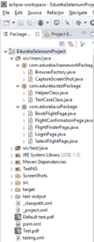
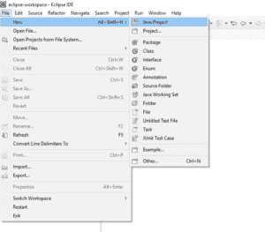
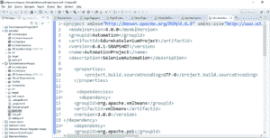
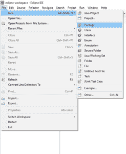
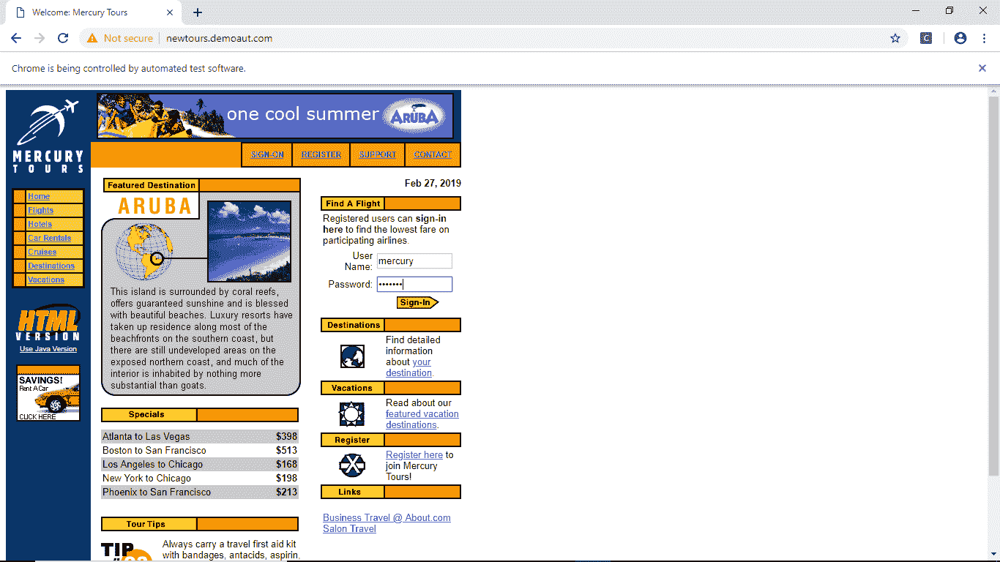
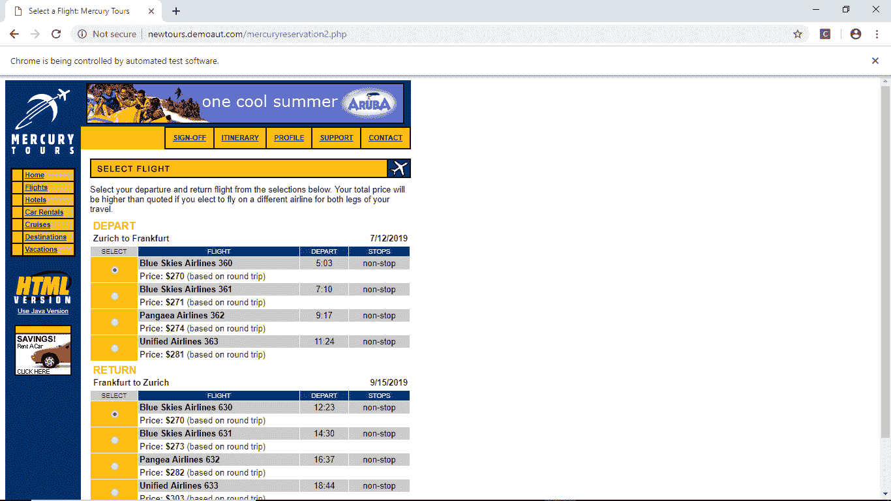
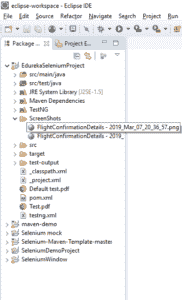

# 如何用 Eclipse 创建 Selenium Maven 项目？

> 原文：<https://www.edureka.co/blog/create-selenium-maven-project/>

Selenium 是测试 web 应用程序最广泛使用的自动化工具之一。它抛弃了所有传统的测试方法。检测领域的进步也增加了参加 [***硒认证***](https://www.edureka.co/selenium-certification-training) 的人数。因此，这篇关于用 Eclipse 创建 Selenium Maven 项目的文章将帮助您理解在 Eclipse IDE 上运行测试用例是多么容易。

在这篇关于 Eclipse 的 Selenium Maven 项目博客中，我们将讨论本文中涉及的以下主题。

*   [硒是什么？它有什么特点？](#What%20is%20Selenium?%C2%A0What%20are%20its%20features)
*   [什么是 Maven？](#What%20is%20Maven)
*   什么是 Eclipse IDE？
*   [Selenium Maven 项目结构](#Selenium%20Maven%20project%20structure)
*   [Selenium Maven 实现](#Selenium%20Maven%20implementation)

想知道为什么 Selenium 在测试 web 应用程序时有很大的价值吗？ [***硒是什么？***](https://www.edureka.co/blog/what-is-selenium/) 它有何独特之处？让我们来揭开这个框架突出需求的各种特性。

**带 Eclipse 的硒 Maven 项目:硒是什么？它有什么特点？**

***[Selenium](https://www.edureka.co/blog/selenium-tutorial)*** 是一项顶级技术，有助于测试 web 应用程序并自动化与之相关的流程。

硒的特性包括以下几点:

*   Selenium 是一个开源的可移植框架，用于测试 web 应用程序。
*   测试用例可以用不同的编程语言编写，如 Java、Python、Ruby 等。，但其中最常用的是 Java，因为它的用户友好行为。
*   测试用例可以在不同的浏览器上运行，比如 Chrome、Explorer、Safari、Opera 等等。
*   Selenium 还支持交叉浏览。交叉浏览指的是测试用例可以同时跨不同平台运行的过程。
*   它有一组名为 Selenese 的命令，包含所有 Selenium 命令的序列。
*   使用 [***元素定位器***](https://www.edureka.co/blog/locators-in-selenium/) 可以轻松定位网页上的元素。
*   Selenium 只测试 web 应用程序。它不能在任何桌面或移动应用程序上执行操作。

**带 Eclipse 的 Selenium Maven 项目:Maven 是什么？**

Maven 是一个构建自动化工具。它基本上是一个软件项目管理和理解工具，可以管理项目的构建、报告和文档。

Maven 是意第绪语单词，意思是“知识的积累者”。它最初是由阿帕奇软件基金会(ASF)在 2002 年为雅加达  亚历山大项目发起的。Maven 的特性包括:

*   Maven 是一个基于 POM(项目对象模型)的强大的项目管理工具。
*   它提供了一个简单的项目，通过给项目或模块一个样板文件来建立。
*   它在不同的项目中是一致的。
*   还能够同时处理多个项目。
*   能够将任意数量的项目构建成其预定义的输出类型，如 JAR、WAR，大多数情况下无需任何脚本。

## **带 Eclipse 的 Selenium Maven 项目:什么是 Eclipse IDE？**


Eclipse 是一个集成开发环境(IDE ),用于开发 Java 和其他语言的应用程序，如 C、C++、Python、Perl、Ruby 等。这个平台可以用于开发富客户端应用程序、ide 和其他工具。

*   为 Eclipse IDE 提供核心的平台基本上是由插件组成的。
*   它主要是用 Java 编写的，主要用途是开发 Java 应用程序，但也可以用来开发其他编程语言的应用程序。
*   谈到工具的许可，它是一个可以跨不同浏览器运行的开源软件。
*   Eclipse 公共许可证 (EPL)是发布 Eclipse 项目的基本许可证。
*   插件框架允许 Eclipse 平台 与 LaTeX、  等排版语言和 telnet、DBMS 等网络应用协同工作。

看看这个关于 Selenium 的视频，我们的 Selenium 测试专家正在解释如何在你的系统上安装 Selenium。

## **下载&安装 Selenium | Selenium WebDriver 安装| Selenium 安装指南| edu reka**


[https://www.youtube.com/embed/U-JRw7yRFcA?rel=0&controls=0&showinfo=0](https://www.youtube.com/embed/U-JRw7yRFcA?rel=0&controls=0&showinfo=0)*This Edureka video on How to Install Selenium will talk about Java Installation, Eclipse Installation followed by Installing Selenium on your system.*

### **我们为什么要用 Eclipse 来运行 Selenium Maven 项目？**

我们考虑使用 Eclipse 平台与 Selenium Maven 一起工作，因为 Eclipse IDE 是开发 Java 应用程序最流行的编辑器，而且它是免费的，易于理解，有更多的社区支持。

*   Eclipse 提供了一个用户友好的环境。
*   这个 IDE 将花费你更少的时间和精力。
*   它支持许多语言，而不仅仅是 Java。
*   像 Junit 和 TestNG 以及其他插件这样的框架集成可以很容易地完成。
*   因为 Eclipse 工具是开源的，所以它可以用最新的技术快速更新，这些技术可以集成到现有的代码中。
*   浏览网页变得很容易。
*   自动完成是最好的特性之一，在 Eclipse 上工作时，您不必记住所有的函数。
*   有助于重构，即通过改变因素而不改变其外部行为来帮助重构现有代码。
*   错误调试很容易，您可以很容易地导航到错误行。
*   所有文件都可以在同一个屏幕上查看和管理。
*   更好地组织进口。
*   下载需要轻松打包。

从[自动化测试认证](https://www.edureka.co/masters-program/automation-testing-engineer-training)中了解更多关于自动化及其应用的信息。

## **Selenium Maven 项目与 Eclipse: Selenium Maven 项目结构**

Selenium Maven 项目简化了程序如何驻留在正在创建的包中的视图。 Maven 项目有一个 *pom.xml* 文件和一个目录结构:

|  |

我们来看看 Selenium Maven 项目的分支方式。

让我们来看看第一个项目 EdurekaSeleniumProject 中的字段。



现在，让我简单介绍一下 Selenium Maven 项目中的目录和文件。

*   pom.xml
*   src 和目标
*   src/main/java
*   src/test/java
*   Maven 依赖性

让我们详细分析一下这些文件夹。

*   在顶层，存在项目的描述性文件，即  **`pom.xml`** 文件。这个文件保存了特定包的 maven 依赖项。此外，还有一些文本文档，用户在收到源文件时可以立即阅读:  `README.txt`、  `LICENSE.txt`等。
*   这个`pom.xml`文件是 Maven 中项目配置的核心。它是一个单一的配置文件，包含按照您想要的方式构建项目所需的所有信息。项目对象模型是巨大的，其复杂性令人望而生畏，但是要有效地使用它，并不需要理解所有的复杂性。这个 pom.xml 文件的结构是这样的。

```

<project  xmlns:xsi="http://www.w3.org/2001/XMLSchema-instance" xsi:schemaLocation="http://maven.apache.org/POM/4.0.0 http://maven.apache.org/xsd/maven-4.0.0.xsd">
<modelVersion>4.0.0</modelVersion>
<groupId>Automation</groupId>
<artifactId>EdurekaSeleniumProject</artifactId>
<version>0.0.1-SNAPSHOT</version>
<name>AutomationProject</name>
<description>SeleniumAutomation</description>

<properties>
<project.build.sourceEncoding>UTF-8</project.build.sourceEncoding>
</properties>

<dependency>
//any dependencies 
</dependency>

```

*   这个结构基本上只有两个子目录:  **`src`** 和  **`target`** 。
*   **`target`** 目录用来存放所有的构建输出。它甚至保存编译结果和测试报告。
*   **`src`** 目录保存了构建项目的所有源材料、它的站点等等。它包含了每种类型的子目录:  `main` 用于主要的构建工件，  `test` 用于测试代码和资源，用于执行项目所需的任何种类的附加资源。
*   依赖关系 : Maven 鼓励使用 jar 和其他依赖关系的中央存储库。它提供了一种机制，项目的客户可以使用这种机制从中央存储库中下载构建项目所需的任何 jar。这允许 Maven 的用户跨项目重用 jar，并鼓励项目之间的通信，以确保向后兼容性问题得到正确处理。

## **带 Eclipse 的 Selenium Maven 项目:Selenium Maven 实现**

让我们考虑这个特殊的项目，我们将尝试自动化预订航班的过程。让我们看看它是如何使用 Selenium Maven 项目完成的。

我们把流程分成相关的页面。

*   我们将从初始化浏览器驱动程序开始，然后登录到网页
*   根据用户需求查找航班
*   选择航班并预订
*   捕获确认页面的屏幕截图

转到文件->转到新建->其他-> Maven 项目来创建一个新的 Java 项目。

****

**第二步:将依赖项添加到 pom.xml 文件**

****

**第三步:创建包**

在 src/main/java 文件夹和 src/test/java 文件夹下创建包，并开始编写这段代码。

### ** 步骤 4:编写代码运行测试用例** 

*   [胸针厂](#BrowserFactory)
*   [登录页面](#LoginPage)
*   [FlightFinder 页面](#FlightFinderPage)
*   [选择航班页面](#SelectFlightPage)
*   [预订航班页面](http://BookFlightPage)
*   [航班确认页面](#FlightConfirmationPage)
*   [截图页面](#CaptureScreenShotPage)
*   [HelperClass 页面](#HelperClassPage)
*   [TestCaseClass Page](#TestCaseClassPage)

**BrowserFactory()**

首先，让我们设置浏览器驱动程序，并通过创建一个名为 **BrowserFactory()** 的公共类来启动这个过程，在这个公共类下，我们将实例化浏览器实例。让我们考虑 ChromeDriver 作为这个项目的浏览器驱动程序，因为使用 Chrome 很容易检查网页。

*   使用 chrome options options = new chrome options()命令实例化 ChromeDriver。
*   使用 options . setpageloadstrategy(PageLoadStrategy)减少/限制执行的页面加载超时。无)
*   使用以下命令将系统属性设置为 webdriver 的名称和驱动程序所在的路径:system . set property(" web driver . chrome . driver "，" D:chromedriver.exe ")
*   接下来，为了最大化网页，我们使用这个命令:driver.manage()。窗口()。最大化()
*   添加一些有助于删除 cookies 的过程的简单执行的命令，driver.manage()。deleteAllCookies()；
*   添加隐式 [***等待***在你希望执行等待一定时间的地方，driver.manage()。超时()。隐式等待(45，时间单位。秒)；](https://www.edureka.co/blog/waits-in-selenium/)
*   添加页面加载等待，这有助于限制加载特定网页 driver.manage()的等待时间。超时()。pageLoadTimeout(45，时间单位。秒)；
*   其他浏览器驱动程序如 FireFox、IE 也遵循同样的程序。

```

package com.edureka.frameworkPackage;

import java.util.concurrent.TimeUnit;

import org.openqa.selenium.PageLoadStrategy;
import org.openqa.selenium.WebDriver;
import org.openqa.selenium.chrome.ChromeDriver;
import org.openqa.selenium.chrome.ChromeOptions;
import org.openqa.selenium.firefox.FirefoxDriver;
import org.openqa.selenium.ie.InternetExplorerDriver;

public class BrowserFactory {

public static WebDriver driver;

public BrowserFactory(){

}

public static WebDriver getDriver(){
if(driver==null){
ChromeOptions options = new ChromeOptions();
options.addArguments("--disable-notifications");
options.setPageLoadStrategy(PageLoadStrategy.NONE);
System.setProperty("webdriver.chrome.driver", "D:chromedriver.exe");
driver = new ChromeDriver(options);
driver.manage().window().maximize();
<a name="Login Page"</a>driver.manage().deleteAllCookies();
driver.manage().timeouts().implicitlyWait(45, TimeUnit.SECONDS);
driver.manage().timeouts().pageLoadTimeout(45, TimeUnit.SECONDS);
}
return driver;
}

public static WebDriver getDriver(String browserName){
if(driver==null){
if(browserName.equalsIgnoreCase("firefox")){
System.setProperty("webdriver.gecko.driver", ""D:Softwaresjarsgeckodriver-v0.23.0-win64geckodriver.exe"");
driver=new FirefoxDriver();
driver.manage().window().maximize();
driver.manage().deleteAllCookies();
driver.manage().timeouts().implicitlyWait(45, TimeUnit.SECONDS);
driver.manage().timeouts().pageLoadTimeout(45, TimeUnit.SECONDS);
}else if(browserName.equalsIgnoreCase("chrome")){
System.out.println("in chrome");
System.setProperty("webdriver.chrome.driver", "D:chromedriver.exe");
driver=new ChromeDriver();
driver.manage().window().maximize();
driver.manage().deleteAllCookies();
driver.manage().timeouts().implicitlyWait(45, TimeUnit.SECONDS);
driver.manage().timeouts().pageLoadTimeout(45, TimeUnit.SECONDS);
}else if(browserName.equalsIgnoreCase("IE")){
System.setProperty("webdriver.ie.driver", ""D:SoftwaresjarsIEDriverServer_Win32_3.14.0IEDriverServer.exe"");
driver=new InternetExplorerDriver();
driver.manage().window().maximize();
driver.manage().deleteAllCookies();
driver.manage().timeouts().implicitlyWait(45, TimeUnit.SECONDS);
driver.manage().timeouts().pageLoadTimeout(45, TimeUnit.SECONDS);
}
}
return driver;
}
}

```

接下来，我们来看看如何登录网页。

**登录页面**

*   创建一个类 LoginPage 并向驱动程序初始化一个变量的实例。
*   像 FindBy 和 CacheLookup 这样的注释用于在网页上查找元素。
*   **@FindBy** 帮助指定 web 元素的对象定位策略。
*   **@CacheLookup** 帮助我们知道什么时候缓存一个 web 元素，什么时候不缓存，并声明要搜索的 web 元素。
*   所以，基本上在这个项目中，我们将使用 web 元素并创建一个相同的对象，并通过使用元素 [***中的【硒】***](https://www.edureka.co/blog/locators-in-selenium/) 定位器找到该元素。
*   创建一个函数 loginWordPress()并传递字符串/值，使用 try-catch 机制来减少执行过程中的错误和异常，并打印出出错的具体行号。
*   Thread.sleep()命令用于暂停执行几秒钟，以便用户可以查看进程，而不必着急。

```
package com.edureka.uiPackage;

import org.openqa.selenium.WebDriver;
import org.openqa.selenium.WebElement;
import org.openqa.selenium.support.CacheLookup;
import org.openqa.selenium.support.FindBy;
import org.openqa.selenium.support.How;

public class LoginPage {

WebDriver driver;

public LoginPage(WebDriver driver){
this.driver=driver;
}
@FindBy(how=How.NAME,using="userName")
@CacheLookup
WebElement username;
@FindBy(how=How.NAME,using="password")
@CacheLookup
WebElement password;
@FindBy(how=How.NAME,using="login")
@CacheLookup
WebElement login;

public void loginWordPress(String use, String pass) {
try {
username.sendKeys(use);
Thread.sleep(3000);
password.sendKeys(pass);
Thread.sleep(3000);
login.click();
} catch (InterruptedException e) {
// TODO Auto-generated catch block
e.printStackTrace();
}
}

}

```

现在，让我们看看如何在网页上找到航班。

**FlightFinder 页面**

*   首先，我们将创建一个类 FlightFinderPage，在它下面将 webdriver 实例化为 driver 实例。
*   使用 Selenium 中的元素定位器[***XPath***在网页上找到元素。](https://www.edureka.co/blog/xpath-in-selenium/)
*   使用 web 元素的位置和注释@FindBy 和@CacheLookup 在网页上找到该元素。
*   创建一个 continueWordPress()函数，在这里我们可以将值发送给声明的变量。

```
package com.edureka.uiPackage;

import org.openqa.selenium.WebDriver;
import org.openqa.selenium.WebElement;
import org.openqa.selenium.support.CacheLookup;
import org.openqa.selenium.support.FindBy;
import org.openqa.selenium.support.How;

public class FlightFinderPage {

WebDriver driver;

public FlightFinderPage(WebDriver driver){
this.driver=driver;
}
@FindBy(how=How.XPATH,using="/html/body/div/table/tbody/tr/td[2]/table/tbody/tr[4]/td/table/tbody/tr/td[2]/table/tbody/tr[5]/td/form/table/tbody/tr[2]/td[2]/b/font/input[1]")
@CacheLookup
WebElement roundTrip;
@FindBy(how=How.XPATH,using="/html/body/div/table/tbody/tr/td[2]/table/tbody/tr[4]/td/table/tbody/tr/td[2]/table/tbody/tr[5]/td/form/table/tbody/tr[2]/td[2]/b/font/input[2]")
@CacheLookup
WebElement onewayTrip;
@FindBy(how=How.NAME,using="passCount")
@CacheLookup
WebElement passCount;
@FindBy(how=How.NAME,using="fromPort")
@CacheLookup
WebElement fromPort;
@FindBy(how=How.NAME,using="fromMonth")
@CacheLookup
WebElement fromMonth;
@FindBy(how=How.NAME,using="fromDay")
@CacheLookup
WebElement fromDay;
@FindBy(how=How.NAME,using="toPort")
@CacheLookup
WebElement toPort;
@FindBy(how=How.NAME,using="toMonth")
@CacheLookup
WebElement toMonth;
@FindBy(how=How.NAME,using="toDay")
@CacheLookup
WebElement toDay;
@FindBy(how=How.NAME,using="airline")
@CacheLookup
WebElement airline;
@FindBy(how=How.NAME,using="findFlights")
@CacheLookup
WebElement findFlights;

@FindBy(how=How.XPATH,using=".//*[@value='Business']")
@CacheLookup
WebElement serviceClass;

public void continueWordPress(String pCount, String fPort, String fMonth, String fDay, String tPort, String tMonth, String tDate,String serClass, String aline) {
try {
Thread.sleep(2000);
roundTrip.click();
Thread.sleep(2000);
passCount.sendKeys(pCount);
Thread.sleep(2000);
fromPort.sendKeys(fPort);
Thread.sleep(2000);
fromMonth.sendKeys(fMonth);
Thread.sleep(2000);
fromDay.sendKeys(fDay);
Thread.sleep(2000);
toPort.sendKeys(tPort);
Thread.sleep(2000);
toMonth.sendKeys(tMonth);
Thread.sleep(2000);
toDay.sendKeys(tDate);
Thread.sleep(2000);
serviceClass.sendKeys(serClass);
Thread.sleep(2000);
airline.sendKeys(aline);
Thread.sleep(2000);
findFlights.click();
Thread.sleep(2000);
} catch (InterruptedException e) {
// TODO Auto-generated catch block
e.printStackTrace();
}
}
}

```

和现在，让我们了解如何使用 Selenium Maven 选择航班。**T3**

**选择航班页面**

*   首先，让我们创建一个类 SelectFlightPage，我们将在其中将驱动程序实例化为 webdriver 的实例。
*   使用 XPath 和元素在网页上的位置找到 web 元素。
*   像@CacheLookup 和@FindBy 这样的注释用于指定元素及其位置。
*   创建一个函数 departAirlineWordPress()并发送出发航空公司的值。在这种情况下，我们将检查存在选项的航班名称，忽略文本的大小写。如果名称匹配，它单击航班名称，否则抛出一个异常。
*   创建另一个函数 returnAirlineWordPress()来发送返回航空公司的值，并重复相同的过程。
*   然后使用 try-catch 技术继续这个过程，以便捕获错误，并使用 sleep 命令暂停执行几秒钟。

```
package com.edureka.uiPackage;

import org.openqa.selenium.WebDriver;
import org.openqa.selenium.WebElement;
import org.openqa.selenium.support.CacheLookup;
import org.openqa.selenium.support.FindBy;
import org.openqa.selenium.support.How;

public class SelectFlightPage {

WebDriver driver;

public SelectFlightPage(WebDriver driver){
this.driver=driver;
}
@FindBy(how=How.XPATH,using="/html/body/div/table/tbody/tr/td[2]/table/tbody/tr[4]/td/table/tbody/tr/td[2]/table/tbody/tr[5]/td/form/table[1]/tbody/tr[3]/td[1]/input")
@CacheLookup
WebElement BlueSkiesAirlines360_D;

@FindBy(how=How.XPATH,using="/html/body/div/table/tbody/tr/td[2]/table/tbody/tr[4]/td/table/tbody/tr/td[2]/table/tbody/tr[5]/td/form/table[1]/tbody/tr[5]/td[1]/input")
@CacheLookup
WebElement BlueSkiesAirlines361_D;

@FindBy(how=How.XPATH,using="/html/body/div/table/tbody/tr/td[2]/table/tbody/tr[4]/td/table/tbody/tr/td[2]/table/tbody/tr[5]/td/form/table[1]/tbody/tr[7]/td[1]/input")
@CacheLookup
WebElement PangaeaAirlines362_D;

@FindBy(how=How.XPATH,using="/html/body/div/table/tbody/tr/td[2]/table/tbody/tr[4]/td/table/tbody/tr/td[2]/table/tbody/tr[5]/td/form/table[1]/tbody/tr[9]/td[1]/input")
@CacheLookup
WebElement UnifiedAirlines363_D;

@FindBy(how=How.XPATH,using="/html/body/div/table/tbody/tr/td[2]/table/tbody/tr[4]/td/table/tbody/tr/td[2]/table/tbody/tr[5]/td/form/table[2]/tbody/tr[3]/td[1]/input")
@CacheLookup
WebElement BlueSkiesAirlines360_T;

@FindBy(how=How.XPATH,using="/html/body/div/table/tbody/tr/td[2]/table/tbody/tr[4]/td/table/tbody/tr/td[2]/table/tbody/tr[5]/td/form/table[2]/tbody/tr[5]/td[1]/input")
@CacheLookup
WebElement BlueSkiesAirlines361_T;

@FindBy(how=How.XPATH,using="/html/body/div/table/tbody/tr/td[2]/table/tbody/tr[4]/td/table/tbody/tr/td[2]/table/tbody/tr[5]/td/form/table[2]/tbody/tr[7]/td[1]/input")
@CacheLookup
WebElement PangaeaAirlines362_T;

@FindBy(how=How.XPATH,using="/html/body/div/table/tbody/tr/td[2]/table/tbody/tr[4]/td/table/tbody/tr/td[2]/table/tbody/tr[5]/td/form/table[2]/tbody/tr[9]/td[1]/input")
@CacheLookup
WebElement UnifiedAirlines363_T;

@FindBy(how=How.XPATH,using="/html/body/div/table/tbody/tr/td[2]/table/tbody/tr[4]/td/table/tbody/tr/td[2]/table/tbody/tr[5]/td/form/p/input")
@CacheLookup
WebElement con;

public void departAirlineWordPress(String departAirline){
try {
if(departAirline.equalsIgnoreCase("Blue Skies Airlines 360")){
BlueSkiesAirlines360_D.click();
Thread.sleep(2000);
}
if(departAirline.equalsIgnoreCase("Blue Skies Airlines 361")){
BlueSkiesAirlines361_D.click();
Thread.sleep(2000);
}
if(departAirline.equalsIgnoreCase("Pangaea Airlines 362")){
PangaeaAirlines362_D.click();
Thread.sleep(2000);
}
if(departAirline.equalsIgnoreCase("Unified Airlines 363")){
UnifiedAirlines363_D.click();
Thread.sleep(2000);
}
} catch (InterruptedException e) {
// TODO Auto-generated catch block
e.printStackTrace();
}
}

public void returnAirlineWordPress(String returnAirline){
try {
if(returnAirline.equalsIgnoreCase("Blue Skies Airlines 360")){
BlueSkiesAirlines360_T.click();
Thread.sleep(2000);
}
if(returnAirline.equalsIgnoreCase("Blue Skies Airlines 361")){
BlueSkiesAirlines361_T.click();
Thread.sleep(2000);
}
if(returnAirline.equalsIgnoreCase("Pangaea Airlines 362")){
PangaeaAirlines362_T.click();
Thread.sleep(2000);
}
if(returnAirline.equalsIgnoreCase("Unified Airlines 363")){
UnifiedAirlines363_T.click();
Thread.sleep(2000);
}
} catch (InterruptedException e) {
// TODO Auto-generated catch block
e.printStackTrace();
}

}

public void continu() {

con.click();
try {
Thread.sleep(2000);
} catch (InterruptedException e) {
// TODO Auto-generated catch block
e.printStackTrace();
}
}

}

```

之后，我们将看看如何预订航班。

**预订航班页面**

*   该页面使用与航班查找器和选择航班页面相同的注释，即@FindBy 和@CacheLookup。
*   它主要处理用户信息，如姓名、用餐、卡号、卡的详细信息等。
*   创建一个函数 purchasePress()，我们将在其中为定义的变量提供值，
*   我们在这里使用 try-catch 方法来减少错误。

```
package com.edureka.uiPackage;

import org.openqa.selenium.WebDriver;
import org.openqa.selenium.WebElement;
import org.openqa.selenium.support.CacheLookup;
import org.openqa.selenium.support.FindBy;
import org.openqa.selenium.support.How;

public class BookFlightPage {

WebDriver driver;

public BookFlightPage(WebDriver driver){
this.driver=driver;
}

@FindBy(how=How.NAME,using="passFirst0")
@CacheLookup
WebElement firstName;
@FindBy(how=How.NAME,using="passLast0")
@CacheLookup
WebElement lastName;
@FindBy(how=How.NAME,using="pass.0.meal")
@CacheLookup
WebElement meal;
@FindBy(how=How.NAME,using="creditCard")
@CacheLookup
WebElement cardType;
@FindBy(how=How.NAME,using="creditnumber")
@CacheLookup
WebElement cardNumber;
@FindBy(how=How.NAME,using="cc_exp_dt_mn")
@CacheLookup
WebElement expMonth;
@FindBy(how=How.NAME,using="cc_exp_dt_yr")
@CacheLookup
WebElement expYears;
@FindBy(how=How.NAME,using="cc_frst_name")
@CacheLookup
WebElement cardFirstNames;
@FindBy(how=How.NAME,using="cc_mid_name")
@CacheLookup
WebElement cardMidName;
@FindBy(how=How.NAME,using="cc_last_name")
@CacheLookup
WebElement cardLastName;
@FindBy(how=How.XPATH,using="/html/body/div/table/tbody/tr/td[2]/table/tbody/tr[4]/td/table/tbody/tr/td[2]/table/tbody/tr[5]/td/form/table/tbody/tr[23]/td/input")
@CacheLookup
WebElement purchase;

public void purchasePress(String fname,String lname,String meal2,String cType,String cNumber,String eMonth,String eYear,String cFirstName,String cMiddleName,String cLastName){
try {
Thread.sleep(2000);
firstName.sendKeys(fname);
Thread.sleep(2000);
lastName.sendKeys(lname);
Thread.sleep(2000);
meal.sendKeys(meal2);
Thread.sleep(2000);
cardType.sendKeys(cType);
Thread.sleep(2000);
cardNumber.sendKeys(cNumber);
Thread.sleep(2000);
expMonth.sendKeys(eMonth);
Thread.sleep(2000);
expYears.sendKeys(eYear);
Thread.sleep(2000);
cardFirstNames.sendKeys(cFirstName);
Thread.sleep(2000);
cardMidName.sendKeys(cMiddleName);
Thread.sleep(2000);
cardLastName.sendKeys(cLastName);
Thread.sleep(2000);
purchase.click();
Thread.sleep(2000);
} catch (InterruptedException e) {
// TODO Auto-generated catch block
e.printStackTrace();
}
}
}

```

本页让您了解注销过程。

**航班确认页面**

*   通过使用元素定位器(如 XPath)和注释(如@FindBy 和@CacheLookup)来查找元素。
*   单击网页上的注销按钮。

```
package com.edureka.uiPackage;

import org.openqa.selenium.WebDriver;
import org.openqa.selenium.WebElement;
import org.openqa.selenium.support.CacheLookup;
import org.openqa.selenium.support.FindBy;
import org.openqa.selenium.support.How;

public class FlightConfirmationPage {

WebDriver driver;

public FlightConfirmationPage(WebDriver driver){
this.driver=driver;
}

@FindBy(how=How.XPATH,using="/html/body/div/table/tbody/tr/td[2]/table/tbody/tr[4]/td/table/tbody/tr[1]/td[2]/table/tbody/tr[7]/td/table/tbody/tr/td[3]/a/img")
@CacheLookup
WebElement logout;

public void logoutPress(){
logout.click();
}
}

```

在这之后，让我们转到 com.edureka.frameworkPackage 包。我们将学习如何捕捉预订航班的屏幕截图。

**截图页面**

*   我们首先创建一个类 CaptureScreenShot()，在这个类下，我们将知道如何截取特定页面的屏幕截图。
*   使用 try-catch 方法捕获执行过程中遇到的错误并引发异常。
*   使用 TakesScreenshot ts =(TakesScreenshot)driver 将 CaptureScreenShot 的对象链接到 webdriver 对象；命令。
*   在此之后，捕获&使用此命令将截图保存为文件 File source = ts . getscreenshotas(output type。文件)；
*   然后，使用 FileUtils.copyFile(source，new File(filepath))复制新文件的路径并保存在源文件中；
*   执行 catch 以确保在运行案例时没有错误或异常。
*   完成后，我们需要将截图保存在。png 格式，并使用 date 函数在文件名中显示日期、月份和年份。

```

package com.edureka.frameworkPackage;

import java.io.File;
import java.io.IOException;
import java.util.Date;

import org.apache.commons.io.FileUtils;
import org.openqa.selenium.OutputType;
import org.openqa.selenium.TakesScreenshot;
import org.openqa.selenium.WebDriver;
import org.openqa.selenium.WebDriverException;

public class CaptureScreenShot {

public CaptureScreenShot(){

}

public static void getScreenShot(WebDriver driver, String filepath) {
try {
System.out.println("In getScreenShot method");
TakesScreenshot ts = (TakesScreenshot)driver;
System.out.println("before getScreenshotAs");
File source = ts.getScreenshotAs(OutputType.FILE);
System.out.println("After getScreenshotAs");
FileUtils.copyFile(source, new File(filepath));
} catch (WebDriverException e) {
// TODO Auto-generated catch block
e.printStackTrace();
} catch (IOException e) {
// TODO Auto-generated catch block
e.printStackTrace();
}
}

public static String getDateTimeStamp(){
Date oDate;
String[] sDatePart;
String sDateStamp;
oDate = new Date();
System.out.println(oDate.toString());
sDatePart = oDate.toString().split(" ");
sDateStamp = sDatePart[5] + "_" +
sDatePart[1] + "_" +
sDatePart[2] + "_" +
sDatePart[3] ;
sDateStamp = sDateStamp.replace(":", "_");
System.out.println(sDateStamp);
return sDateStamp;}

}

```

一旦我们完成了这个，让我们看看下一个处理测试用例的包。

**HelperClass 页面**

*   首先，创建 BrowserFactory 的一个对象，即 obj1。
*   注释用于控制方法如何运行
*   套件之前，类之前，方法之前，套件之后，类之后，方法之后是我们将在这个项目中使用的一些注释。
*   **@Before suite** 代表套件开始前的事件。因此，这个方法将在测试中声明的第一个测试之前执行。
*   **@BeforeClass** 用于设置浏览器驱动属性和初始化驱动。
*   **@BeforeMethod** 在执行测试方法之前检查数据库连接。
*   使用命令 helper class . driver = browser factory . get driver(" Chrome ")将助手类驱动程序与 Chrome 链接起来
*   使用@AfterSuite、@AfterMethod 和@AfterClass 批注结束套件、方法和类。

```

package com.edureka.testPackage;

import java.io.IOException;

import org.apache.commons.mail.EmailException;
import org.openqa.selenium.WebDriver;
import org.testng.annotations.AfterClass;
import org.testng.annotations.AfterMethod;
import org.testng.annotations.AfterSuite;
import org.testng.annotations.BeforeClass;
import org.testng.annotations.BeforeMethod;
import org.testng.annotations.BeforeSuite;

import com.edureka.frameworkPackage.BrowserFactory;
//import com.edureka.frameworkPackage;

public class HelperClass {

public static WebDriver driver;
BrowserFactory obj1;

public HelperClass(){
}

@BeforeSuite
public void beforeSuite(){

}

@BeforeClass
public void beforeClass(){
System.out.println("in @BeforeClass");
}

@BeforeMethod
public void beforeMethodClass(){
System.out.println("in @BeforeMethod");
HelperClass.driver = BrowserFactory.getDriver("chrome");

}

@AfterMethod
public void close()
{
//this.driver.close();
}

@AfterClass
public void afterClass(){

}

@AfterSuite
public void afterSuite() throws IOException, EmailException{

driver.quit();
}
}

```

最后，让我们看看这些程序是如何组合在一起计算一个基类的。

**TestCaseClass Page**

此页面包含项目中所有程序的详细信息，从浏览器驱动程序到为不同程序中调用的函数提供值。

*   所有的程序最终都集成到项目的这个页面中，从这个页面中调用它。
*   登录的值可以像 log in page log in page = page factory . init elements(driver，LoginPage.class)一样使用；
*   loginPage.loginWordPress("水星"，"水星")；在这个页面中调用 loginPage()函数，在这里我们将传递用户名和密码等值。
*   对于所有页面，即 FindFlight、SelectFlight 等等，这个过程都将继续。
*   Try-catch 方法用于捕获错误。

**了解我们在顶级城市的硒测试课程**

| 印度 | 美国 | 其他国家 |
| [印度硒培训](https://www.edureka.co/selenium-certification-training-india) | [芝加哥硒培训](https://www.edureka.co/selenium-certification-training-chicago) | [硒认证英国](https://www.edureka.co/selenium-certification-training-uk) |
| [加尔各答的硒培训](https://www.edureka.co/selenium-certification-training-kolkata) | [纽约硒培训](https://www.edureka.co/selenium-certification-training-new-york-city) | [新加坡硒培训](https://www.edureka.co/selenium-certification-training-singapore) |
| [浦那硒课程](https://www.edureka.co/selenium-certification-training-pune) | [美国硒培训](https://www.edureka.co/selenium-certification-training-us) | [硒训练悉尼](https://www.edureka.co/selenium-certification-training-australia) |

```
package com.edureka.testPackage;

import org.openqa.selenium.support.PageFactory;
import org.testng.annotations.Test;

import com.edureka.frameworkPackage.BrowserFactory;
import com.edureka.frameworkPackage.CaptureScreenShot;
import com.edureka.uiPackage.BookFlightPage;
import com.edureka.uiPackage.FlightConfirmationPage;
import com.edureka.uiPackage.FlightFinderPage;
import com.edureka.uiPackage.LoginPage;
import com.edureka.uiPackage.SelectFlightPage;

public class TestCaseClass extends HelperClass {

public TestCaseClass(){
}

@Test
public void returnTicket() {
try {
System.out.println("in returnTicket");
driver.get("http://newtours.demoaut.com/");
LoginPage loginPage = PageFactory.initElements(driver, LoginPage.class);
loginPage.loginWordPress("mercury", "mercury");
FlightFinderPage flightFinderpage = PageFactory.initElements(driver, FlightFinderPage.class);
flightFinderpage.continueWordPress("1","Zurich","July","12","Frankfurt","September","15","Business Class","Unified Airlines");
SelectFlightPage selectFlightPage = PageFactory.initElements(driver, SelectFlightPage.class);
selectFlightPage.departAirlineWordPress("Pangaea Airlines 362");
selectFlightPage.returnAirlineWordPress("Unified Airlines 363");
selectFlightPage.continu();
BookFlightPage bookFlightPage = PageFactory.initElements(driver, BookFlightPage.class);
bookFlightPage.purchasePress("Anirudh", "AS", "Vegetarian", "MasterCard", "12345678", "12", "2008", "Anirudh", "A", "S");
FlightConfirmationPage flightConfirmationPage = PageFactory.initElements(driver, FlightConfirmationPage.class);
String bookingDetailsFile = System.getProperty("user.dir")+"\"+"ScreenShotsFlightConfirmationDetails - "+CaptureScreenShot.getDateTimeStamp()+".png";
try {CaptureScreenShot.getScreenShot(BrowserFactory.getDriver(), bookingDetailsFile);
} catch (Exception e) {e.printStackTrace();}

flightConfirmationPage.logoutPress();
} catch (Exception e) {
// TODO Auto-generated catch block
e.printStackTrace();
}

}
}

```

这是关于我们需要创建的页面和我们需要传递的功能的一切，以自动化预订航班的过程。

现在让我们检查这个项目的输出。



根据用户传递的值查找航班。



相应地选择航班。

通过填写姓名、卡号等详细信息来预订航班。

预订航班的详细信息。确认预订的航班和当前日期。

**

至此，我们结束了这篇“Selenium Maven with Eclipse”博客。我希望你们喜欢阅读这篇文章，并且理解如何在 [Selenium 课程](https://www.edureka.co/selenium-certification-training)中运行测试用例。有问题吗？请在“Selenium Maven with Eclipse”的评论部分提到它，我们会回复您。