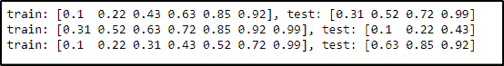

# 什么是机器学习中的交叉验证，如何实现？

> 原文：<https://www.edureka.co/blog/cross-validation-in-machine-learning/>

[机器学习](https://www.edureka.co/blog/machine-learning-tutorial/)中的验证技术的问题是，它没有给出任何关于学习者将如何归纳未知数据的指示。这就是交叉验证发挥作用的地方。本文涵盖了机器学习中交叉验证的基本概念，本文讨论了以下主题:

*   什么是交叉验证？
*   [交叉验证的类型](#types)
    *   [K 倍交叉验证](#kfold)
    *   [维持方式](#holdout)
    *   [排除交叉验证](#leavep)
    *   [留一交叉验证](#leaveone)
*   [交叉验证 API](#api)
*   如何度量模型的偏差-方差？
*   [交叉验证的限制](#limitation)
*   [交叉验证申请](#applications)

## 什么是交叉验证？

对于[机器学习](https://www.edureka.co/blog/machine-learning-classifier/)、*中的任何模型，如果用独立的数据集对模型进行测试，则被认为是最佳实践。*通常情况下，任何预测模型都是在一个已知的数据集上工作的，该数据集也称为训练集。

但在现实生活中，该模型将通过一个完全不同的独特数据集来测试其效率和准确性。在这种情况下，您会希望您的模型足够高效，或者至少与它为训练集显示的效率相当。基本上，这种测试被称为机器学习中的交叉验证，因此它适用于未来的任何模型。

通过 [人工智能课程](https://www.edureka.co/executive-programs/machine-learning-and-ai) 将自己转变为高技能专业人士，并获得高薪工作。

我们也可以称之为**断言统计模型如何推广到独立数据集**的技术。现在我们知道了交叉验证的含义，让我们试着用简单的术语来理解交叉验证。

交叉验证的基本目的是评估模型在未知数据集下的表现。例如，你试图在一个空门中进球。这看起来很简单，你甚至可以从相当远的地方得分。但是当有一个守门员和一群防守队员时，真正的考验就开始了。这就是为什么你需要在真正的比赛中接受训练，面对所有的压力，仍然能够进球。

类似地，一个统计模型以这样的方式被训练，即它在使用交叉验证的其他未知数据集的效率上是优秀的。

## **交叉验证的类型**

机器学习中有两种交叉验证技术。

1.  **详尽的交叉验证**–这种方法基本上涉及以所有可能的方式测试模型，它是通过将原始数据集分成训练集和验证集来完成的。示例:留一交叉验证、留一交叉验证。

2.  **非穷举交叉验证**–在这种方法中，原始数据集没有被分成所有可能的排列和组合。举例:K 倍交叉验证，维持法。

让我们更详细地了解机器学习中各种类型的交叉验证。

### **K 倍交叉验证**

在机器学习中，永远没有足够的数据来训练模型。即使这样，如果我们删除一些数据，它也会造成[过度拟合](https://www.edureka.co/blog/overfitting-in-machine-learning/)机器学习模型的威胁。如果没有为训练阶段提供足够的数据，也可能无法识别主要模式。

通过减少数据，我们也面临着由于偏差引起的误差而降低精确度的风险。为了克服这个问题，我们需要一种方法来提供大量的训练数据和一些测试数据。k 倍交叉验证正是这样做的。

它是如何工作的？

在这种交叉验证技术中，数据被分成 k 个子集。我们从这些数据中选择一个子集，并将其作为模型的验证集。我们保留 k-1 个子集用于训练模型。

对所有“k 次试验”的误差估计进行平均，以获得模型的有效准备状态。每个 k 子集将在验证集中至少出现一次。它也包含在 k-1 训练集中至少一次。这大大降低了由偏置引起的误差。它还减少了方差，因为在验证中使用了 k 个子集的每一个。

### **分层 K 倍交叉验证**

在这种技术中，k 倍交叉验证有一点小小的变化。它会发生变化，使得每个折叠在整个集合中具有每个目标类的大约相等百分比的样本。在预测问题的情况下，平均响应值在所有折叠中近似相等。

在某些情况下，响应变量存在很大的不平衡。让我们用一个例子来理解这一点。在房屋定价问题中，一些房屋的价格可能比其他房屋的价格高得多。此外，在分类问题中，样本的负样本可能比正样本多。为了解决这种差异，我们遵循机器学习中的分层 k-fold 交叉验证技术。

### **维持方式**

这是所有方法中最简单的交叉验证方法。在这种方法中，我们将数据点随机分配给两个数据集。在这种情况下，大小无关紧要。

这背后的基本思想是从您的训练集中删除一部分，并使用它从基于其余数据训练的模型中获得预测。这种方法有很大的差异，因为只需运行一次就可以执行所有这些。它也可能给出误导性的结果。

### **排除交叉验证**

在这种方法中， **p** 个数据点被排除在训练数据之外。假设数据集中有 **m** 个数据点，那么 **m-p** 个数据点用于训练阶段。并且将 **p** 数据点保存为验证集。

这种技术相当详尽，因为对原始数据集中所有可能的组合重复上述过程。为了检查模型的整体有效性，对所有试验的误差进行平均。

由于模型需要为所有可能的组合和相当大的 **p** 进行训练和验证，因此在计算上变得不可行。

### **留一交叉验证**

这种交叉验证的方法类似于不考虑 p 的交叉验证，但唯一的区别是在这种情况下 **p = 1** 。它实际上节省了很多时间，这是一个很大的优势。

尽管如果样本数据太大，仍然会花费很多时间。但是它仍然比留 p-out 交叉验证法要快。

既然我们已经讨论了不同类型的交叉验证技术，让我们来看看交叉验证 API。

## **交叉验证 API**

我们不必手动实现交叉验证，Python 中的 Scikit-Learn 库提供了一个简单的实现，可以相应地拆分数据。根据不同的交叉验证策略，可以使用交叉验证迭代器。

*   k-fold 交叉验证:KFold() scikit-learn 类

*   Leave-one-out 交叉验证:LeaveOneOut() scikit-learn 类

*   Leave-p-out 交叉验证:LeavePOut() scikit-Learn 类

*   分层 K 折叠交叉验证:StratifiedKFold() scikit-learn 类

例如，让我们尝试使用 Kfold 和 python 来创建训练集和验证集。

```
from numpy import array
from sklearn.model_selection import KFold
# sampling the data
data = array([0.10, 0.22, 0.31, 0.43, 0.52, 0.63,0.72,0.85,0.92,0.99])
# Splittinf the data
kfold = KFold(3, True, 1)
# enumerating the splits
for train, test in kfold.split(data):
    print('train: %s, test: %s' % (data[train], data[test]))

```

**输出:** 

类似地，我们可以根据需求和数据类型选择其他的[交叉验证迭代器](https://scikit-learn.org/stable/modules/cross_validation.html#cross-validation-iterators)。现在让我们试着理解如何计算模型的偏差和方差。

## **如何测量模型的偏差方差**

如果做 k 重交叉验证，会得到 k 个不同的估计误差。在理想的情况下，这些误差总和为零，但是得到这样的结果是非常不可能的。为了得到偏差，我们取所有估计误差的平均值。

为了计算模型的方差，我们取所有误差的标准差。如果我们得到一个较低的标准差值，这意味着我们的模型不会随着不同的训练数据集而有很大的变化。

重点应该是保持模型的偏差和方差之间的平衡。这可以通过将方差减小到最小并控制偏差来实现。这种权衡通常会产生更好的预测模型。

但是交叉验证也有一些限制。让我们来看看交叉验证的各种限制。

## **交叉验证的限制**

以下是交叉验证面临的一些限制:

1.  在理想情况下，交叉验证会产生最佳结果。但是在**数据**不一致的情况下，结果可能会大相径庭。模型会遇到什么样的数据是相当不确定的。

2.  预测建模通常需要在数据方面进行**进化，这可以极大地改变训练和验证集。**

3.  结果可能**因数据集**的特征而异。假设我们制作了一个预测模型来检测一个人的疾病，然后用一组特定的人群来训练它。它可能随一般人群而变化，导致不一致和效率降低。

## **交叉验证应用**

为了防止机器学习模型[过拟合和欠拟合，](https://www.edureka.co/blog/overfitting-in-machine-learning/)有一些交叉验证的其他应用，如下所列:

1.  我们可以用它来比较一组预测建模过程的性能。

2.  交叉验证在医学研究领域表现出色。

3.  它可以用于荟萃分析，因为许多数据分析师已经在使用交叉验证。

这就把我们带到了本文的结尾，在这里我们学习了机器学习中的交叉验证。我希望你清楚本教程中与你分享的所有内容。

*如果你发现这篇文章与“机器学习中的交叉验证”相关，请查看一下  Edureka 的[机器学习与 Python](https://www.edureka.co/machine-learning-certification-training) 认证培训，  一家值得信赖的在线学习公司，拥有遍布全球的 250，000 多名满意的学习者。*

我们在这里帮助你踏上旅程的每一步，并为想成为  [机器学习工程师](https://www.edureka.co/blog/how-to-become-a-machine-learning-engineer/)的学生和专业人士设计课程。该课程旨在让您在 Python 编程方面有一个良好的开端，并训练您掌握核心和高级 Python 概念以及各种  [机器学习算法](https://www.edureka.co/blog/machine-learning-algorithms/) ，如[【SVM】](https://www.edureka.co/blog/support-vector-machine-in-python/)[决策树](https://www.edureka.co/blog/decision-tree-algorithm/)等。

如果您遇到任何问题，请在“机器学习中的交叉验证”的评论部分提出您的所有问题，我们的团队将很乐意回答。