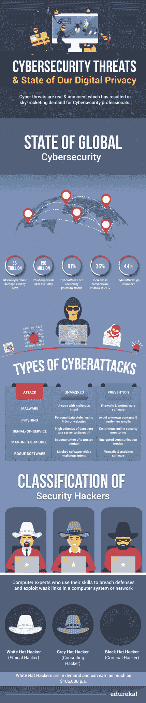

# 网络安全威胁和我们的数字隐私状况

> 原文：<https://www.edureka.co/blog/cybersecurity-threats-state-of-digital-privacy/>

*“Cybersecurity Threats are much more than a matter of IT,” IBFS Global Chief Information Security Officer & Board Advisor, Société Générale.*

**网络安全是一个大部分时间都不为人知的领域。只有少数领先的组织有专门的团队来保护他们的隐私和系统安全。但是，网络安全从未在全球范围内被大规模采纳为一种职业，甚至是一个 IT 领域。**

**直到 2010 年，组织中数据的安全性和隐私性还是每一个在那里工作的专业人员的责任。不幸的是，在当今快节奏的世界中，这种方法已经过时了，与技术专业人员相比，黑客领先了好几年。让我们用一个信息图来更好地理解这一点:**

## ****

****网络安全威胁的类型以及如何避免它们|网络安全| Edureka Live****

**[https://www.youtube.com/embed/CRvyhSUsgJg](https://www.youtube.com/embed/CRvyhSUsgJg)

## 网络安全威胁:现代趋势

从上图可以明显看出，网络安全和我们的数字隐私状况在过去几年里一直在恶化。这就引出了一个问题，“*我们的数字身份和数据安全吗？*

与 IT 行业的大多数问题一样，技术趋势的转变解决了网络安全威胁带来的大多数问题。公司、组织甚至有影响力的人最近开始建立自己的网络安全团队。据 Indeed.com 称，事实上，道德和咨询黑客可以获得年薪高达 10.6 万美元的工作。

随着黑客学会适应安全策略，网络安全威胁是真实存在的，并将变得更加复杂。这使得网络安全成为最具活力的领域之一，比任何其他 IT 部门都需要更多的学习。幸运的是，对于希望进入网络安全岗位的入门级专业人士来说，就业市场上有数百个(如果不是数千个)空缺。此外，进入这个令人敬畏的领域没有坚实的先决条件。不过，初级的网络技能会更好。如果你获得了[网络安全培训](https://www.edureka.co/cybersecurity-certification-training)认证，比如 [CompTIA Security+](https://www.edureka.co/comptia-security-plus-certification-training) 、[认证道德黑客](https://www.edureka.co/ceh-ethical-hacking-certification-course)、[网络安全大师](https://www.edureka.co/masters-program/cybersecurity-training)等等，你也可以在市场上获得竞争优势。

*希望您喜欢我们对当前网络安全威胁的分析。如果您对此有任何问题或建议，欢迎在下面的评论区告诉我们，或者今天就参加我们在布里斯托尔举办的[网络安全培训..](https://www.edureka.co/cybersecurity-certification-training-bristol)***