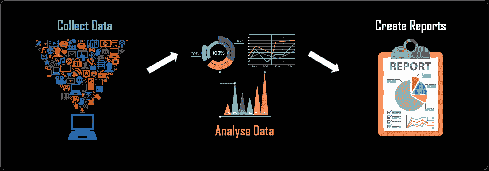
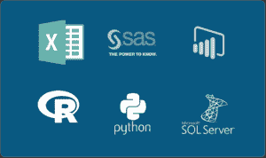
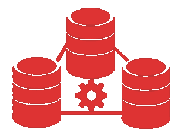

# 数据分析师角色和职责:您需要知道的一切

> 原文：<https://www.edureka.co/blog/data-analyst-roles-and-responsibilities/>

数据越来越多地塑造着我们每天与之互动的系统。无论你是在谷歌上搜索什么，使用 Siri，还是浏览你的脸书 feed，你都在消费和产生数据。我们已经到了一个每天产生 2.5 万亿字节 T2 的时代，这是一个非常大的数据量。那么，如何处理这些数据呢？嗯，这就是**数据分析师**介入的原因。让我们来看看**数据分析师的角色和职责**。

在这篇博客中，我将涉及以下主题:

*   [谁是数据分析师？](#whoisdataanalyst)
*   [数据分析师角色和职责](#roles)

因此，在深入了解数据分析师的角色和职责之前，让我们看看谁是数据分析师？

## **谁是数据分析师？**

数据分析师通过获取关于特定主题的信息，然后**解释、分析并在综合报告中呈现调查结果**，从而为他们的公司带来价值。许多不同类型的企业使用数据分析师来提供帮助。作为专家，数据分析师经常被要求使用他们的技能和工具来提供竞争分析并确定行业内的趋势。

## **数据分析师角色和职责**

根据专业知识水平，数据分析师可能有以下角色:

*   ### **Determine the organizational goal:**

数据分析师最重要的角色之一是确定组织的目标。这涉及到与合作

*   IT 团队
*   管理
*   数据科学家

*   ### **Mining data**

数据挖掘是一种通过数学和计算算法来构建原始数据并形成或识别数据中各种模式的过程。它有助于产生新的信息，开启各种洞见。数据分析师必须经常挖掘或收集数据。从公司数据库获取数据或从外部来源提取数据以进行任何类型的研究是任何数据分析师的主要角色之一。

*   ### **Data cleaning**

数据清理是整个数据准备过程的第一步，是分析、识别和纠正杂乱的原始数据的过程。当分析组织数据以做出战略决策时，数据分析师必须从彻底的数据清理过程开始。好的分析依赖于干净的数据——就这么简单。清理包括移除可能扭曲分析的数据或将数据标准化为单一格式。

*   ### **分析数据**

    

不用说，这个角色对于任何数据分析师来说都是必须的。[数据分析](https://www.edureka.co/blog/big-data-analytics/)是从数据中探索特定事实以回答特定问题的艺术。

它是使用分析和逻辑推理来评估数据的过程，以检查所提供数据的每个组成部分。一种是使用统计工具来分析和解释数据。

分析中使用了各种工具和编程语言。

*   ### **Define the trend and pattern**

数据分析师花费大量时间在复杂的数据集中寻找趋势、相关性和模式。趋势也很重要。数据分析师寻找短期和长期趋势。

趋势分析有助于您了解您的企业表现如何，并预测当前的业务运营和实践将带您走向何方。做得好的话，它会给你一些想法，告诉你如何改变事情，让你的企业朝着正确的方向发展。

*   ### **Create a clear and visual report**

报告将原始数据转化为信息。报告有助于公司监控其在线业务，并在数据超出预期范围时发出警报。好的报告应该向最终用户提出关于业务的问题。

能够用数据讲述一个令人信服的故事，对于表达你的观点并吸引听众至关重要。因此，当涉及到数据的影响时，数据可视化可能会产生成败的影响。分析师使用引人注目的高质量图表和图形，以清晰简洁的方式展示他们的发现。

*   ### **Maintain database and data system**

 数据分析师必须确保电子存储数据的存储、可用性和一致性满足组织的需求。数据分析师需要有关于数据模型，数据库设计开发的技术专长，以充分利用它。

他们通过从第一手和第二手来源获取数据来开发和维护数据库，并构建脚本来使我们的数据评估流程更加灵活或可跨数据集扩展。

Follow the Correct Path and Become A Data Analyst [<button>Enroll Now</button>](https://www.edureka.co/data-analyst-certification)So, with this, we come to an end of this Data Analyst Roles and Responsibilities Blog. I hope you got an understanding of the various Roles of a Data Analyst in the industry.  With all these responsibilities the [**Salary of Data Analyst**](https://www.edureka.co/blog/data-analyst-salary/) is growing at an accelerated rate.

[***数据分析师硕士项目***](https://www.edureka.co/masters-program/data-analyst-certification) 遵循一个固定的结构，包括 4 门核心课程和 7 门选修课，分布在 15 周内。它让你成为数据分析相关关键技术的专家。这是由领先的行业专家推荐的结构化学习路径，可确保您转变为数据分析专家，同时让您学习各种工具的用法，如 [R](https://www.edureka.co/r-for-analytics) 、SAS、 [Tableau](https://www.edureka.co/tableau-certification-training) 、Python、Qlikview、Advanced Excel、机器学习等。个别课程侧重于一两个特定技能的专业化，但是，如果你打算成为一名数据分析师，那么这是你应该遵循的道路。

如果您对本文有任何疑问，请在下面的评论区留下，我们会尽快回复。