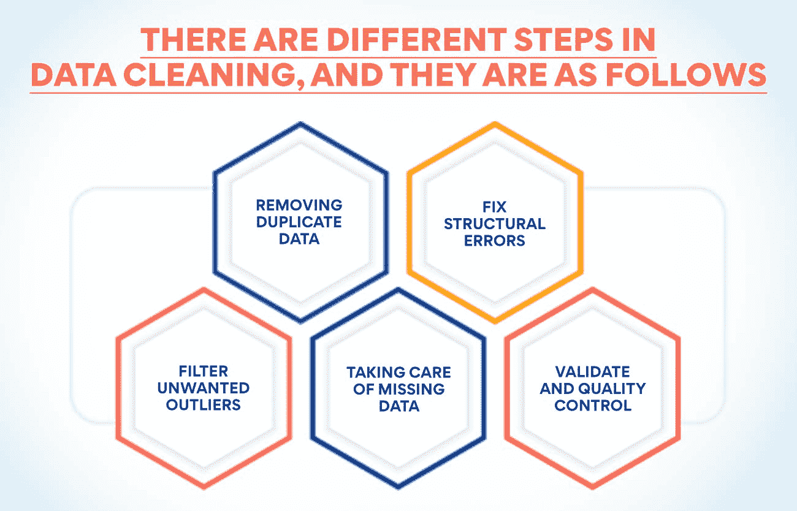
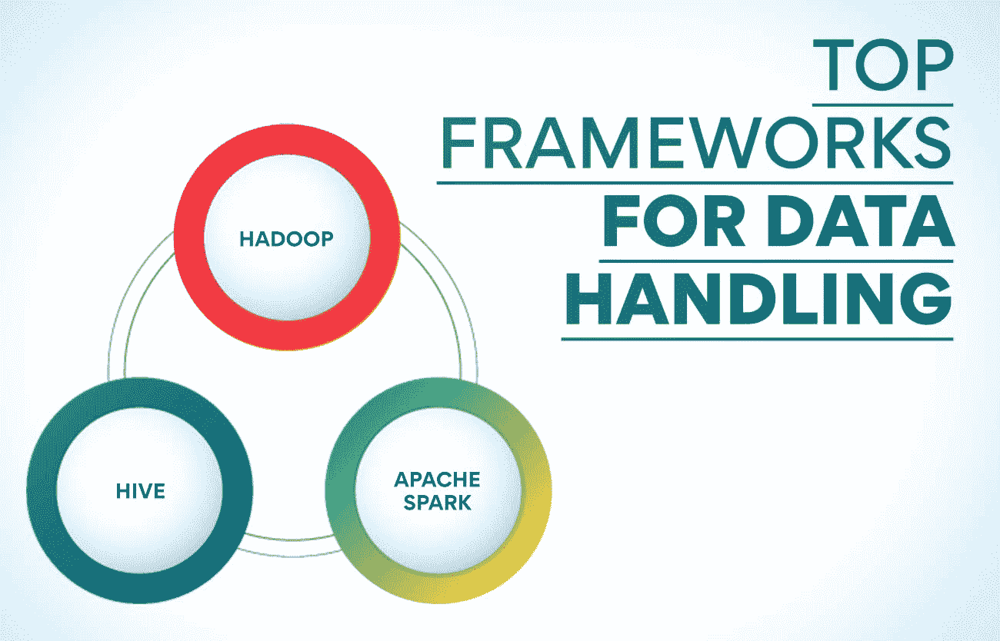

# 数据处理:含义、框架和例子

> 原文：<https://www.edureka.co/blog/data-handling/>

现在几乎所有的组织都在进行分析，这样他们就可以根据确凿的事实而不是猜测做出决策。所有类型的分析都需要收集大量数据并为分析做好准备。这些数据可以在组织内部获得，也可以从外部获得。公司产生数据是其日常活动的一部分。但是信息可以在不同的地方以不同的形式获得。收集、清理、存储和分析数据的过程被称为数据处理。

产品管理高级管理人员证书课程详细讲述了如何利用数据来发现有助于公司做出更好决策的见解。人们可以从我们的网站上更多地了解这个项目以及它如何使他们受益。现在让我们来理解这个过程是什么，以及用于这个过程的不同框架。

**什么是数据处理？**

数据处理是收集、清理、组织和分析公司内部或外部来源的数据的过程。组织收集和分析大量数据，通常称为大数据，以揭示有价值的见解。这些见解有助于公司理解过去各种事件的原因，并预测未来的结果。数据分析有助于公司做出更好的决策。数据处理需要该领域专家的服务和各种工具的帮助。为了更好地理解该功能，我们必须详细了解该过程的每个部分。

**数据收集**

这是数据处理的第一步。数据可以从各种来源获得，分析人员在使用它们之前必须收集它们。在收集数据之前，专家必须决定数据分析的预期结果。这将有助于他们了解他们必须收集的信息种类以及在哪里可以找到这些信息。下一步是决定用什么方法来收集和处理数据。这项活动是必要的，因为信息，因为他们存在，是无用的。它们必须被收集和清洗用于分析。

可以使用各种方法收集信息，如调查、交易跟踪、访谈、观察、表格或社交媒体监控。人们普遍使用两种数据收集方法。主要方法是在任何人进行任何处理之前，由研究人员进行的第一次数据收集。这种方法很贵，但更准确。在第二种方法中，专家收集已经过处理的数据。这种方法不贵，但可能需要更精确。可以说是二手资料。

**数据清理**

数据清理是指从收集的数据中删除损坏的、不正确的、重复的、格式错误的或不完整的数据。这个过程在数据处理中非常重要，因为如果信息不正确，分析的结果也会是错误的。这可能会对公司管理层的决策产生严重影响。数据清理不应该被误认为是转换，因为那是将数据从一种格式转换成另一种格式的任务。该过程用于转换用于存储或分析目的的格式。

数据清理有不同的步骤，具体如下:

1.  **删除重复数据**

清理的第一步是从数据中删除重复或不相关的观察值。无关数据指的是分析时不需要的信息。当从各种来源收集数据时，可能存在数据重复。这些必须删除，这是数据清理的关键步骤之一。

2.  **修复结构错误**

这些是命名错误、错别字或大写错误。必须纠正这些错误，因为它们会导致错误的类别或分类。这是数据处理的重要一步，因为这些会影响分析的结果。

3.  **过滤不想要的离群值**

观察数据时，您可能会发现与您正在分析的数据不符的细节。删除这些信息将使您的结果更加准确。并非所有的异常值都是不正确的，这使得在这里做出正确的决定是必要的。

4.  **处理丢失的数据**

由于大多数算法不接受缺失值，因此处理缺失数据至关重要。解决这一问题的一种方法是删除带有缺失值的观察值。另一种方法是根据其他观察值输入缺失值。也有可能改变你使用数据的方式。

5.  **验证和质量控制**

这个阶段，要看你能不能回答一些问题。您必须确认数据是有意义的，并遵循其字段的规则。同样重要的是，看看这些信息是否证明或否定了你的理论，或者引出了什么真知灼见。您还必须确保能够发现数据中的趋势。

**也读:[产品管理:初学者指南](https://www.edureka.co/blog/product-management/)**

**数据处理**

这是输入原始数据以获得有价值见解的步骤。对于小型数据集，您可以使用 SQL 查询或 Excel 等手动技术。手动过程很慢，有时可能不准确。但当要处理的数据庞大时，数据分析师会为此使用机器学习和人工智能。一旦专家完成数据处理，他们就可以发现有价值的见解，使决策更加准确。

**数据可视化**

一旦专家完成数据处理，结果就会以一种只有数据专家才能阅读的形式出现。他们需要把它变成其他人容易阅读和理解的信息。专家使用可视化工具将结果转换成每个人都可以阅读的图形、图表或报告。

**数据存储**

以一种公司可以方便地访问以供参考的方式存储数据至关重要。确保此类信息不会被未授权人员获取是非常重要的。这种安全措施必须由组织来实施。

我们已经看到了数据处理过程及其所涉及的内容。现在让我们看看专家如何处理非结构化数据以获得必要的见解。这些在知名机构提供的产品管理高级管理人员证书课程中有详细介绍。您可以访问我们的门户网站，了解有关该计划的更多信息。

**处理非结构化数据**

也可以处理非结构化数据，但采用不同的流程。非结构化数据以音频文件、图像、应用程序日志、JSON 和 CSV 导出以及 BLOBs 的形式出现。使用这些类型数据的过程如下。

**收集和准备**

公司必须做的第一件事是决定收集非结构化数据要包括哪些来源。您必须尽可能验证数据并删除任何不完整的数据。

**移动数据**

您不能将非结构化数据添加到关系数据库中，因此您必须将其移动到大数据环境中。通常，这样的数据被转移到像 Hadoop 这样的数据处理框架中。

**数据探索**

分析团队可能不清楚可用数据的范围。探索是一种初步分析，帮助团队清楚地了解数据集的内容，并确定分析目标。在处理大型数据集时，这是非结构化数据的一个重要步骤。

**将结构化引入非结构化数据**

**元数据分析**——元数据是结构化数据，因此可以按原样处理。分析它有助于理解非结构化数据的内容。

**正则表达式**–这是一种识别意思相同的数据的方法。人们可能用不同的格式表示日期。但都传达了同样的意思。正则表达式有助于简化传达相同内容的非结构化数据。

**标记化**–使用这种方法可以发现常见模式的出现。在一篇文章中可能会有重复多次的短语。这些使用标记来识别，并且这些标记可以被组合以创建语义结构。

**分段**–该过程识别可以分组的数据。例如，可以将同一天生成的信息分组进行分析。

当所有上述过程完成后，数据就可以进行分析和可视化了。这些操作与针对结构化数据执行的操作类似。

**数据处理的顶级框架**

**Hadoop**

Hadoop 是一个适合可扩展、分布式和可靠计算的框架。这个框架可以存储和处理大量数据。Hadoop 依赖于计算机集群和模块，这些集群和模块是在硬件最终会出现故障的假设下创建的。该框架将处理这种故障。该框架将文件分割成大型数据块，这些数据块分布在集群中的节点上。在节点中处理数据的方法提高了效率和速度。这个数据处理框架在现场数据中心通过云工作。

Hadoop 有四个不同的模块。Hadoop Common 存储了其他模块所需的库和实用程序。Hadoop 分布式文件系统(HDFS)存储数据。Hadoop 的另一个资源协商器(YARN)是资源管理系统，它处理集群中的计算资源和用户应用程序的调度。MapReduce 涉及大规模数据处理的 MapReduce 模型的实现。对于客户分析、企业项目和数据湖的创建来说，这是一个很好的框架。这个数据处理工具非常适合批处理，并且可以与大多数其他大数据框架集成。

**同时阅读:[如何成为更好的产品经理:10 大技巧](https://www.edureka.co/blog/product-manager)**

**阿帕奇火花**

Apache Spark 是另一个可以执行流处理的批处理框架，也是一个混合框架。它很容易使用，人们可以用 Java、Scala、Python 和 r 编写应用程序。这个框架对于机器学习很好，但缺点是它需要一个集群管理器和分布式存储系统。您可以在一台机器上运行 Spark，每个 CPU 内核有一个执行器。这个开源集群计算框架可以作为一个独立的框架使用，也可以与 Hadoop 或 Apache Mesos 结合使用。

这个数据处理框架使用了一种叫做弹性分布式数据集(RDD)的数据结构。这个只读的多数据项集合分布在整个机器集群中。它作为一组分布式程序工作，提供有限形式的分布式共享内存。Spark 可以访问 HDFS、卡桑德拉、HBase 和 S3 等资源。Spark 核心充当 Spark 的基础。它使用两种形式的变量，称为广播变量和累加器。Spark Core 包含其他元素，如 Spark SQL、Spark Streaming、Spark MLlib 和 Graph X

**鼠标**

脸书创建了 Apache Hive，这是一个将 SQL 请求转换成 MapReduce 任务的框架。这个框架包含三个组成部分。解析器是对传入的 SQL 请求进行排序的元素。优化器是另一个优化 SQL 请求以提高效率的组件。Hive 中的另一个元素是 Executor，它在 MapReduce 框架中启动任务。可以将这个框架与 Hadoop 集成，作为处理大数据量的服务器部分。

即使在发布十年后，Hive 仍然是一个数据处理框架，保持着大数据分析使用最多的框架的地位。Hortonworks 在 2018 年发布了 Hive 3，当时它将搜索引擎从 MapReduce 切换到 Tez。这个框架具有出色的机器学习能力。您可以将 Hive 与大多数其他大数据框架集成。

这些只是一些常用于数据处理的顶级框架。你可以在知名机构举办的[产品管理高级主管证书课程](https://www.edureka.co/highered/advanced-executive-program-in-product-management-iitg)中了解更多关于数据处理框架的知识。关于本课程的更多细节以及它如何使处理产品的专业人员受益，请访问我们的网站。

**总结**

数据处理是当今所有组织的基本流程。利用可用信息获得有价值的见解，可以让公司做出更好的决策，并快速实现目标。这一过程的结果取决于数据的正确选择和处理方式。数据处理框架并不能作为一种通用的解决方案，因此为每个过程选择不同的框架是明智的。获得期望的结果取决于处理这项工作的专家的能力。

**更多信息:**

产品生命周期的阶段和例子是什么？

[制定优秀产品战略的指南](https://www.edureka.co/blog/product-strategy/)

[创建成功上市战略的步骤](https://www.edureka.co/blog/go-to-market-strategy/)

[什么是产品规划，是怎么做的？](https://www.edureka.co/blog/product-planning/)