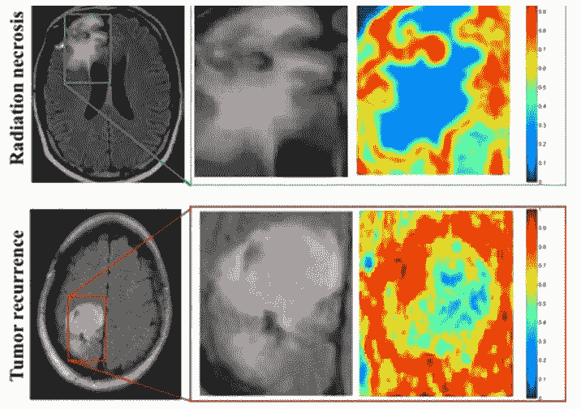
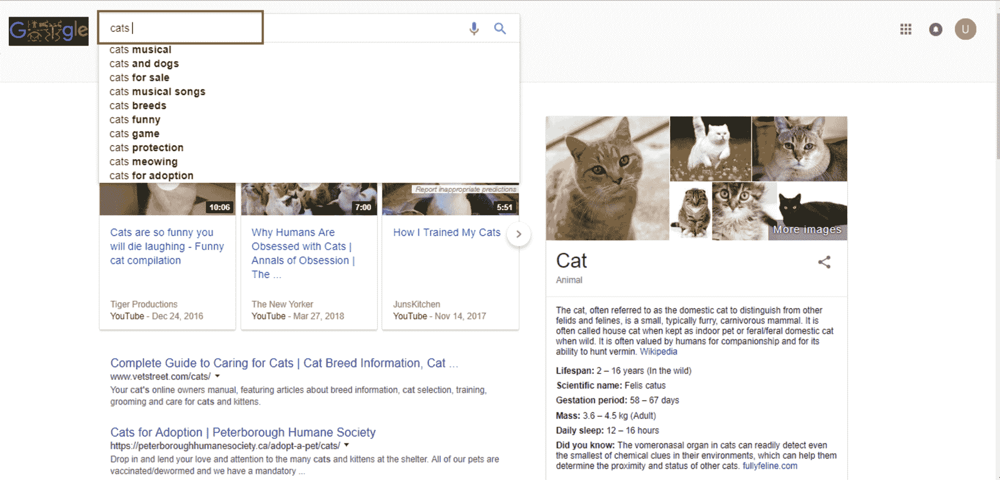
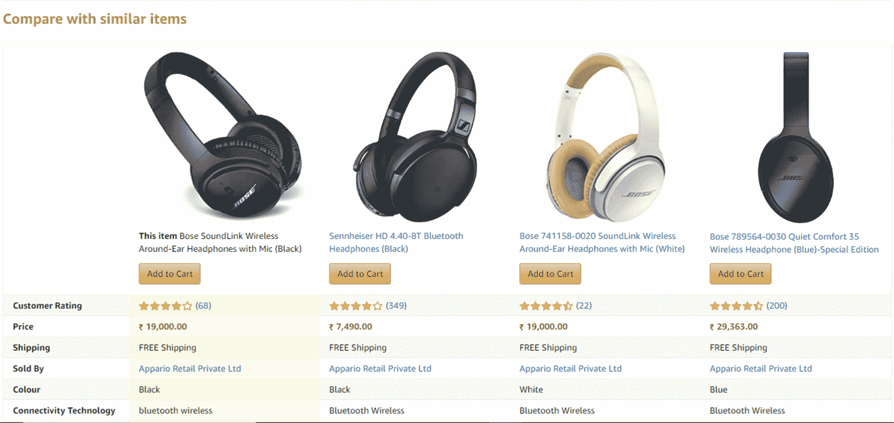
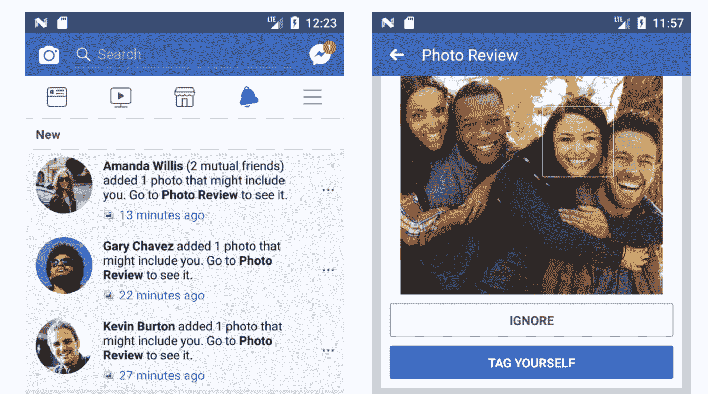
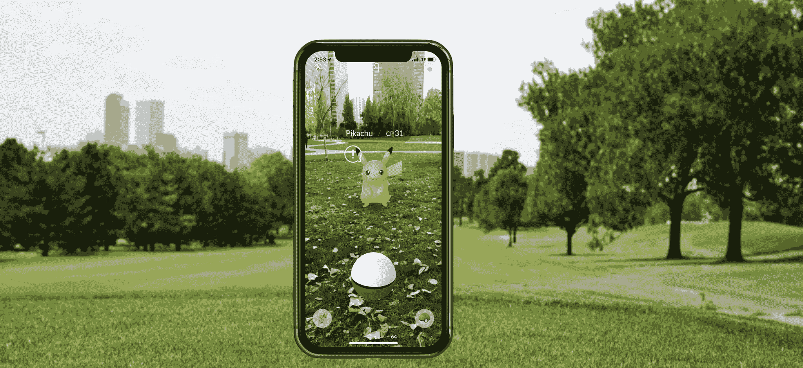

# 十大数据科学应用

> 原文：<https://www.edureka.co/blog/data-science-applications/>

***数据科学应用*** 的作用并不是一夜之间演变而来的。由于更快的计算和更便宜的存储，我们现在可以在几分钟内预测结果，而这可能需要几个小时才能完成。

一名数据科学家一年能拿到高达 124，000 美元的收入，这要归功于该领域熟练专业人员的缺乏。这就是 [***数据科学与 Python 课程***](https://www.edureka.co/data-science-python-certification-course) 空前高涨的原因！

通过这篇博客，我们为您带来了 10 个基于数据科学概念的应用，探索了不同的领域，例如:

*   [欺诈和风险检测](#fraudandriskdetection)
*   [医疗保健](#healthcareindatascience)
*   [互联网搜索](#internetsearch)
*   [针对性广告](#targetedadvertising)
*   [网站推荐](#websiterecommendations)
*   [高级图像识别](#imagerecognition)
*   [语音识别](#speechrecognition)
*   [航线规划](#airline)
*   [游戏](#gaming)
*   [增强现实](#augreality)

[//html5-player.libsyn.com/embed/episode/id/10324679/height/360/theme/legacy/thumbnail/yes/direction/backward/](//html5-player.libsyn.com/embed/episode/id/10324679/height/360/theme/legacy/thumbnail/yes/direction/backward/)

[//html5-player.libsyn.com/embed/episode/id/10324679/height/360/theme/legacy/thumbnail/yes/direction/backward/](//html5-player.libsyn.com/embed/episode/id/10324679/height/360/theme/legacy/thumbnail/yes/direction/backward/)

## 欺诈与风险检测

数据科学最早的应用是在金融领域。公司受够了每年的坏账和亏损。然而，他们有很多数据，这些数据是在批准贷款时最初的文书工作中收集的。他们决定引进 ***[数据科学家](https://www.edureka.co/blog/who-is-a-data-scientist/)*** 来拯救他们免受损失。

多年来，银行公司学会了通过客户档案、过去的支出和其他基本变量来分而治之，分析风险和违约的概率。此外，这也有助于他们根据客户的购买力推销他们的银行产品。

## **医疗**

尤其是医疗保健行业，从数据科学应用中获益匪浅。

### **1。医学图像分析**

诸如检测肿瘤、动脉狭窄、器官描绘之类的过程采用各种不同的方法和框架，如 MapReduce，来为诸如肺纹理分类之类的任务找到最佳参数。它将机器学习方法、支持向量机(SVM)、基于内容的医学图像索引和小波分析应用于固体纹理分类。 

### **2。遗传学&基因组学**

数据科学应用还可以通过遗传学和基因组学研究实现更高级别的个性化治疗。目标是了解 DNA 对我们健康的影响，并找到遗传学、疾病和药物反应之间的个体生物学联系。数据科学技术允许在疾病研究中整合不同种类的数据和基因组数据，这提供了对特定药物和疾病反应中的遗传问题的更深入理解。一旦我们获得可靠的个人基因组数据，我们将对人类 DNA 有更深入的了解。先进的遗传风险预测将是向更多个体化治疗迈出的重要一步。

Want to learn Data Science? [<button>Learn Now</button>](https://www.edureka.co/data-science?)

### **3。药物开发**

药物研发过程非常复杂，涉及许多学科。最伟大的想法往往受到数十亿次测试、巨大的财务和时间支出的束缚。平均而言，正式提交需要 12 年时间。

数据科学应用和机器学习算法简化并缩短了这一过程，为从药物化合物的初始筛选到基于生物因素的成功率预测的每个步骤增加了视角。这种算法可以使用先进的数学建模和模拟而不是“实验室实验”来预测化合物在体内的作用。计算药物发现背后的想法是创建计算机模型模拟作为生物相关网络，以高精度简化未来结果的预测。

### **4。对患者的虚拟援助和客户支持**

临床流程的优化建立在这样一个理念之上，即在许多情况下，患者实际上没有必要亲自去看医生。一个移动应用程序可以给出一个更有效的解决方案，它把医生带到病人面前，而不是 T2。

人工智能驱动的移动应用程序可以提供基本的医疗支持，通常是聊天机器人。你只需描述你的症状，或者问一些问题，然后从一个联系症状和原因的广泛网络中获得关于你的医疗状况的关键信息。应用程序可以提醒你按时吃药，如果有必要，还可以预约医生。

这种方法通过鼓励患者做出健康的决定来促进健康的生活方式，节省他们排队等候预约的时间 ，并使医生能够专注于更危急的病例。

如今最受欢迎的应用是 ***你的。MD*** 和 ***Ada*** 。

**了解我们在顶级城市开设的数据科学与 Python 课程**

| 印度 | 美国 | 其他热门城市 |
| [海得拉巴的数据科学与 Python 培训](https://www.edureka.co/data-science-python-certification-course-hyderabad) | [达拉斯 Python 数据科学课程](https://www.edureka.co/data-science-python-certification-course-dallas) | [德里的数据科学与 Python 课程](https://www.edureka.co/data-science-python-certification-course-delhi) |
| [班加罗尔的数据科学与 Python 培训](https://www.edureka.co/data-science-python-certification-course-bangalore) | [夏洛特的 Python 数据科学](https://www.edureka.co/data-science-python-certification-course-charlotte) | [孟买的数据科学与 Python 课程](https://www.edureka.co/data-science-python-certification-course-mumbai) |
| [钦奈的数据科学与 Python 培训](https://www.edureka.co/data-science-python-certification-course-chennai) | [纽约的数据科学与 Python 课程](https://www.edureka.co/data-science-python-certification-course-new-york-city) | [西雅图的数据科学与 Python 课程](https://www.edureka.co/data-science-python-certification-course-seattle) |

## **互联网 搜索**

现在，当你想到数据科学应用时，这可能是你首先想到的。

当我们谈到搜索时，我们会想到“谷歌”。对吗？但是还有许多其他的搜索引擎，像雅虎、必应、Ask、AOL 等等。所有这些搜索引擎(包括谷歌)都利用数据科学算法，在几秒钟内为我们的搜索查询提供最佳结果。考虑到这一事实，谷歌每天处理超过 20pb 的数据。

如果没有数据科学，谷歌就不会是我们今天所知的“谷歌”。

##  **针对性广告**

如果你认为搜索会是所有数据科学应用中最大的，那么现在有一个挑战者——整个数字营销领域。从各种网站上的显示横幅到机场的数字广告牌——几乎所有这些都是通过使用数据科学算法来决定的。

这就是为什么数字广告能够获得比传统广告高得多的点击率。他们可以根据用户过去的行为来确定目标。

这就是为什么你可能会看到数据科学培训项目的广告，而我会在同一时间同一地点看到服装广告。

##  **网站推荐**

我们不都习惯了亚马逊上关于类似商品的建议吗？它们不仅能帮助你从数十亿的可用产品中找到相关的产品，还能增加用户体验。

许多公司根据用户的兴趣和信息的相关性，热情地使用这个引擎来推广他们的产品。亚马逊、Twitter、Google Play、网飞、Linkedin、IMDb 等互联网巨头都使用这个系统来改善用户体验。这些推荐是基于用户先前的搜索结果做出的。

##  **高级图像识别**

你上传了你和朋友在脸书上的照片，然后你开始收到给你的朋友添加标签的建议。这种自动标签建议功能使用人脸识别算法。

在他们的最新更新中，脸书概述了他们在这一领域取得的额外进展，特别提到了他们在图像识别准确性和能力方面的进步。

*“We’ve witnessed massive advances in image classification (what is in the image?) as well as object detection (where are the objects?), but this is just the beginning of understanding the most relevant visual content of any image or video. Recently we’ve been designing techniques that identify and segment each and every object in an image, a key capability that will enable entirely new applications.”*

**此外，Google 为您提供了通过上传图片来搜索图片的选项。它使用图像识别，并提供相关的搜索结果。**

## ** **语音识别****

**语音识别产品的一些最好的例子是 Google Voice、Siri、Cortana 等。使用语音识别功能，即使你不能输入信息，你的生活也不会停止。只需大声说出信息，它就会被转换成文本。然而，有时你会意识到，语音识别并不准确。**

## ****航线规划****

**众所周知，全世界的航空业都承受着巨大的损失。除了少数航空服务提供商，其他公司都在努力维持他们的入住率和运营利润。随着航空燃料价格的大幅上涨，以及需要向客户提供大幅折扣，这进一步使情况变得更糟。没过多久，航空公司就开始使用数据科学来确定改进的战略领域。现在利用数据科学，航空公司可以:**

***   预测航班延误*   决定购买哪种级别的飞机*   是直接降落在目的地还是中途停留(例如，一架航班可以有一条从新德里到纽约的直达航线。或者，它也可以选择在任何国家暂停。)*   有效推动客户忠诚度计划**

**西南航空公司和阿拉斯加航空公司是采用数据科学来改变工作方式的顶级公司之一。**

**您可以通过参考我们团队的视频来更好地了解这一点，该视频生动地讲述了数据科学应用所征服的各个领域。**

## ****数据科学应用|爱德华卡****

****

**[//www.youtube.com/embed/8Fz2nDfZinE?rel=0&showinfo=0](//www.youtube.com/embed/8Fz2nDfZinE?rel=0&showinfo=0)**

**本视频将带您了解当今数据科学应用的各个领域，以及该技术的一些潜在应用。**

## ****博彩****

**现在，游戏是使用机器学习算法设计的，随着玩家向更高层次发展，这些算法会自我改进/升级。同样在动态游戏中，你的对手(电脑)会分析你之前的移动，并相应地调整游戏。EA Sports、Zynga、索尼、任天堂、动视暴雪利用数据科学将游戏体验提升到了一个新的水平。**

## ****增强现实****

**这是未来最令人兴奋的数据科学应用的最终版本。增强现实。**

**数据科学和虚拟现实确实有关系，考虑一个包含计算知识、算法和数据的 VR 头戴设备为你提供最佳的观看体验。向这个目标迈出的一小步是热门游戏《口袋妖怪 *围棋*。能够在周围走来走去，看着墙上、街道上的口袋妖怪，那些并不存在的东西。这款游戏的创作者使用了同一公司的最后一款应用 Ingress 的数据来选择口袋妖怪和健身房的位置。**

**然而，一旦虚拟现实经济在定价方面变得可行，并且消费者像其他应用程序一样经常使用它，数据科学就更有意义了。**

**然而，除了原型之外，没有太多关于它们的信息被披露，我们也不知道它们什么时候能被普通人使用。让我们看看，未来的数据科学应用会给我们带来怎样的惊喜！**

**我希望你喜欢阅读这篇博客。对 Python 编程专业人士的数据科学的需求急剧增加，这使得该课程非常适合各种专业水平的人。[数据科学硕士项目](https://www.edureka.co/masters-program/data-scientist-certification)非常适合希望与 Python、软件和 IT 专业人员一起工作的分析专业人员，以及对分析领域感兴趣和对数据科学有热情的任何人。**

**还有，如果你正在寻找数据科学的在线结构化培训，edureka！拥有专门策划的[数据科学课程](https://www.edureka.co/executive-programs/advanced-program-data-science-course-iitg)，帮助您获得统计学、数据争论、探索性数据分析和机器学习算法(如 K-Means 聚类、决策树、随机森林和朴素贝叶斯)方面的专业知识。您还将学习时间序列、文本挖掘的概念，以及深度学习的介绍。本课程的新批次即将开始！！**