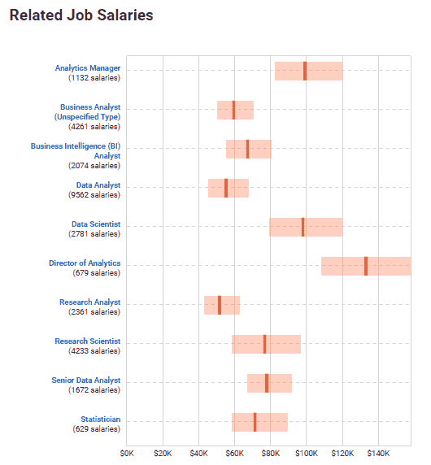
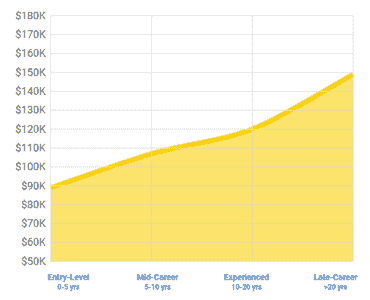
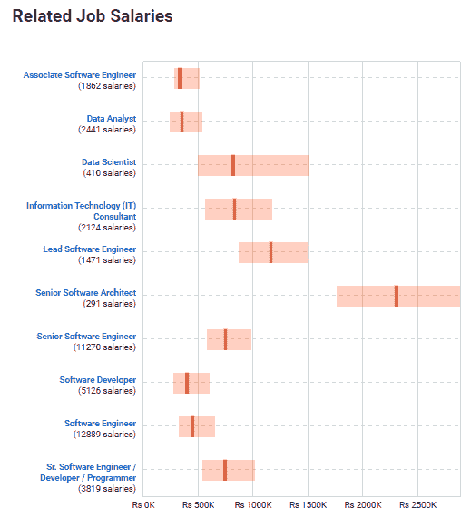
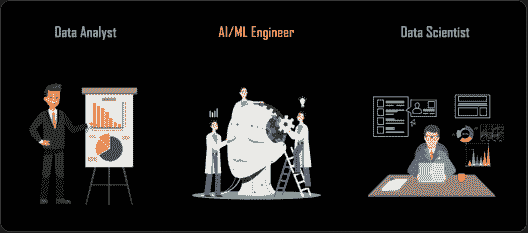
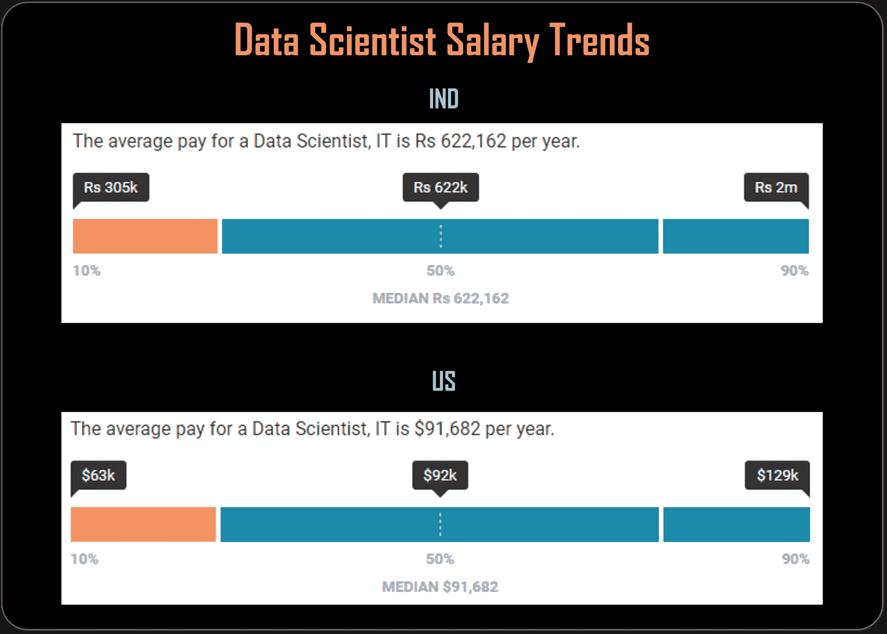

# 数据科学职业机会:开启顶级数据科学家工作的指南

> 原文：<https://www.edureka.co/blog/data-science-career-opportunities-your-guide-to-top-data-scientist-jobs>

在一个每天产生 2.5 万亿字节数据的世界里，能够组织这些海量数据以提供商业解决方案的专业人士才是真正的英雄！关于为什么大数据会一直存在，为什么 [大数据分析是最好的职业选择](https://www.edureka.co/blog/10-reasons-why-big-data-analytics-is-the-best-career-move "Why big data analytics is the best career move") ，已经说了很多。基于已经撰写和说过的内容，让我们讨论数据科学职业机会，以及为什么“数据科学家”是 21 世纪最性感的职位。

## 数据科学职业机会

根据《哈佛商业评论》(Harvard Business Review)的说法，数据科学家“是受过训练并有好奇心在大数据世界中做出发现的高级专业人士”。因此，数据科学家成为大数据分析和 it 行业梦寐以求的专业人士也就不足为奇了。

据专家预测，到 2020 年将有 40 吉字节的数据存在( [来源](http://cloudtweaks.com/2015/03/surprising-facts-and-stats-about-the-big-data-industry/) )，数据科学职业机会只会一飞冲天！在一个越来越依赖数据进行决策的世界里，熟练专业人员的短缺也导致了初创公司和老牌公司对数据科学家的巨大需求。麦肯锡全球研究所(McKinsey Global Institute)的一项研究表明，到 2018 年，仅美国就将面临约 19 万名具有深度分析技能的专业人员的短缺。随着大数据浪潮没有显示出放缓的迹象，全球公司纷纷雇佣数据科学家来驯服他们的业务关键型大数据。

[https://www.youtube.com/embed/L9vhEnciPg4](https://www.youtube.com/embed/L9vhEnciPg4)

## 数据科学家工资趋势

Glassdoor 的一份报告显示，数据科学家在美国最佳工作中遥遥领先。报告继续说，数据科学家的平均工资在美国是令人印象深刻的 91，470 美元，在₹是 622，162 美元，在网站上有超过 2300 个职位空缺。

在 Indeed.com，截至 2019 年 5 月，美国职位发布的数据科学家平均工资比全国所有职位发布的平均工资高 80%。

在印度，趋势并无不同；截至 2019 年 5 月，数据科学家职位的工资中位数为卢比。根据 Payscale.com 的数据是 622，162。

## 

## 数据科学家工作角色

数据科学家在工作场所身兼多职。数据科学家不仅负责业务分析，他们还参与构建数据产品和软件平台，以及开发可视化和机器学习算法。

一些比较突出的 [数据科学家的职称](https://www.edureka.co/blog/job-titles-for-data-scientists/ "Data Scientist job titles") 有:

*   数据科学家
*   数据架构师
*   数据管理员
*   数据分析师
*   商业分析员
*   数据/分析经理
*   商业智能经理

**顶级数据科学:简介**

## 

## 热门数据科学技能

结合了统计学知识和批判性思考能力的编码技能，构成了成功数据科学家的武器库。将在数据科学领域带来巨大职业机会的一些受欢迎的数据科学家技能包括:

*   编程语言:R/Python/Java
*   统计学和应用数学
*   [Hadoop](https://www.edureka.co/blog/hadoop-ecosystem) 和 [Spark](https://www.edureka.co/blog/spark-streaming/) 的工作知识
*   数据库:SQL 和 NoSQL
*   [机器学习](https://www.edureka.co/blog/what-is-machine-learning/)和[神经网络](https://www.edureka.co/blog/neural-network-tutorial/)
*   深度学习框架熟练程度: [TensorFlow，Keras，Pytorch](https://www.edureka.co/blog/keras-vs-tensorflow-vs-pytorch/)
*   创造性思维和行业知识

下面的 Payscale.com 图表显示了美国和印度数据科学家的平均薪资。

货币:印度–₹，美国–美元

数据科学职业机会的上升趋势预计将持续很长一段时间。随着数据渗透到我们的生活中，公司试图理解产生的数据，技术娴熟的数据科学家将继续受到大大小小企业的青睐。一个典型的例子是，看看 Indeed.com 的就业委员会就可以发现，顶尖公司都在竞相招聘数据科学家。一些大公司包括脸书、Twitter、Airbnb、苹果、LinkedIn、IBM 和 PayPal 等。

提升数据科学和大数据分析技能的时机已经成熟，您可以利用数据科学职业机会。参加[数据科学培训](https://www.edureka.co/masters-program/data-scientist-certification)，这是开启您在数据科学领域职业生涯的最佳机会。

*此外，Edureka 还特别策划了 [**数据科学与 Python 课程**](https://www.edureka.co/data-science-python-certification-course) ，帮助你获得机器学习算法方面的专业知识，如 K-Means 聚类、决策树、随机森林和朴素贝叶斯。您还将学习统计学、时间序列、文本挖掘的概念，以及深度学习的介绍。新一批[数据科学课程](https://www.edureka.co/executive-programs/advanced-program-data-science-course-iitg)即将开始！！*

有问题要问我们吗？请在评论区提到它，我们会给你回复。

**相关帖子:**

[数据科学培训的优势](https://www.edureka.co/blog/advantages-of-data-science-training/ "Advantages of Data Science Training")

[顶尖数据科学初露头角的数据科学家面试问题](https://www.edureka.co/blog/interview-questions/data-science-interview-questions/ "Top Data Science interview questions")