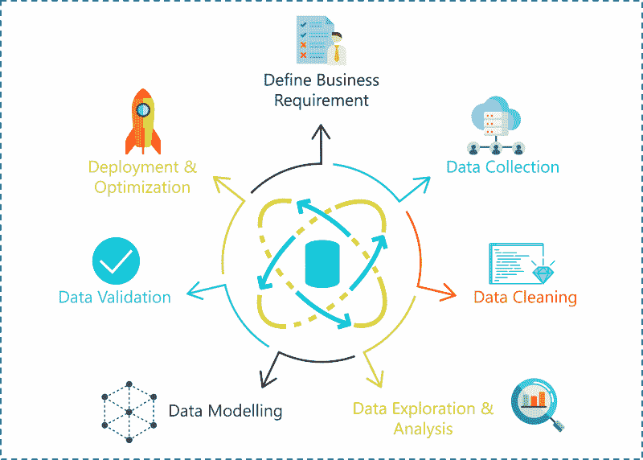
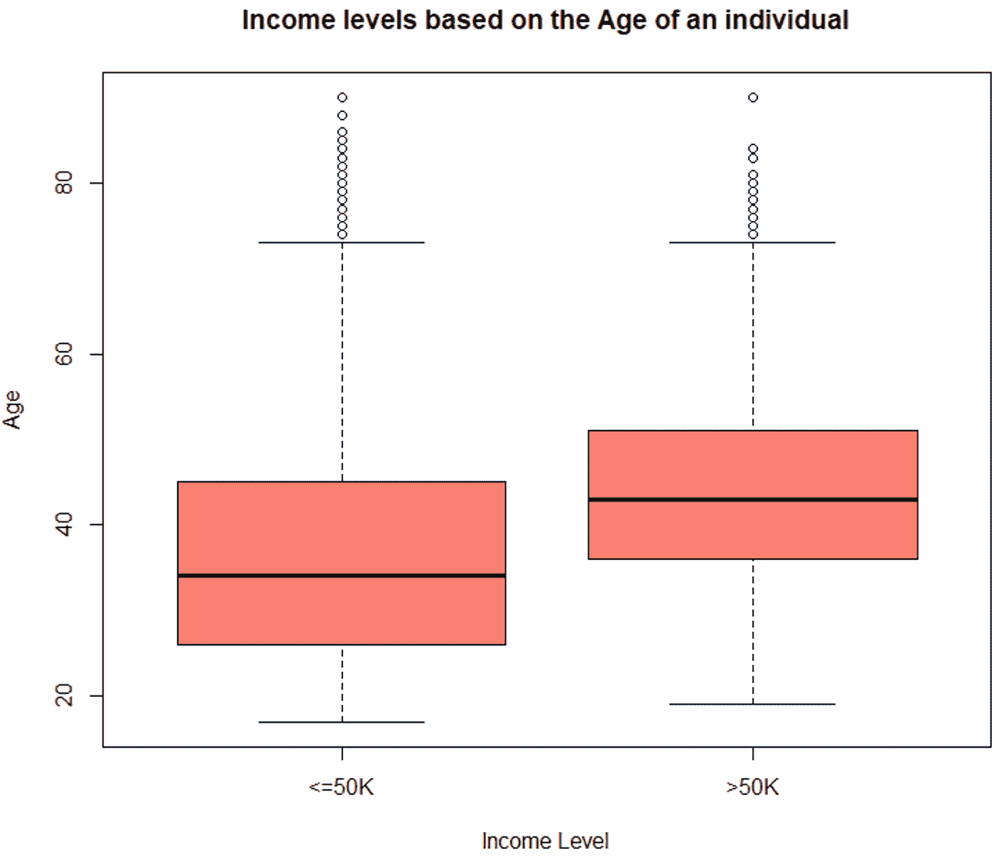
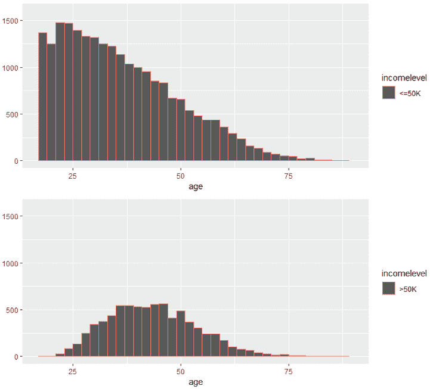
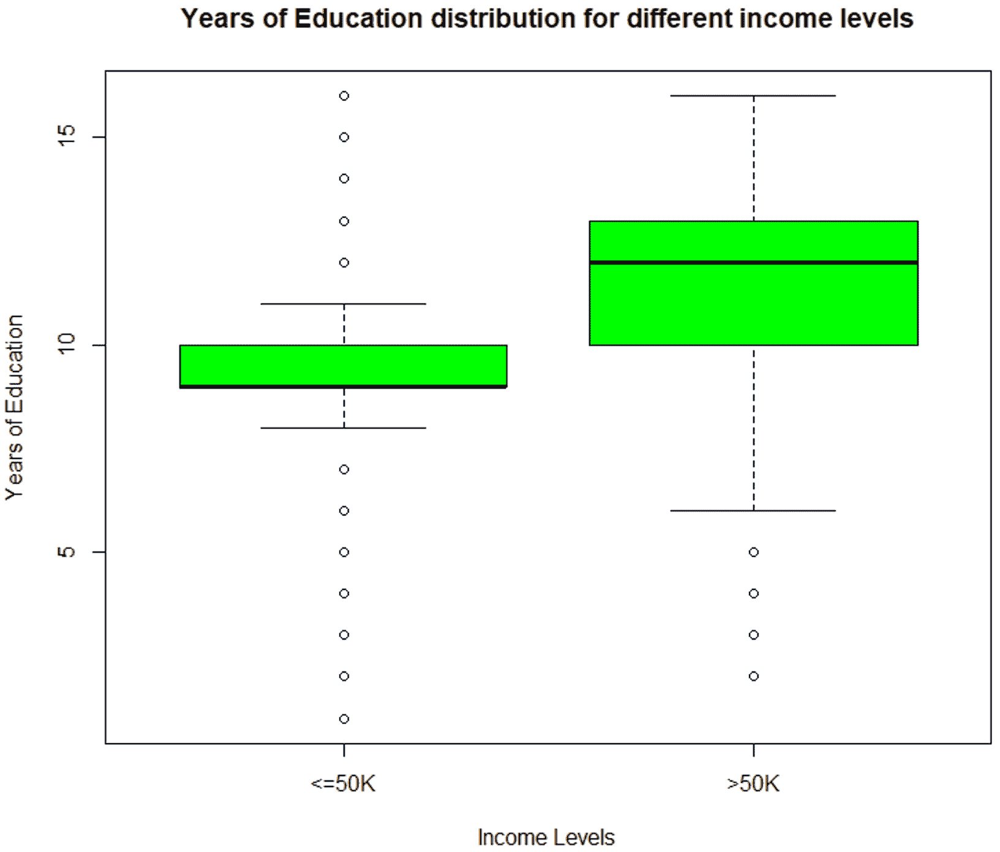
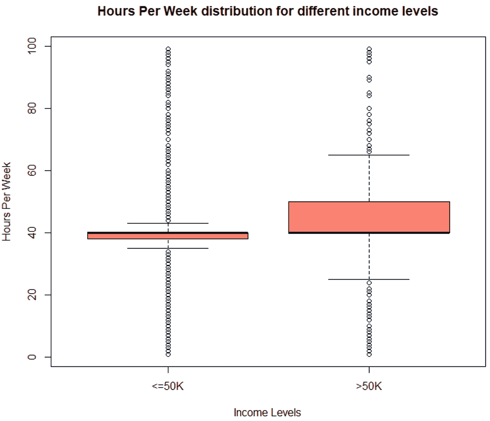
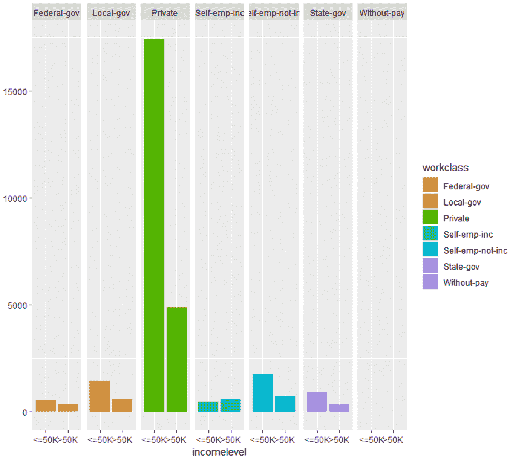
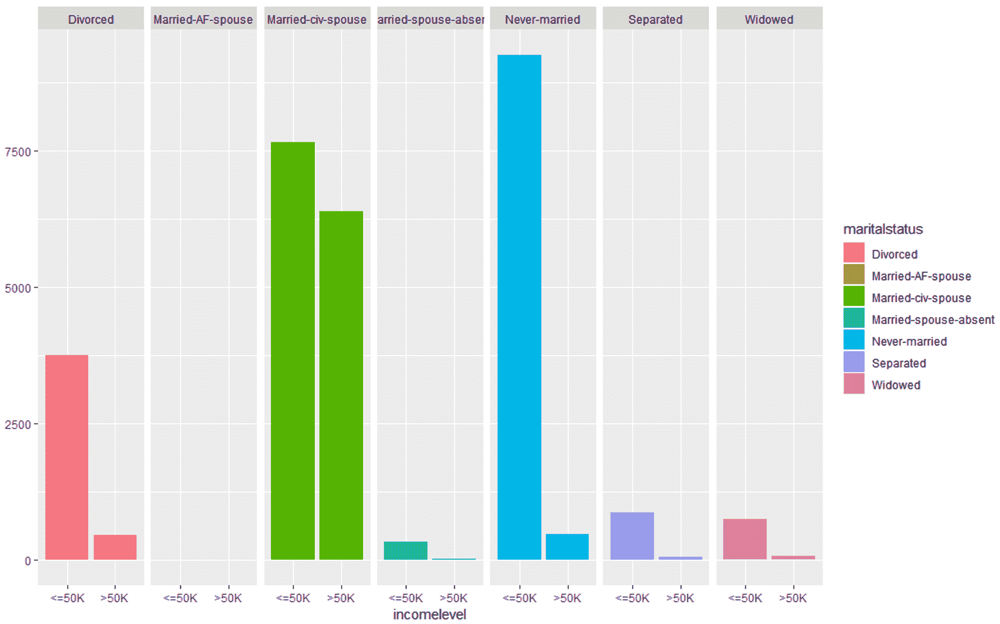
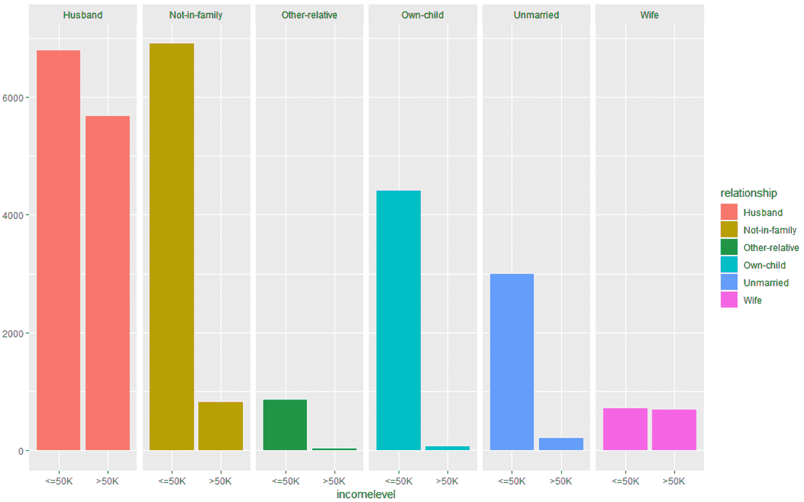

# 5 个带源代码的最佳数据科学项目

> 原文：<https://www.edureka.co/blog/data-science-projects/>

随着人工智能的指数级爆发，公司急切地希望雇用熟练的数据科学家来发展他们的业务。除了获得数据科学认证，在简历中加入几个数据科学项目也是很好的。有理论知识永远不够。因此，在这篇博客中，您将学习如何实际使用数据科学方法来解决现实世界的问题。

以下是本博客将涵盖的主题列表:

1.  [使用数据科学解决问题的基本方法](#A%20Basic%20Approach%20To%20Solving%20A%20Problem%20Using%20Data%20Science)

2.  [数据科学的实际实施](#Practical%20Implementation%20of%20Data%20Science)

3.  [数据科学项目](#Data%20Science%20Projects)

## **数据科学项目生命周期**

有了正确的数据，[数据科学](https://www.edureka.co/blog/what-is-data-science/)可以用来解决从欺诈检测和智能农业到预测气候变化和心脏病等一系列问题。也就是说，数据不足以解决问题，你需要一种能给你最准确结果的方法。这给我们带来了一个问题:

### **你如何解决数据科学问题？**

数据科学中的问题陈述可以通过以下步骤解决:

1.  定义问题陈述/业务需求
2.  数据收集
3.  数据清理
4.  数据探索和分析
5.  数据建模
6.  部署和优化



*数据科学项目生命周期–数据科学项目–edu reka*

让我们详细看一下这些步骤:

**步骤 1:定义问题陈述**

在你开始一个数据科学项目之前，你必须定义你试图解决的问题。在这个阶段，你应该清楚你项目的目标。

**第二步:数据收集**

顾名思义，在这个阶段，你必须获得解决问题所需的所有数据。收集数据并不容易，因为大多数时候你不会发现数据在数据库里等着你。相反，你必须走出去，做一些研究，收集数据或从互联网上搜集数据。

**第三步:数据清理**

如果你问一位数据科学家，他们最不喜欢的数据科学流程是什么，他们很可能会告诉你是数据清理。数据清理是删除冗余、缺失、重复和不必要数据的过程。这个阶段被认为是数据科学中最耗时的阶段之一。然而，为了防止错误的预测，消除数据中的任何不一致是很重要的。

**第四步:数据分析和探索**

一旦你清理完数据，是时候释放内心的福尔摩斯了。在数据科学生命周期的这个阶段，您必须检测数据中的模式和趋势。这是您检索有用见解和研究数据行为的地方。在这个阶段的最后，你必须开始形成关于你的数据和你正在处理的问题的假设。

**第五步:数据建模**

这个阶段是关于建立一个能最好地解决你的问题的模型。模型可以是使用数据训练和测试的机器学习算法。这个阶段总是从称为数据拼接的过程开始，在这个过程中，您将整个数据集分成两部分。一个用于训练模型(训练数据集)，另一个用于测试模型的效率(测试数据集)。

接下来是使用训练数据集构建模型，最后是使用测试数据集评估模型。

**第六步:优化部署:**

这是数据科学生命周期的最后一个阶段。在这个阶段，你必须努力提高数据模型的效率，让它能做出更准确的预测。最终目标是将模型部署到生产或类似生产的环境中，以获得最终用户的认可。用户必须验证模型的性能，如果模型有任何问题，则必须在此阶段进行修复。

现在你知道了如何使用数据科学解决问题，让我们进入有趣的部分。在接下来的部分中，我将为您提供五个高级数据科学项目，它们可以让您被顶级 IT 公司聘用。

## **R 中的数据科学**

在我们开始编码之前，这里有一个简短的声明:

我将使用 R 语言来运行整个数据科学工作流，因为 ***R 是一种统计语言*** ，它有超过 8000 个软件包，使我们的生活变得更加轻松。

如果你想学习更多关于 R 编程的知识，你可以看看我们的 R 编程专家的视频。

**R 初学者教程| edu reka**


[//www.youtube.com/embed/eDrhZb2onWY?rel=0&showinfo=0](//www.youtube.com/embed/eDrhZb2onWY?rel=0&showinfo=0)

本 Edureka R 教程将帮助您理解 R 工具的基本原理，并帮助您建立一个坚实的 R 基础。

**1994 年人口普查收入数据分类**

**问题陈述:**建立一个模型，根据个人的可用数据预测美国个人的收入是高于还是低于 50，000 美元。

**数据集描述:**该人口普查收入数据集由 Barry Becker 于 1994 年收集，并提供给 http://archive.ics.uci.edu/ml/datasets/Census+Income*的公共网站*。这个数据集将帮助你了解一个人的收入是如何随着各种因素而变化的，如教育背景、职业、婚姻状况、地理位置、年龄、每周工作时间等。

以下是用于预测个人收入是否超过 50，000 美元的独立变量或预测变量列表:

*   年龄
*   工人阶级
*   最终重量
*   教育
*   教育-num(受教育的年数)
*   婚姻状况
*   职业
*   关系
*   人种
*   性
*   资本收益
*   资本损失
*   每周小时数
*   母国

因变量是代表收入水平的“收入水平”。这是一个分类变量，因此它只能有两个值:

1.  < =50k
2.  > =50k

既然我们已经定义了我们的目标并收集了数据，是时候开始分析了。

**第一步:导入数据**

幸运的是，我们在网上找到了一个数据集，所以我们所要做的就是将数据集导入到我们的 R 环境中，就像这样:

```

#Downloading train and test data
trainFile = "adult.data"; testFile = "adult.test"

if (!file.exists (trainFile))
download.file (url = "http://archive.ics.uci.edu/ml/machine-learning-databases/adult/adult.data",
destfile = trainFile)

if (!file.exists (testFile))
download.file (url = "http://archive.ics.uci.edu/ml/machine-learning-databases/adult/adult.test",
destfile = testFile)

```

在上面的代码片段中，我们已经下载了训练数据集和测试数据集。

如果你看一下训练数据，你会注意到预测变量没有被标记。因此，在下面的代码片段中，我为每个预测变量分配了变量名，为了使数据更具可读性，我去掉了不必要的空格。

```

#Assigning column names
colNames = c ("age", "workclass", "fnlwgt", "education",
"educationnum", "maritalstatus", "occupation",
"relationship", "race", "sex", "capitalgain",
"capitalloss", "hoursperweek", "nativecountry",
"incomelevel")

#Reading training data
training = read.table (trainFile, header = FALSE, sep = ",",
strip.white = TRUE, col.names = colNames,
na.strings = "?", stringsAsFactors = TRUE)

```

现在为了研究数据集的结构，我们调用 str()方法。这为我们提供了数据集中所有预测变量的描述性总结:

```

#Display structure of the data
str (training)
> str (training)
'data.frame': 32561 obs. of 15 variables:
$ age : int 39 50 38 53 28 37 49 52 31 42 ...
$ workclass : Factor w/ 8 levels "Federal-gov",..: 7 6 4 4 4 4 4 6 4 4 ...
$ fnlwgt : int 77516 83311 215646 234721 338409 284582 160187 209642 45781 159449 ...
$ education : Factor w/ 16 levels "10th","11th",..: 10 10 12 2 10 13 7 12 13 10 ...
$ educationnum : int 13 13 9 7 13 14 5 9 14 13 ...
$ maritalstatus: Factor w/ 7 levels "Divorced","Married-AF-spouse",..: 5 3 1 3 3 3 4 3 5 3 ...
$ occupation : Factor w/ 14 levels "Adm-clerical",..: 1 4 6 6 10 4 8 4 10 4 ...
$ relationship : Factor w/ 6 levels "Husband","Not-in-family",..: 2 1 2 1 6 6 2 1 2 1 ...
$ race : Factor w/ 5 levels "Amer-Indian-Eskimo",..: 5 5 5 3 3 5 3 5 5 5 ...
$ sex : Factor w/ 2 levels "Female","Male": 2 2 2 2 1 1 1 2 1 2 ...
$ capitalgain : int 2174 0 0 0 0 0 0 0 14084 5178 ...
$ capitalloss : int 0 0 0 0 0 0 0 0 0 0 ...
$ hoursperweek : int 40 13 40 40 40 40 16 45 50 40 ...
$ nativecountry: Factor w/ 41 levels "Cambodia","Canada",..: 39 39 39 39 5 39 23 39 39 39 ...
$ incomelevel : Factor w/ 2 levels "<=50K",">50K": 1 1 1 1 1 1 1 2 2 2 ...

```

因此，在导入数据并将其转换为可读格式之后，我们将进入数据处理的下一个关键步骤，即数据清理。

**第二步:数据清理**

数据清理阶段被认为是数据科学中最耗时的任务之一。这一阶段包括删除 NA 值，去除冗余变量和数据中的任何不一致之处。

我们将通过检查我们的数据观察值是否有任何缺失值来开始数据清理:

```

> table (complete.cases (training))

FALSE TRUE
2399 30162

```

上面的代码片段表明 2399 个样本案例具有 NA 值。为了解决这个问题，让我们看看所有变量的汇总，并分析哪些变量的空值最多。我们必须去除 NA 值的原因是，它们会导致错误的预测，从而降低我们模型的准确性。

```
> summary  (training [!complete.cases(training),])
      age                   workclass        fnlwgt              education    educationnum  
 Min.   :17.00   Private         : 410   Min.   : 12285   HS-grad     :661   Min.   : 1.00  
 1st Qu.:22.00   Self-emp-inc    :  42   1st Qu.:121804   Some-college:613   1st Qu.: 9.00  
 Median :36.00   Self-emp-not-inc:  42   Median :177906   Bachelors   :311   Median :10.00  
 Mean   :40.39   Local-gov       :  26   Mean   :189584   11th        :127   Mean   : 9.57  
 3rd Qu.:58.00   State-gov       :  19   3rd Qu.:232669   10th        :113   3rd Qu.:11.00  
 Max.   :90.00   (Other)         :  24   Max.   :981628   Masters     : 96   Max.   :16.00  
                 NA's            :1836                    (Other)     :478                  
               maritalstatus           occupation           relationship                 race     
 Divorced             :229   Prof-specialty : 102   Husband       :730   Amer-Indian-Eskimo:  25  
 Married-AF-spouse    :  2   Other-service  :  83   Not-in-family :579   Asian-Pac-Islander: 144  
 Married-civ-spouse   :911   Exec-managerial:  74   Other-relative: 92   Black             : 307  
 Married-spouse-absent: 48   Craft-repair   :  69   Own-child     :602   Other             :  40  
 Never-married        :957   Sales          :  66   Unmarried     :234   White             :1883  
 Separated            : 86   (Other)        : 162   Wife          :162                            
 Widowed              :166   NA's           :1843                                                 
     sex        capitalgain       capitalloss       hoursperweek         nativecountry  
 Female: 989   Min.   :    0.0   Min.   :   0.00   Min.   : 1.00   United-States  
               Median :    0.0   Median :   0.00   Median :40.00   Canada                  
               Mean   :  897.1   Mean   :  73.87   Mean   :34.23   Philippines             
               3rd Qu.:    0.0   3rd Qu.:   0.00   3rd Qu.:40.00   Germany               
               Max.   :99999.0   Max.   :4356.00   Max.   :99.00   (Other)            
                                                                   NA's         : 583    

```

根据上述总结，可以观察到三个变量具有大量 NA 值:

1.  Workclass – 1836
2.  职业-1843 年
3.  本土国家–583

这三个变量必须清理，因为它们是预测个人收入水平的重要变量。

```

#Removing NAs
TrainSet = training [!is.na (training$workclass) & !is.na (training$occupation), ]
TrainSet = TrainSet [!is.na (TrainSet$nativecountry), ]

```

一旦我们去掉了 NA 值，我们的下一步就是去掉任何不必要的变量，这些变量对于预测我们的结果是不必要的。去掉这些变量很重要，因为它们只会增加模型的复杂性，而不会提高模型的效率。

一个这样的变量是“fnlwgt”变量，它表示通过计算人口的任何特定社会经济特征的“加权计数”从 CPS 得出的人口总数。

该变量已从我们的数据集中删除，因为它无助于预测我们的结果变量:

```

#Removing unnecessary variables

TrainSet$fnlwgt = NULL

```

这就是数据清理的全部内容，我们的下一步是数据探索。

**第三步:数据探索**

数据探索包括分析每个特征变量，以检查这些变量对于构建模型是否重要。

**了解我们在顶级城市开设的数据科学与 Python 课程**

| 印度 | 美国 | 其他热门城市 |
| [海得拉巴的数据科学与 Python 培训](https://www.edureka.co/data-science-python-certification-course-hyderabad) | [达拉斯的数据科学与 Python 课程](https://www.edureka.co/data-science-python-certification-course-dallas) | [德里的数据科学与 Python 课程](https://www.edureka.co/data-science-python-certification-course-delhi) |
| [班加罗尔的数据科学与 Python 培训](https://www.edureka.co/data-science-python-certification-course-bangalore) | [夏洛特的 Python 数据科学](https://www.edureka.co/data-science-python-certification-course-charlotte) | [孟买的数据科学与 Python 课程](https://www.edureka.co/data-science-python-certification-course-mumbai) |
| [钦奈的数据科学与 Python 培训](https://www.edureka.co/data-science-python-certification-course-chennai) | [纽约的数据科学与 Python 课程](https://www.edureka.co/data-science-python-certification-course-new-york-city) | [数据科学用 Python](https://www.edureka.co/data-science-python-certification-course-seattle) |

**探索年龄变量**

```

#Data Exploration
#Exploring the age variable

> summary (TrainSet$age)
Min. 1st Qu. Median Mean 3rd Qu. Max.
17.00 28.00 37.00 38.44 47.00 90.00

#Boxplot for age variable
boxplot (age ~ incomelevel, data = TrainSet,
main = "Income levels based on the Age of an individual",
xlab = "Income Level", ylab = "Age", col = "salmon")

```



*箱线图–数据科学项目–edu reka*

```

#Histogram for age variable
incomeBelow50K = (TrainSet$incomelevel == "<=50K")
xlimit = c (min (TrainSet$age), max (TrainSet$age))
ylimit = c (0, 1600)

hist1 = qplot (age, data = TrainSet[incomeBelow50K,], margins = TRUE,
binwidth = 2, xlim = xlimit, ylim = ylimit, colour = incomelevel)

hist2 = qplot (age, data = TrainSet[!incomeBelow50K,], margins = TRUE,
binwidth = 2, xlim = xlimit, ylim = ylimit, colour = incomelevel)

grid.arrange (hist1, hist2, nrow = 2)

```



*直方图–数据科学项目–edu reka*

上述说明表明，年龄变量随着收入水平的变化而变化，因此它是一个强有力的预测变量。

**探索‘education num’变量**

这个变量表示一个人受教育的年数。让我们看看“教育数量”变量是如何随着收入水平而变化的:

```

> summary (TrainSet$educationnum)
Min. 1st Qu. Median Mean 3rd Qu. Max.
1.00 9.00 10.00 10.12 13.00 16.00

#Boxplot for education-num variable
boxplot (educationnum ~ incomelevel, data = TrainSet,
main = "Years of Education distribution for different income levels",
xlab = "Income Levels", ylab = "Years of Education", col = "green")

```



*数据探索(education num)–数据科学项目–edu reka*

上图描述了“educationnum”变量因收入水平<=50k and > 50k 而异，从而证明它是预测结果的重要变量。

**探索资本收益和资本损失变量**

在研究了每个收入水平的资本收益和资本损失变量的汇总后，它们的均值差异很大，因此表明它们是预测个人收入水平的合适变量。

```
> summary (TrainSet[ TrainSet$incomelevel == "<=50K", 
+                        c("capitalgain", "capitalloss")])
  capitalgain       capitalloss     
 Min.   :    0.0   Min.   :   0.00  
 1st Qu.:    0.0   1st Qu.:   0.00  
 Median :    0.0   Median :   0.00  
 Mean   :  148.9   Mean   :  53.45  
 3rd Qu.:    0.0   3rd Qu.:   0.00  
 Max.   :41310.0   Max.   :4356.00  

```

**探索小时/周变量**

同样，对“hoursperweek”变量进行评估，以检查它是否是一个重要的预测变量。

```

#Evaluate hours/week variable

> summary (TrainSet$hoursperweek)
Min. 1st Qu. Median Mean 3rd Qu. Max.
1.00 40.00 40.00 40.93 45.00 99.00

boxplot (hoursperweek ~ incomelevel, data = TrainSet,
main = "Hours Per Week distribution for different income levels",
xlab = "Income Levels", ylab = "Hours Per Week", col = "salmon")

```



*数据探索(小时/周)——数据科学项目——edu reka*

箱线图显示了不同收入水平的明显差异，这使其成为预测结果的重要变量。

类似地，我们也会评估分类变量。在下面的部分中，我为每个变量创建了 qplots，在评估这些图之后，很明显这些变量对于预测个人的收入水平是必不可少的。

**探索工人阶级变量**

```

#Evaluating work-class variable
qplot (incomelevel, data = TrainSet, fill = workclass) + facet_grid (. ~ workclass)

```



*数据探索(工作类)–数据科学项目–edu reka*

```

#Evaluating occupation variable
qplot (incomelevel, data = TrainSet, fill = occupation) + facet_grid (. ~ occupation)

```


*数据探索(职业)–数据科学项目–edu reka*

```

#Evaluating marital-status variable
qplot (incomelevel, data = TrainSet, fill = maritalstatus) + facet_grid (. ~ maritalstatus)

```



*数据探索(军事状态)–数据科学项目–edu reka*

```

#Evaluating relationship variable
qplot (incomelevel, data = TrainSet, fill = relationship) + facet_grid (. ~ relationship)

```



*数据探索(关系)–数据科学项目–edu reka*

所有这些图表表明，这些预测变量集对于构建我们的预测模型非常重要。

**第四步:建立模型**

因此，在评估了我们所有的预测变量之后，终于到了执行预测分析的时候了。在此阶段，我们将构建一个预测模型，根据我们在上一节中评估的预测变量来预测个人收入是否超过 50，000 美元。

为了构建这个模型，我使用了 boosting 算法，因为我们必须将个人分为两类，即:

1.  收入水平< = 50，000 美元

2.  收入水平> 50，000 美元

```

#Building the model
set.seed (32323)

trCtrl = trainControl(method = "cv", number = 10)

boostFit = train (incomelevel ~ age + workclass + education + educationnum +
maritalstatus + occupation + relationship +
race + capitalgain + capitalloss + hoursperweek +
nativecountry, trControl = trCtrl,
method = "gbm", data = TrainSet, verbose = FALSE)

```

由于我们使用的是集成分类算法，我还实现了交叉验证技术，以防止模型过度拟合。

**第五步:检查模型的准确性**

为了评估模型的准确性，我们将使用混淆矩阵:

```

#Checking the accuracy of the model

> confusionMatrix (TrainSet$incomelevel, predict (boostFit, TrainSet))
Confusion Matrix and Statistics

Reference
Prediction <=50K >50K
<=50K 21404 1250 >50K 2927 4581

Accuracy : 0.8615
95% CI : (0.8576, 0.8654)
No Information Rate : 0.8067
P-Value [Acc > NIR] : < 2.2e-16

Kappa : 0.5998

Mcnemar's Test P-Value : < 2.2e-16

Sensitivity : 0.8797
Specificity : 0.7856
Pos Pred Value : 0.9448
Neg Pred Value : 0.6101
Prevalence : 0.8067
Detection Rate : 0.7096
Detection Prevalence : 0.7511
Balanced Accuracy : 0.8327

'Positive' Class : <=50K

```

输出显示，我们的模型计算个人收入水平的准确率约为 86%，这是一个很好的数字。

到目前为止，我们使用训练数据集来构建模型，现在是使用测试数据集来验证模型的时候了。

**步骤 5:加载并评估测试数据集**

就像我们如何清理我们的训练数据集一样，我们的测试数据也必须以这样一种方式准备，即它没有任何空值或不必要的预测变量，只有这样我们才能使用测试数据来验证我们的模型。

首先加载测试数据集:

```

#Load the testing data set
testing = read.table (testFile, header = FALSE, sep = ",",
strip.white = TRUE, col.names = colNames,
na.strings = "?", fill = TRUE, stringsAsFactors = TRUE)

```

接下来，我们研究数据集的结构。

```

#Display structure of the data
> str (testing)
'data.frame': 16282 obs. of 15 variables:
$ age : Factor w/ 74 levels "|1x3 Cross validator",..: 1 10 23 13 29 3 19 14 48 9 ...
$ workclass : Factor w/ 9 levels "","Federal-gov",..: 1 5 5 3 5 NA 5 NA 7 5 ...
$ fnlwgt : int NA 226802 89814 336951 160323 103497 198693 227026 104626 369667 ...
$ education : Factor w/ 17 levels "","10th","11th",..: 1 3 13 9 17 17 2 13 16 17 ...
$ educationnum : int NA 7 9 12 10 10 6 9 15 10 ...
$ maritalstatus: Factor w/ 8 levels "","Divorced",..: 1 6 4 4 4 6 6 6 4 6 ...
$ occupation : Factor w/ 15 levels "","Adm-clerical",..: 1 8 6 12 8 NA 9 NA 11 9 ...
$ relationship : Factor w/ 7 levels "","Husband","Not-in-family",..: 1 5 2 2 2 5 3 6 2 6 ...
$ race : Factor w/ 6 levels "","Amer-Indian-Eskimo",..: 1 4 6 6 4 6 6 4 6 6 ...
$ sex : Factor w/ 3 levels "","Female","Male": 1 3 3 3 3 2 3 3 3 2 ...
$ capitalgain : int NA 0 0 0 7688 0 0 0 3103 0 ...
$ capitalloss : int NA 0 0 0 0 0 0 0 0 0 ...
$ hoursperweek : int NA 40 50 40 40 30 30 40 32 40 ...
$ nativecountry: Factor w/ 41 levels "","Cambodia",..: 1 39 39 39 39 39 39 39 39 39 ...
$ incomelevel : Factor w/ 3 levels "","<=50K.",">50K.": 1 2 2 3 3 2 2 2 3 2 ...

```

在下面的代码片段中，我们寻找没有任何空数据或缺失数据的完整观察结果。

```
> table (complete.cases (testing))
FALSE TRUE
1222 15060
> summary  (testing [!complete.cases(testing),])
      age                 workclass       fnlwgt               education    educationnum   
 20     : 73   Private         :189   Min.   :  13862   Some-college:366   Min.   : 1.000  
 19     : 71   Self-emp-not-inc: 24   1st Qu.: 116834   HS-grad     :340   1st Qu.: 9.000  
 18     : 64   State-gov       : 16   Median : 174274   Bachelors   :144   Median :10.000  
 21     : 62   Local-gov       : 10   Mean   : 187207   11th        : 66   Mean   : 9.581  
 22     : 53   Federal-gov     :  9   3rd Qu.: 234791   10th        : 53   3rd Qu.:10.000  
 17     : 35   (Other)         : 11   Max.   :1024535   Masters     : 47   Max.   :16.000  
 (Other):864   NA's            :963   NA's   :1         (Other)     :206   NA's   :1       
               maritalstatus           occupation          relationship                 race    
 Never-married        :562   Prof-specialty : 62                 :  1                     :  1  
 Married-civ-spouse   :413   Other-service  : 32   Husband       :320   Amer-Indian-Eskimo: 10  
 Divorced             :107   Sales          : 30   Not-in-family :302   Asian-Pac-Islander: 72  
 Widowed              : 75   Exec-managerial: 28   Other-relative: 65   Black             :150  
 Separated            : 33   Craft-repair   : 23   Own-child     :353   Other             : 13  
 Married-spouse-absent: 28   (Other)        : 81   Unmarried     :103   White             :976  
 (Other)              :  4   NA's           :966   Wife          : 78                           
     sex       capitalgain       capitalloss       hoursperweek         nativecountry 
       :  1   Min.   :    0.0   Min.   :   0.00   Min.   : 1.00   UnitedStates 
 Female:508   1st Qu.:    0.0   1st Qu.:   0.00   1st Qu.:20.00   Mexico    
              Mean   :  608.3   Mean   :  73.81   Mean   :33.49   South                 
              3rd Qu.:    0.0   3rd Qu.:   0.00   3rd Qu.:40.00   England                 
              Max.   :99999.0   Max.   :2603.00   Max.   :99.00   (Other)               
              NA's   :1         NA's   :1         NA's   :1       NA's         :274   

```

从摘要中可以清楚地看出，我们在“工作类”、“职业”和“本地国家”变量中有许多 NA 值，所以让我们去掉这些变量。

```

#Removing NAs
TestSet = testing [!is.na (testing$workclass) & !is.na (testing$occupation), ]
TestSet = TestSet [!is.na (TestSet$nativecountry), ]

#Removing unnecessary variables
TestSet$fnlwgt = NULL

```

**第六步:验证模型**

将测试数据集应用于预测模型，以验证模型的效率。以下代码片段显示了这是如何实现的:

```

#Testing model
TestSet$predicted = predict (boostFit, TestSet)
table(TestSet$incomelevel, TestSet$predicted)

actuals_preds <- data.frame(cbind(actuals=TestSet$incomelevel, predicted=TestSet$predicted)) # make actuals_predicteds dataframe.
correlation_accuracy <- cor(actuals_preds)
head(actuals_preds)

```

该表用于比较个人的预测值和实际收入水平。通过在模型中引入一些变化或使用替代算法，可以进一步改进该模型。

因此，我们刚刚从头开始执行了一个完整的数据科学项目。

在下面的部分中，我已经编译了一组项目，它们将帮助你获得数据清理、统计分析、数据建模和数据可视化方面的经验。

就当这是你的作业。

**简历数据科学项目**

### **沃尔玛销售预测**

数据科学在预测零售行业的销售和风险方面发挥着巨大的作用。大多数领先的零售商店实施数据科学来跟踪客户需求并做出更好的业务决策。沃尔玛就是这样一家零售商。

**问题陈述:**分析沃尔玛的销售数据集，以预测每个商店的部门销售情况。

**数据集描述:**本项目使用的数据集包含历史培训数据，涵盖 2010-02-05 至 2012-11-01 的销售明细。为了分析这个问题，使用了以下预测变量:

1.  商店–商店编号
2.  部门——部门编号
3.  日期–星期
4.  CPI——消费者价格指数
5.  weekly _ Sales–给定商店中给定部门的销售额
6.  I sholiday–该周是否为特殊假日周

通过研究这些预测变量对响应变量的依赖性，您可以预测未来几个月的销售额。

**逻辑:**

1.  **导入数据集:**本项目需要的数据集可以从 [Kaggle](https://www.kaggle.com/c/walmart-recruiting-store-sales-forecasting/data) 下载。
2.  **数据清理:**在这个阶段，你必须确保去掉所有不一致的地方，比如缺失的值和任何多余的变量。
3.  **数据探索:**在这个阶段，可以绘制 boxplots 和 qplots，了解各个预测变量的显著性。参考人口普查收入项目，了解如何使用图表来研究每个变量的重要性。
4.  **数据建模:**对于这个特定的问题陈述，由于结果是一个连续变量(销售数量)，因此建立一个回归模型是合理的。线性回归算法可用于解决此类问题，因为它专门用于预测连续因变量。
5.  **验证模型:**在这个阶段，你要通过使用测试数据集来评估数据模型的效率，最后通过使用混淆矩阵来计算模型的准确性。

**芝加哥犯罪分析**

随着芝加哥犯罪数量的增加，执法机构正在尽最大努力理解这些行为背后的原因。此类分析不仅有助于理解这些犯罪背后的原因，还可以防止进一步的犯罪。

**问题陈述:**分析和探索芝加哥犯罪数据集，以了解趋势和模式，这将有助于预测此类重罪的未来发生。

**数据集描述:**本项目使用的数据集包括芝加哥市从 2014 年 1 月 1 日到 2016 年 10 月 24 日报告的每一起犯罪事件。

对于此分析，数据集包含许多预测变量，例如:

1.  ID–记录的标识符
2.  案例号–芝加哥警察链 RD 号
3.  日期–事件发生的日期
4.  描述-IUCR 代码的二级描述
5.  位置–发生事故的位置

**逻辑:**

像任何其他数据科学项目一样，遵循下面描述的一系列步骤:

1.  **导入数据集:**本项目需要的数据集可以从 [Kaggle](https://www.kaggle.com/currie32/crimes-in-chicago) 下载。

2.  **数据清理:**在这个阶段，你必须确保去掉所有不一致的地方，比如缺失的值和任何多余的变量。

3.  **数据探索:**你可以通过将犯罪事件转化为城市地理地图上的情节来开始这一阶段。以图形方式研究每个预测变量将有助于您了解哪些变量对于构建模型至关重要。

4.  **数据建模:**对于这个特殊的问题陈述，由于犯罪的性质各不相同，因此建立一个聚类模型是合理的。K-means 是最适合这种分析的算法，因为使用 k-means 很容易构建聚类。

5.  **分析模式:**由于本问题陈述要求您绘制关于犯罪的模式和见解，因此本步骤主要涉及创建报告和从数据模型中得出结论。

6.  **验证模型:**在这个阶段，你要通过使用测试数据集来评估数据模型的效率，最后通过使用混淆矩阵来计算模型的准确性。

**电影推荐引擎**

每个成功的数据科学家在其职业生涯中都至少建立过一个推荐引擎。个性化推荐引擎被认为是数据科学项目的圣杯，这也是我在博客中加入这个项目的原因。

**问题陈述:**分析电影镜头数据集，以了解有助于向用户推荐新电影的趋势和模式。

**数据集描述:**本项目使用的数据集由明尼苏达大学的 GroupLens 研究项目收集。

数据集由以下预测变量组成:

1.  943 名用户对 1682 部电影的 10 万次评分。
2.  每个用户至少评价了 20 部电影
3.  用户的详细信息，如年龄、性别、职业、地理位置等。

通过研究这些预测变量，可以建立一个向用户推荐电影的模型。

**逻辑:**

1.  **导入数据集:**本项目需要的数据集可以从 [Kaggle](https://www.kaggle.com/prajitdatta/movielens-100k-dataset/data) 下载。
2.  **数据清洗:**在此阶段，执行必要的清洗和转换，以便模型可以预测准确的结果。
3.  **数据探索:**在这个阶段，你可以评估电影流派对一个观众的评分产生了怎样的影响。同样，您可以根据用户的年龄、性别和职业来评估他对电影的选择。以图形方式研究每个预测变量将有助于您了解哪些变量对于构建模型至关重要。
4.  **数据建模:**对于这个问题陈述，可以使用 k-means 聚类算法，根据相似的电影观看模式对用户进行聚类。还可以利用关联规则挖掘来研究用户与其电影选择之间的相关性。
5.  **验证模型:**在这个阶段，你要通过使用测试数据集来评估数据模型的效率，最后通过使用混淆矩阵来计算模型的准确性。

### **文本挖掘**

在简历中加入文本挖掘项目，肯定会增加你被聘为数据科学家的机会。它涉及高级分析和数据挖掘，将使你成为一名熟练的数据科学家。文本挖掘的一个流行应用是情感分析，这在社交媒体监控中非常有用，因为它有助于获得关于某些主题的更广泛的公众意见的概览。

**问题陈述:**使用自然语言处理技术对一组文档进行预处理、文本分析、文本挖掘和可视化。

**数据集描述:**该数据集包含著名的星球大战系列的脚本，来自原始三部曲集，即 IV、V 和 VI。

**逻辑:**

1.  **导入数据集:**对于这个项目，你可以在 [Kaggle](https://www.kaggle.com/xvivancos/analyzing-star-wars-movie-scripts/data) 上找到数据集。
2.  **预处理:**在文本挖掘过程的这个阶段，你必须去掉不一致的地方，比如停用词、标点符号、空格等等。为了更好地进行分析，还可以执行诸如词汇化和数据词干化之类的过程。
3.  **建立文档术语矩阵(DTM):** 这一步包括创建文档术语矩阵(DTM)。它是一个列出文档中单词出现频率的矩阵。在这个矩阵上，执行文本分析。
4.  **文本分析:**文本分析包括分析文档中每个单词的词频，并找出单词之间的相关性，以便得出结论。
5.  **文本可视化:**使用直方图和词云来表示重要的词是文本挖掘中的重要步骤之一，因为它可以帮助您理解文档中最重要的词。

这些是让你开始的几个数据科学项目。我已经为您提供了解决每个用例的蓝图，您所要做的就是按照步骤来做。想尝试，想做自己的事情，就不要犹豫。

另外，不要忘记在评论区分享你的实现，我很想知道你的解决方案结果如何。

既然您已经知道如何使用数据科学解决现实世界的问题，我相信您一定很想了解更多。这里有一个博客列表，可以帮助你开始:

1.  [数据科学 R 综合指南](https://www.edureka.co/blog/r-for-data-science/)
2.  [数据科学 vs 机器学习——有什么区别？](https://www.edureka.co/blog/data-science-vs-machine-learning/)
3.  [十大数据科学应用](https://www.edureka.co/blog/data-science-applications/)
4.  [数据科学数学和统计学完全指南](https://www.edureka.co/blog/math-and-statistics-for-data-science/)

说到这里，我们就到此为止了。如果你对这个话题有任何疑问，请在下面留下评论，我们会尽快回复你。

敬请关注更多关于趋势技术的博客。

对 Python 编程专业人士的数据科学的需求急剧增加，这使得 Python 数据科学课程非常适合各种专业水平的人。[Python 数据科学课程](https://www.edureka.co/data-science-python-certification-course)非常适合希望与 Python、软件和 IT 专业人员一起工作的分析专业人员，以及对分析领域感兴趣和对数据科学有热情的任何人。

*还有，如果你正在寻找数据科学的在线结构化培训，edureka！有专门策划的  [**数据科学培训**](https://www.edureka.co/masters-program/data-scientist-certification) ，帮助您获得统计学、数据争论、探索性数据分析和机器学习算法(如 K-Means 聚类、决策树、随机森林和朴素贝叶斯)方面的专业知识。您还将学习时间序列、文本挖掘的概念，以及深度学习的介绍。本课程的新批次即将开始！！*