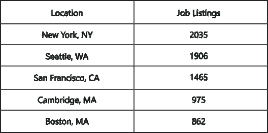
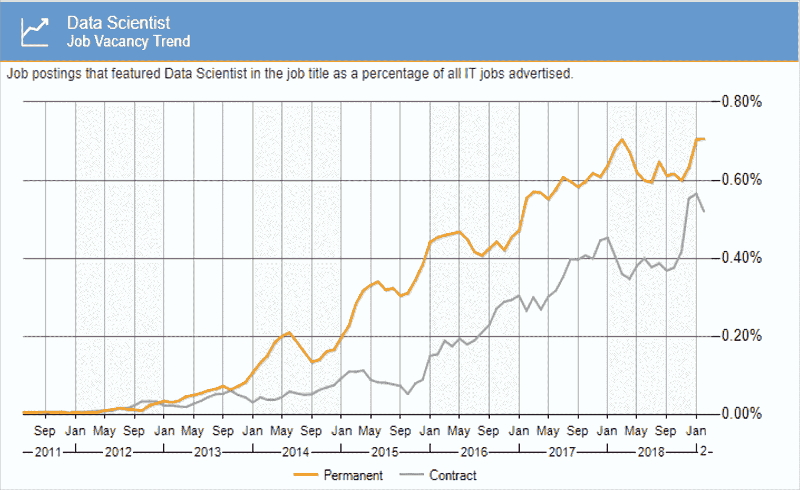
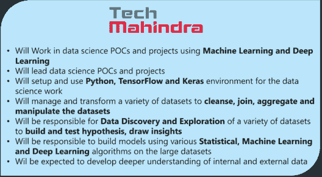
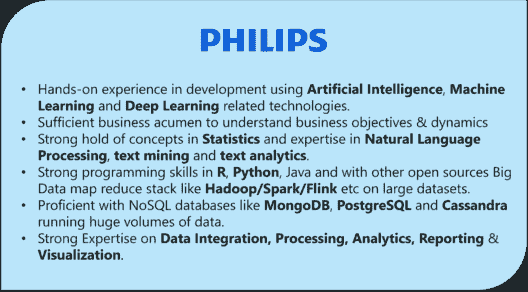
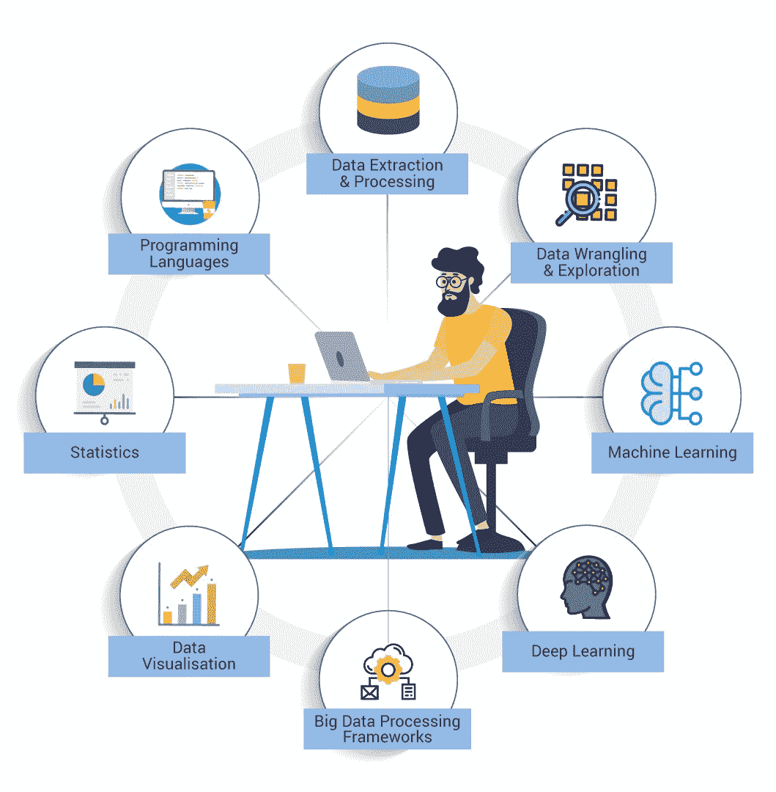
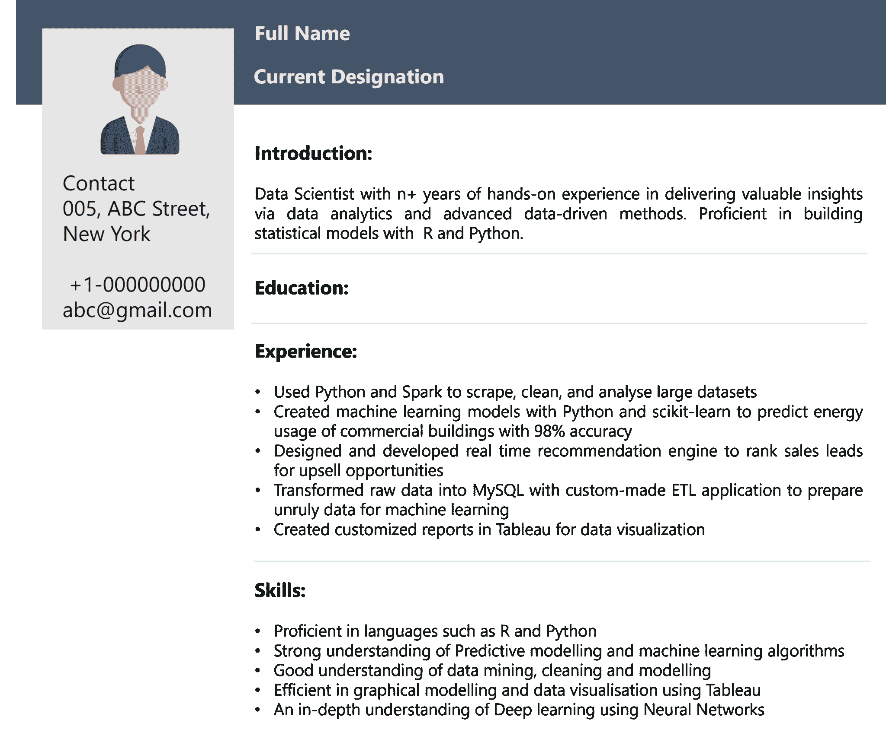

# 数据科学家简历示例

> 原文：<https://www.edureka.co/blog/data-scientist-resume/>

你知道数据科学家被评为 2019 年美国最有前途的工作吗？根据最近来自 [Glassdoor](https://www.glassdoor.com/List/Best-Jobs-in-America-LST_KQ0,20.htm) 和 [Linkedin](https://blog.linkedin.com/2019/january/10/linkedins-most-promising-jobs-of-2019) 的一项调查，数据科学家一直排名第一，因为他们在商业和技术行业的需求很高。在这个关于数据科学家简历的博客中，你将了解对*认证数据科学家*的需求和增长，以及他们对商业世界的影响。

要获得深入的数据科学知识，您可以报名参加 Edureka 提供的实时 [*数据科学家硕士项目*](https://www.edureka.co/masters-program/data-scientist-certification) ，该项目提供全天候支持和终身访问。

本博客涵盖了以下主题:

## **谁是数据科学家？**

数据科学家就是侦探，就像夏洛克·福尔摩斯一样！唯一的区别是，夏洛克·福尔摩斯解决谋杀之谜，而数据科学家解决数据之谜，例如检测趋势和模式，提取有用的见解，形成假设和建立预测模型，以便找到解决方案。

下面是数据科学家的定义:

*A Data Scientist is a professional who possesses the ability to view data through a quantitative lens. They’re responsible for finding solutions to problems in the Business, Finance, Healthcare, Tech, Agriculture and basically every other field out there.*

**要成为一名数据科学家，你必须精通诸如 [R](https://www.edureka.co/blog/r-programming-language) 、MatLab、SQL、Python 等技术。您必须拥有数据驱动的问题解决方法、强大的商业敏锐度，以及在统计、预测建模、数据操作、数据争论和可视化方面的专业知识。**

**如果您希望了解成为数据科学家所需技能的更多信息，您可以浏览此  [*数据科学家技能——成为数据科学家需要什么？*](https://www.edureka.co/blog/data-scientist-skills/) 博客。**

**现在你知道谁是数据科学家了，让我们看看市场上数据科学家的一些工作趋势。**

**如果您希望了解有关数据科学家的职业趋势和机会的更多信息，请查看我们的数据科学专家录制的视频。**

## ****数据科学家简历|数据科学家工作岗位、薪资&技能|爱德华卡****

****

**[//www.youtube.com/embed/-EAec6-g17k?rel=0&showinfo=0](//www.youtube.com/embed/-EAec6-g17k?rel=0&showinfo=0)**

**本节关于数据科学家简历的课程将帮助您了解数据科学家的需求和成长，以及他们对商业世界的影响。**

## ****数据科学家工作趋势:****

**在 2019 年 3 月发行的《美国最佳工作》中， [Linkedin](https://blog.linkedin.com/2019/january/10/linkedins-most-promising-jobs-of-2019) 将数据科学家列为第一名，职业发展得分为 9 分(满分 10 分)。**

**拥有一套丰富的技能，一名数据科学家的年薪预计会超过 12.7 万美元。下面的表格显示了工作列表是如何随着地理位置的变化而变化的。我从以下来源收集了这些信息:**

****

***数据科学家工作趋势——数据科学家简历——**爱德华卡***

**IBM 预测，到 2020 年，数据科学和分析工作清单的数量将增加近 364，000 个。对数据科学家的需求只会与日俱增。**

**下图显示了数据科学家职位空缺占英国所有 IT 职位的百分比。这也是大多数信息技术驱动的国家的情况，如加拿大、美国、德国等。**

****

***数据科学家职位空缺——数据科学家简历——爱德华卡***

**这些数据显示了全球对数据科学家的需求。拥有如此多样的技能和专业知识，数据科学家带回家大量数据也就不足为奇了。**

**现在，在我们开始构建数据科学家简历样本之前，让我们先分析几份工作描述，以了解什么行业需要数据科学家。**

## ****数据科学家职位描述:****

**当我坐下来研究数据科学家的技能组合时，我浏览了 Glassdoor 等平台上的几份工作描述，实际上是为了检查顶级公司到底需要什么样的数据科学家。**

**让我们来看看一位数据科学家的几份工作描述:**

***数据科学家 Tech Mahindra 职位描述——数据科学家简历——edu reka***

***数据科学家飞利浦职位描述——数据科学家简历——爱德华卡***

**这些工作描述让我们了解公司对数据科学家的确切期望，以及成为一名成功的数据科学家需要哪些技能。为了让你更容易理解，我在下面的部分列出了工作描述的要点。**

## ****数据科学家技能****

**数据科学家基本上是一个专业人士，他可以通过使用统计模型、[机器学习算法](https://www.edureka.co/blog/machine-learning-algorithms/)和预测分析，从数据中发现模式、趋势和有用的见解，以发展业务。与其他开发人员和工程师不同，数据科学家对业务、统计和技术有很好的理解。数据科学是一个广阔的领域，需要你具备多种技能。**

**如果你想了解更多关于数据科学的知识，你可以浏览下面的博客文章:**

***   [什么是数据科学？数据科学入门指南](https://www.edureka.co/blog/what-is-data-science/)*   [数据科学教程——从零开始学习数据科学！](https://www.edureka.co/blog/data-science-tutorial/)*   [数据科学 R 综合指南](https://www.edureka.co/blog/r-for-data-science/)*   [用于数据科学的 Python——在数据科学中使用 Python 库](https://www.edureka.co/blog/learn-python-for-data-science/)**

**现在，我们来讨论一下数据科学家的技能。以下是大多数行业对数据科学家的技能要求:**

***   统计数字*   至少一种编程语言–R/Python*   数据提取、转换和加载*   数据争论和数据探索*   机器学习算法*   高级机器学习(深度学习)*   大数据处理框架*   数据可视化**

***数据科学家技能——数据科学家简历——爱德华卡***

**这里有一个机器学习算法博客的列表，可以让你开始学习:**

***   [线性回归](https://www.edureka.co/blog/linear-regression-in-r/)*   [逻辑回归](https://www.edureka.co/blog/logistic-regression-in-r/)*   [支持向量机](https://www.edureka.co/blog/support-vector-machine-in-r/)*   [决策树](https://www.edureka.co/blog/decision-trees/)*   [随机森林](https://www.edureka.co/blog/random-forest-classifier/)*   [K-表示](https://www.edureka.co/blog/k-means-clustering-algorithm/)**

**如果你想了解更多关于数据科学家的技能，请参考 [*数据科学家技能——成为一名数据科学家需要什么？*](https://www.edureka.co/blog/data-scientist-skills/) 博客。**

**现在，我们来看一份数据科学家简历样本。您可以根据自己的技能、经验和工作要求进行更改。**

## ****数据科学家简历样本:****

**他们总是说，第一印象永远持续，所以让它成为你最好的。在建立简历的时候也是一样。简历会在面试中给你留下第一印象，所以要确保它能脱颖而出，让你得到你一直在追求的工作。**

**这是我为数据科学家角色创建的一份简历样本:**

****

***数据科学家简历样本——数据科学家简历——爱德华卡***

**以下是让你的简历变得完美的几个要点:**

***   清晰的职业目标:明确说明你申请的是什么以及你的兴趣所在。*   教育资格:此字段包括您的教育背景，如学士学位、硕士学位(如有)等。既然你申请的是数据科学家的职位，最好有计算机科学背景。*   **职业经验:**该领域专门针对有工作经验的个人，不针对应届生。在这里你可以提到你对公司的贡献。例如，你可以写一个你为解决业务问题而创建的机器学习模型，以及它如何使你的组织受益。*   **技术技能:**技术技能是从实时、复杂的项目中获得的实践能力。在这个领域，你必须提到你的编程技能，你精通哪些工具，如 SQL、Apache Spark、Hadoop、Tableau 等。你的技能应该向招聘经理证明你的能力，所以确保你在这一部分列出了所有相关的细节。*   非技术技能:我们很多人在制作简历时并不关注这个领域。数据科学家不只是处理工具和机器，它不再是一个需要强大技术技能才能成为数据科学家的领域。你必须拥有出色的沟通技巧、强大的智力、分析思维和大量创造性的想法，才能建立成功的数据科学家职业生涯。**

**现在你知道了对数据科学家的需求，我相信你很想了解更多。这里有一篇关于[如何学习数据科学的博客？](https://www.edureka.co/blog/how-to-learn-data-science/)读一读吧。**

**就这样，我们结束了这篇博客。我希望你们都觉得这篇博客内容丰富。如果你有任何想法分享，请在下面评论。敬请关注更多类似的博客！**

***如果你正在寻找数据科学的在线结构化培训，Edureka 有一个专门策划的 **[数据科学硕士课程](https://www.edureka.co/masters-program/data-scientist-certification)** ，它将使你精通数据科学专业人员使用的工具和系统。它包括关于统计学、数据科学、Python、Apache Spark & Scala、Tensorflow 和 Tableau 的培训。该课程是通过对全球 5000 多个职位描述的广泛研究而确定的。***

***有问题吗？请在“数据科学家简历”文章的评论部分提到它，我们将会回复您。***