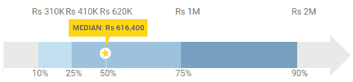
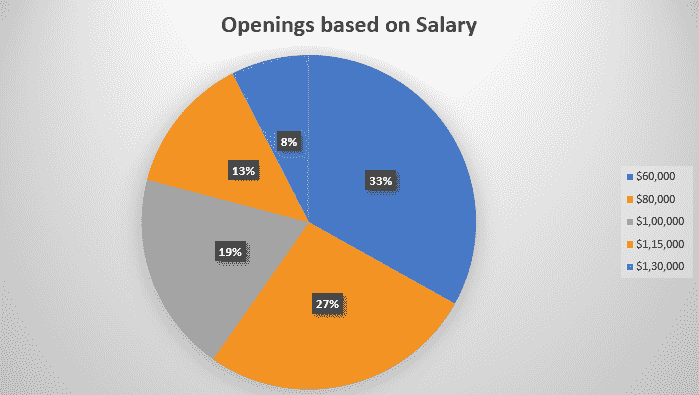
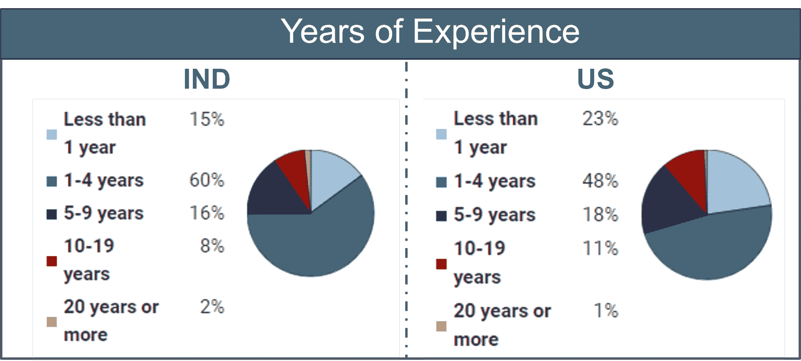

# 数据科学家的工资——数据科学家的工资是多少？

> 原文：<https://www.edureka.co/blog/data-scientist-salary/>

到 2020 年，每个人类每秒产生的数据量将是 1.7 兆。有了这个，你可以想象数据的增长，这就是一个**数据科学家**通过分析和组织这些数据来提供商业解决方案的地方。在本文中，我们将讨论全球数据科学家的薪水，并知道为什么“数据科学家”是 21 世纪最性感的职位。 事实上，一个数据科学家可以期望的平均年薪是 **Rs** **693，637 (IND)** 或 **$91，470 (US)** 。

在我们深入研究数据科学家薪酬趋势的细节之前，让我们先对各种行业的就业趋势有一个简要的展望。

## **数据科学家工作趋势**

根据《哈佛商业评论》的报道，数据科学家是“受过训练并有好奇心在大数据世界中做出发现的高级专业人员”。由于数据科学是一个广阔的领域，数据科学家需要具备多方面的技能。

下表显示了根据[Indeed.com](https://www.indeed.com/q-Data-Scientist-jobs.html)统计的美国不同地区的工作岗位数量。

| **状态** | **作业数量** |
| New York, NY | 1813 年 |
| 华盛顿州西雅图 | 第 1544 章 |
| 加利福尼亚州旧金山 | 第 1487 章 |
| 马萨诸塞州剑桥 | 936 |
| 马萨诸塞州波士顿 | 733 |

数据科学职业机会只会一飞冲天！随着世界转向将数据用于各种决策，无论是初创公司还是老牌公司，如思科、戴尔、VMware 等。向数据科学家提供丰厚的薪水。

**数据科学家薪资趋势**

据 Payscale.com 报道，下面是描绘和 [**美国**](https://www.payscale.com/research/US/Job=Data_Scientist%2C_IT/Salary) 数据科学家平均工资的图表。

**【数据科学家工资(中)**

**【美国数据科学家薪资】**

据《福布斯》报道，到 2020 年，数据科学和分析工作清单的数量预计将增长近 364，000 份。此外，据估计，到 2020 年，分析数据的企业的生产率收益将比不分析数据的竞争对手高出约 4300 亿美元。从上图中你可以看出，这一点非常明显。

数据科学家负责企业中的许多任务，包括[分析](https://www.edureka.co/blog/what-is-data-science/)，使用[编程语言如 Java](https://www.edureka.co/blog/java-tutorial/) 构建数据产品，以及[开发可视化](https://www.edureka.co/blog/python-matplotlib-tutorial/)和[机器学习](https://www.edureka.co/blog/machine-learning-tutorial/)算法 [Python](https://www.edureka.co/blog/learn-python-for-data-science/) 或 [R](https://www.edureka.co/blog/r-tutorial/) 。正因为如此，一个数据科学家的平均薪资包是**Rs**693637******(IND)**或**91470 美元(US)** 。此外，根据你的经验和技能，公司可以给你高达 13 万美元的年薪。

***注:*** 这可能因公司、地理位置和经验而异。

事实上，如果你精通数据科学领域，公司不会根据你多年的经验来衡量你的专业背景。你可以观察到，在印度被雇佣的数据科学家中，超过 15%是应届毕业生。在美国，这个数字甚至更高。 参考以下剧情获得更多见解:

*资料来源:薪级表*

让我也根据上述因素给你几个数字:

## **数据科学家工资根据公司:**

我列出了正在积极招聘数据科学家的大公司提供给数据科学家的薪水。

| **公司** | **工资** |
| 微软 | 150 万卢比/年 |
| IBM | 135 万卢比/年 |
| 埃森哲 | 105.55 万卢比/年 |
| 脸书 | 13.5 万美元/年 |
| Airbnb | 13 万美元/年 |
| 首都一号 | 106，000 美元/年 |

*来源:玻璃门*

## **数据科学家基于经验的工资**

### **入门级数据科学家工资(IND):**

| **补偿** | **年薪范围** |
| 工资 | 297，414 卢比–1，195，066 卢比 |
| 奖金 | 2004 卢比–161146 卢比 |
| 利润分享 | 0.00 卢比–322976 卢比 |
| 总薪酬 | 306，054 卢比–1，215，966 卢比 |

### **入门级数据科学家工资(美国):**

| **补偿** | **年薪范围** |
| 工资 | $61，598–122，827 |
| 奖金 | $1，010 到$15，019 |
| 利润分享 | $ 503-$ 16638 |
| 总薪酬 | $60，894–127，894 |

### **中级数据科学家工资(IND):**

| **补偿** | **年薪范围** |
| 工资 | 590，734 卢比–2，070，477 卢比 |
| 奖金 | 1030 卢比–792758 卢比 |
| 利润分享 | 95000 卢比 |
| 总薪酬 | 595，982 卢比–2，506，994 卢比 |

### **中级数据科学家工资(美国):**

| **补偿** | **年薪范围** |
| 工资 | $74，623–140，210 |
| 奖金 | $1，973 到$19，998 |
| 分红制 | 2007-20608 美元 |
| 总薪酬 | $77，215–158，409 |

### **经验丰富的数据科学家工资(IND):**

| **补偿** | **年薪范围** |
| 工资 | 972，106 卢比–2，927，745 卢比 |
| 奖金 | 3.5 万卢比至 40 万卢比 |
| 分红制 | 2.5 万卢比 |
| 总薪酬 | 972，106 卢比–2，928，194 卢比 |

### **【有经验的数据科学家薪资(美国):**

| **补偿** | **年薪范围** |
| 工资 | $78，424–157，653 |
| 奖金 | $2，449 到$22，400 |
| 分红制 | 11000 美元 |
| 总薪酬 | $79，321-$ 167，947 |

*资料来源:薪级表*

嗯，我相信一个众所周知的事实是，不同国家的人做同样的工作却得到不同的报酬。让我们看看一个数据科学家的工资会因地理位置的不同而有所不同。

数据科学家的技能将在数据科学领域带来巨大的职业机会。以下是成为数据科学家的[技能。](https://www.edureka.co/blog/how-to-become-a-data-scientist/)

## **基于地理的数据科学家工资:**

我列出了以下主要城市的数据科学家工资:

| **城市** | **工资** |
| 古尔冈 | 120 万卢比/年 |
| 浦那 | Rs 736976/yr |
| 孟买 | 734696 卢比/年 |
| 山景城（位于美国加州） | $ 124882/yr |
| 旧金山 | $117，256/年 |
| 西雅图 | $ 116898/yr |

*资料来源:薪级表*

如果你正在寻找一份有趣的职业，现在是提升技能和利用数据科学职业机会的好时机。

*Edureka 有专门策划的 **[数据科学大师课程](https://www.edureka.co/masters-program/data-scientist-certification)** ，让你精通数据科学专业人士使用的工具和系统。它包括关于统计学、数据科学、Python、Apache Spark & Scala、Tensorflow 和 Tableau 的培训。该课程是通过对全球 5000 多个职位描述的广泛研究而确定的。*

*有问题吗？请在“数据科学家薪水”文章的评论部分提到它，我们会给你回复。*