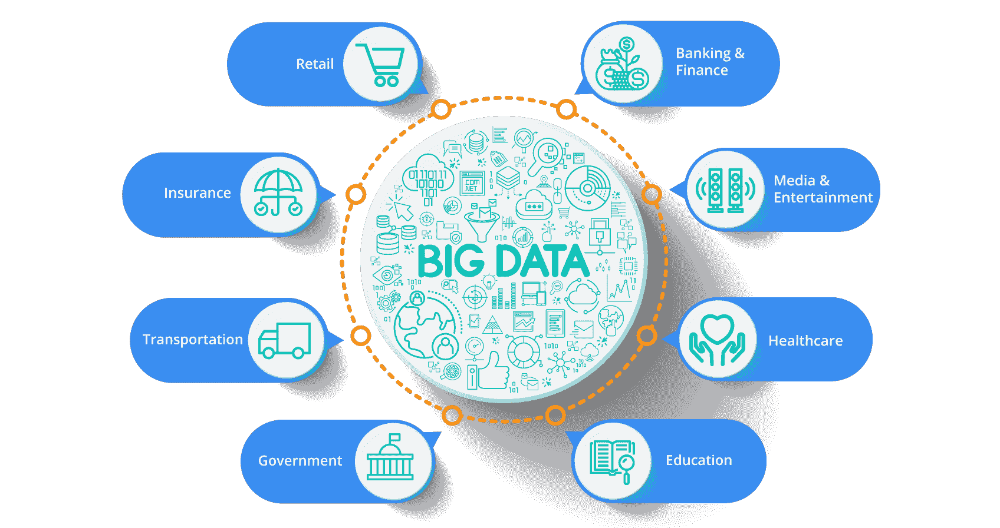
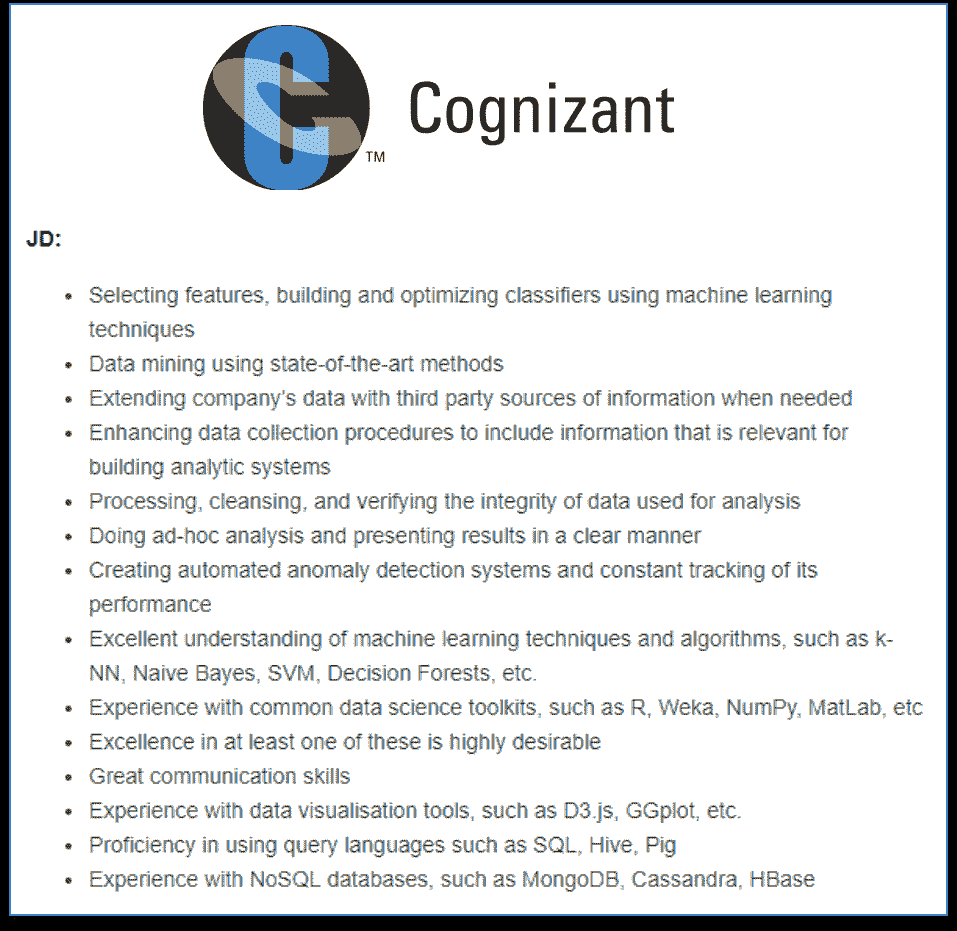

# 数据科学技能:数据科学家必备的 8 大技能

> 原文：<https://www.edureka.co/blog/data-scientist-skills/>

数据科学是一个总括术语，包括数据分析、数据挖掘、人工智能、机器学习、深度学习和其他几个相关学科。 在这篇文章中，我提到了数据科学家必备的技能。

大多数组织现在已经意识到数据驱动决策的重要性。在我继续之前，让我列出能让你被录用的数据科学家技能:

*   统计数据
*   至少一种编程语言——R/Python
*   数据提取、转换和加载
*   数据争论和数据探索
*   机器学习算法
*   高级机器学习(深度学习)
*   大数据处理框架
*   数据可视化

在我解释上面提到的每一点之前，让我先对这些技巧进行分类。

作为一名数据科学家，你将负责跨越三个技能领域的工作。

*   统计/数学推理，
*   业务沟通/领导力，以及
*   编程

你经常会被分派从头到尾领导数据科学项目的任务。现在，让我逐一解释每个数据科学家技能。

## **数据科学家技能:** **成为一名数据科学家需要什么**

## **1。统计:**

维基百科将其定义为对数据的收集、分析、解释、展示和组织的研究。因此，数据科学家需要了解统计学并不奇怪。

例如，数据分析至少需要描述性统计和概率论。这些概念将帮助你从数据中做出更好的商业决策。

## **2。编程语言 R/ Python:**

有了编程语言，你可以操纵数据，应用某些算法，得出一些有意义的见解。[**Python**](https://www.edureka.co/blog/python-tutorial/)和 **[R](https://www.edureka.co/blog/r-tutorial/)** 是数据科学家使用最广泛的语言之一。主要原因是可用于数值和科学计算的软件包的数量。在 Python 中的 Scikitlearn 和 e1071、rpart 等包的帮助下。在 R 中，应用机器学习算法变得非常容易。

## **3。数据提取、转换、加载:**T3

假设我们有多个数据源，比如 MySQL DB、MongoDB、Google Analytics。你必须 **从这些来源中提取** 数据，然后 **转换** 以适当的格式或结构存储，以便查询和分析。最后，你必须 **加载** 数据仓库中的数据，在那里你将分析数据。所以，对于来自背景的人来说，数据科学可以是一个不错的职业选择。

## **4。数据角力与数据探索:**

你有数据在仓库里，但是那些数据相当不一致。因此，你必须清理和统一混乱和复杂的数据集，以便于访问和分析，这被称为**数据争论**。 **探索性数据分析【EDA】**是你数据分析过程的第一步。在这里，你要弄清楚你所拥有的数据，然后弄清楚你想问什么问题，如何设计这些问题，以及如何最好地操作你可用的数据源来得到你需要的答案。

你可以通过广泛观察模式、趋势、异常值、意外结果等等来做到这一点。

## **5。机器学习和高级机器学习(深度学习):**

[**机器学习**](https://www.edureka.co/blog/machine-learning-tutorial/) 顾名思义，就是让机器变得智能的过程，使其拥有思考、分析和决策的能力。通过建立精确的机器学习模型，一个组织有更好的机会识别有利可图的机会——或避免未知的风险。

您应该对各种监督和非监督算法有很好的实践知识。

**[深度学习](https://www.edureka.co/blog/deep-learning-tutorial)** 将传统的机器学习方法提升到了一个新的水平。它受到生物神经元(脑细胞)的启发。这里的想法是模仿人脑。使用这种人工神经元的大型网络，这被称为深度神经网络。现在的机构大多要求深度学习的知识，这个不要错过。

Python 是机器学习专家最青睐的语言，TensorFlow 是最著名的用于创建深度学习模型的 Python 库之一。

## **6。大数据处理框架:**

训练机器学习/深度学习模型需要海量数据。早期由于缺乏数据和计算能力，创建精确的机器学习/深度学习模型是不可能的。如今，大量的数据以很高的速度产生。这些数据可以是结构化的，也可以是非结构化的，因此不能用传统的数据处理系统来处理。如此庞大的数据集被称为大数据。

因此，我们需要像 **[Hadoop](https://www.edureka.co/blog/what-is-hadoop/)** 和 **[Spark](https://www.edureka.co/blog/spark-tutorial/)** 这样的框架来处理大数据。如今，大多数组织都在使用大数据分析来获得隐藏的业务洞察力。因此，这是数据科学家必备的技能。

## **7。数据可视化:**

**数据可视化** 是数据分析最重要的部分。以一种可理解的、视觉上吸引人的格式呈现数据一直是很重要的。数据可视化是数据科学家为了更好地与最终用户沟通而必须掌握的技能之一。有多种工具如**[Tableau](https://www.edureka.co/blog/tableau-tutorial/)****[Power BI](https://www.edureka.co/blog/what-is-power-bi/)**给你一个漂亮直观的界面。

除了我上面提到的所有数据科学家技能，你还应该拥有一种数据驱动的解决问题的方法。这只会随着经验而来。

请看下面的职位描述:

## ****

我想我已经证明了我的观点。

## **结论:**

我希望你喜欢阅读我关于数据科学家技能的帖子。你成为数据科学家的旅程肯定会很漫长。我知道，作为一名职业人士，花时间学习新东西是非常困难的。这就是为什么我总是建议人们去参加在线培训。提升数据科学和大数据分析技能的时机已经成熟，您可以利用数据科学职业机会。要深入了解数据科学，您可以报名参加 Edureka 提供的实时 [**数据科学与 Python 课程**](https://www.edureka.co/data-science-python-certification-course) ，该课程提供全天候支持和终身访问。

## **edu reka 的数据科学硕士课程！**

在 Edureka！你可以按照自己的速度，在自己的时间，在自己选择的地点学习。但 Edureka 的体验远不止于此，它迎合了数据科学家技能发展的每一个方面。

*Edureka 有专门策划的 **[数据科学硕士课程](https://www.edureka.co/masters-program/data-scientist-certification)** ，帮助你获得机器学习算法方面的专业知识，如 K-Means 聚类、决策树、随机森林、朴素贝叶斯。你将学习统计学、时间序列、文本挖掘、深度学习、大数据等概念。本课程的新批次即将开始！！*

*有问题吗？请在评论区提到它，我们会给你回复。*