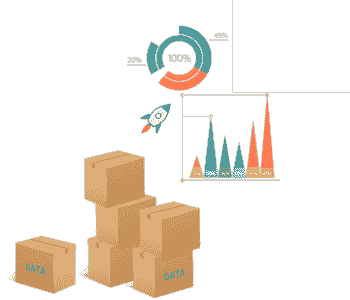
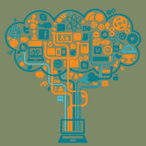
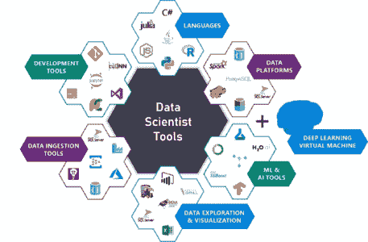

# 关于印度角色的 10 大数据科学家神话

> 原文：<https://www.edureka.co/blog/data-scientists-myths>

[**数据科学**](https://www.edureka.co/masters-program/data-scientist-certification) 已经成为近期最具趋势的领域之一。它正以惊人的速度增长，对数据科学家的需求也在增长。数据科学家的角色是极其动态的；对他们来说，没有两天是一样的，这就是为什么它如此独特和令人兴奋。因为这是一个新领域，所以既兴奋又困惑。那么，让我们按照以下顺序来澄清那些数据科学家的神话:

*   [谁是数据科学家？](#who-is-a-ds)
*   [数据科学家的神话与现实](#myths-vs-reality)

## 谁是数据科学家？

虽然对 [数据科学家](https://www.edureka.co/blog/who-is-a-data-scientist/) 有几种定义，但基本上他们都是实践数据科学艺术的专业人士。数据科学家利用他们在科学领域的专业知识解决复杂的数据问题。这是一个专家的职位。

他们擅长不同类型的技能，如演讲、文本分析(NLP)、图像和视频处理、医学和材料模拟等。这些专家角色中的每一个在数量上都非常有限，因此这样一个专家的价值是巨大的。任何迅速获得动力的事物往往会成为每个人谈论的话题。而且，人们谈论的越多，误解和神话就越多。因此，让我们揭穿一些数据科学家的神话。

## 数据科学家的神话与现实

*   **你需要成为博士** 

毫无疑问，博士学位是一项非常大的成就。做研究需要很多努力和奉献。但是成为数据科学家有必要吗？这取决于你想从事的工作类型。

如果你想去**应用数据科学岗位**，这个岗位主要是基于使用现有算法和理解它们如何工作。大多数人都属于这一类，你看到的大多数职位空缺和工作描述都只针对这些角色。对于这个角色，你**不需要**博士学位。

但是，如果你想从事研究工作，那么你可能需要一个博士学位。如果研究算法或写任何论文是你的事情，那么博士是你的方向。

*   **数据科学家将很快被人工智能取代**

如果你认为一群数据科学家可以做与一个人工智能/人工智能项目相关的一切事情。这不是一个实用的解决方案，因为如果你专注于任何一个人工智能项目，它都有过多的工作岗位。 **[AI](https://www.edureka.co/blog/artificial-intelligence-tutorial/)** 是一个非常复杂的领域，有很多不同的角色与之相关，比如:

*   [数据工程师](https://www.edureka.co/blog/big-data-engineer-skills/)
*   统计员
*   领域专家
*   物联网专家
*   [项目经理](https://www.edureka.co/blog/project-management/)

光靠数据科学家无法解决所有问题，人工智能也不可能做到。所以，如果你是害怕这个的人之一，DONT。人工智能还不能做这样的事情，你需要不同领域的大量知识。

看看这个由 Edureka 设计的 [**NLP 培训**](https://www.edureka.co/python-natural-language-processing-course) 让你的 AI 技能更上一层楼

*   **更多的数据提供更高的准确性**

有一个非常大的误解，大数据科学家的一个误区是“数据越多，模型的准确性就越高”。更多的数据**不会将**转化为更高的精度。另一方面，维护良好的小型数据可能具有更好的质量和准确性。最重要的是理解数据及其可用性。最重要的是**的质量**。

*   **深度学习只适用于大型组织**

一个最常见的误区是，你需要相当多的硬件来运行深度学习任务。嗯，这并不完全错误，当有强大的硬件设置运行时，深度学习模型总是会更有效地执行。但是你可以在你的本地系统或者 [Google Colab](https://colab.research.google.com/notebooks/welcome.ipynb) (GPU + CPU)上运行。在您的机器上训练模型可能需要比预期更长的时间。

*   **数据收集很容易**

数据正以每天大约 2.5 万亿字节的惊人速度生成，以正确的格式收集正确的数据仍然是一项艰巨的任务。你需要为你的项目建立一个**合适的管道**。有很多来源可以获得数据。成本和质量很重要。维护数据和管道的完整性是一个非常重要的部分，不应该乱来。

*   **数据科学家只与工具打交道/一切都与工具有关**

人们通常开始学习一种工具，认为他们会在数据科学领域找到一份工作。作为一名数据科学家，学习一种工具很重要，但正如我之前提到的，他们的角色更加多样化。数据科学家应该超越使用工具来获得解决方案；相反，他们需要掌握必要的技能。是的，掌握一种工具创造了轻松进入数据科学的希望，但雇佣数据科学家的公司不会只考虑工具专业知识；相反，他们寻找的是掌握了技术和商业技能的专业人士。

*   **你需要有编码/计算机科学背景**

大多数数据科学家擅长编码，可能有计算机科学、数学或统计学方面的经验。这并不意味着来自其他背景的人不能成为数据科学家。所以，有一点要记住，这些来自这些背景的人有优势，但这只是在最初阶段。您只需要保持奉献和努力工作，很快就会对您来说也很容易。

*   **数据科学竞赛和真实项目是一样的**

这些比赛是**数据科学漫长旅程中的一个伟大开端**。你要处理大型数据集和算法。一切都很好，但将它视为一个项目并写进你的简历肯定不是一个好主意因为这些比赛与现实生活中的项目相去甚远。你不能清理杂乱的数据或建立任何管道或检查时间限制。重要的是模型的准确性。

*   **这都是关于预测模型的建立**

人们通常认为数据科学家预测未来的结果。预测建模是数据科学的一个非常重要的方面，但它本身并不能帮助你。任何一个项目，从数据收集、扯皮、分析数据、训练算法、建立模型、测试模型到最后部署的**全周期**都有**多个步骤**参与。你需要知道整个**端到端的流程**。让我们看看最终的数据科学家神话。

*   **AI 一旦建成将继续进化**

这是一个普遍的误解，即人工智能会自己继续成长、进化和推广。嗯，科幻电影一直在传达同样的信息。现在，这完全不是真的，事实上，我们落后了。我们最多能做的就是训练模型，如果有新的数据输入，这些模型就会自我训练。他们无法适应环境的变化和新的数据类型。

*所以。如果你认为一日机器将做所有的工作？好吧，你得离开电影了！*

我希望你所有的数据科学家神话现在都被澄清了。Edureka 还提供了关于数据科学的结构化培训。它包括关于统计学、数据科学、Python、Apache Spark & Scala、Tensorflow 和 Tableau 的培训。

有问题要问我们吗？请在“数据科学家的神话”文章的评论部分提到它，我们将会回复您。