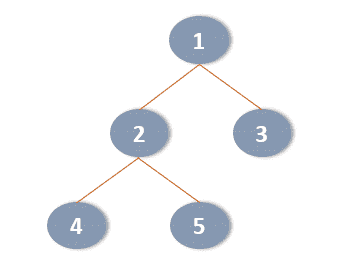
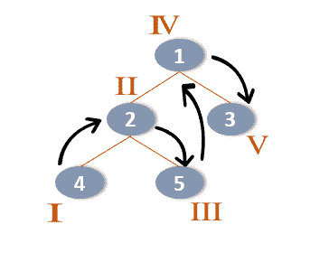
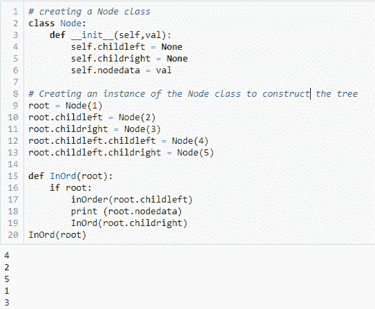
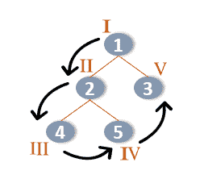
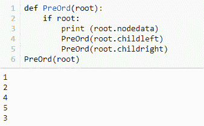
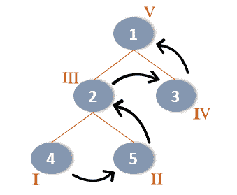
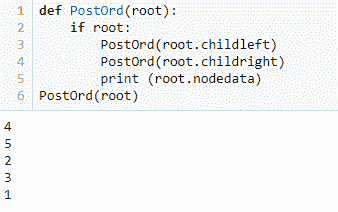

# 如何用 Python 实现数据结构和算法

> 原文：<https://www.edureka.co/blog/data-structures-and-algorithms-in-python/>

数据结构和算法的知识构成了识别程序员的基础，这给了技术爱好者获得 [Python 认证](https://www.edureka.co/python-programming-certification-training)的又一个理由。虽然数据结构有助于数据的组织，但算法有助于为无休止的数据分析问题找到解决方案。因此，如果您仍然不了解 Python 中的数据结构和算法，这里有一篇详细的文章将帮助您理解和实现它们。

在继续之前，看一下这里讨论的所有主题:

*   [Python 中的数据结构](#ds)
    *   [内置数据结构](#builtin)
    *   [用户自定义数据结构](#userdefined)
*   [Python 中的算法](#algorithms)
    *   [什么是算法？](#whatarealgorithms)
    *   [好算法的要素](#elements)
    *   [算法类](#classes)
    *   [树遍历算法](#treetraversal)
    *   [排序算法](#sorting)
    *   [搜索算法](#searching)
*   [算法分析](#analysis)

## **Python 中的数据结构:**


### **内置数据结构:**

[**列表**](https://www.edureka.co/blog/data-structures-in-python/#list) :存储可变的、可以包含重复项的索引元素

[](https://www.edureka.co/blog/data-structures-in-python/#tuple):存储索引的、不可改变的元素，可以有重复的副本

[**字典**](https://www.edureka.co/blog/data-structures-in-python/#dictionary) :存储可变的键值对

[**集合**](https://www.edureka.co/blog/sets-in-python/) :包含无序的、唯一的可变元素

### **用户自定义数据结构:**

[**数组**](https://www.edureka.co/blog/arrays-in-python/) :类似于列表，但是存储单一类型的元素

[](https://www.edureka.co/blog/data-structures-in-python/#stack):线性后进先出数据结构

[](https://www.edureka.co/blog/data-structures-in-python/#queue):线性 FIFO(先进先出)数据结构

[**树**](https://www.edureka.co/blog/data-structures-in-python/#tree) :具有根和节点的非线性数据结构

[**链表**](https://www.edureka.co/blog/data-structures-in-python/#linkedlist) :用指针链接的线性数据结构

[**图**](https://www.edureka.co/blog/data-structures-in-python/#graph) :存储点或节点以及边的集合

[**哈希映射**](https://www.edureka.co/blog/hash-tables-and-hashmaps-in-python/) :在 [Python](https://www.edureka.co/blog/python-tutorial/) 中，哈希映射和字典一样

这篇关于 Python 中的数据结构和算法的文章将要求您事先了解 Python 中的数据结构。如果您对它没有太多的了解，请点击。

## **算法:**

### **什么是算法？**

算法是以有限的、连续的顺序制定的规则或指令，用于解决问题并获得所需的结果。它们给出了问题的伪代码，并且可以用几种语言实现，因为它们不是特定于语言的。

**怎么写算法？**

算法通常由用户可理解的语言和一些常见的编程语言组合而成。它们通常是一步一步写下来的，但是并不总是需要这样做。制定算法没有明确的规则，但您需要记住以下几点:

1.  找出确切的问题是什么
2.  确定你需要从哪里开始
3.  确定你需要在哪里停下来
4.  制定中间步骤
5.  回顾你的步骤

例如，如果您必须制定一个算法来检查学生是否通过了考试，您可以遵循给定的步骤:

第一步:开始

步骤 2:声明两个变量 x，y

第三步:将学生获得的分数存储在 x 中

步骤 4:将最低及格分数存储在 y 中

步骤 5:检查 x 是否大于或等于 y。如果是，则返回“通过”，否则返回“失败”

停止

但是，您可以根据自己的喜好操作这些步骤。例如，您可以在步骤 2 中为变量赋值，而不是执行步骤 3 和 4。这样，一个问题可以有多个解决方案，选择最可行和最可靠的解决方案取决于问题和程序员。

### **好算法的要素:**

*   步骤需要**有限**，**清晰**，**可理解**
*   **输入**和**输出**应有清晰和**精确的**描述
*   每个**步骤**需要有一个**定义的输出**，该输出只取决于该步骤或前面步骤中的输入
*   算法应该足够灵活来塑造它，以便允许许多解决方案
*   这些步骤应该利用**通用编程基础**，而不应该是特定于语言的

### **算法类:**

| **类** | **描述** |
| 各个击破 | 将问题分成子部分，并分别解决每个子部分 |
| 动态规划 | 将问题分成子部分，记住子部分的结果，并将其应用于类似的问题 |
| 贪婪算法 | 包括在解决问题时采取最简单的步骤，而不用担心未来步骤的复杂性 |

继续 Python 文章中的数据结构和算法，让我们看看一些重要的算法，比如树遍历算法、搜索算法、排序算法等。

#### **树遍历算法:**

如前所述，Python 中的树是具有根和节点的非线性数据结构。树遍历指的是恰好访问树中的每个节点一次，以便更新或检查它们。看看下面显示的树:



基于节点被访问的顺序，可以有三种类型的树遍历:

*   前序遍历(根-左-右)
*   有序遍历(左根右)
*   后序遍历(左-右-根)

在为每个遍历创建函数之前，您需要创建一个节点类，并使用以下代码创建树(运行所有函数):

```
# creating a Node class 
class Node:
    def __init__(self,val):
        self.childleft = None
        self.childright = None
        self.nodedata = val

# Creating an instance of the Node class to construct the tree shown in the image above
root = Node(1)
root.childleft = Node(2)
root.childright = Node(3)
root.childleft.childleft = Node(4)
root.childleft.childright = Node(5)  
```

##### **有序遍历:**

有序遍历是指以这样的方式遍历树，首先访问左边的**节点，然后是根**节点**，然后是右边的**节点**。您从左子树中的所有节点开始遍历，然后向根节点移动，最后到右子树。**

在上面显示的树中，4 是最左边的节点，因此是第一个被访问的节点。接下来，您向根移动，因此节点 4 的根是 2，因此您访问节点 2。接下来，您必须检查右侧是否有任何节点，以及上面显示的树，节点 5 存在，因此节点 5 被访问。一旦完成，左子树就完成了，然后你必须再次遵循相同的规则，即左-根-右，以完成遍历。



用于有序遍历的**算法**如下:

**步骤 1** :遍历左子树中的节点

**第二步**:访问根节点

**第三步**:遍历右边的子树

**有序功能:**

```
def InOrd(root):
    if root:
        InOrd(root.childleft)
        print (root.nodedata)
        InOrd(root.childright)
InOrd(root)
```

当您运行这个函数以及前面显示的代码时，您将获得给定二叉树的有序遍历。

##### ****

##### **前序遍历:**

在前序遍历中，首先访问**根**节点，接着是**左**子树，然后是**右**子树。因此，在上面的示例中，您首先访问节点 1，然后访问节点 1 左侧的节点 2。然后，您必须向节点 2 的左侧移动，先访问节点 4，然后访问节点 5。这样，根和左子树就完成了，因此，您需要访问右子树。



用于前序遍历的**算法**将如下:

**步骤 1** :访问根节点

**步骤 2** :遍历左子树中的节点

**第三步**:遍历右边的子树

**预购功能:**

```
def PreOrd(root):
    if root:
        print (root.nodedata)
        PreOrd(root.childleft)
        PreOrd(root.childright)
PreOrd(root)
```

##### ****

##### **后序遍历:**

后序遍历从左开始，然后到右，最后到根。在上面的示例中，您访问了节点 4，然后向右移动到节点 5。完成后，您必须访问根节点，即节点 2。这样，左边的子树就完成了，所以你需要向右边的子树移动，最后访问根树。



用于后序遍历的**算法**将如下:

**步骤 1** :遍历左子树中的节点

**第二步**:遍历右边的子树

**第三步**:访问根节点

**后期订单功能:**

```
def PostOrd(root):
    if root:
        PostOrd(root.childleft)
        PostOrd(root.childright)
        print (root.nodedata)
PostOrd(root)
```



数据排序是一个实时问题，需要解决许多排序算法。因此，继续阅读 Python 文章中的数据结构和算法，让我们深入了解一下 Python 中的排序算法。

### **排序算法:**

排序算法用于将数据按给定的顺序排序。排序算法可以分为五种类型:

*   合并排序
*   冒泡排序
*   插入排序
*   选择排序
*   外壳排序

**注:**这里所有的算法都按照**升序**排序。

#### **合并排序:**

合并排序算法遵循分治规则。在这里，给定的项目列表首先被分成更小的列表，直到它到达每个列表只包含一个项目的点。默认情况下，由一个项目组成的列表将被排序，然后合并排序算法比较相邻的列表，并按照所需的顺序对它们进行重新排序。这个过程递归地进行，直到只存在一个排序列表。

**合并排序算法:**

**第一步:**检查列表是否包含多个项目；如果是，将列表分成两半，否则对列表进行排序

**步骤 2:** 重复划分列表，直到每个子列表中只剩下一个元素

第三步:递归合并子列表，按照给定的顺序排列它们，直到你得到一个单一的排序列表

**合并排序程序:**

```
def msort(mylist, left, right):
    if right - left > 1:
        middle = (left + right)//2
        msort(mylist, left, middle)
        msort(mylist, middle, right)
        mlist(mylist, left, middle, right)

def mlist(mylist, left, middle, right):
    leftlist = mylist[left:middle]
    rightlist = mylist[middle:right]
    k = left
    i = 0
    j = 0
    while (left + i < middle and middle + j < right):
        if (leftlist[i] <= rightlist[j]):
            mylist[k] = leftlist[i]
            i = i + 1
        else:
            mylist[k] = rightlist[j]
            j = j + 1
        k = k + 1
    if left + i < middle:
        while k < right:
            mylist[k] = leftlist[i]
            i = i + 1
            k = k + 1
    else:
        while k < right:
            mylist[k] = rightlist[j]
            j = j + 1
            k = k + 1

mylist = input('Enter the list values to be sorted: ').split()
mylist = [int(x) for x in mylist]
msort(mylist, 0, len(mylist))
print('The sorted list is: ')
print(mylist)
```

上面的程序将允许用户输入要排序的列表，并将显示最终排序的列表，如下所示:

**输出:**

输入要排序的列表值:23 1 45 34 7 排序后的列表为: [1，7，23，34，45]

#### **冒泡排序:**

冒泡排序是一种比较算法，它首先比较相邻的元素，如果它们没有按指定的顺序排列，就对它们进行排序。

**冒泡排序算法:**

**步骤 1:** 从第一个元素，即索引为 0 的元素开始，逐步比较数组中的相邻元素

**步骤 2:** 如果当前元素和下一个元素没有按照指定的顺序，则交换元素

**步骤 3:** 如果当前元素和下一个元素按照指定的顺序，则移动到下一个元素

**冒泡排序程序:**

```
def bs(a):                   # a = name of list
    b=len(a)-1
    for x in range(b):
        for y in range(b-x):
            if a[y]>a[y+1]:
                a[y],a[y+1]=a[y+1],a[y]
    return a
a=[3,6,1,8]
bs(a)

```

**输出:** [1，3，6，8]

上面的程序将给定的列表按升序排序。

#### **插入排序:**

插入排序一次选取给定列表中的一个元素，并将其放在要放置它的确切位置。

**插入排序算法:**

**步骤 1:** 将第一个元素与下一个元素(key)进行比较，如果左边的元素和 key 元素没有按顺序排列，则交换它们

**步骤 2:** 取下一个元素(key ),如果新的 key 元素需要重新定位，则向右移动排序列表的元素，直到为所考虑的元素创建了合适的位置

**步骤 3:** 重复步骤 2，直到给定列表的所有元素都被排序

**插入排序程序:**

```
def isort(a): 
    for x in range(1, len(a)): 
        k = a[x]  #element present at index number 1
        j = x-1
        while j >=0 and k < a[j] :      #comparing elements with the next until the last item 
                a[j+1] = a[j] 
                j -= 1         #comparing each element to the elements present to its left 
        a[j+1] = k     #new item becomes the key

a = [24, 56, 1, 50, 17] 
isort(a) 
print(a)

```

**输出:** [1，17，24，50，56]

在上面的程序中，第一个关键元素将是 56，这与列表的第一个元素 24 相比较。由于这两个元素已经排序，算法接受下一个元素，即 1，这将成为新的键。因为 1 小于 24 和 56，所以 24 和 56 都向右移动，1 放在数组的开头。重复相同的过程，直到给定数组中的所有项目都被排序。

#### **选择排序:**

选择排序算法将给定的列表分成两半，其中前半部分是排序列表，后半部分是未排序列表。首先，排序列表是空的，所有要排序的元素都出现在未排序列表中。

选择排序算法将查看未排序列表中存在的所有元素，选取应该最先出现的项目，然后将其放入排序列表中。然后重复搜索过程，将下一个元素放在排序列表中第一个元素的右边。

例如，如果您必须按升序对元素进行排序，选择排序算法将查看整个列表，选择最小的元素，然后将该元素作为排序列表中的第一个元素。然后，它搜索下一个最小的元素，并将其放在第一个元素的右边，依此类推。

**选择排序算法:**

**第一步:**将第一个元素作为最小值，与下一个元素进行比较。如果下一个元素小于所选元素，则将其标记为最小值，并与下一个元素进行比较。重复相同的过程，直到您比较了未排序列表的所有元素

**步骤 2:** 将最小值放入排序后的数组中(这成为排序后的数组的第一个元素)

**步骤 3:** 增加计数器的位置，指向未排序数组的第一个元素，并对未排序数组的所有元素重复步骤 1 和 2

**选择分拣程序:**

```
def selsort(myarray, r):
    for x in range(r):
        minimum = x      #first element is assumed to be the minimum
        for y in range(x + 1, r):    
            if myarray[y] < myarray[minimum]:     #comparing minimum with the next element
                minimum = y
        (myarray[x], myarray[minimum]) = (myarray[minimum], myarray[x]) #swap elements if required
mylist = [34, 23, 1, 67, 4]
r = len(mylist)
selsort(mylist, r)
print(mylist)
```

**输出:** [1，4，23，34，67]

#### **外壳分类:**

Shell 排序算法允许您对彼此分离的元素进行排序。对元素进行排序的原始序列遵循 n/ 2，n/4，…，1 序列，其中 n 是未排序列表中存在的元素数量。例如，如果你有一个包含 8 个元素的列表，那么这个列表的长度将除以 2，即 8/ 2 = 4。现在，将第一个元素与索引号为 4 的元素进行比较，然后，通过将 8 除以 4 来产生间隙。这一次，间隔将是 2，位于这些间隔的元素将被比较。最后，8/ 8 = 1，所以相邻的元素将被比较和排序。(对于奇数列表，商的整个部分将作为间隙)

**外壳排序算法:**

**第一步:**用元素个数除以 2，求出 gap 的值

**步骤 2:** 将给定阵列分成具有相等间隙间隔的更小的子阵列

**步骤 3:** 使用插入排序，对子数组进行排序

**步骤 4:** 重复步骤 1、2 和 3，直到整个数组排序完毕

**外壳分类程序:**

```
def shsort(myarray, n):
    g = n // 2       # dividing the number of elements by 2 to find the gap
    while g > 0:
        for x in range(g, n):
            y = myarray[x]
            z = x
            while z >= g and myarray[z - g] > y:
                myarray[z] = myarray[z - g]
                z -= g
            myarray[z] = y
        g //= 2
mylist = [23, 12, 1, 17, 45, 2, 13]
length = len(mylist)
shsort(mylist, length)
print(mylist)
```

**输出:**【1，2，12，13，17，23，45】

继续这篇 Python 中的数据结构和算法的文章，让我们看看 Python 中一些最重要的搜索算法。

### **搜索算法:**

搜索算法用于搜索或获取某个给定数据集中的某些元素。有许多类型的搜索算法，如线性搜索，二分搜索法，指数搜索，插值搜索等。

#### **线性搜索:**

线性搜索算法用于通过与给定数组的每个元素进行比较来连续搜索给定元素。这是最简单的搜索算法之一，但对理解其他排序算法非常重要。

**线性搜索算法:**

**步骤 1:** 创建一个接受数据列表、列表长度和关键元素的函数

**步骤 2:** 如果给定列表中的一个元素与 key 元素匹配，则返回相应的索引号

**第三步:**如果没有找到元素，返回-1

**线性搜索程序:**

```
def lin_search(myarray, n, key): 

    for x in range(0, n): 
        if (myarray[x] == key): 
            return x 
    return -1

myarray = [ 12, 1, 34, 17]
key = 17
n = len(myarray)
matched = lin_search(myarray, n, key) 
if(matched == -1): 
    print("Key is not present") 
else: 
    print("Key is present in the given list at index", matched)
```

**输出:**关键字出现在给定列表中的索引 3 处

#### **二分搜索法:**

通过使用递减和征服算法，二分搜索法用于搜索排序数组中的某个给定元素。在这里，首先通过与中间的元素进行比较来查找键，然后将数组分成两半。如果要搜索的元素小于中间的元素，则搜索左半部分，反之亦然。适当的子阵列再次被分成两半，并再次重复该过程。

例如，如果您有一个包含 8 个元素的排序列表，则 key 元素将与位于中间的元素进行比较，或者 7/ 2 = 3.5 (7 是最后一个元素的索引值)，并且取整数值进行比较。因此，关键元素将与索引号 3 处的值进行比较，如果给定值较小，则向中间元素的左侧重复相同的过程，反之亦然。

**二分搜索法算法:**

**第一步:**将键与中间元素进行比较

**第二步:**如果匹配，返回中间指标值

**步骤 3:** 如果关键元素大于中间元素，则在中间元素右侧搜索关键元素，否则在左侧搜索

**二分搜索法计划:**

```
def bin_search(mylist,key):
    l = 0
    r = len(mylist)-1
    matched = False
    while( l<=r and not matched):
        middle = (l + r)//2
        if mylist[middle] == key :
            matched = True
        else:
            if key < mylist[middle]:
                r = middle - 1
            else:
                l = middle + 1
    return matched
print(bin_search([2, 3, 56, 13, 1], 56))
print(bin_search([2, 3, 56, 13, 1], 26))

```

**输出:**

真假

Python 中的数据结构和算法文章中讨论的最后一个主题是算法分析。

## **算法分析:**

算法可以在实现之前和之后进行分析。这些分析被称为先验分析和后验分析。

**先验分析(理论分析):**算法的效率是通过假设所有其他因素不变且不影响算法的实现来衡量的。

**后验分析(经验分析):**使用某种编程语言实现算法后，在某种计算机上执行。因此，在这种分析中，收集了实际值，如时间复杂度或算法直到完成任务的执行时间、空间复杂度或算法在其整个生命周期所需的空间等。

我希望你清楚本教程中与你分享的所有内容。这就把我们带到了关于 Python 中的数据结构和算法的文章的结尾。 ***确保你尽可能多的练习，恢复你的经验。***

*有问题吗？请在“Python 中的数据结构和算法”博客的评论部分提到它，我们会尽快回复您。*

*要深入了解 Python 及其各种应用程序，您可以注册参加 Python 在线实时培训，该培训提供全天候支持和终身访问。*