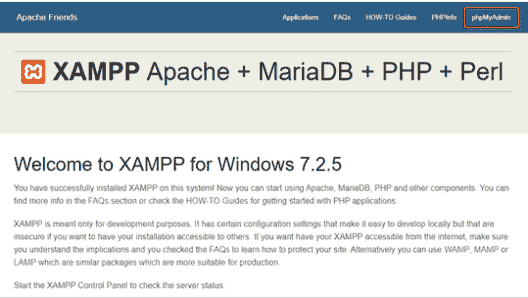
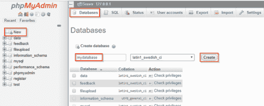
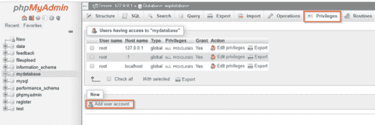
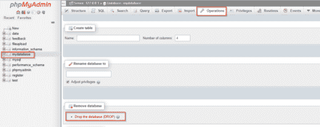
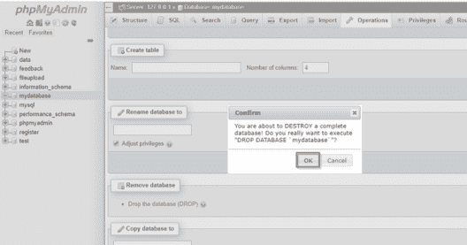

# 如何在 phpMyAdmin 中创建和删除数据库

> 原文：<https://www.edureka.co/blog/database-in-phpmyadmin/>

为了处理网络上 MySQL 的管理，phpMyAdmin 是一个用 [PHP](https://www.edureka.co/blog/php-tutorial-for-beginners/) 编写的免费软件工具。phpMyAdmin 支持 MySQL 和 MariaDB 上的各种操作。各种操作，如管理数据库，表格，列，关系，索引，用户等可以通过其用户界面执行，也可以执行任何 SQL 语句。通常，数据库由一个或多个表组成。在 phpMyAdmin 中，按照以下顺序创建或删除数据库需要特殊的创建权限:

*   [在 phpMyAdmin 中创建一个数据库](#create)
*   [在 phpMyAdmin](#delete) 中删除一个数据库

## **在 phpMyAdmin 中创建一个数据库**

打开 localhost dashboard 并点击 phpMyAdmin。



现在，通过 MySQLi 或手动创建一个数据库。为了手动操作，点击数据库并创建一个新的。



您还可以更改权限，并设置一个新的用户登录来访问该数据库，方法是单击 add user account，如下图所示



您还可以使用 MySQLi 过程创建数据库，如下例所示:

```
// Create connection
$conn = mysqli_connect($servername, $username, $password);
// Check connection
if (!$conn) 
{
    die("Connection failed: " . mysqli_connect_error());
}

// Create database
$sql = "CREATE DATABASE mydatabase";
if (mysqli_query($conn, $sql)) 
{
    echo "Database created successfully";
} else 
{
    echo "Error creating database: " . mysqli_error($conn);
}

mysqli_close($conn);
?>
```

**//输出:**

`Database Created Successfully`

## **删除 phpMyAdmin 中的数据库**

转到 phpMyAdmin 主页，选择要删除的数据库。现在选择 operations 并单击 drop the database，如下图所示。





您还可以使用 SQL query 删除数据库，如下图所示:

`DROP DATABASE mydatabase;`


至此，我们结束了这篇如何在 phpMyAdmin 中创建和删除数据库的文章。我希望您已经了解了如何在 phpMyAdmin 中创建和删除数据库，既可以手动创建，也可以使用查询。

*查看 Edureka 提供的* *[**PHP 认证培训**](https://www.edureka.co/php-mysql-self-paced) ，edu reka 是一家值得信赖的在线学习公司，在全球拥有超过 250，000 名满意的学习者。它会让你很好的理解 PHP。*

*有问题吗？请在这篇文章的评论部分提到它，我会回复你。*