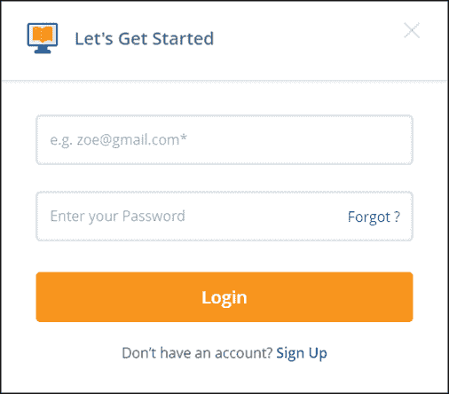

# 什么是软件测试中的决策表？

> 原文：<https://www.edureka.co/blog/decision-table-in-software-testing/>

决策表是处理不同组合输入及其相关输出的好方法。它是一种黑盒测试设计技术，用于确定复杂业务逻辑的测试场景。在本文中，了解更多关于[软件测试](https://www.edureka.co/blog/what-is-software-testing/)中的决策表是如何帮助测试设计技术的，顺序如下:

*   [什么是软件测试中的决策表？](#decisiontable)
*   [决策表为什么重要？](#decisiontableimportance)
*   [决策表在软件测试中的优势](#advantages)
*   [使用决策表的方式:示例](#example)

## **什么是软件测试中的决策表？**

决策表是一种[软件测试](https://www.edureka.co/blog/what-is-software-testing/)技术，用于测试不同输入组合的系统行为。这是一种系统化的方法，其中不同的输入组合及其相应的系统行为以表格的形式被捕获。

此表帮助您处理不同的输入组合及其相关输出。此外，它也被称为因果表，因为一种称为因果图的相关逻辑图表技术基本上用于导出决策表。

## **决策表为什么重要？**

决策表是用于测试和需求管理的杰出技术。决策表非常重要的一些原因包括:

*   决策表在测试设计技术中非常有用。

*   它帮助测试人员搜索不同输入和实现业务规则的其他软件状态的组合的效果。

*   它提供了一种陈述复杂业务规则的常规方式，这对开发人员和测试人员都有好处。

*   它帮助开发人员在开发过程中做得更好。测试所有组合可能不切实际。

*   这是测试和需求管理的最佳选择。

*   在处理复杂的业务规则时，这是一个准备需求的结构化练习。

*   它也用于模型复杂的逻辑。

## **决策表在软件测试中的优势**

在软件测试中使用决策表有不同的优势，例如:

*   使用这种技术，任何复杂的业务流程都可以很容易地转换成测试场景和测试用例。

*   决策表以迭代方式工作。因此，在第一次迭代中创建的表被用作下一个表的输入表。只有当初始表不令人满意时，才进行迭代。

*   简单易懂，每个人都可以用这种方法来设计测试场景& [测试用例](https://www.edureka.co/blog/test-case-in-software-testing/)。

*   它提供了测试用例的完整覆盖，有助于减少编写测试场景的返工。

*   这些表格保证我们考虑了条件值的每一种可能的组合。这就是所谓的完全性。

## **使用决策表的方式:示例**

**决策表**是输入对规则、案例或测试条件的**表格表示**。让我们举一个例子，看看如何为登录屏幕创建决策表:

该条件规定，如果用户提供正确的用户名和密码，用户将被重定向到主页。如果有任何输入错误，将会显示一条错误消息。

| 情况 | 规则 1 | 规则 2 | 规则 3 | 规则 4 |
| 用户名 | F | T | F | T |
| 密码 | F | F | T | T |
| 输出 | E | E | E | H |

在上面的例子中，

*   **T**–正确的用户名/密码
*   **F**–错误的用户名/密码
*   **E**–显示错误信息
*   **H**–显示主屏幕

现在让我们来理解一下上述案例的解释:

*   **案例 1**–用户名和密码都错误。向用户显示一条错误消息。

*   **案例 2**–用户名正确，但密码错误。向用户显示一条错误消息。

*   **案例 3**–用户名错误，但密码正确。向用户显示一条错误消息。

*   **情况 4**–用户名和密码都正确，用户被导航到主页。

这是在软件测试中建立决策表的一个例子。就这样，我们来到了这篇文章的结尾。

*既然你已经了解了软件测试中的决策表，那就来看看* [***软件测试基础课程***](https://www.edureka.co/software-testing-fundamentals-training)*by**edu reka。* *本课程旨在向您介绍完整的软件测试生命周期。您将学习不同级别的测试、测试环境设置、测试用例设计技术、测试数据创建、测试执行、错误报告、DevOps 中的 CI/CD 管道以及软件测试的其他基本概念。*

有问题要问我们吗？请在这个“*软件测试决策表*”博客  的评论区提出来，我们会尽快回复您。