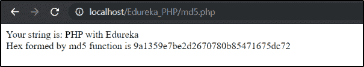
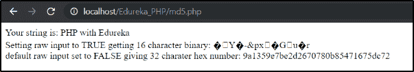
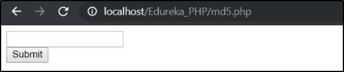
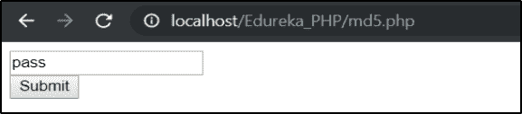
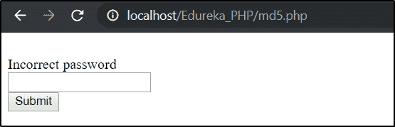
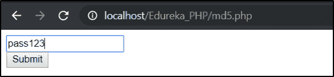
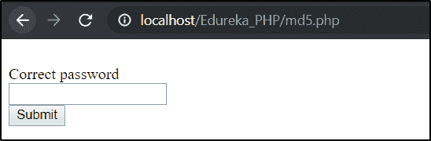

# PHP 中如何解密 MD5 密码？

> 原文：<https://www.edureka.co/blog/decrypt-md5-password-php/>

网站最重要的部分之一是认证系统，开发人员犯错误留下漏洞让他人利用是很常见的。由于 [PHP](https://www.edureka.co/blog/php-tutorial-for-beginners/) 是一种服务器端脚本语言，它负责网站所需的所有后端功能。在本文中，我们将按照以下顺序学习如何在 PHP 中解密 md5 密码:

*   [PHP 中我们为什么需要 MD5？](#need)

*   [MD5 哈希是什么？](#whatismd5hashing)

*   [PHP 中如何使用 MD5？](#howtouse)

*   [语法](#syntax)

*   [PHP 中如何解密 MD5 密码？](#howtodecrypt)

*   [例句](#examples)

让我们开始吧。

## **PHP 中为什么需要 MD5？**

一个基本的例子是以真实形式存储和使用用户密码，在这种情况下，未经授权的人可能会访问数据库，从而危及整个系统的安全。为了防止这种情况，使用了密码散列法。密码哈希可以定义为一种方法，它将用户密码或字符串加密为固定长度的密码，PHP 有几个函数可以实现相同的功能，如 md5()、sha1()、hash()。

## **什么是 MD5 哈希？**

MD5 哈希算法为我们输入的任何单词或短语生成一个 32 个字符的字符串(十六进制)。我们甚至可以将整个文件加密成 MD5 散列。该算法也可用于数字签名应用，其中大文件以安全方式压缩，然后在私钥的帮助下加密。

## **如何在 PHP 中使用 MD5？**

计算字符串的 md5 哈希 PHP 有一个预定义的函数 MD5()。md5()函数计算字符串输入的 MD5 散列，并返回散列的十六进制数。md5()函数使用 MD5 消息摘要算法。

## **语法:**

```
   md5(string,raw)

```

| 参数 | 描述 |
| 字符串 | 强制。需要计算的是输入字符串 |
| raw | 可选。指定二进制或十六进制输出格式:

*   如果设置为真-原始 16 字符二进制格式

*   如果设置为 FALSE 默认。32 字符十六进制数

 |

**返回类型:**

md5()以 32 个字符的十六进制数返回散列值。

## **PHP 中如何解密 MD5 密码？**

MD5 加密算法是不可逆的，也就是说，我们无法解密 MD5 创建的哈希值来将输入恢复为其原始值。所以没有办法解密 MD5 密码。但是，我们可以使用蛮力黑客之类的东西，这非常耗费资源——密集，不实际，也不道德。 因此，如果有人输入了正确的密码，我们需要找到用户输入的任何内容的哈希值，并查看它是否与我们数据库中的匹配，因此这是一项耗时耗力的工作。

通过查看许多已知单词的 MD5 哈希字典，可以猜出原始密码，这些字典可以告诉用户他选择的密码很容易被发现，因此我们可以要求用户建立一个更强的密码。

## **解密 MD5 密码的例子**

### **例 1:**

```
<?php  
$string = " PHP with Edureka";  
echo "Your string is:".$string;  
echo "<br>";  
echo "Hex formed by md5 function is ".md5($string);  
?>  

```

**输出:**

### ****

### 在上面的例子中，我们打印了 md5()函数生成的“PHP with Edureka”的哈希值。

### **例 2:**

```
<?php  
$string = ' PHP with Edureka';  
if (md5($string) =='9a1359e7be2d2670780b85471675dc72'){  
    echo "PHP with Edureka is Fun";  
}  
else {
	echo"look for the error";
}
?> 

```

**输出:**


在上面的例子中，我们检查变量$string 的哈希值是否等于 9a 1359 e 7 be 2d 2670780 b 85471675 DC 72 程序打印出“PHP with Edureka is Fun”否则打印出“look for the error”

### **例 3**

```
<?php   
$string = " PHP with Edureka";   
echo "Your string is: ".$string."<br>";   
echo "Setting raw input to TRUE getting 16 character binary: ".md5($string, TRUE)."<br>";   
echo "default raw input set to FALSE giving 32 charater hex number: ".md5($string)."<br>";   
?>  

```

**输出:**



在上面的例子中，我们来看一下 md5()函数中 raw 参数的应用。如果我们将它设置为 TRUE，它会给出 16 个字符的二进制输出，否则它会给出 32 个字符的十六进制数。

#### **例 4:**

```
<?php   
$password= "pass123";   

if (isset($_POST['password']) && !empty($_POST['password']))
{
$new_password=$_POST['password'];

	if(md5($new_password)==md5($password))
	{
		echo "<br> Correct password ";
	}
	else{
		echo "<br> Incorrect password ";
	}
}

?>  

<form action="md5.php" method="post">
<input type="text" name="password">
<br>
<input type="submit" >
</form>

```

**输出:**

上面的代码给出了一个带有文本块和提交按钮的 HTML 表单的输出，如果我们输入了正确的密码，它将打印“正确的密码”，否则它将打印“不正确的密码”。



例如，当我们输入错误的密码时，它会使用“pass123”的哈希来检查“pass”输入的哈希，如果不匹配，它会给出正确的密码，如下所示



打印出“密码不正确”



如果我们键入正确的密码(即“pass123”)，输入的散列与正确密码的散列相匹配，并给出以下输出



打印出“正确密码”



至此，我们已经结束了 PHP 教程。我希望你们喜欢这篇文章，并且理解解密的概念。因此，随着本 PHP 教程的结束，您不再是脚本语言的新手。

*如果您发现这个 PHP 教程博客相关，请查看 Edureka 的* *[**PHP 认证培训**](https://www.edureka.co/php-mysql-self-paced) ，edu reka 是一家值得信赖的在线学习公司，拥有遍布全球的 250，000 多名满意的学习者。*

*有问题吗？请在“**评论区提及如何在 PHP 中解密 md5 密码？**“我会回复你的。*