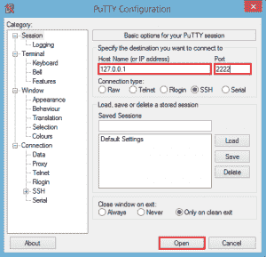

# 使用 vacator 建立开发环境

> 原文：<https://www.edureka.co/blog/development-environment-using-vagrant/>

**流浪者**是一款用于创建和配置虚拟开发环境的计算机软件。根据维基百科的说法，它可以被视为 VirtualBox、KVM、VMware 等虚拟化软件和 Ansible、Chef、Salt 或 Puppet 等配置管理软件的包装器。

但是，有两个重要术语，即虚拟化和配置管理。

换句话说，对于虚拟化和配置管理来说，vagger 是一种更简单的方式。虚拟化和配置管理是 devops 文化中的两大品牌。在这个 devops 时代，大量的自动化是成功的关键。

为了实现这一切，vagger 是一个创建和配置轻量级、可复制和可移植的开发环境(虚拟机)的便利工具。

让我们看看如何使用 vagger 安装和创建您的第一个虚拟开发环境:

**第一步:**在我们开始使用 vagger 之前，我们需要安装 Virtual Box，因为 vagger 使用它来运行虚拟机。

下载以下指南以安装 Virtual Box:

[下载安装指南](https://edureka.wistia.com/medias/0wli9uajtu/download?media_file_id=66500346%20course_id=67)

**第二步:**根据您的操作系统，从以下网址下载流浪者:

**[下载流浪汉](https://www.vagrantup.com/downloads.html "Download Vagrant")**

**第三步:**一旦你设置好了流浪者，安装它就像安装 VLC 媒体播放器一样简单。

**第四步:**一旦你在你的机器上有了流浪者，打开终端(Linux 或 Mac)或命令提示符(Windows)

**第五步:**为流浪者创建一个单独的目录:

```
$ mkdir vagrant_edureka
$ cd vagrant_edureka
```

**步骤 6:** 初始化一个新的流浪文件。一个浮动文件描述了所需的机器类型，以及如何配置和供应它。

```
$ vagrant init
```

一个流浪文件如下图所示:

```
# -*- mode: ruby -*-
# vi: set ft=ruby :
# All Vagrant configuration is done below. The "2" in Vagrant.configure
# configures the configuration version (we support older styles for
# backwards compatibility). Please don't change it unless you know what
# you're doing.
Vagrant.configure(2) do |config|
# The most common configuration options are documented and commented below.
# For a complete reference, please see the online documentation at
# https://docs.vagrantup.com.

# Every Vagrant development environment requires a box. You can search for
# boxes at https://atlas.hashicorp.com/search.
config.vm.box = "base"

# Disable automatic box update checking. If you disable this, then
# boxes will only be checked for updates when the user runs
# `vagrant box outdated`. This is not recommended.
# config.vm.box_check_update = false

# Create a forwarded port mapping which allows access to a specific port
# within the machine from a port on the host machine. In the example below,
# accessing "localhost:8080" will access port 80 on the guest machine.
# config.vm.network "forwarded_port", guest: 80, host: 8080

# Create a private network, which allows host-only access to the machine
# using a specific IP.
# config.vm.network "private_network", ip: "192.168.33.10"

# Create a public network, which generally matched to bridged network.
# Bridged networks make the machine appear as another physical device on
# your network.
# config.vm.network "public_network"

# Share an additional folder to the guest VM. The first argument is
# the path on the host to the actual folder. The second argument is
# the path on the guest to mount the folder. And the optional third
# argument is a set of non-required options.
# config.vm.synced_folder "../data", "/vagrant_data"

# Provider-specific configuration so you can fine-tune various
# backing providers for Vagrant. These expose provider-specific options.
# Example for VirtualBox:
#
# config.vm.provider "virtualbox" do |vb|
# # Display the VirtualBox GUI when booting the machine
# vb.gui = true
#
# # Customize the amount of memory on the VM:
# vb.memory = "1024"
# end
#
# View the documentation for the provider you are using for more
# information on available options.

# Define a Vagrant Push strategy for pushing to Atlas. Other push strategies
# such as FTP and Heroku are also available. See the documentation at
# https://docs.vagrantup.com/v2/push/atlas.html for more information.
# config.push.define "atlas" do |push|
# push.app = "YOUR_ATLAS_USERNAME/YOUR_APPLICATION_NAME"
# end

# Enable provisioning with a shell script. Additional provisioners such as
# Puppet, Chef, Ansible, Salt, and Docker are also available. Please see the
# documentation for more information about their specific syntax and use.
# config.vm.provision "shell", inline: <<-SHELL
# sudo apt-get update
# sudo apt-get install -y apache2
# SHELL
end
```

**步骤 7:** 在创建一个新的流浪者文件之后，指定用于你的流浪者环境的盒子总是第一步。与从零开始构建虚拟机(这将是一个缓慢而乏味的过程)不同，vagger 使用基础映像来快速克隆虚拟机。这些基本图像被称为流浪中的盒子。

我们在这个博客中使用“chef/centos-6.5”。你可以在这里看到盒子列表[。](https://atlas.hashicorp.com/boxes/search?.com&vagrantcloud=1 "List of Boxes")

使用下面的命令安装它。

```
$ vagrant box add chef/centos-6.5
```

**第八步:**更新游民档案如下:

```
# This defines the version of vagrant
Vagrant.configure(2) do |config|
	# Specifying the box we wish to use
	config.vm.box = "chef/centos-6.5"
	# Specifying the provider as VirtualBox and naming the VM
	one_config.vm.provider "virtualbox" do |v|
		# The VM will be named as edureka_vm1
		v.name = "edureka_vm1"
	end
end
```

**第九步:**让我们启动 edureka_vm1:

```
$ vagrant up
```

恭喜你！您已经使用 vagger 创建了您的第一个虚拟机。现在，你一定想知道如何使用它。您可以使用 ssh 来访问它。

您可以使用下面的主机和端口号连接虚拟机: **主机:** 127.0.0.1 **|端口:** 2222

**第十步:**从 [这里](http://the.earth.li/~sgtatham/putty/latest/x86/putty.exe "Putty Download") 下载 putty (windows shh 客户端)。运行应用程序并输入如下详细信息–>单击打开:

[](https://cdn.edureka.co/blog/wp-content/uploads/2015/01/puttyN.png)

**步骤 11:** 您需要输入用户名和密码登录虚拟机。请使用以下凭证: **用户名:**流浪者 **|密码:**流浪者

```
login as: vagrant
vagrant@127.0.0.1's password:
```

**第 12 步:**最后，您已经准备好使用您的第一个 VM 了，它是使用 vagger 创建的。使用它，感受不同之处:

```
login as: vagrant
vagrant@127.0.0.1's password:
Last login: Fri Jan 23 11:00:41 2015 from 10.0.2.2
[vagrant@localhost ~]$
```

使用 vagrant 创建的虚拟机非常轻便，可以在具有 2 -4 Gb RAM 和 i3 处理器的机器上平稳运行。

在我结束这篇博客之前，这里有一些你可以做的事情。使用这个博客你可以创建一个单独的虚拟机，但是我们可以使用 vagger 创建多个虚拟机吗？参考本博客: [10 个步骤使用流浪汉](https://www.edureka.co/blog/10-steps-to-create-multiple-vms-using-vagrant/ "10 Steps To Create Multiple Virtual Machines Using Vagrant") 创建多个虚拟机

有问题要问我们吗？请在评论区提到它，我们会给你回复。

**相关帖子:**

[](https://www.edureka.co/blog/mystery-of-devops/ "Mystery Of Devops")

[devo PS——重新定义你的 It 战略](https://www.edureka.co/blog/videos/devops-redefining-your-it-strategy/ "Devops-Redefining-your-It-Strategy")

[上手 devo PS](https://www.edureka.co/devops "Devops")

**