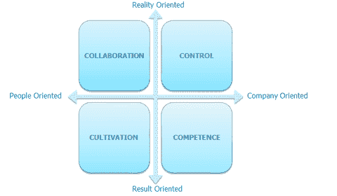
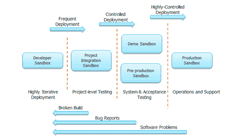
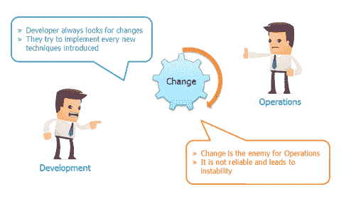
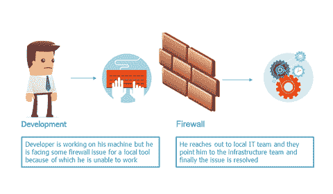
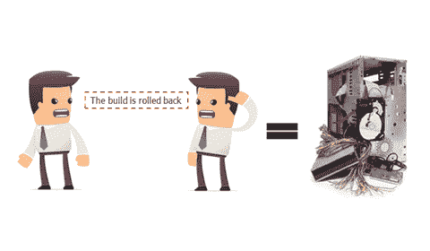
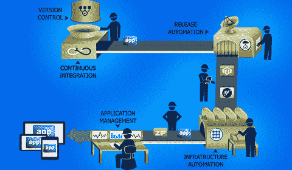
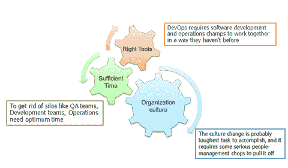
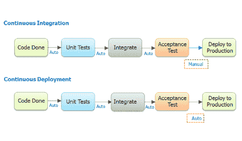
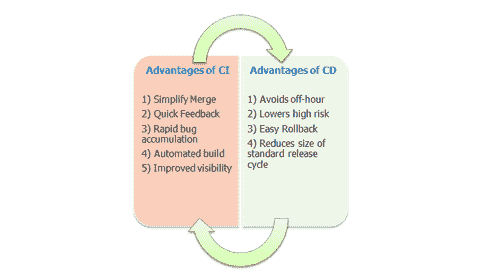

# DevOps 既不是一种方法也不是一种工具，它是一种文化

> 原文：<https://www.edureka.co/blog/devops-is-neither-a-method-nor-a-tool-its-a-culture/>

文化经常被忽视和误解，但它却是决定公司业绩的关键因素。如果我们不管理我们的文化，我们将最终做错误的实践，这将最终影响我们的业务目标。

## 了解组织的当前文化

文化告诉我们一个团体或公司的价值观和规范。它确定了什么是重要的，以及人们如何相互接近和合作。

**文化=“如何聪明地做事以获得成功”**

让我们以客户支持团队为例。该团队的文化应该是，他们最终实现 97-98 %的客户满意度。

牢记顾客的喜悦，首先他们需要有礼貌，即使在困难的情况下；他们需要成为好的倾听者，以避免混淆；他们需要根据需求确定工作的优先级。

让我们暂停一下，问自己几个问题:

*   我现在公司的文化是什么？
*   这种文化与我的业务目标或关键绩效指标的契合程度如何？
*   由于错位，我会遇到什么问题？

对于每个组织来说，4c 标准都扮演着至关重要的角色

现在，让我们来看看软件开发组织的文化。构建和维护一个软件单元涉及到许多团队。所有这些团队都有各自的目标和文化。

这个过程在客户确认需求后开始。

开发人员遵循由他们的组织定义的编码指南，并且使用诸如编译器、解释器、调试器等编程工具来生成代码。使用 C、C++、Pascal、Java、PHP 等不同的高级编程语言进行编码。

他们把完整的包分成小文件夹，然后据此开发小代码。

**阶段 1** :这些小单位的代码然后被组合成一个大单位。在集成较小的芯片时，必须进行项目级测试，称为集成测试。

**第二阶段**:集成成功后，部署到虚拟系统中。这个虚拟系统的配置与客户机或最终部署这个项目的机器的配置相似。

**阶段 3** :最后，在一个虚拟系统中测试完所有特性之后，项目被部署到生产服务器或客户机上。

虽然这个过程看起来很容易，但从技术角度来说，却很难实现。

让我们看看我们可能会面临什么问题:

**第一阶段** :

客户总是在寻找改进产品质量的方法。当第一次迭代完成时，客户通常会建议一些变更。当开发人员收到变更时，他们开始合并变更，这会影响集成，导致构建失败。

**第二阶段:**

大多数时候，测试人员或其他操作人员不会意识到将要做出的新变化。一旦他们从开发者那里得到代码，他们就开始测试。而在后端，开发人员仍在进行更改。

由于他们没有足够的时间来实现新的变化，他们最终开发出低效的代码；他们面临着其他网络和数据库问题，这再次延误了他们的交货时间。

当他们最终将代码交付给操作团队时，他们只剩下很少的时间来创建和实现新的测试用例。所以他们跳过了许多测试用例，他们后来意识到那些是高优先级的。

**第三阶段:**

尽管实际上构建似乎已经准备好投入生产，但结果却完全出乎意料。构建失败，并出现许多错误。

然后，对于出现的每一个错误，他们必须跟踪为什么会出现，在哪里出现，需要做什么改变来克服它，其他人的代码中是否会有改变以使其与以前的代码兼容。最后，对于所有这些错误，必须生成一个错误报告。

失败是因为数据库导致的系统错误；开发人员对代码效率的无知，测试人员对测试用例数量的无知，等等。

由于客户总是把最后期限看得很紧，参与实现它们的员工只专注于最终版本，即使他们不得不牺牲整体质量。

虽然这似乎是工作协调的问题，**但这实际上是所采用的文化的失败。**

出现这种情况是因为严重依赖手动流程。由于缺乏不同领域的知识，在同一个团队中跑来跑去；缺乏接触或可能缺乏兴趣增加了我们自己的负担和痛苦。

现在是我们需要多才多艺的时候了。掌握一个系统中的所有过程可能很难，但我们可以成为所有过程中的佼佼者，掌握其中的一个。然后，只有我们可以自动化我们的系统，或使它足够智能，以恢复而不是回滚。

现在，你可能会想为什么呢？

是因为，你正在掌握的那个，是高度依赖别人的。所以要了解依赖点，我们需要了解整个系统。

所以让我们想一个改变文化的过程。在此之前，你有以下问题的答案吗？

*   你目前的文化失败在哪里？
*   你为什么希望改变流程？
*   你是否清楚地确定了所有需要的改变？
*   您是否获得了所有受影响的利益相关者的反馈和认同？
*   您是否针对变更重新验证了工艺规程、数据和测量系统？

所以，现在当我们有了所有问题的答案，我们想到了对我们系统的一场革命。这场革命将如何发生？只有杀死现在的我们，才能实现。很多时间浪费在团队之间的代码迁移上。我们必须引入可以进行持续集成和持续部署的流程。

这个持续集成和部署的过程使 it 更加敏捷。带来这种敏捷性被认为是 DevOps 文化。

**DevOps 是运营和开发工程师共同参与整个服务生命周期的实践，从设计到开发流程再到生产支持。**

随着时间的推移，改变工作制度并不容易。成功的过渡是革新系统，而不是重建。

现在，让我们看看如何实现这一点。有两种方法可以接近。

1)自上而下

2)自下而上

深入研究这些技术，我们将认识到哪种技术最适合我们的组织。

在自上而下的方法中，我们可以去找更高的管理层，要求他们在所有团队中做出改变。如果管理层被说服了，我们就可以开始工作了。

但是得到答案为“不”的概率还是挺高的。这是因为改变系统会导致组织不稳定。

他们必须调查组织结构、收入、客户的兴趣水平等。但是，将他们从旧系统中拉回来的最重要的因素是，他们看不到新系统可以实现什么以及如何顺利实现的大局。

在这种情况下，我们可以寻找第二种方法来获得这个大图。

自下而上的方法需要志愿者。这里我们要拿一个小团队，一个小任务，用 DevOps 模型执行。

从这个模型的技术方面来看，我们有各种各样的复杂工具，可以使工作更加高效和快速。但是，工具本身不足以创建一个称为 DevOps 的协作环境。

创造这样的环境需要你跳出思维定势，例如评估和调整人们对团队、业务和客户的看法。

组装一套新的工具比改变组织文化更简单。通过提升反社会的主开发人员，允许低效率的代码被集成，部署未经适当测试的代码，将责任推到对方头上，认为运营团队是愚蠢的，这些都不是我们为实现业务和为客户创造价值而遵循的最佳实践。

使过程变得复杂的不是工具，而是使用工具的人。 抽象地说，与其收集想法和行为，不如对它们开放，让我们走上一条光明的道路。

让我们从一个 6 人团队和一个 3 点故事开始。首先，我们必须打破我们称为开发人员、运营人员、测试人员等的团队。我们认为他们是一个整体，比如说“DevOps”。当我们收到需求时，我们需要分析风险区域。记住海洋的更深处…..我们开始航行。

现在，您一定在想“降低失败概率的这些持续集成和持续部署的 x 因素是什么”。

有了改进的愿景和流程，我们可以向管理层展示清晰的结果，如流程有多顺利，失败风险如何降低，任务如何在时间表之前完成等。

现在，通过在每次迭代后进行回顾，我们可以清楚地看到整个过程是如何在技术和文化基础上进行优化的。

*Edureka 特别策划了 **[Devops 在线培训](https://www.edureka.co/devops-certification-training)** 帮助你掌握木偶、Jenkins、Ansible、SaltStack、Chef 等概念。*

有问题要问我们吗？在评论区提到它们，我们会给你回复。

**相关帖子:**

