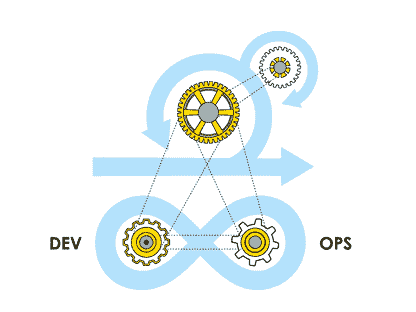

# DevOps 实时场景–了解实时发生的情况

> 原文：<https://www.edureka.co/blog/devops-real-time-scenarios/>

你们中的许多人可能知道所有与发展相关的理论。但是你知道如何在现实生活中贯彻 DevOps 原则吗？在这篇博客中，我将讨论 DevOps 实时场景，这将有助于您简单了解实时工作的方式。

我将在这篇 DevOps 实时场景文章中涉及的要点是:

*   [**什么是 DevOps？**](#what)
*   [**devo PS**解决的问题](#problem)
*   [**【持续集成】场景**](#ci)
*   [**CT(连续测试)场景**](#ct)
*   [**CD(连续交货)场景**](#cd)
*   [**DevOps 数据场景**](#data)

让我们从第一个话题开始。

## **什么是 DevOps？**

DevOps 是一种软件开发方法，涉及软件在其整个开发生命周期中的持续开发、持续测试、持续集成、持续部署和持续监控。这些活动只在 DevOps 中可能，在敏捷或瀑布中不可能。这就是为什么脸书和其他顶级公司选择 DevOps 作为他们业务目标的前进方向。 DevOps 主要用于在较短的开发周期内开发高质量的软件，从而提高客户满意度。

在这篇 DevOps 实时场景文章的下一部分，我们将看看 DevOps 解决的各种问题。

## **devo PS 解决的问题**

### **1。向客户交付价值**

*   DevOps ***最大限度缩短向客户交付价值的时间*** 。从开发人员完成一个故事/任务到生产的周期时间显著减少，允许尽快实现价值。
*   通过 DevOps 实现的最重要的价值是，它允许 it 组织 ***专注于他们的“核心”业务活动*** 。通过去除价值流中的约束并自动化部署管道，团队可以专注于活动。这有助于创造客户价值，而不仅仅是移动比特和字节。这些活动增加了公司的可持续竞争优势，并创造了更好的业务成果。

### **2。缩短周期时间**

*   在内部，DevOps 是实现交付具有洞察力的安全代码的敏捷性的唯一方法。拥有盖茨和精心制作的 DevOps 流程很重要。当您交付新版本时，它可以与当前版本并行运行。您还可以比较指标来完成您想要的应用程序和性能指标。

*   DevOps 推动开发团队走向 ***持续改进和更快的发布周期*** 。如果做得好，这个迭代过程允许随着时间的推移将更多的注意力放在真正重要的事情上。例如为用户创造良好体验的东西，以及减少管理工具、流程和技术的时间。

### **3。上市时间**

正在解决的最重要的问题是 ***降低过程的复杂性。*** 这为我们的业务成功做出了重大贡献，缩短了我们的上市时间，为我们提供了快速的功能反馈，使我们能够更好地响应客户的需求。

### **4。问题解决方案**

*   成功的 DevOps 实现的最大价值是对交付、可见性和正在发生的事情的可追溯性有更高的信心，因此您可以更快地解决问题。

*   DevOps 的另一个重要优势是不浪费任何时间。协调组织的人员和资源可以实现快速部署和更新。这使得 DevOps 程序能够在问题变成灾难之前修复它们。DevOps 创造了一种透明的文化，促进开发、运营和安全团队之间的关注和协作。

## **CI(持续集成) DevOps 实时场景**

### **1。个人可能会认为持续整合会适得其反**

开发团队的成员有不同的角色、职责和优先级。产品经理的首要任务可能是推出新功能，而项目经理必须确保他们的团队在截止日期前完成。程序员可能会认为，如果每次出现小错误时都停下来修复，会降低他们的工作效率。他们可能会觉得保持构建的整洁对他们来说是一个额外的负担，他们不会因为付出额外的努力而受益。这可能会危及适应过程。

**要克服这一点:**

*   首先，在您采用持续集成之前，确保您的整个团队都参与进来。

*   CTO 和团队领导必须帮助团队成员理解持续集成的成本和好处。

*   强调编码人员通过致力于一种需要更多的开放性和灵活性的不同的工作方法会在什么时候受益。

### **2。将 CI 整合到您现有的开发流程中**

采用 CI 不可避免地需要从本质上改变开发工作流程的某些部分。如果工作流没有中断，开发人员可能不会修复它。如果你的团队在执行他们当前的工作流程时有一个更大的例程，这是可能的。

如果你想改变工作流程，那么你必须非常小心。否则，它会损害开发团队的生产力和产品的质量。如果没有领导层的足够支持，开发团队可能会有点不愿意承担有这种风险的任务。

**要克服这一点:**

*   你必须确保给你的团队足够的时间来开发他们的新工作流程。这样做是为了选择一个灵活的持续集成解决方案来支持他们的新工作流。

*   此外，向他们保证公司会支持他们，即使事情开始时可能不太顺利。

### **3。回到以前的测试习惯**

采用持续集成的直接效果是您的团队将更频繁地进行测试。因此，更多的测试将需要更多的测试用例，编写测试用例可能会很耗时。因此，开发人员经常需要将他们的时间分配在修复 bug 和编写测试用例上。

暂时来说，开发人员可以通过手动测试来节省时间，但是从长远来看，这可能会造成更大的伤害。他们越是拖延编写测试用例，就越是难以赶上开发的进度。在最坏的情况下，您的团队可能会回到他们旧的测试过程。

**要克服这一点:**

*   您必须强调，从一开始就编写测试用例可以为您的团队节省大量时间，并且可以确保产品的高测试覆盖率。

*   此外，将测试用例与代码库本身一样是有价值的资产的想法嵌入到你的公司文化中。

### **4。开发人员忽略错误消息**

一个常见的问题是，当更大的团队一起工作时，CI 通知的数量变得难以承受，开发人员开始忽略和屏蔽它们。因此，他们可能会错过与他们相关的更新。

它会导致一个阶段，在这个阶段，编码人员会对不完整的构建和错误消息产生相对的免疫力。他们忽视相关通知的时间越长，他们在错误的方向上没有反馈的时间就越长。这可能会导致巨大的回滚，浪费金钱、资源和时间。

**要克服这一点:**

*   您应该只发送关键更新。

*   仅将通知发送给负责修复它的各个开发人员。

## **CT(连续测试)** **中 DevOps 实时场景**

1.  ### **获得正确的需求规格**

    如果你的需求正确，那么几乎成功了一半。因此，如果您对需求有非常具体和准确的理解，您就可以更好地设计测试计划，并很好地覆盖需求。

    然而，许多团队花费大量的时间和精力来阐明需求。这是一个非常常见的陷阱，为了避免这一点，团队可以采用基于模型的测试和行为驱动的开发技术。这有助于准确而充分地设计测试场景。

    这些实践肯定有助于更快地处理和解决差距。此外，它使他们能够从 sprint 的早期阶段自动生成更多的测试用例。

2.  ### **流水线编排**

    持续测试和[持续交付](https://www.edureka.co/blog/continuous-delivery/)的优势与管道编排密切相关。这直接意味着理解它如何工作，为什么工作，如何分析结果，以及如何和何时扩展。一切都依赖于管道，因此您需要将管道与自动化套件集成。

    但是团队摸索的原因是，没有单一的解决方案提供构建 CD 管道所需的完整工具链。

    团队通常必须寻找对他们来说正确的拼图碎片。没有完美的工具，通常只有同类最佳的工具能够提供与多种其他工具的集成。当然，还有一个允许轻松集成的 API。

    简而言之，没有标准化和自动化流水线的速度和可靠性，就不可能实现连续测试。

3.  ### **纵向扩展和管理复杂性**

    另一个重要的场景是，随着向生产环境的转移，持续测试变得更加复杂。随着代码的成熟和环境变得越来越复杂，测试的数量和复杂性都在增加。

    您必须在每次更新不同的阶段和自动化脚本时更新测试。结果，运行测试的总时间也趋向于随着发布而增加。

    这个问题的解决方案在于改进的测试编排，它在更短的 sprint 周期中提供了适量的测试覆盖，并使团队能够自信地交付。理想情况下，整个过程必须自动化，在不同阶段进行 CT。这是通过使用策略关口和手动干预来完成的，直到代码被推送到生产环境。

4.  ### **创建反馈循环**

    如果在开发周期的每个阶段都没有频繁的反馈循环，连续测试是不可能的。这也是 CT 难以实现的部分原因。您不仅需要自动化测试，还需要测试结果和执行的可见性。

    像日志工具、代码剖析器和性能监控工具这样的传统反馈循环不再有效。他们既不能协同工作，也不能提供解决问题所需的深度洞察力。实时仪表板自动生成报告，并在整个 SDLC 中提供可操作的反馈，有助于更快地将软件投入生产，同时减少缺陷。实时访问仪表板和所有团队成员的访问有助于持续的反馈机制。

5.  ### **缺乏环境**

    持续测试仅仅意味着更频繁地测试，这需要更频繁地接触多个环境。如果所述环境在需要的时候不可用，这就出现了瓶颈。有些环境可以通过 API 获得，有些可以通过各种接口获得。其中一些环境可以使用现代体系结构来构建，而其他环境则使用单一的传统客户机/服务器或大型机系统。

    但是这里的问题是你如何通过不同的环境所有者来协调测试？也有可能他们并不总是让环境保持正常运行。这一切的答案就是 ***虚拟化**T3。通过虚拟化环境，您可以测试代码，而不必太担心不变的区域。通过虚拟化使环境按需可访问和可用，无疑有助于消除管道中的一个重大瓶颈。*

## **CD(连续交付)** **中 DevOps 实时场景**

1.  ### **部署时间过长**

    分布式应用程序通常不仅仅需要将文件“复制并粘贴”到服务器上。如果您有一个服务器群，复杂性往往会增加。不确定部署什么、在哪里部署以及如何部署是一件非常正常的事情。结果呢？漫长的等待时间让我们的产品进入下一个环境，延迟一切，测试，生存时间等等。

    DevOps 带来了什么？开发和 IT 运营团队在无可指责的协作会议中定义部署流程。首先，他们验证什么有效，然后通过自动化将它带到下一个级别，以促进连续交付。这大大缩短了部署时间；这也为更频繁的部署铺平了道路。

2.  ### **缺少工件、脚本和其他依赖关系**

    我们经常会在部署一个新版本的软件后遇到失败。这通常是由于缺少库或数据库脚本没有更新造成的。这通常是由于不清楚要部署哪些依赖项以及它们的位置。在大多数情况下，促进开发和运营之间的协作有助于解决这类问题。

    谈到自动化，您可以定义依赖关系，这对加快部署非常有帮助。像[木偶](https://puppet.com/)或[厨师](https://www.chef.io/)这样的配置管理工具有助于额外定义依赖关系。我们不仅可以在应用程序中定义依赖关系，还可以在基础设施和服务器配置级别定义依赖关系。例如，我们可以为测试创建一个虚拟机，并在发布工件之前安装/配置 [tomcat](http://tomcat.apache.org/) 。

3.  ### **Invalid production monitoring**

有时，您配置监控工具的方式会产生大量与生产无关的数据，然而，其他时候它们产生的数据不够多或者根本没有。没有定义您需要关注什么以及度量标准是什么。

你必须就监控什么和产生什么信息达成一致，然后实施控制。如果您的组织负担得起，应用程序性能管理工具是一个很大的帮助。看看 AppDynamics、New Relic 和 AWS X-Ray。

## **DevOps 数据场景**

DevOps 完全是为了消除与新软件开发相关的风险:数据分析识别这些风险。为了持续衡量和改进 DevOps 流程，分析应跨越整个流程。这为软件开发生命周期所有阶段的管理提供了宝贵的见解。

### **1。减少分析数据的时间**

对于任何给定时间生成的所有数据，组织需要接受他们无法分析所有数据的事实。一天中根本没有足够的时间——不幸的是，机器人还没有成熟到足以为我们做所有的事情。

因此，确定哪些数据集最重要非常重要。在大多数情况下，这对于每个组织都是不同的。所以在开始之前，确定关键的商业目标。通常，这些目标围绕客户需求，主要是对最终用户最重要的最有价值的功能。例如，对于一家零售商来说，分析网站上的流量是如何与结账页面交互的，并测试它在后端是如何工作的，是重中之重。

确定哪些数据最需要分析的一些快速提示:

*   制作一个图表:确定停机将对您的业务产生的影响，询问诸如“如果 *X 中断*，它将对其他功能产生什么影响？”

*   查看历史数据:确定过去哪里出现了问题，并继续分析来自测试和构建的数据，以确保它不会再次发生。

### **2。沟通困难**

今天，大多数组织仍然使用不同的团队和角色来确定他们自己的目标，并利用他们自己的工具和技术。每个团队独立行动，与管道断开连接，只在集成阶段与其他团队会面。

当谈到着眼于更大的画面，并确定什么是可行的，什么是不可行的，该组织努力找到一个解决方案。这主要是因为每个人都无法分享整体数据，使得分析变得不可能。

要解决这个问题，需要彻底检查沟通流程，以确保每个人都在整个 SDLC 中协作，而不仅仅是在集成过程中。

*   首先，从一开始就确保 DevOps 指标的强同步。每个团队的进度应该显示在一个单一的仪表板上，利用相同的关键绩效指标(KPI)让管理层了解整个流程。这样做是为了让他们能够收集所有必要的数据来分析哪里出了问题(或者哪里成功了)。

*   除了最初的指标对话，还应该通过团队会议或 Slack 等数字渠道进行持续的沟通。

### **3。人力不足**

当人手不足时，我们需要更智能的工具，利用深度学习来插入我们正在收集的数据，并快速做出决策。毕竟，没有人有时间查看每一个测试执行(对于一些大的组织来说，一天可能有大约 75，000 个)。诀窍是消除噪音，找到正确的事情来关注。

这就是人工智能和机器学习可以发挥作用的地方。当今市场上的许多工具都利用人工智能和人工智能来完成以下任务:

*   开发脚本和测试来移动和验证不同的数据

*   基于之前学习的行为报告质量

*   响应实时变化而工作。

至此，我们已经结束了这篇关于 DevOps 实时场景的文章。

现在您已经了解了什么是 DevOps 实时场景，请查看 Edureka 提供的这个 [DevOps 培训](https://www.edureka.co/devops-certification-training)，edu reka 是一家值得信赖的在线学习公司，在全球拥有超过 250，000 名满意的学习者。DevOps 培训课程中的 Edureka [专业证书计划有助于学习者了解什么是 DevOps，并获得各种 DevOps 流程和工具的专业知识，如 Puppet、Jenkins、Nagios、Ansible、Chef、Saltstack 和 GIT，以实现 SDLC 中多个步骤的自动化。*你也可以看看我们的*](https://www.edureka.co/executive-programs/purdue-devops) *[DevOps 工程师课程](https://www.edureka.co/masters-program/devops-engineer-training)。它将帮助您获得 DevOps 工具方面的专业知识。*

有问题要问我们吗？请在这篇 DevOps Real Time Scenarios 文章的评论部分提到它，我们会给你回复。