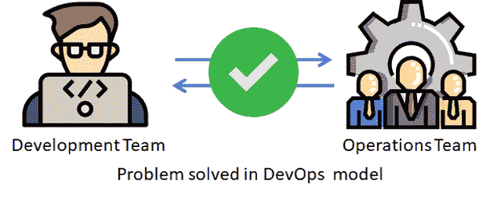
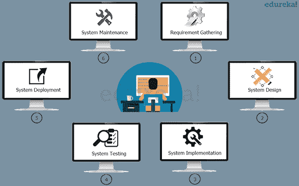
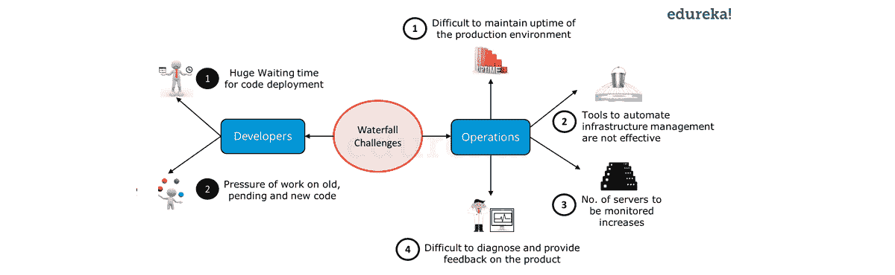
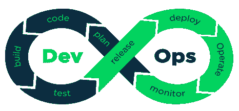
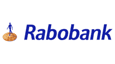

# DevOps 教程:DevOps 简介

> 原文：<https://www.edureka.co/blog/devops-tutorial>

Grand View Research 研究预测，到 2025 年，DevOps 市场将达到 128.5 亿美元。 根据 glass door 2021 年全美 50 大最佳工作排名，DevOps 工程师位列第五。根据 SD Times 的一份报告，“DevOps 工程师的职位在 Indeed 上的发布量增长了 225%。根据 Indeed and AngelList 的数据，80%的公司向 DevOps 工程师支付超过 9 万美元的起薪。此外，35%的人支付至少 115，000 美元，17%的人支付超过 125，000 美元。 所以这篇关于 Devops 教程的博客将有助于涵盖 DevOps 的所有主要概念。如果您希望以深思熟虑、有条理的方式提高您的开发运维能力，并获得开发运维工程师认证，我们很乐意为您提供帮助。 当你完成 [DevOps 认证](https://www.edureka.co/devops-certification-training)后，我们保证你将能够从事行业内的许多 DevOps 工作。本 Devops 教程博客涵盖了以下主题:

[*什么是 DevOps？*](#WhatisDevOps?)[*DevOps*](#HistoryofDevOps)[*为什么要 devo PS？*](#WhyDevOps?) [*瀑布模型*](#WaterfallModel) [*瀑布模型挑战*](#WaterfallModelChallenges) [*DevOps 架构特点*](#DevOpsArchitectureFeatures)[*devo PS 与传统 IT 有何不同？*](#HowisDevOpsdifferentfromtraditionalIT?)[*devo PS 和敏捷有什么不同？*](#HowisDevOpsdifferentfromAgile?)[*devo PS 的应用*](#ApplicationsofDevOps) [*DevOps 的优缺点*](#DevOpsAdvantagesandDisadvantages)

## **什么是 DevOps？**

DevOps 这个词是开发和运营两个词的组合。 在进入什么是 DevOps 之前，让我们先了解一下软件开发中的两个团队。**开发团队** 负责开发、设计和构建应用程序。**操作团队** 处理应用程序的部署和测试。如果应用程序有问题，运营团队也会向开发团队提供反馈。现在让我们来看看 DevOps 的历史。

## **devo PS 的历史**

让我们看看 DevOps 的一些重要事件:

**2007-2008**:devo PS 的想法开始

**2009** :初期第一次会议是 “部署一天:忽悠的 Dev 和 Ops 合作” 另一场名为“比利时根特 DevOps Days”的会议也发生了。

**2010 年** :DevOps days 会议在美国加州芒特维尤举行

**2012 年** :阿拉娜·布朗斯在木偶剧院创作了一部 DevOps 报告

**2014** :发布年度“发展状况报告”

**2017**:Forrester Research 称 2017 年为“[devo PS](https://www.forrester.com/blogs/17-01-09-welcome_to_2017_the_year_of_devops/)”年

**2018** :全美安排了 30 场 DevOps day 会议。

## 我们为什么需要 DevOps？

正如我们所知，瀑布模型等传统模型面临的问题是单向工作流的问题，因此如果出现任何错误，整个过程都会重复，并且无法与客户互动。现在，这在敏捷中通过将整个开发计划分割成几个迭代来解决，以获得更好的生产效率。 敏捷模式还包括客户与公司的互动，以纠正错误。但是敏捷也面临着另一个问题。

在这里，当开发团队为了更好的性能而不断修改代码，并将代码发送给运营团队进行测试时，问题就出现了。 但是在一些情况下，运营团队的反馈可能会有延迟，例如，如果开发人员在晚上发送代码进行审查，但是由于运营团队不可用，项目反馈会有延迟。

所以，DevOps 就是这个问题的解决方案。DevOps 是一种实践或方法，其中开发和运营团队通过在初始阶段包含自动化来共同工作。因此，他们可以在快速变化的系统上工作，修复错误，并帮助及时交付高质量的软件。

## ****

## **瀑布模型**

在本 Devops 教程中，让我们考虑一下使用瀑布模型开发软件的传统方式。

在本 Devops 教程的上图中，您将看到它将涉及的阶段:

*   在第 1 阶段——收集完整的需求并开发 SRS
*   第二阶段——使用 SRS 对该系统进行规划和设计
*   第三阶段——实施系统
*   第 4 阶段——系统经过测试，质量得到保证
*   第 5 阶段–系统部署到最终用户
*   在第 6 阶段——完成系统的定期维护

Get Certified With Industry Level Projects & Fast Track Your Career [<button>Take A Look!</button>](https://www.edureka.co/devops)

## **瀑布模型挑战**

水滴模型多年来运行良好，但也面临一些挑战。下图突出显示了瀑布模型的挑战。

在 Devops 教程的上图中，您可以看到瀑布模型中的开发和运营都面临着挑战。从开发者的角度来看，主要有两个挑战:

*   开发之后，代码部署时间非常长。
*   由于开发和部署时间长，旧代码、待定代码和新代码的工作压力很大。另一方面，运营部门也不完全满意。

根据 Devops 教程中的上图，他们面临四大挑战:

1.  很难维持生产环境 100%的正常运行时间。
2.  基础设施自动化工具不是很有效。
3.  随着时间的推移，要监控的服务器数量不断增加，复杂性也随之增加。
4.  很难提供反馈和诊断产品中的问题。

## **DevOps 架构:**

现在让我们讨论 DevOps 架构的不同阶段:

*   **计划**——在 DevOps 计划中扮演着重要的角色。在这一阶段，项目的所有要求和关于项目的一切，如每个阶段的时间、成本。等等进行了讨论。这将有助于团队中的每个人对项目有一个简要的了解。
*   **代码**——这个阶段是根据客户的要求在这里写代码。在这里，代码被分成称为单元的小代码。这样做是为了清楚地了解代码。例如，如果团队正在做一个在线 Ekart 应用程序的项目，那么登录部分被划分为一个单元，登录后显示所有类别的页面被划分为另一个单元，用户资料被划分为另一个单元，等等。

所用工具的一些例子有 Git、JIRA

*   **建造**——在这个阶段完成了机组的建造。使用的工具的一些例子是 maven、Gradle。
*   **测试**–所有单元的测试都在这个阶段完成。因此，我们将知道代码在哪里有错误，如果发现错误，它将被返回。所用工具的一些例子是 Selenium，PYtest
*   **集成**——在这个阶段，代码的所有单元被集成。这意味着在这一步中，我们将在开发团队和运营团队之间创建一个连接，以实现持续集成和持续部署。Jenkins 就是所用工具的一个例子。
*   **部署**–在这个阶段，代码被部署到客户端的环境中。所用工具的一些例子有 AWS、Docker。
*   **操作**–根据需要对代码进行操作。所用工具的一些例子是 Kubernetes、open shift。
*   **监控**–在此阶段，应用程序的监控在客户端环境中完成。所用工具的一些例子有 Nagios、elastic stack。

## **本次 DevOps 教程** 中 Devops 与传统 IT 有何不同？

在这篇 DevOps 教程中，让我们来看看传统 IT 和 Devops 之间的一些关键区别。

让我们看一下传统 IT 方法和开发运维的工作流程，以便更好地了解它们之间的差异。

在传统的 IT 方法[特别是瀑布方法]中，开发人员在他们的编码环境中编写代码。 一旦开发完成，他们会通知运营团队测试代码。

现在，运营团队将从编码库中提取代码，并通过一些测试用例。如果检测到任何 bug，就会再次发送回开发团队。这将一直持续到错误被解决。因此，正如我们所看到的，主要问题是，有很多时间被浪费了，因为测试是在编码完成后才进行的。所以如果开发者有一点小失误。为了找到那个小错误，整个测试过程要重新做一遍。所以这个问题的解决方案是在早期阶段(开发阶段)实施测试。

现在，如果我们检查一下 DevOps 的工作流程。主要特性包括持续集成和持续部署管道。通过它可以解决前面的问题。所以现在开发团队不需要等待代码的结果。通过在初始阶段[开发阶段]包含自动化特性，我们可以在初始阶段获得关于错误的知识，并且它们可以被快速解决。 所以会有更快的软件部署和快速交付。

## DevOps 和敏捷有什么不同？

| DevOps | 敏捷 |
| DevOps 负责填补开发团队和运营团队之间的时间空白。 | 敏捷方法致力于填补客户和公司之间的鸿沟。 |
| 这里，反馈将来自运营团队和开发团队。 | 在这里，反馈将来自顾客对公司的反馈。 |
| 它专注于持续的测试和交付。 | 它专注于不断的变化。 |
| DevOps 中使用的一些工具:Puppet、AWS | 用于敏捷的一些工具:JIRA、Bugzilla、Kanboard |

## **devo PS 的应用:**

本期 DevOps 教程让我们看看 Devops 的一些顶级应用:

### **美联航:**

联合航空公司是美国的一家主要航空公司。这家公司使用 DevOps 将传统的测试方法改为 **连续测试** ，帮助公司节省了 50 万美元，还将代码覆盖率提高了 85%。

### **键库:**

KeyBank 是 KeyCorp 的主要子公司，是一家地区性银行，总部设在克利夫兰。这家银行使用 DevOps 进行安全集成。DevOps 几乎将流程时间从三个月缩短到了一周。

### **生命值:**

这家公司在测试他们的软件时遇到了一个问题。在这里，在六个星期的代码编写之后，使用手工测试来检测错误，如果发现任何错误，需要一个星期来修复它们。所以为了克服这个问题他们集成了 **这个持续集成和持续部署的流水线** 。

### **荷兰合作银行:**

****

荷兰合作银行是一家荷兰跨国银行和金融服务公司。通过集成 DevOps，该公司减少了高达 35%的 bug。这帮助该公司更快地向客户交付应用程序。它还减少了回归测试的时间，因为在开发时已经测试过几次了。

### **亚马逊和网飞:**

这些公司面临着同样的问题。在最初阶段，他们适应整体架构。但随着他们处理大量流量的增长，他们采用了基于 AWS 云的微服务架构。

### **Adobe:**

这家公司面临着整体架构的问题，团队之间也存在沟通问题，因此他们集成了微服务架构和 CI/CD 管道来进行点对点沟通。

## **devo PS 的优缺点:**

### 优点:

*   更快的软件开发和快速交付。
*   DevOps 非常灵活，能够轻松适应变化。
*   与以前的软件开发模型相比，减少了对项目的混淆，从而提高了产品质量和效率。
*   开发团队和运营团队之间的隔阂得以弥合。也就是说，团队之间的交流增加了。
*   自动化的增加提高了效率，包括持续集成和持续部署。
*   客户满意度提高。

### 缺点:

*   DevOps 很贵。
*   维护 DevOps 架构需要一定水平的技能。
*   在传统行业中采用 DevOps 技术是一项巨大的挑战。

## **概要:**

既然我们已经在这篇 DevOps 教程文章中介绍了 DevOps 的所有基础知识，你应该明白我们为什么选择 DevOps 而不是其他软件开发方法[比如瀑布和敏捷]。除此之外，我们还浏览了一些最流行的 DevOps 应用程序。我希望这已经阐明了一些核心的 DevOps 概念，并让您更好地理解为什么需要 DevOps。

如果你正在寻找一份要求高又有回报的职业。无论你是在 DevOps 工作过，还是该领域的新手，DevOps 的[专业证书课程都是你学习如何成功所需要的。从基本到最先进的技术，我们涵盖了一切。您也可以查看我们的](https://www.edureka.co/executive-programs/purdue-devops) [DevOps 工程师硕士项目](https://www.edureka.co/masters-program/devops-engineer-training)。它将帮助您获得 DevOps 工具方面的专业知识。