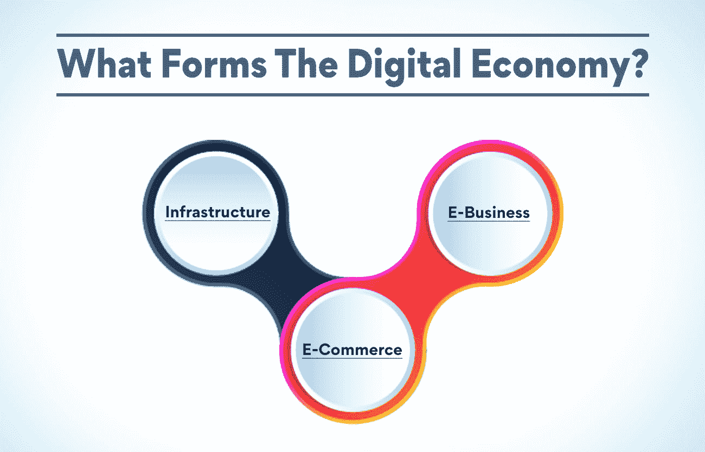
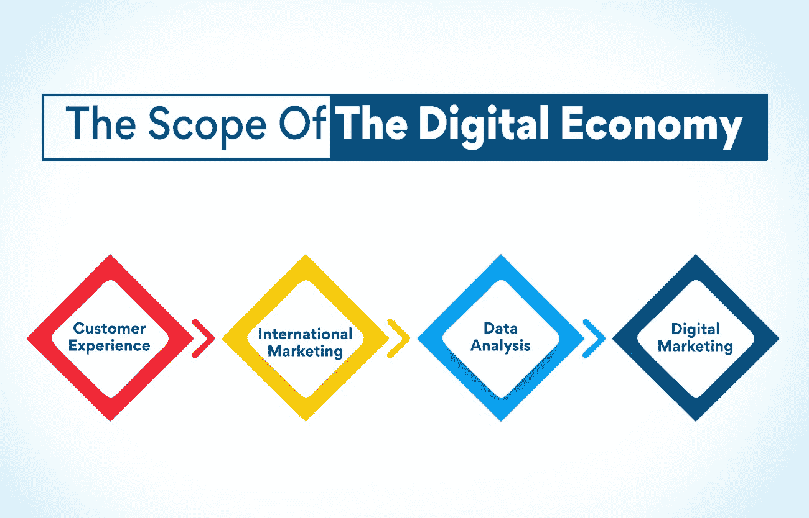

# 什么是数字经济？

> 原文：<https://www.edureka.co/blog/digital-economy>

什么是数字经济？这个世界上的每一个企业都在无止境地寻求将他们的业务数字化，以获得更广泛的覆盖面和技术升级。实体企业的趋势一直处于下降趋势，在世界遭受疫情袭击后，情况变得更加糟糕。

然而，由于变化是唯一不变的，人们成功地形成了一个交易和沟通系统，使他们能够与各种利益相关者在线互动。

但是，这还不是对这个数字化生态系统的全部理解，它让企业可以无障碍地快速扩大规模。这里是你需要了解的关于数字经济的一切，以及它为专业人士打开的大门。

**数字经济到底是什么？**

这个世界越来越依赖网络基础设施来进行在线交易和互动。所有这些反复出现的互动形成了一批在线交易，这些交易形成了数字经济。

简单来说，你在下各种订单上花费的每一个卢比都会刺激数字经济。整个数字基础设施中最重要的一环是跨越了地理障碍的人们之间的超连接。

这种连接性使企业能够通过与国际合作伙伴建立数字联盟来扩大全球规模，从而实现基础设施升级和更好的组织内部文化。

**数字经济有哪些形式？**

虽然在数字经济中有许多令人感动的因素，但有三个显著的因素使数字经济与众不同。其中包括:

*   **基础设施**

在技术和自动化的帮助下，开展商业活动的范围已经得到了改进。在新的软件和硬件的帮助下，流程变得非常高效，同时拥有同样熟练的人力资本来管理它们。

每个领域都有专家来控制流程，使之尽善尽美。数字企业管理领域正在兴起，如果是你觉得有趣的东西，可以去看看我们的 [数字企业管理高级执行官证书](https://www.edureka.co/highered/advanced-executive-program-digital-business-management-iitg?) 。

*   **电子商务**

许多工具和软件为企业提供自动化和数据跟踪方面的高效服务。数据是 21 世纪最重要的金矿，在跟踪和 CRM 软件的帮助下，每个在线企业都可以利用这些数据。

由于企业和客户都在线，组织可以更容易地在一天中的任何时间锁定这些用户。这在传统的设置中是不可能的，因为它需要物理交互。

因此，每一个数字化的组织都可以通过了解客户的需求并相应地提供服务来更好地满足他们的需求。这份 USP 给每一个传统企业敲响了警钟，要求它们向网络转型。

*   **电子商务**

网上买卖商品的过程被称为电子商务。它包括所有的用户和平台，使用户能够使用互联网和网络基础设施买卖商品。

虽然物理交互对于一些专业服务来说是必要的，但是越来越多的企业已经将他们的产品和服务放到了网上。一些企业，如健身房和健身中心，被认为只是传统的，也突破性地尝试在线模式，让用户体验更舒适。

由于企业在网上享有巨大的影响力，这个世界成了年轻企业家提出解决关键问题的迷人想法的画布。在线市场的趋势随着每个企业专注于其数字存在而高涨。

如果你认为电子商务是你的茶，你可以通过我们的课程[数字商业管理高级执行官证书](https://www.edureka.co/highered/advanced-executive-program-digital-business-management-iitg?)在数字商业管理方面了解更多并提高自己的技能。

**也读:[什么是数字商业？](https://www.edureka.co/blog/what-is-digital-business)简介**

**数字经济的优势是什么？**

虽然在线基础设施看起来令人望而生畏，但它带来的一系列有利可图的优势吸引了企业主。以下是伴随着数字经济 : 而来的这些优势

*   **信息支付**

由于有各种方式在网上展示和传播信息，每位消费者都有机会做出明智的选择。网站旁边的所有社交渠道都允许品牌与用户建立更深层次的联系。

除了公司提供的信息之外，每个潜在客户都可以从其他客户那里寻找评论和推荐的信息。数字基础设施的这一部分被称为用户生成的内容，它增加了企业的可信度。

一旦用户在收集了足够的信息并比较了他们所有的选择后感到满意，他们就更容易选择满足他们需求的品牌。

*   **数字接近度**

尽管企业和客户从未真正进行过身体上的互动，但这两个利益相关者之间的距离已经大大缩短了。几乎所有的公司都通过专用通信线路提供全天候支持。

随着技术的进步，企业已经将消费者申诉补救流程整合到他们的应用程序和网站中。现在，用户只需与一位高管取得联系，就能获得即时的补救响应。

*   **全球影响力**

如前所述，在线市场出现后，用户可以坐在世界的任何一个角落进行交易，地理障碍已经被解除。

这为企业向全球观众展示商品目录带来了巨大的机会。产品理念得到了恢复，消费者在享受舒适家居生活的同时，会不遗余力地寻找与他们的心态相一致的东西。

对于传统企业和知名品牌来说，这种说法是正确的，中小微企业也享受到了这种基础设施的好处。像亚马逊这样的在线市场的出现重新点燃了创造之火，人们通过不断重复的产品来解决独特的问题。

*   **安全框架**

由于数字基础设施对任何拥有活跃互联网连接的人都是可访问的，因此它处于威胁和违规的高漏洞点。因此，这种基础设施的安全性已经成为其发展的核心。

每一笔交易都由加密网关保护，这使得整个漏斗免受任何不法行为的侵害。这些措施在用户中产生了信任，使适应过程更快、更持久。

随着越来越安全的网站成为入口，这些交易只是整体的一部分。包括用户凭证在内的一切都被多层安全保护所笼罩，从而使数字堡垒无法渗透。

**数字经济的范围**

在理解和领会了数字经济的好处后，判断它将翻新的领域至关重要。作为一名职业人士，这些见解可以帮助你做出与现代经济相关的正确职业选择。

以下是正在进行数字化改革的领域:

*   **客户体验**

在数字基础设施的帮助下，客户体验的范围已经被重新定义。公司不断想出与目标受众沟通的方法，这些技术已经初见成效。

像苹果这样的大型科技公司已经在他们的网站上展示了他们产品的全部功能，而家具公司现在可以选择以 3D 方式放置物品，以检查其外观！

除此之外，消费者投诉之旅也实现了自动化，用户无需等待数日就有机会解决他们的问题。即时补救方法进一步增加了每个用户对这种新模式的信心。

*   **国际营销**

随着每个品牌都站在数字入口的门槛上，国际营销领域正以前所未有的速度蓬勃发展。由于每家公司都想在未知领域尽最大努力，所以他们希望雇佣专业人士来协调这一过程。

品牌希望以积极的方式与观众建立联系，这也是最有回报的选择。我们对目标受众进行了彻底的研究，以确定哪些可行，哪些不可行。

国际营销的范围始于每一个具体活动的策划，只是为了进一步深入到后勤、执行、衡量，然后分析。

所有这些步骤都是由不同的专家完成的，他们都有一套完美的技能。如果这些领域在你的头脑中点燃了火花，那么你可以探索我们的 [数字商业管理高级执行官课程](https://www.edureka.co/highered/advanced-executive-program-digital-business-management-iitg?) ！

*   **数据分析**

在过去，由于收集答案的限制和时间障碍，很难同时调查很多人。然而，在今天的数字世界里，用户的一举一动都可以在网上被追踪。

看到与你日常谈论的东西相关的广告可能会很有趣，这不是巧合，而是数字营销人员发现你适合他们的产品。虽然数据跟踪可能会让人觉得有侵犯性，但它会让公司关注你的问题。

这使得这些公司能够遵循以用户为中心的方法，这有助于提供一流的产品，为用户的生活增加价值。这也有助于他们以符合你的频率的方式展示他们的产品。

*   **数字营销**

由于互联网的画布是开放的，每个人都可以画画，许多公司用他们从来不知道会被需要的产品来惊艳用户。许多突破性技术通过以前所未有的方式营销自己而变得伟大。

随着新玩家的加入，市场变得越来越密集，品牌正在利用诸如瞬间营销、游击营销、表演营销等技术来吸引眼球。

数字营销有助于公司利用他们的利基市场，直到他们获得足够的商誉来瞄准大众。它正以其过度的影响力和印象迅速取代传统的印刷媒体，这在当时是一个梦想。

**也读:[什么是数字领导？为什么重要？](https://www.edureka.co/blog/digital-leadership)**

作为一名职业人士，你如何充分利用这场变革？

虽然整个场景可能对你很有吸引力，但在挣脱束缚之前，你需要达到一定的门槛。以下是你应该做的一些事情，以获取所有可用的好处:

*   **高等教育**

如果你是一名拥有大学本科学位的在职专业人士，你可以开始计划在一所好大学的研究生课程的帮助下掌握一门特定的学科。

这段经历会让你对这个领域有更深入的了解，同时让你接触到其他可能拥有不同技能的专业人士。它还能让你在人际网络的基础上进一步实现职业发展。

*   **证书课程**

如果你没有足够的带宽来参加严格的全日制课程，你可以选择非全日制的数字认证来提高你目前的知识水平。这也会让你在继续工作的同时尝试一些有趣的想法。

网上有各种各样的课程，但是，你应该总是在你瞄准的特定行业中寻找一个可信的名字来报名。这种方法可以让你区分哪些课程会增加价值，哪些不会。

您也可以在我们的[网站](http://www.edureka.com) 探索这些先进高效的证书课程！它将帮助您在根据当前市场需求专门设计的几门课程中进行选择。

**遗言**

数字革命是不可避免的，因此所有企业主都急于在有时间的时候加入这个平行领域。如果你想提高技能，现在正是时候！

**更多信息:**

[利用数字业务管理提高盈利能力](https://www.edureka.co/blog/digital-business-management-for-better-profitability/)

[传统营销与数字营销:主要区别和相似之处](https://www.edureka.co/blog/traditional-vs-digital-marketing-key-differences-and-similarities/)