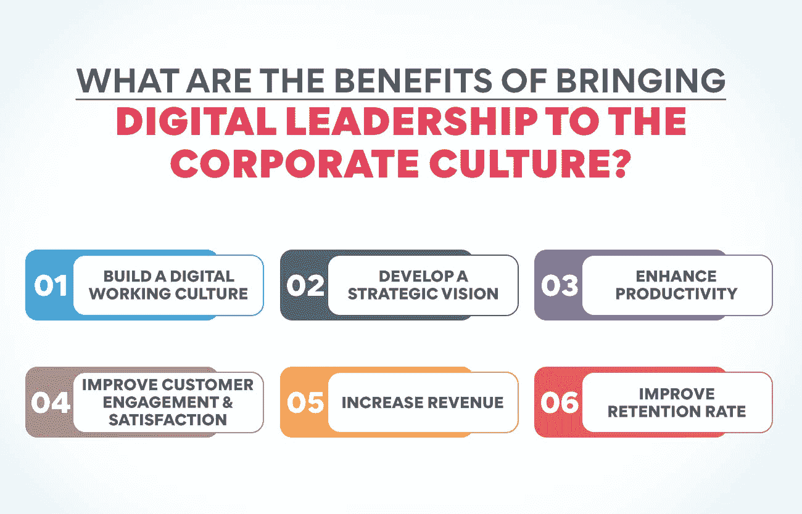
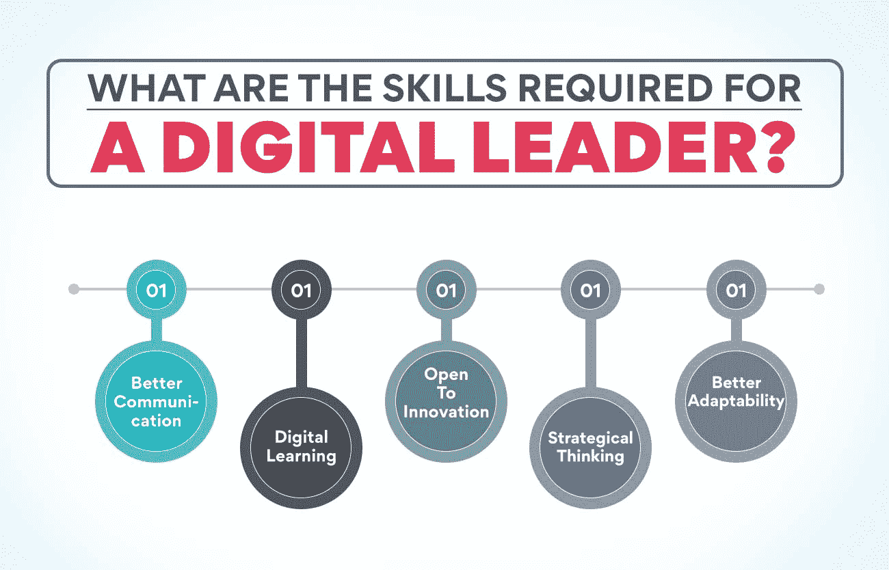

# 什么是数字领导？为什么重要？

> 原文：<https://www.edureka.co/blog/digital-leadership>

在当今不断发展变化的数字时代，企业拥有一位数字领导者比以往任何时候都更重要。你会问，什么是数字领导？数字领导是一个相对较新的术语，但它的重要性与日俱增。那么什么是数字领导呢？简而言之，它是通过数字渠道领导团队或组织的能力。这包括社交媒体、电子邮件营销和网站设计。一个数字领导者可以跟上数字世界的最新趋势和变化，并将其落实到公司的战略中。

为什么数字领导很重要？随着越来越多的人从网上获取信息，企业必须与客户建立联系。要将您的业务提高到一个很高的水平，数字领导应该是您的首要任务！

## **在不断发展的商业环境中，数字领导力意味着什么？**

数字领导是使用数字技术实现预期业务成果的艺术。它包含各种技能和能力，包括但不限于数字化转型、数字化战略、创新和变革管理。

不断变化的商业环境要求企业不断调整战略，以保持领先地位。因此，数字领导力是组织保持竞争力的一项基本技能。

许多企业已经意识到数字领导的好处及其在数字时代的必要性。许多组织已经开始投资数字化转型计划，以保持领先地位。数字领导不仅是指使用数字技术，还包括领导数字团队和项目。与传统的领导角色相比，它需要更广泛的技能和能力。

数字领导者需要了解数字技术不断变化的前景，以及如何利用它们来实现预期的业务成果。他们还需要能够启发和激励数字团队实现最佳工作。

想提高你的数字领导技能吗？有几件事你可以做:

1.  关注最新的数字趋势和发展。
2.  考虑在您的组织内开展一个数字化转型项目。这将有助于获得领导数字团队和实施数字技术的第一手经验。
3.  寻找机会向其他数字领导者学习。

许多数字领导力项目可以帮助你发展成功所需的技能和知识。

想成为数字领导者？查看我们的[数字企业管理高级执行官证书](https://www.edureka.co/highered/advanced-executive-program-digital-business-management-iitg)，它将带你经历成为一名数字企业管理高级执行官的每一个重要方面。从尖端的数字技术到个性化支持，您将在这里得到一切。

## 将数字领导带入企业文化有什么好处？

数字领导是指有策略地使用数字技术来塑造组织的方向。它是关于使用数字工具来推动创新、转型和增长。

**建立数字化工作文化**

数字领导有助于在组织内建立数字工作文化。这种数字文化将是一种专注于使用数字工具和技术来更有效地工作的文化。

**制定战略愿景**

数字化领导力可以帮助组织制定数字化转型的战略愿景。这一数字愿景将有助于指导组织如何最好地利用数字技术来实现其业务目标。拥有数字愿景也有助于确保所有员工朝着同一个目标努力。

**提高生产力**

数字领导有助于提高组织内部的生产力。通过使用数字技术，组织可以实现任务和流程的自动化。这将最终解放员工的时间，让他们专注于更重要的任务。此外，数字技术还有助于改善组织内部的沟通和协作。

**提高客户参与度&满意度**

数字领导对于提高客户参与度和满意度至关重要。根据定义，数字领导者是那些采用数字技术来改善组织工作方式的人。他们使用数字工具来更好地吸引客户、员工和合作伙伴。

**增加收入**

数字领导至关重要，因为它可以帮助组织增加收入。数字领导者是懂得如何利用技术为公司创造价值的人。他们可以发现新的机会并实施创新的解决方案。因此，数字领导者能够帮助他们的组织成长和成功。

**提高留存率**

数字领导有助于降低员工流动率。在数字时代，对于公司来说，拥有一个懂得如何使用数字工具来吸引员工的数字领导者变得比以往任何时候都更加重要。数字领导者能够制定有助于公司实现目标的数字战略。他们还可以帮助实施提高效率的数字工具和流程。

## **数字领导是如何工作的？**

数字领导是指利用数字技术为组织创造价值的能力，无论是通过提高效率还是开发新产品和服务。数字领导者不仅能看到数字技术的潜力，还能预见到如何利用这种潜力并推动组织内部的变革。

数字领导不是最大或最好，而是利用数字技术创造竞争优势。它是关于能够看到机会并抓住它们，关于能够在快速发展的数字世界中适应和改变。

数字领导不仅仅是指技术；它是关于使用数字技术来创造组织价值。它是关于能够看到机会并抓住它们，关于能够在快速变化的数字世界中适应和改变。

## **数字领导的例子**

数字领导并不新鲜，但近年来随着数字化转型成为企业的当务之急，它变得更加重要。数字化领导者通过数字化转型来指导他们的组织，帮助他们利用技术的力量来实现业务目标。

有很多强有力的方法来定义数字领导力，但其核心是利用数字技术为组织带来价值。这可以通过多种方式实现，例如开发新的数字产品和服务，改善数字客户体验，或使用数字技术提高运营效率。

微软首席执行官塞特亚·纳德拉是一位影响深远的数字领袖。在他的领导下，微软已经从一家软件公司转型为云计算和人工智能巨头。

纳德拉一直是微软数字化转型背后的驱动力，这见证了该公司从本地软件提供商转变为云计算领域的领导者。他还在微软进军人工智能领域发挥了重要作用，这是该公司目前关注的一个关键领域。

多亏了纳德拉在数字领域的领导地位，微软现在已经做好了在数字时代竞争的准备。

## **参与数字领导的规划**

数字世界千变万化，因此数字领导者必须积极主动地进行规划。他们需要对自己的组织有一个清晰的愿景，以及为了实现这一愿景必须做些什么。他们还需要能够随着数字环境的变化调整自己的计划。数字领导者需要了解可用的技术，以及如何使用这些技术来实现他们的愿景。他们还需要能够识别和评估数字风险。

## 数字领导者需要具备哪些技能？

**更好的沟通**

数字领导者需要能够在内部和外部传达他们对公司的愿景。他们必须激励他人认同这一愿景，并共同努力实现这一愿景。随着交流而来的是协作的能力。数字领导者经常引领新的计划和项目，因此他们必须知道如何让人们参与进来，并与他们一起朝着共同的目标前进。

**数字学习**

数字领导使用数字技术来帮助个人、团体和组织实现他们想要的结果。当今的领导者必须能够利用数字工具和资源来创造新的机会、推动创新并取得成功。数字领导至关重要，因为它允许领导者利用数字技术的巨大潜力来实现他们的目标。借助数字领导力，领导者可以与世界各地的人和资源建立联系，进入新的市场，创造新的价值。

**向创新开放**

创新的确是数字时代成功的关键，如果组织想要在竞争中保持领先地位，就需要能够接受新的想法和技术。数字领导至关重要，因为它允许组织对创新持开放态度。通过对创新持开放态度，数字领导者可以为他们的组织创造竞争优势。对于组织来说，现在是向创新开放的关键时刻，而数字领导者是实现这一目标的关键。

**战略思维**

数字领导力是从战略角度思考如何利用数字技术实现业务目标的能力。这一点至关重要，因为数字技术正日益成为 T2 商业运作和竞争的一部分。没有数字化战略，企业就有落后于竞争对手的风险。

数字领导者必须识别机遇和趋势，并对如何利用数字技术创造价值有一个愿景。他们还应该战略性地向他人阐述这一愿景，并就此达成共识。这不是一项容易的任务，因为数字技术在不断发展，总有新的东西要学。但对于企业来说，有一个负责数字战略的人是非常重要的，他可以保持领先，并确保公司充分利用数字技术。

**更好的适应性**

数字领导的一个品质是更好地适应变化的能力。随着数字化转型，企业被打乱，不得不不断改变运营方式。要成为一名数字领导者，你需要能够拥抱变化并带领你的团队度过难关。适应性越强越好；在您的组织中领导数字化转型将变得容易。

## **成为数字领导者！**

数字领导是指使用数字技术来创造价值、制定战略和管理绩效。这是数字素养、创新和商业头脑的结合。精通数字技术的领导者可以利用技术的力量创造新的增长机会，提高运营效率并改善客户参与度。

IBM 最近的一项研究发现，数字领导者强烈认同他们的组织在创造新的增长机会方面取得成功的可能性是他们的同行的三倍。他们也有两倍的可能说他们的公司在客户参与和提高运营效率方面非常有效。

研究发现，数字领导并不是为了技术而技术。精通数字的领导者知道如何利用技术创造商业价值。通常，数字领导者也更有可能拥有与其业务目标一致的清晰的数字战略。

那么，成为一名数字领导者需要什么呢？下面是五个必备素质:

*   必须有远见；能够超越现状，想象新的可能性。
*   必须创新；不怕实验，不怕冒险。
*   必须具备协作能力；没有人能独自成功并建立强大的团队。
*   必须敏捷；能快速适应变化，抓住机遇。
*   必须正宗；诚信领导，建立信任。

在当今的商业世界中，数字领导力至关重要。未能接受数字技术的公司将会被甩在后面。不了解数字的领导者会发现创造价值、制定战略或管理绩效越来越困难。好消息是，数字领导对任何组织来说都是触手可及的——只需要愿景、创新、协作和敏捷性的正确组合。

如果你已经具备成为数字领导者的一切条件，那么你必须专注于将你的职业生涯引向正确的方向，这将带来丰硕的成果。借助我们的[数字企业管理高级执行官证书](https://www.edureka.co/highered/advanced-executive-program-digital-business-management-iitg)，开启您的职业生涯或为其开辟新的垂直领域，这是成为数字领导者的必经之路。