# 数字营销人员工资多少？

> 原文：<https://www.edureka.co/blog/digital-marketing-salary/>

如今，数字营销领域正在蓬勃发展。如果你的目标是在 *[数字营销](https://www.edureka.co/post-graduate/digital-marketing-certification)* 领域谋职，那么高薪的数字营销工作正等着你。由于如今每个品牌都在争夺数字霸权，数字营销机构大有可为。在这篇关于“数字营销薪酬”的博客中，我们将讨论全球数字营销薪酬以及该领域有哪些职业选择。以下是本博客涵盖的主题——

*   [什么是数字营销？](#what)
*   [数字营销中的角色](#roles)
*   [数字营销薪资](#salary)
    *   [数字营销经理](#manager)
    *   [SEO 经理](#seo)
    *   [社交媒体营销专家](#social)
    *   [内容管理者](#content)
    *   [文案](#copywriter)
    *   [SEM 专员](#sem)

[//www.youtube.com/embed/Y3_AWxIKxaA?rel=0&showinfo=0](//www.youtube.com/embed/Y3_AWxIKxaA?rel=0&showinfo=0)

## **什么是数字营销？**

数字营销是一个术语，指的是商业运作中注入的所有在线努力。简单来说， ***[数字营销](https://www.edureka.co/blog/what-is-digital-marketing/)*** 囊括了所有使用数字设备或互联网的营销努力。这是一种通过利用搜索营销、社交媒体营销和电子邮件营销等在线营销策略来推广和销售产品的行为。

## **数字营销中的角色**

世界正在走向数字化，到 2020 年，每个公司都将拥有在线业务，从而创造大量的就业机会。数字营销行业在各个方面都在膨胀，给员工一个在天赋和技能的基础上发挥杠杆作用的空间。

因此，让我们来看看数字营销领域的一些职业选择。

## **数字营销薪资**

数字营销的薪酬根据工作概况、经验和才能而有所不同。如果你具备这三个条件，你肯定能抓住这个机会。

### **数字营销经理**

根据[PayScale.com](https://www.payscale.com/research/IN/Job=Digital_Marketing_Manager/Salary)的说法，下面是描绘美国和印度数字营销经理平均工资的图表。

美国数字营销经理的平均工资为**65，488 美元**

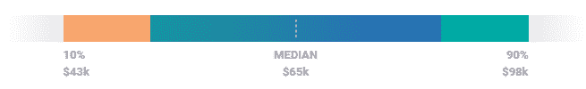

**数字营销经理工资(美国)**

在印度，数字营销经理的平均工资是 515，124 卢比

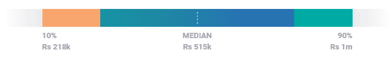

**数字营销经理工资(中)**

下图显示了**美国**和**印度**的数字营销经理的**经验水平**薪酬。

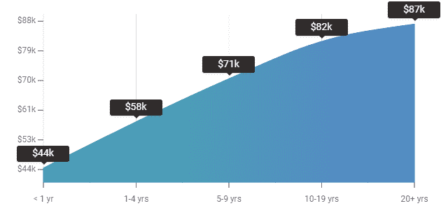

**数字营销经理工资(美国)–经验水平**

**数字营销经理工资(IN)–经验水平**

### **SEO 经理**

根据 PayScale.com 的说法，下面的图表描述了印度和 T2 的 SEO 经理的平均工资。

在美国，搜索引擎优化经理的平均工资是 67475 美元。

**SEO 经理工资(美国)**

印度 SEO 经理的平均工资为**509，090 卢比**

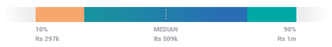

**SEO 经理工资(中)**

参考下面的图片，描绘了美国和美国的 SEO 经理按经验 **水平**支付**。**

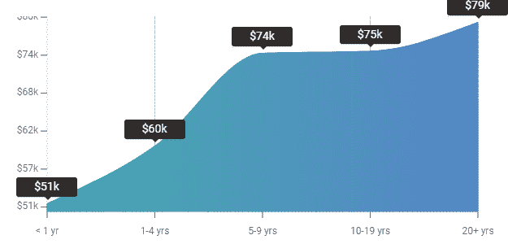

**SEO 经理工资(美国)-经验水平**

**SEO 经理工资(中)-经验水平**

### **社交媒体经理**

根据 PayScale.com 的说法，这是描绘印度和美国社交媒体经理平均工资的图表。

在美国，社交媒体经理的平均工资是 49881 美元。

**社交媒体经理工资(美国)**

印度社交媒体经理的平均工资为 366，271 卢比

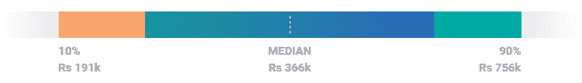

**社交媒体经理工资(中)**

这是一张图表，描绘了美国和英国社交媒体经理的经验水平薪酬。

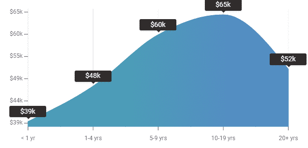

**社交媒体经理工资(美国)–经验水平**

**社交媒体经理工资(IN)–经验水平**

### **内容管理者**

根据 PayScale.com 的说法，以下图表描述了印度和美国社交媒体经理的平均工资。

内容经理的平均工资是**$ 57734**

**内容经理工资(美国)**

内容经理的平均工资是 572，510 美元

**内容经理工资(中)**

下图显示了美国和英国内容经理的**经验水平**薪酬。

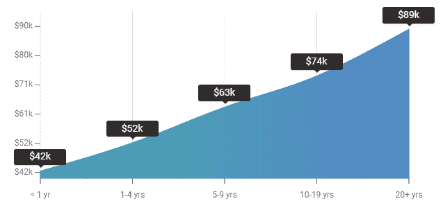

**内容经理工资(美国)–经验水平**

**内容经理工资(IN)–经验水平**

### **文案**

根据 PayScale.com 的说法，这是描绘印度和美国社交媒体经理平均工资的图表。

一个文案的平均工资是 50，570 美元

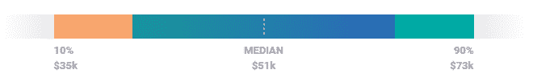

**文案工资(美元)**

一个文案的平均工资是卢比。**377690。**

**文案工资(中)**

这是一张图表，显示了美国和英国文案的**经验水平**薪酬。

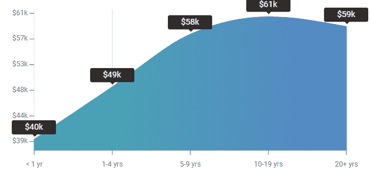

**文案工资(美国)–经验水平**

**文案工资(IN)–经验等级**

### **扫描电镜专家**

根据 PayScale.com 的说法，以下图表描述了印度和美国社交媒体经理的平均工资。

一名 SEM 专家的平均工资是 47186 美元。

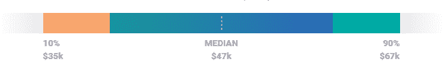

**SEM 专员工资(美国)**

SEM 专家的平均工资为**366，634 卢比**

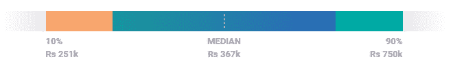

**SEM 专员工资(中)**

下图显示了美国和英国 SEM 专家按经验水平支付的**。**

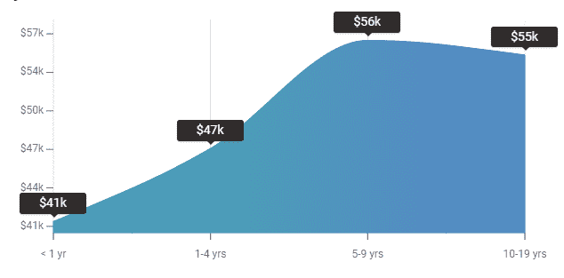

**SEM 专家工资(美国)–经验水平**

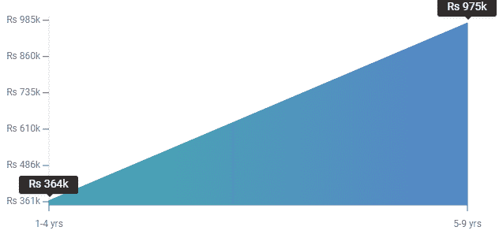

**SEM 专家工资(IN)–经验水平**

数字营销正在为激动人心的职业创造一个进化的空间，让你既充实又有丰厚的报酬。现在你已经熟悉了数字营销工作和职业的总体情况，你是否对用诱人的数字营销薪水建立职业感兴趣？然后抓住今天的机会，成为一名数字营销专家。

*如果你想报名参加[数字营销培训](https://www.edureka.co/digital-marketing)的完整课程，Edureka 有一个专门策划的 PG 营销计划，专门从事数字营销，这将帮助你获得各种数字媒体方面的专业知识，如关键词规划、搜索引擎优化、社交媒体营销、搜索引擎营销、电子邮件营销、联盟营销和谷歌分析。*